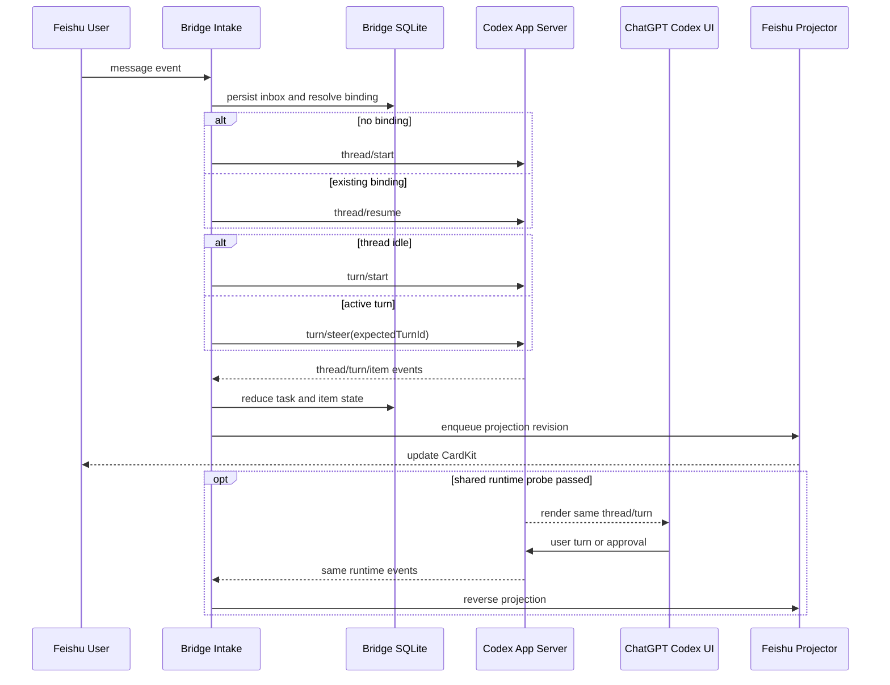
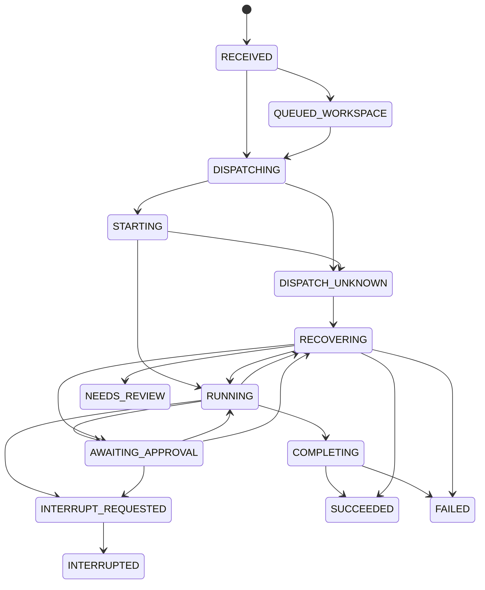
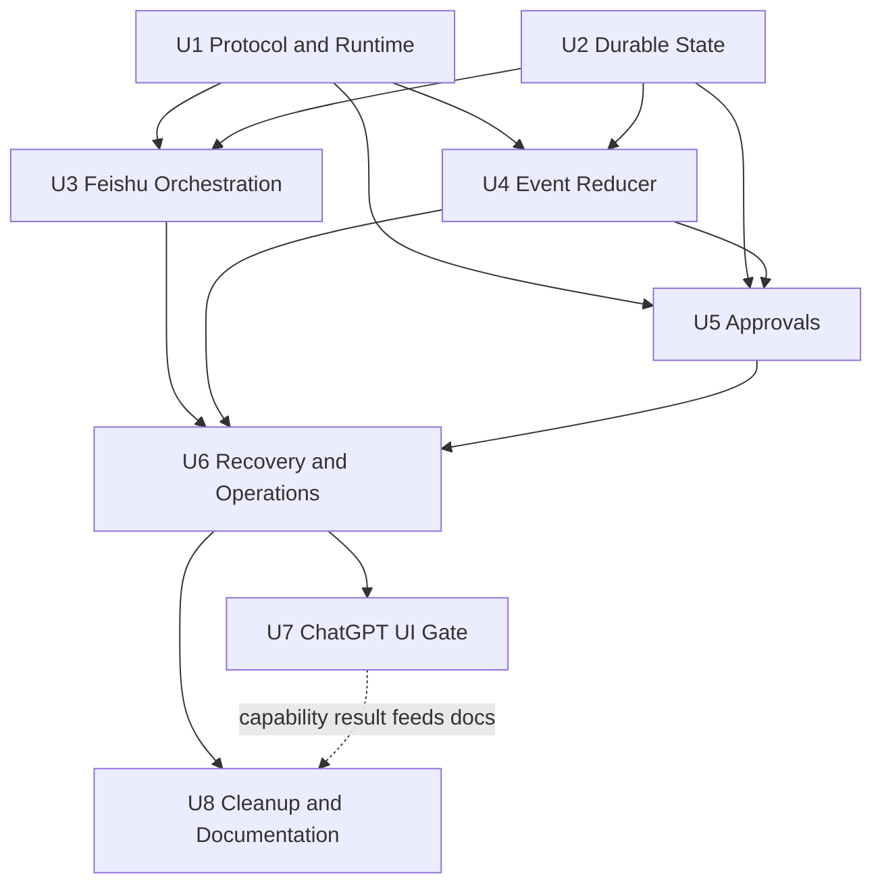
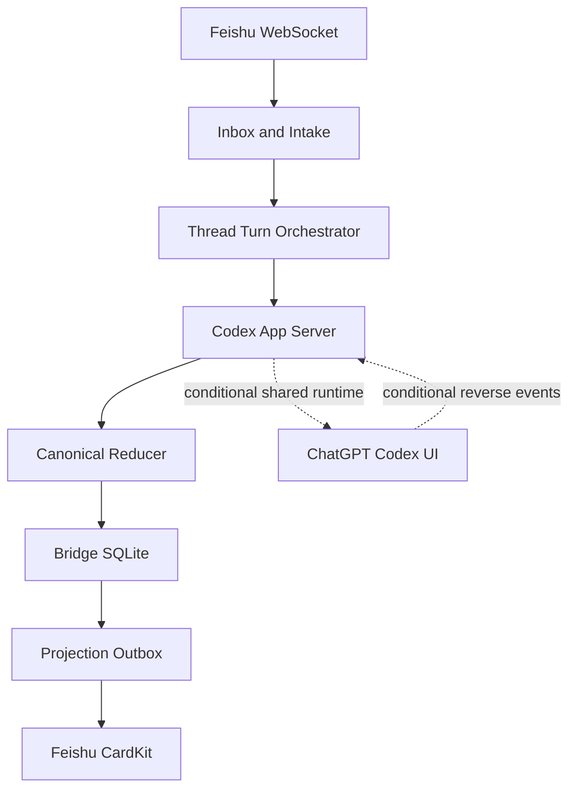

# feat: 基于 App Server 重构飞书与 ChatGPT 实时桥接

## Summary

将当前 `chatgpt-v2` 分支收敛为一条官方 App Server 主链路：飞书消息进入同一个 Codex thread/turn，App Server 执行智能体循环并输出 UI-ready 事件，飞书 CardKit 以事件流实时渲染。ChatGPT 页面只有在验收确认其订阅同一 App Server runtime 后才标记为实时同步，否则明确降级为历史可见或仅飞书实时。

---

## Problem Frame

当前仓库已经具备飞书收消息、启动 Codex turn、CardKit 流式更新和审批卡等能力，但实现混合了三条互相冲突的路径：标准 App Server、旧 Desktop 私有 IPC/SQLite 修补，以及未接入的 daemon/Electron/私有 relay 实验。新的 ChatGPT 客户端已经使旧 IPC 路径失效，而且直接改 ChatGPT/Codex 数据库、注入 Electron 或循环 deep link 刷新都不能证明页面订阅了同一个运行时。

本次改造必须把“模型任务真实执行并实时推送飞书”与“ChatGPT 当前页面实时刷新”拆成两个独立验收目标。前者由公开 App Server 协议保证；后者由同 runtime 验收结果决定，不能在没有证据时对外承诺。

当前工作树包含用户尚未提交的 `chatgpt-v2` 迁移实验。执行本计划时必须先保留这些改动，再按本计划逐项吸收或淘汰，禁止用回退工作树的方式覆盖。

---

## Requirements

- R1. 飞书所有消息和卡片回调必须以 tenant 作用域内的 `event_id`/`message_id` 持久化幂等；同一事件重复投递不得重复创建 thread、turn、steer、审批响应或任务卡。对外部 mutating RPC 采用“单次自动 dispatch + UNKNOWN 对账”，不能宣称 SQLite 提供跨系统 exactly-once。
- R2. 飞书任务按 `(tenant_key, lark_chat_id, lark_root_message_id)` 绑定 Codex thread；顶层消息以自身 `message_id` 作为 root，同一群允许存在多个独立任务。
- R3. 新绑定通过 `thread/start` 创建 thread；已有绑定通过 `thread/resume` 恢复订阅，空闲时用 `turn/start`，运行中补充消息用 `turn/steer(expectedTurnId)`。
- R4. App Server transport 必须完成 `initialize -> initialized` 握手，并正确区分 RPC response、server-initiated request 与 notification。
- R5. App Server 的 `thread/*`、`turn/*`、`item/*`、`error` 和 server request 是运行态的唯一实时事实源；本地存储只负责绑定、幂等、投影、审计与恢复检查点。
- R6. 飞书实时卡必须展示任务状态、可公开的 reasoning summary/commentary、命令与工具进度、文件变更摘要、最终回复和错误；不得把原始隐藏思维链当作产品合同。
- R7. 普通流式事件应在 1–2 秒窗口内合并更新；审批、错误、中断和完成事件立即刷新。每张 CardKit 卡只允许一个串行写入队列和单调递增 revision。
- R8. App Server 审批必须支持 `accept`、`acceptForSession`、`decline`、`cancel`，校验审批人权限，并对双击、过期、断线和已结束 turn 做幂等处理。
- R9. App Server 或 Bridge 断线重启后，必须通过重新握手、`thread/resume` 和 snapshot reconciliation 恢复非终态任务，不得依赖数据库轮询或不可用的服务端事件 offset。
- R10. ChatGPT 页面同步必须暴露明确能力状态：`shared_runtime_live`、`history_visible_only` 或 `feishu_live_only`；只有正反向验收通过才能进入 `shared_runtime_live`。
- R11. 生产主链路不得依赖 Desktop 私有 IPC、ChatGPT/Codex SQLite 写入、Electron 注入、私有 Noise relay、`code_mode_host` 猜测或 deep link 强刷。
- R12. 必须保留现有飞书用户白名单、审批人白名单、slash commands、skills 输入、图片/文件上传、CardKit sequence recovery 等已验证能力，除非协议变更要求明确迁移。
- R13. App Server 类型和事件名必须来源于运行时所选 `CODEX_BIN` 生成的 schema；启动 doctor 要发现 PATH CLI 与 ChatGPT 内置 CLI 的版本漂移。
- R14. 同一 thread 同时最多有一个可写 turn；首期同一 workspace 也只允许一个 Bridge 发起的写任务，避免文件写入竞态。
- R15. 所有 cwd 必须经过 `realpath` 并落在 `ALLOWED_WORKSPACE_ROOTS` 内；拒绝相对路径、符号链接逃逸、空路径、隐式 home fallback 和越界历史 binding。
- R16. 飞书入站必须 fail closed：校验 SDK 验证后的 envelope、app/tenant、sender type、chat、user/admin role 和命令权限；机器人自身消息、未知身份及跨租户数据不得进入 App Server。
- R17. 审批 action 必须使用一次性 opaque token，绑定 tenant/chat/card/approval/connection epoch/允许决策和 TTL，并通过服务端状态恢复权威上下文；不得信任卡片回传的 thread、turn、cwd 或 RPC request id。

---

## Scope Boundaries

- 不通过 UI 自动化模拟用户在 ChatGPT 页面输入。
- 不调用未公开的 Desktop IPC、ChatGPT relay 或内部 Electron API。
- 不直接修改 `~/.codex/state_5.sqlite`、`~/.codex/sqlite/*` 或 ChatGPT 应用缓存。
- 不把 `thread/inject_items`、Responses API 或 Workspace Agent trigger 伪装成真实用户 turn。
- 不把原始 reasoning text/CoT 默认推送到飞书；飞书只展示官方 reasoning summary、commentary 和可审计工具事件。
- 不在首期支持公网裸 WebSocket；TCP WebSocket 仅允许 localhost/SSH，远程部署必须另行设计认证与 TLS。
- 不在首期允许同一 workspace 多个写 turn 并行。
- deep link 如保留，仅用于用户主动导航到 thread，不能参与一致性判断或自动强刷。

### Deferred to Follow-Up Work

- 多实例 Bridge 的分布式 lease：首期按单机单进程设计，未来再引入跨进程协调。
- 远程 App Server 部署：本计划只覆盖本机 stdio/Unix socket。
- `acceptWithExecpolicyAmendment`、动态权限和 MCP elicitation 的完整 UI：首期先完成四种基础审批决策，保留协议扩展点。
- 长回答的独立归档页面：首期沿用截断、文件上传和补充消息策略。

---

## Context & Research

### Relevant Code and Patterns

- `src/index.ts`：当前飞书入站、消息幂等、skills 解析、任务卡创建和 turn 调用都集中在一个入口中，是拆分 intake/orchestration 的主要目标。
- `src/adapter.ts`：当前正式 App Server client，同时还保留旧 IPC、SQLite patch、snapshot 翻译和私有审批响应，需收敛为兼容薄层或移除。
- `src/codex/client.ts`：未跟踪的 daemon/UDS 客户端原型，可吸收其连接与重连思路，但不能与 `src/adapter.ts` 并存为第二事实源。
- `src/codex/connector.ts`：应成为唯一运行时装配入口，当前注释中的 `code_mode_host` 与真实启动参数不一致。
- `src/codex/events.ts` 与 `src/codex/dispatcher.ts`：当前新旧两个事件处理器并存；前者缺审批和工具事件，后者包含可复用的 CardKit/工具聚类逻辑。
- `src/feishu/card.ts`：已实现 CardKit 创建、元素流式 PUT、cardId 级 sequence recovery 和 finalize，可保留并增加 outbox/节流。
- `src/codex/queue.ts`：已有串行任务队列，可升级为 cardId 级单写队列和 finalize barrier。
- `src/core/storage.ts`：已有原子 JSON 写入和审批 TTL，但跨文件状态无法事务提交。
- `src/codex/history.ts`：已有 `thread/resume` 补偿逻辑，应降级为启动/重连对账而非实时刷新源。
- `src/cards/turn-cards.ts`：已有 `accept`、`acceptForSession`、`decline` 卡片和脱敏入口，可扩展 `cancel`、可用决策和已失效状态。
- `test/test.ts` 与 `test/bin/codex`：已有基本 transport mock，可重构成协议契约测试夹具。

### Institutional Learnings

- CardKit sequence 必须以 cardId 为作用域单调递增，不能由多个元素或 turn 各自维护。
- delta 不一定带 `AgentMessage.phase`；必须通过 `itemId` 关联 `item/started`/`item/completed`，否则 commentary 会串入 final answer。
- `item/completed` 是 item 最终权威状态，`turn/completed` 是 turn 唯一终态；本地按钮和启发式 sleep 不能先行宣布完成。
- `thread/read`/历史 JSONL 只能用于对账，不能与 App Server 事件流并列成为第二实时事实源。
- 当前 100ms dirty scan 和每次最多 15 次飞书重试容易形成队列堆积，应改为合并刷新、有限退避和 outbox。
- Server-initiated approval request 具有 `id + method`；如果仅把所有带 id 的消息当 response，会静默丢掉审批。
- App Server 通知没有公开的可重放全局序号；`last_event_seq` 只能作为本地投影 revision/connection epoch，断线恢复必须依赖 snapshot reconciliation。

### External References

- [Codex App Server](https://learn.chatgpt.com/docs/app-server)：rich client 接口、transport、初始化、thread/turn、事件、审批和错误的主事实源。
- [Unlocking the Codex harness](https://openai.com/index/unlocking-the-codex-harness/)：App Server 是长生命周期双向协议，事件被设计为 UI-ready；本地客户端通常拥有并保持自己的 App Server 连接。
- 本机 `codex app-server generate-json-schema --experimental`：用于锁定当前 `CODEX_BIN` 的 `expectedTurnId`、reasoning summary、command output 和审批 decision schema。
- 本机 CLI 观察：PATH 中 `codex` 与 ChatGPT 包内 `codex` 可能不是同一版本；daemon/remote-control 属于当前本机可见的实验能力，不能替代公开协议保证。

---

## Key Technical Decisions

| Decision | Choice | Rationale |
|---|---|---|
| 执行与事件事实源 | 单一 App Server client + 单一 event reducer | 消除 App Server、IPC snapshot、历史扫描三套状态互相覆盖的问题 |
| 默认 transport | 稳定模式用 stdio；页面同 runtime 验证用本机 daemon/Unix socket | 官方推荐本地客户端使用长生命周期 stdio；多客户端共享 runtime 需要可连接的本机 listener |
| ChatGPT 页面能力 | 三档 capability gate，不做无证据强刷 | 官方协议保证客户端自身 UI，不保证第三方 turn 自动刷新已打开的 ChatGPT 页面 |
| 持久化 | 新增本地 SQLite `bridge.db`，从现有 JSON 一次性迁移 | inbox、binding、task、approval、projection outbox 需要唯一约束和事务；多个 JSON 文件无法原子提交 |
| 外部副作用一致性 | durable intent + UNKNOWN outcome reconciliation | SQLite 无法与 App Server/飞书形成分布式事务；未知结果禁止盲目重发 |
| 实时内容 | reasoning summary/commentary + item lifecycle | 满足过程可见和审计需求，同时避免承诺隐藏 CoT |
| 活跃 turn 补充 | `turn/steer(expectedTurnId)` | 与当前协议一致，避免并发创建第二个 turn |
| 断线恢复 | connection epoch + snapshot reconciliation | RPC request id 只在连接内有效，事件流又没有公开 replay cursor |
| 飞书更新 | cardId 单写队列 + 1–2 秒合并 + terminal barrier | 控制频率、sequence 和 finalization 竞态 |
| 协议兼容 | 从实际 `CODEX_BIN` 生成类型，runtime doctor 校验版本 | 避免手写 event 名漂移以及 PATH/ChatGPT 内置 CLI 不一致 |

### Transport Matrix

| Transport | Ownership | Protocol path | Allowed use |
|---|---|---|---|
| `owned_stdio` | Bridge owns child process | `CODEX_BIN app-server --listen stdio://` over stdin/stdout | Stable default |
| `owned_unix` | Bridge owns listener/socket lifecycle | `CODEX_BIN app-server --listen unix://PATH` then UDS WebSocket | Local multi-client experiments |
| `owned_loopback_ws` | Bridge owns listener lifecycle | `CODEX_BIN app-server --listen ws://127.0.0.1:PORT` | Local validation only; never non-loopback |
| `managed_daemon_proxy` | Codex daemon owns control socket | Bridge starts `CODEX_BIN app-server proxy` and speaks over proxy stdin/stdout | U7 shared-runtime probe only |

Daemon control socket 与普通 `--listen unix://PATH` endpoint 不是同一个抽象。Bridge 不直接解析、连接或删除 daemon control socket。一个进程只激活一种 transport；有 active turn 或 pending approval 时禁止热切换。

### Runtime Modes

| Mode | App Server ownership | Feishu realtime | ChatGPT page | Product status |
|---|---|---:|---:|---|
| `shared_runtime_live` | managed daemon / proxy | Healthy dependencies 下满足 realtime SLO | Live only after bidirectional probe passes | Target capability |
| `history_visible_only` | shared or bridge-owned runtime | Healthy dependencies 下满足 realtime SLO | Reopen/refresh to read persisted history | Supported degradation |
| `feishu_live_only` | bridge-owned stdio | Healthy dependencies 下满足 realtime SLO | Not promised | Safe fallback |

`shared_runtime_live` 不等于“UDS 可连接”。它必须额外证明 ChatGPT 页面订阅了该 runtime，并且 Bridge 能收到同一绑定 thread 上由页面发起的 turn。

这里的 Feishu realtime 是健康依赖下的服务目标，不是无条件保证。断线或限流时卡片进入恢复/延迟状态，过程 delta 可能不可重放；依赖恢复后保证最终状态收敛。

---

## Open Questions

### Resolved During Planning

- 是否继续使用私有 Desktop IPC：否，生产路径完全移除。
- 是否继续通过 SQLite patch/deep link 保证 UI：否；deep link 最多保留为显式导航。
- 飞书 UI 的事实源：App Server event stream；SQLite 只保存 checkpoint/outbox。
- 运行中补充消息如何处理：同绑定且有 active turn 时使用 `turn/steer(expectedTurnId)`。
- 推理过程展示什么：官方 reasoning summary、commentary 和工具状态，不默认展示 raw reasoning text。
- 使用 JSON 还是 SQLite：使用 Bridge 自己的 SQLite，禁止触碰 ChatGPT/Codex 数据库。

### Deferred to Implementation

- 当前 ChatGPT build 是否能附着 Bridge 使用的 managed daemon：需要 U7 的真实双向 UI 验收决定。
- daemon 默认 socket 的最终发现方式：从所选 `CODEX_BIN`/platform 能力发现，禁止硬编码仓库中的 `/tmp/bridge-direct.sock`。
- PATH CLI 与 ChatGPT 包内 CLI 选择：由 doctor 输出版本与路径，部署时显式选择并生成对应协议 fixture。
- SQLite 技术门：保持 Node 20 并选择兼容原生驱动，还是升级 Node 后再选稳定接口；必须以 clean-install/打包验证结果决策。
- 数据保留：inbox payload、prompt/item、approval audit、delivered outbox、UI certificate 和 migration backup 的默认保留期及清理责任人。
- 附件策略：首期允许的 MIME、单文件/总大小、数量、超时和解压上限。
- 当前未提交实验文件是吸收、移动到研究目录还是删除：实施前逐文件对照本计划，不覆盖用户工作。

---

## Output Structure

    src/
      codex/
        client.ts
        connector.ts
        protocol.ts
        orchestrator.ts
        reducer.ts
        approvals.ts
        recovery.ts
        ui-sync.ts
      core/
        database.ts
        migrations.ts
        repositories.ts
      feishu/
        intake.ts
        projector.ts
        approval-actions.ts
    test/
      codex/
      core/
      feishu/
      integration/
      fixtures/app-server/

该结构是范围声明，不是要求机械照搬；实现中可根据现有循环依赖情况调整文件边界，但必须保持单一 client、单一 reducer 和 intake/projector 分离。

---

## High-Level Technical Design

> *This illustrates the intended approach and is directional guidance for review, not implementation specification. The implementing agent should treat it as context, not code to reproduce.*

### Message and task state

### Canonical state-to-card contract

| State | User-facing meaning | Allowed actions |
|---|---|---|
| `QUEUED_WORKSPACE` | 同一工作区已有写任务，当前任务等待执行 | 查看状态、取消排队 |
| `STARTING` | 请求已准备并正在提交，暂勿重复发送 | 查看状态、请求取消 |
| `DISPATCH_UNKNOWN` / `NEEDS_REVIEW` | 请求可能已执行，系统正在核对；禁止直接重跑 | 管理员再次对账，普通用户查看状态 |
| `RUNNING` | App Server 正在执行 | 补充说明、请求取消 |
| `AWAITING_APPROVAL` | 等待有权限用户处理审批 | 审批按钮或查看状态 |
| `RECOVERING` | Bridge 正在重连/对账，过程记录可能不完整 | 查看状态、请求取消 |
| `DELIVERY_DELAYED` | 模型仍可能执行，但飞书更新延迟 | 查看状态；禁止据此重复提交 |
| Terminal states | 展示最终结果、稳定错误码或中断原因 | 新建任务；UNKNOWN 不提供直接重跑 |

每张卡必须显示脱敏 task reference、最后更新时间、ChatGPT UI mode 和安全下一步；状态/风险不得只依赖颜色或 emoji。过程区默认可折叠并限制可见条数，最终答案位置保持稳定，审批按钮在窄屏允许纵向布局。

### Durable records

- `chat_profile`：tenant/chat 级默认 thread、workspace、model、personality、plan mode 和待消费 skill；承接旧 `sessions.json`，不伪造 root。
- `task_binding`：tenant、`chat_id`、`root_message_id`、project/workspace、thread 和 UI sync mode。
- `inbox_message`：tenant 作用域内唯一 event/message、payload digest、消息时间、claim owner/deadline、处理状态和错误，作为入站幂等与陈旧事件边界。
- `task_turn`：binding、prompt、turn、状态、card、cancel flag、projection revision、reconcile 时间。
- `task_item`：`item_id`、类型、phase、状态、可渲染内容摘要和 terminal payload。
- `dispatch_intent`：operation key/type、task/binding、connection epoch、RPC id、request digest 和 `PREPARED/SENT/ACKED/UNKNOWN/RESOLVED/ABANDONED` 状态。
- `workspace_claim`：canonical workspace key、task/thread/turn、heartbeat、connection epoch 和 lease 状态。
- `approval`：runtime instance、connection epoch、RPC request id/method、thread/turn/item、response intent、状态、决策、审批人和期限。
- `projection_outbox`：card 目标、本地 projection revision、外部 card sequence、稳定 UUID、claim/retry 和发送状态。

App Server 的 delta 不写成永久事件日志；reducer 保存当前投影状态，重连后以 `thread/read`/`thread/turns/list` snapshot 覆盖校正，避免重复追加历史 delta。

---

## Implementation Units

### Requirements traceability

| Requirement | Implementation owner(s) | Verification owner(s) |
|---|---|---|
| R1 | U2, U3 | U3, U6 |
| R2 | U2, U3 | U2, U3 |
| R3 | U1, U3 | U3, U6 |
| R4 | U1, U5 | U1, U5 |
| R5 | U1, U4, U6, U7 | U4, U6, U7 |
| R6 | U4 | U4 |
| R7 | U2, U4, U6 | U4, U6 |
| R8 | U2, U5, U6 | U5, U6 |
| R9 | U2, U4, U5, U6 | U6 |
| R10 | U7, U8 | U7, U8 |
| R11 | U1, U7, U8 | U8 |
| R12 | U3, U4, U5, U8 | U3, U4, U5, U8 |
| R13 | U1, U6, U7, U8 | U1, U6, U7 |
| R14 | U2, U3, U6 | U2, U3, U6 |
| R15 | U2, U3, U6, U8 | U3, U6, U8 |
| R16 | U2, U3, U6, U8 | U3, U6, U8 |
| R17 | U2, U5, U6, U8 | U5, U6, U8 |

### U1. 收敛 App Server 协议与运行时客户端

**Goal:** 只保留一个生产 App Server client，支持 stdio 与 Unix socket，完成规范握手、消息分流、重连和 schema 兼容。

**Requirements:** R4, R5, R11, R13

**Dependencies:** None

**Files:**
- Modify: `src/config.ts`
- Modify: `src/codex/client.ts`
- Modify: `src/codex/connector.ts`
- Modify: `src/codex/protocol.ts`
- Modify or retire: `src/adapter.ts`
- Modify: `src/core/platform.ts`
- Modify: `package.json`
- Create: `tsconfig.test.json`
- Test: `test/codex/client.test.ts`
- Test: `test/codex/protocol.test.ts`
- Create fixtures: `test/fixtures/app-server/`

**Approach:**
- 以 `src/codex/client.ts` 为唯一 transport client；`src/adapter.ts` 在迁移期只保留业务兼容接口，最终不再含 IPC/SQLite/UI 逻辑。
- transport 状态机为 `DISCONNECTED -> CONNECTING -> INITIALIZING -> READY -> RECONNECTING/DEGRADED`。
- READY 前禁止业务 RPC；`initialize` 成功后立即发送 `initialized` notification。
- 消息路由按三类判断：id 命中 pending 为 response；`id + method` 且未命中 pending 为 server request；无 id 的 method 为 notification。
- stdio 为稳定默认；managed daemon/Unix socket 仅用于共享 runtime 和恢复场景。WebSocket listener 不对公网开放。
- `managed_daemon_proxy` 必须通过官方 proxy 入口连接；能力由 doctor 实测探测，禁止把 daemon control socket 当作普通 UDS WebSocket。
- UDS 位于 Bridge 私有 `0700` 目录，socket 为 `0600`；连接前校验非 symlink、类型和 owner UID。只允许清理由 Bridge 创建且 owner/type 匹配的 socket。
- `ws://` 配置只接受 loopback，显式拒绝 `0.0.0.0`、局域网和公网；`CODEX_BIN` 解析为绝对路径并用 `spawn/execFile` 启动，不经 shell 拼接。
- wire 输出遵循 App Server JSON-RPC-lite 格式，不依赖 `jsonrpc` header；解析器容忍旧 mock 中的 header。
- 从实际 `CODEX_BIN` 生成 schema fixture；doctor 比较运行 server、PATH CLI 和配置 binary 的版本。
- 配置正式 TypeScript test runner 和 `test:unit`、`test:contract`、`test:integration`、`test:all`；CI 与阶段退出统一执行 `test:all`，测试源码由独立 tsconfig/type-check 覆盖。真实 shared-runtime smoke 保持独立人工命令。
- server request 使用可扩展 registry。未注册或首期不支持的 request 必须持久化并进入可见 blocked 状态；仅在 schema 明确允许时回复 deny/cancel/error，绝不能静默悬挂并长期占用 lease。

**Execution note:** 先为现有 stdio/UDS 行为添加 characterization coverage，再替换旧 adapter，避免迁移时丢失 commands 和 mock 能力。

**Patterns to follow:**
- `src/adapter.ts` 的 request timeout、pending map 和 stdio reader。
- `test/bin/codex` 的本地 mock binary。

**Test scenarios:**
- Happy path: stdio client 完成 `initialize -> initialized` 后进入 READY，随后 `thread/list` 正常返回。
- Happy path: Unix socket client 能连接本机 mock listener，并在同一连接收发 request、notification 和 server request。
- Edge case: `turn/started` 在 `turn/start` response 前到达时，notification 不会被误认作 response。
- Error path: server-initiated approval 带 id 但不在 pending map 中，必须进入 server request handler 而不是被丢弃。
- Error path: App Server 退出时所有 pending RPC 以连接错误结束，transport 进入重连而不是永久挂起。
- Error path: READY 前调用业务方法得到稳定的本地错误，不把非法请求发给 server。
- Error path: daemon control socket 不可被客户端直连或自动 unlink；UDS 为 symlink、其他 UID 所有或权限过宽时拒绝连接。
- Integration: 使用 `test/bin/codex` 验证生成 schema 对应的 `turn/steer.expectedTurnId` 和四种基础审批 decision 可被 client 编解码。
- Error path: unsupported MCP elicitation、dynamic permission 和未知未来 request 不会被吞掉或无限挂起。

**Verification:**
- 主程序只实例化一个 App Server client。
- 代码中不再启动 Desktop IPC connection loop，也不再硬编码 `/tmp/bridge-direct.sock`。
- 初始化、server request、notification、重连均有独立契约测试。

### U2. 建立事务化 Bridge 持久化模型

**Goal:** 用 Bridge 自有 SQLite 统一 inbox、binding、task、item、approval 和 projection outbox，并安全迁移现有 JSON 状态。

**Requirements:** R1, R2, R7, R8, R9, R14, R15, R16, R17

**Dependencies:** None

**Files:**
- Create: `src/core/database.ts`
- Create: `src/core/migrations.ts`
- Create: `src/core/repositories.ts`
- Modify: `src/core/storage.ts`
- Modify: `src/core/state.ts`
- Modify: `src/types.ts`
- Modify: `src/config.ts`
- Modify: `package.json`
- Test: `test/core/database.test.ts`
- Test: `test/core/migration.test.ts`
- Test: `test/core/repositories.test.ts`

**Approach:**
- 数据库位于 Bridge 配置目录的 `bridge.db`，绝不访问 ChatGPT/Codex 数据库。
- U2 开始前必须锁定最低 Node 版本与 SQLite driver。当前 Node 20/CommonJS 路线只能选择对目标 Node ABI/macOS 有预构建产物、支持显式事务的驱动；clean install、native load、ts-node、打包启动和文件权限测试通过后才能实施 schema。若升级 Node，必须单列 runtime 迁移和回滚，不默认假设 `node:sqlite` 可用。
- 对 `(tenant_key, event_id)`、适用事件的 `(tenant_key, message_id)` 和 `(tenant_key, chat_id, root_message_id)` 建唯一约束；task、approval、card action token、outbox 和审计外键继承 tenant/app identity。
- 本地 task 状态、dispatch intent、workspace claim、projection revision 和 outbox 在同一事务内提交；外部 App Server/飞书副作用通过 intent + reconciliation 管理，不能宣称跨系统事务。
- `dispatch_intent` 在 mutating RPC 前进入 `PREPARED`，发送后进入 `SENT`，response/event 关联后进入 `ACKED/RESOLVED`；断线/崩溃无法判定时进入 `UNKNOWN`，禁止自动盲重试。
- approval 用 `(runtime_instance_id, connection_epoch, rpc_request_id, method)` 定位，兼容字符串/数字 id，保留审计终态。
- `workspace_claim` 以 canonical realpath 为 key，通过 CAS 获取；断线不能释放，只有 turn terminal 或对账确认无 active turn 后释放。
- 旧 `sessions.json` 迁为 `chat_profile`；`approvals.json` 迁为不可点击的 `STALE_IMPORTED`；`pushed_turns.json` 迁为历史 seen-turn 标记。
- 启动迁移持有单实例锁，先校验源 digest，在 `bridge.db.staging` 导入并执行行数/外键/`integrity_check` 后原子切换。迁移失败时业务 dispatch fail closed；cutover 后只能恢复 SQLite 快照或 forward-fix，不能回旧 JSON 双写。
- 数据库启用外键、busy timeout，并明确 WAL/synchronous 策略；partial unique index 保证每个 thread 和 workspace 最多一个非终态写任务。
- 对受 Bridge 管理的敏感数据启用 SQLite `secure_delete`（运行时支持时）；清理后执行有界 WAL checkpoint，并通过受控 `VACUUM`/incremental-vacuum 维护回收 free pages。database、WAL、SHM、staging 和 backup 均使用 `0600`，失败 staging 与过期 backup 必须清理。逻辑清理不承诺删除 Time Machine、磁盘快照或其他外部备份中的副本；有物理擦除合规要求时必须依赖加密存储或单独数据库加密方案。
- 内存 Map 只作为缓存，数据库记录是恢复来源。

**Execution note:** 先写 JSON 到 SQLite 的迁移与回滚测试，再切换运行时读写。

**Patterns to follow:**
- `src/core/storage.ts` 的配置目录和原子写语义。
- `src/types.ts` 的 Session/Turn/Approval 领域字段。

**Test scenarios:**
- Happy path: 旧 `sessions.json` 迁移后保留 thread、cwd、model、personality、planMode 和 skill 设置。
- Happy path: 同一个 `message_id` 插入两次时只有第一次获得 dispatch 权限。
- Edge case: 同一群两个不同 root 创建两个 binding；同一 root 重试返回同一 binding。
- Error path: JSON 损坏或迁移中断时 transaction 回滚，原文件不被删除或覆盖。
- Error path: purge/checkpoint/VACUUM 任一步崩溃后数据库仍通过 integrity check，受管 staging/backup/WAL 不无限残留。
- Error path: task 与 outbox 写入任一步失败时，整个状态变更不可见。
- Integration: Bridge 重启后恢复 active turn、card id/revision、审批审计和未发送 outbox；旧 epoch 审批原子转为 stale，不能恢复为可点击 pending。
- Error path: App Server 已接受 `thread/start`/`turn/start` 但 response 落库前崩溃，恢复后进入 UNKNOWN 对账，不创建第二个 thread/turn。
- Edge case: 两个 tenant 使用相同 chat/message/root id 时完全隔离；同 tenant 重放被唯一约束拒绝。

**Verification:**
- 所有关键唯一性和状态转换由数据库约束/事务保护。
- `processedMessageIds`、`pushedTurns` 不再是唯一幂等依据。
- 迁移过程可重复执行且不会生成重复 binding/task。

### U3. 拆分飞书 intake 与 thread/turn 编排

**Goal:** 将 `src/index.ts` 中的消息处理拆成可测试的 intake/orchestrator，并实现 root binding、start/resume/steer/interrupt 的正确调度。

**Requirements:** R1, R2, R3, R12, R14, R15, R16

**Dependencies:** U1, U2

**Files:**
- Create: `src/feishu/intake.ts`
- Create: `src/codex/orchestrator.ts`
- Modify: `src/index.ts`
- Modify: `src/commands/router.ts`
- Modify: `src/commands/handlers/session.ts`
- Modify: `src/commands/handlers/bind.ts`
- Modify: `src/commands/handlers/control.ts`
- Test: `test/feishu/intake.test.ts`
- Test: `test/codex/orchestrator.test.ts`
- Test: `test/integration/message-to-turn.test.ts`

**Approach:**
- 所有事件先持久化，再让 SDK handler 返回；reaction 只是用户反馈。inbox 使用 CAS claim/lease，记录 event/message digest、消息时间和 attempt。首次收到且超过配置 backlog 窗口的历史事件标记 `IGNORED_STALE`，只恢复本机此前已持久化的可恢复事件。
- 相同 message id 但 digest 不同视为完整性异常；command 和 card action 也经过同一 tenant 作用域幂等边界。
- 入站授权顺序固定为 verified envelope、app/tenant、sender type、chat、user/admin role、command-specific authorization，任一步失败都不创建 intent。
- 权限反馈按信任层分级：签名失败、未知 tenant/app、机器人自身消息和跨租户 envelope 仅写脱敏审计，不回复；已验证 tenant/chat 内的未授权用户只收到通用“请求未执行：权限不足”和 request reference，不显示白名单；管理员命令明确提示所需角色；cwd 越界仅展示允许的 workspace 标签，quarantine 卡说明任务未启动。所有拒绝发生在 dispatch intent 之前。
- root key 使用飞书事件的 root/parent 关系；无 root 的顶层消息以自身 message id 建立 task root。
- 顶层任务卡、审批卡和状态反馈必须 reply 到对应 `lark_root_message_id`；话题群使用 thread reply，普通群使用 message reply，并在卡头显示短 task reference。同群不同 root 的卡片/回调不得混线。
- 新 root 可创建新 thread；现有 `/list`、`/new`、`/bind` 保留 chat-level default 作为向后兼容，但实际任务落到 root binding。
- 同一 tenant 内一个 Codex thread 首期只允许一个 active task binding；未绑定 thread 的 ChatGPT 反向事件仅审计、不自动投影。`/bind` 仅管理员可用，并明确提示将启用双向同步；解绑后反向事件立即停止。
- 每个 thread 有串行 dispatch lock。无 active turn 时 `thread/resume` 后 `turn/start`；有 active turn 时 `turn/steer(expectedTurnId)`。
- 不同 root 竞争同一 workspace 时进入持久化 FIFO `QUEUED_WORKSPACE`；只有同一 binding/root 的补充消息可以 steer。用户可取消自己的排队任务，管理员可终止阻塞任务，但不得绕过 workspace claim 并行启动。
- `turn/start` response 与 `turn/started` 竞速通过 client request token + thread pending-start 合并为同一个 task。
- 所有 mutating RPC 先创建唯一 durable intent。UNKNOWN 时先按 thread、时间窗和输入摘要对账；只有候选唯一才绑定，多候选/无候选进入人工恢复，首期优先避免重复执行。
- UNKNOWN 卡显示“请求可能已执行，请勿重复发送”、最近对账时间和 task reference。管理员可执行再次对账、绑定唯一候选 turn、确认未执行后创建新的显式 retry intent、或放弃；所有动作写审计，普通用户不能直接重跑。
- 启动阶段收到 `/cancel` 时持久化 `cancel_requested`，取得真实 turn id 后立即 `turn/interrupt`。
- skills 输入、model、personality、cwd、plan mode 继续由已有配置转换为合法 turn params。
- 输入附件只允许通过已认证飞书 SDK/OpenAPI resource id 下载，拒绝任意 URL；限制数量、大小、超时和解压规模，按内容校验 MIME，在 `0700` 私有临时目录以随机名和 exclusive create 落盘，不保留用户路径片段，并在 terminal/失败/启动恢复时清理。
- 入站附件采用全有或全无：任一文件不支持、超限、下载失败或 MIME 不符时不创建 thread/turn/lease，并在原 root 返回稳定错误码、脱敏文件名、当前限制和修正动作。出站 artifact 是任务终态后的独立子状态；上传失败不改变 turn 成功状态，只能重试上传，不能重新执行模型。自动上传关闭时，卡片明确说明本地文件未外发。

**Patterns to follow:**
- `src/index.ts` 的用户过滤、授权、skills 解析和 CardKit 初始反馈。
- `src/commands/handlers/*` 的 command 路由与状态卡交互。

**Test scenarios:**
- Happy path: 顶层飞书消息创建 binding、thread、turn 和一张任务卡。
- Happy path: 已有 idle binding 的后续消息执行 `thread/resume + turn/start`。
- Happy path: active turn 收到补充消息只发送一次 `turn/steer`，且 `expectedTurnId` 等于持久化 active turn。
- Edge case: 同一群两个 root 同时发消息，事件、卡片和 thread 不串联。
- Edge case: `turn/started` 先于 `turn/start` response，最终仍只有一个 task/turn mapping。
- Error path: stale `expectedTurnId` 触发一次 active turn reconciliation，不无条件重试或创建并发 turn。
- Error path: `/cwd ../../`、符号链接越界、历史越界 binding 进入 quarantine；`/cwd`、`/bind`、`/new` 仅授权角色可执行。
- Error path: attachment traversal、MIME spoofing、超限文件、archive bomb 和临时文件残留均被拒绝或清理。
- Error path: 部分附件失败时整批不 dispatch，用户得到可执行修正提示；出站上传重试不会重新启动 Codex turn。
- Error path: 启动阶段取消在拿到 turn id 后自动 interrupt；最终状态以 `turn/completed` 为准。
- Integration: 同一 `message_id` 重放三次，App Server 只收到一次 start/steer，飞书只创建一张任务卡。
- Integration: 同群两个 root 并行时，任务卡、审批卡和回调始终留在各自消息线程。

**Verification:**
- `src/index.ts` 只负责 SDK 注册与依赖装配，不再包含完整 turn 生命周期。
- 每个 thread 和 workspace 的写操作有明确串行边界。
- 飞书补充说明符合当前 `expectedTurnId` 协议。

### U4. 建立 canonical event reducer 与飞书投影器

**Goal:** 用 itemId 驱动的纯 reducer 统一事件语义，并通过可靠 outbox 实时更新 CardKit。

**Requirements:** R5, R6, R7, R9, R12

**Dependencies:** U1, U2

**Files:**
- Create: `src/codex/reducer.ts`
- Create: `src/feishu/projector.ts`
- Modify: `src/codex/events.ts`
- Modify or retire: `src/codex/dispatcher.ts`
- Modify: `src/codex/queue.ts`
- Modify: `src/feishu/card.ts`
- Modify: `src/feishu/media.ts`
- Modify: `src/cards/turn-cards.ts`
- Modify: `src/types.ts`
- Test: `test/codex/reducer.test.ts`
- Test: `test/feishu/projector.test.ts`
- Test: `test/integration/event-to-card.test.ts`

**Approach:**
- 原始 message 先通过 protocol decoder，再转成 normalized event，reducer 只更新 task/item state，不直接调用飞书 API。
- 通过 `itemId` 保存 item type、agent phase 和内容。`commentary`、reasoning summary、final answer 分区渲染；`item/completed` 覆盖 delta 累积结果。
- 正式支持 `item/reasoning/summaryTextDelta`、`summaryPartAdded`、`item/commandExecution/outputDelta`、`turn/diff/updated`、`turn/plan/updated`、MCP/tool/fileChange 和 `error`。
- raw `item/reasoning/textDelta` 默认不投影；可仅记录“模型正在推理”的状态。
- 所有飞书字段必须先通过统一 `ProjectionSanitizer` 再写 outbox：secret redaction、路径最小化、CardKit/Markdown escaping、控制字符清理、字段长度上限和安全截断。outbox 只保存已清洗的投影 payload。
- 普通 delta 合并 1–2 秒，terminal/approval/error 立即 enqueue；同一 cardId 只有一个 writer。
- `projection_revision` 与飞书 `card_sequence` 分离。reducer 在事务中递增 revision 并 UPSERT 最新 outbox；projector 事务 claim、事务外调用飞书，明确成功后才推进外部 sequence。
- 同一 outbox 重试复用稳定 UUID 和 sequence；初始消息也使用由 task 派生的稳定 UUID，避免崩溃重试创建两张卡。正常路径只使用数据库的 `last_acked_sequence`，无法确定外部值时进入未知态，不盲目自增。
- 当前 CardKit API 无法读取服务端权威 sequence 时，禁止递增扫描；进入 `CARD_SEQUENCE_UNKNOWN`，优先用消息级全量 patch/替代卡恢复并在旧 root 留下指向，仍无法恢复则转人工处理。
- projection outbox 负责 429/5xx 有界指数退避。终态 projection 淘汰旧非终态 payload，finalization 通过队列 barrier，移除按字符 sleep。
- 首卡短超时失败时，在同 root 尝试发送带 task reference、当前状态和“请勿重复提交”的普通文本 fallback，正式卡继续由 outbox 创建；飞书完全不可用时标记 `DELIVERY_UNCONFIRMED`，恢复后的第一条消息补充实际执行时间和状态。
- `turn/completed` 强制关闭未完成 item，迟到 usage 只更新统计，不改变终态。
- terminal media upload 作为独立后置 outbox operation，以 task/file digest 幂等，不阻塞 CardKit finalize；恢复重试不得重复上传。

**Execution note:** 先用真实 schema fixture 为 commentary/final_answer、command、tool、乱序和 terminal 行为写 reducer 测试，再替换旧 dispatcher。

**Patterns to follow:**
- `src/codex/dispatcher.ts` 的工具分类、折叠面板和脱敏逻辑。
- `src/feishu/card.ts` 的 cardId sequence recovery。
- `src/codex/queue.ts` 的串行队列。

**Test scenarios:**
- Happy path: `item/started(agentMessage, commentary) -> delta -> completed` 只更新过程区。
- Happy path: `item/started(agentMessage, final_answer) -> delta -> completed` 只更新最终答案区。
- Happy path: commandExecution 输出按 itemId 进入对应工具面板，完成时显示 exit code/状态。
- Edge case: delta 先于 `item/started` 时创建临时 item shell，started 到达后补全类型和 phase。
- Edge case: `turn/completed` 缺少某个 `item/completed` 时自动关闭该 item，最终卡只 finalize 一次。
- Edge case: terminal 后迟到 token usage 更新 footer，但不会把 task 改回 running。
- Error path: 飞书 patch 返回 429/5xx 时写回 outbox 重试，不阻塞 App Server reader。
- Error path: 飞书 sequence 冲突时不推进 `last_acked_sequence`，转入可恢复/人工处理分支且不重复追加模型文本。
- Error path: sequence 无法恢复时进入 `CARD_SEQUENCE_UNKNOWN`，不盲目尝试 N+1；首卡失败但文本 fallback 成功时模型任务仍可追踪。
- Integration: 一组完整 App Server fixture 最终生成一张含 prompt、summary、tool、final answer 和 terminal footer 的卡。
- Security: token、Authorization header、private key、绝对路径、ANSI/control character 和 CardKit markup injection fixture 均被清洗。
- Integration: 图片/普通文件上传、重复恢复、超限、越界路径和上传失败不破坏主卡终态。

**Verification:**
- `src/codex/events.ts` 是唯一 event entry，旧 dispatcher 不再作为第二处理器。
- App Server reader 不直接等待飞书网络请求。
- CardKit 更新频率、revision 和 terminal barrier 可测且可恢复。

### U5. 重建 App Server 审批闭环

**Goal:** 将 server-initiated approval 变为持久化、可审计、可恢复失败的状态机。

**Requirements:** R4, R8, R9, R12, R17

**Dependencies:** U1, U2, U4

**Files:**
- Create: `src/codex/approvals.ts`
- Create: `src/feishu/approval-actions.ts`
- Modify: `src/index.ts`
- Modify: `src/cards/turn-cards.ts`
- Modify: `src/core/repositories.ts`
- Modify: `src/codex/events.ts`
- Test: `test/codex/approvals.test.ts`
- Test: `test/feishu/approval-actions.test.ts`
- Test: `test/integration/approval-roundtrip.test.ts`

**Approach:**
- 明确识别 `item/commandExecution/requestApproval` 和 `item/fileChange/requestApproval`，读取 `availableDecisions` 决定按钮。
- 状态机为 `PENDING -> DECIDING -> RESPONSE_INTENT_PERSISTED -> SENT_AWAITING_RESOLUTION -> ACCEPTED/ACCEPTED_FOR_SESSION/DECLINED/CANCELLED`，另有 `OUTCOME_UNKNOWN/EXPIRED/STALE`。
- 每个按钮使用至少 128-bit 随机一次性 opaque token，数据库只保存 hash，并绑定 tenant/app/chat/card/approval/connection epoch/允许 decision/TTL。回调从服务端恢复上下文，校验用户与 decision 后 CAS 消费；卡片回传的 thread/turn/cwd/request id 一律不可信。
- 飞书合法点击先持久化不可变 response intent，再向当前 connection epoch 发送。socket write 只能进入 `SENT_AWAITING_RESOLUTION`；以 `serverRequest/resolved`、item/turn 状态或连接关闭收敛。
- “可能已发送”的失败进入 `OUTCOME_UNKNOWN`，禁止回滚 PENDING 或跨连接重发；只有 transport 明确证明未入队时才允许同 epoch 重试。
- 收到 `serverRequest/resolved`、turn terminal 或 TTL 到期时关闭按钮并更新卡片。
- `acceptForSession` 的授权范围完全交给 App Server，Bridge 不自行缓存放行规则。
- `acceptForSession` 默认只对独立 elevated approver role 开放，并要求二次确认其作用范围与失效条件；审计保存 policy version。server 的 `availableDecisions` 只是必要条件，不替代 Bridge 授权。
- 审批卡创建、按钮失效和 terminal 更新必须经过 U4 projector/outbox，approval handler 不得成为第二个 CardKit writer。
- 按钮必须使用明确作用域文案；CAS 成功后立即切换为“正在提交决定”并禁用重复点击，最终显示决定、审批人、时间和作用范围。`OUTCOME_UNKNOWN` 显示“决定可能已送达，禁止再次点击”。

**Patterns to follow:**
- `src/cards/turn-cards.ts` 的风险提示、脱敏和三按钮布局。
- `src/index.ts` 的 `ALLOWED_APPROVERS` 校验。
- `src/core/storage.ts` 的现有 30 分钟 TTL 语义。

**Test scenarios:**
- Happy path: command approval 的 `accept`、`acceptForSession`、`decline`、`cancel` 均回复正确 request id，并更新同一审批卡。
- Happy path: file approval 只展示 server 声明的可用决策。
- Edge case: 两个用户同时点击，只有第一个合法 CAS 能发出 response。
- Error path: 未授权用户点击不改变审批状态，不向 App Server 发消息。
- Error path: 连接重建后旧 connection epoch 的审批被标记 stale，旧 request id 不发到新连接。
- Error path: App Server response 写入失败时审批不会被静默删除。
- Error path: response 可能已写入但数据库提交前崩溃时，重启后标记 unknown/stale，不向新 epoch 重发。
- Error path: 转发卡片、跨群点击、篡改 decision、双击和旧卡重放均不发送 App Server response。
- UX: 长中文、窄屏和四决策布局下，作用范围、危险操作和处理中状态仍清晰可读。
- Integration: server request 暂停 turn，飞书批准后 item completed，turn 继续并最终完成。

**Verification:**
- 新主链路下审批卡完整工作，不依赖 IPC approval 方法。
- 每次审批都有 thread/turn/item、审批人、决策和时间审计记录。
- stale/expired/terminal 审批按钮不可再次执行。

### U6. 实现断线恢复、对账、健康检查和可观测性

**Goal:** 使 transport、任务卡、审批和 outbox 在 App Server/Bridge/飞书故障后最终收敛。

**Requirements:** R1, R5, R7, R9, R13, R14, R15, R16, R17

**Dependencies:** U3, U4, U5

**Files:**
- Create: `src/codex/recovery.ts`
- Create: `src/core/health.ts`
- Modify: `src/codex/history.ts`
- Modify: `src/codex/connector.ts`
- Modify: `src/cli.ts`
- Modify: `src/core/logger.ts`
- Modify: `src/config.ts`
- Create: `src/commands/handlers/doctor.ts`
- Test: `test/codex/recovery.test.ts`
- Test: `test/core/health.test.ts`
- Test: `test/integration/restart-recovery.test.ts`

**Approach:**
- 断线时 pending RPC 失败，非终态 task 进入 `RECOVERING`，卡片显示连接恢复中；使用指数退避和 jitter 重连。
- 重连顺序固定为 initialize、initialized、持久化新 connection epoch 并 stale 旧审批、恢复 bindings、`thread/resume`、snapshot reconcile、生成新 projection revision、淘汰旧 outbox payload，再开放新 dispatch。
- reader/pending RPC/server request handler 捕获 connection generation；旧 reader 的迟到消息不得写入新 epoch。
- 每个 thread 使用 reconcile generation 和 dispatch gate。snapshot 请求期间缓冲实时事件；snapshot 合并后按接收顺序应用缓冲事件，terminal 不可回退。
- `thread/turns/list` 分页直到已知 watermark；`task_turn(thread_id, turn_id)` 和 `task_item(turn_id, item_id)` 唯一。snapshot 以最终 item/turn 校正 state，不重放历史 delta。
- App Server snapshot/持久化 turn item 可能有损；恢复只保证 turn 终态、最终 agent message 和已持久化 item 对账，不承诺补回断线窗口内所有 command/tool delta。卡片必须明确标记“连接中断期间的部分过程不可重放”。
- 旧 connection epoch 的审批全部 stale；若 App Server 重新发出请求则创建新 approval。
- 卡片创建或 patch 失败不阻止模型任务执行，projection outbox 独立重试。
- 本地 `bridge doctor` 输出 binary 路径/版本、daemon 版本、transport、握手、数据库 migration、飞书连接和 UI sync mode；飞书 `/doctor`、`/status` 由 U6 提供、仅管理员可用，只展示 basename/标签、transport 类型、粗粒度健康、backlog 和 UI mode，不泄露绝对路径、endpoint 或 raw error。
- 启动顺序先执行 preflight，再连接飞书：配置、Node/ABI、SQLite module、数据库目录权限、migration integrity、`CODEX_BIN` 和 workspace roots 任一硬门失败均非零退出且不回退 JSON。`bridge doctor --bootstrap` 不依赖业务数据库成功打开，可报告稳定错误码、native load、路径权限、staging/backup 状态和脱敏修复步骤；运行中数据库只读/磁盘满时停止新 mutating dispatch，并让已有任务进入 degraded/recovery。
- 日志统一带 message/task/thread/turn/item/card correlation id，并沿用 secret redaction。
- 埋点记录 `event_received_at`、`inbox_committed_at`、`dispatch_sent_at`、`app_event_received_at`、`outbox_claimed_at`、`feishu_acked_at`，按 transport/event/card operation/result 分桶。

**Patterns to follow:**
- `src/codex/history.ts` 的 thread resume 和补发思路。
- `src/core/logger.ts` 的脱敏。
- 旧 `src/codex/connector.ts` 的重连失败卡思路，但不复用多事实源。

**Test scenarios:**
- Happy path: App Server 在 agent message 中途断开，重连后原卡无重复文本并收敛到 terminal。
- Happy path: Bridge 进程重启后恢复同一 active task/card/outbox，不新建第二张任务卡。
- Edge case: 断线期间多个 turn 完成，reconciliation 能逐个发现而不是只补最后一个。
- Edge case: snapshot 与新事件并发到达时，旧 running snapshot 不覆盖已完成 item/turn。
- Edge case: cancel requested 在恢复后仍生效，并在找到真实 active turn 后 interrupt。
- Error path: snapshot 暂不可用时任务保持 RECOVERING，有限退避，不被误标成功。
- Error path: 飞书持续 429 时 outbox 不阻塞 App Server 消费，并暴露积压健康状态。
- Error path: SQLite native load、migration、磁盘空间或权限检查失败时，bootstrap doctor 仍可运行并给出稳定恢复步骤。
- Integration: doctor 能发现 PATH CLI 与配置 `CODEX_BIN` 版本不一致并给出降级状态。
- Integration: lossy snapshot 下最终状态正确，过程区明确标记不完整；飞书诊断快照不含绝对路径、socket、token 或底层异常。

**Verification:**
- 运行时不依赖 App Server 事件 replay cursor。
- 重连恢复有固定顺序和端到端测试。
- 飞书、App Server 和数据库任一短暂失败不会导致重复执行模型任务。

### U7. 建立 ChatGPT 页面同 runtime 验收门

**Goal:** 用独立 validator 判断 ChatGPT/Codex 页面是否真正订阅 Bridge 所用 runtime，并将结果作为产品能力而非执行依赖。

**Requirements:** R5, R10, R11, R13

**Dependencies:** U6

**Files:**
- Create: `src/codex/ui-sync.ts`
- Modify: `src/commands/router.ts`
- Modify: `src/commands/handlers/open.ts`
- Modify: `src/codex/connector.ts`
- Modify: `src/types.ts`
- Test: `test/codex/ui-sync.test.ts`
- Test: `test/integration/shared-runtime-smoke.test.ts`

**Approach:**
- validator 只使用公开 thread/turn/event 接口和本机 daemon/proxy 能力，不访问私有 IPC、SQLite 或 Electron；页面可见性由协议证据加人工确认完成，不能伪装成全自动判断。
- UI 同步实验由默认关闭的 `CHATGPT_UI_SYNC_EXPERIMENTAL=false` 或等价 policy 控制，仅管理员可启用 probe/确认；首期默认 `feishu_live_only`。
- 验收 A1：在已打开、已绑定的专用测试 thread/scratch cwd 使用唯一 nonce；禁止 `/open`、刷新或切换 thread，页面需在限定时间内出现输入、过程和结果。
- 验收 A2：飞书创建的新 thread 是否无需刷新出现在 ChatGPT task list/sidebar，单独记录结果。
- 验收 A3：当前页面是否自动导航到新 thread，单独记录；在不使用 UI 自动化/私有 API 的边界下不把 A3 作为承诺，最多由用户主动 `/open` 导航。
- 验收 B：用户从页面发送另一唯一 nonce；Bridge 在限定时间内收到对应 user item、turn 和后续事件并反向投影飞书。
- A1+B 通过后 `runtime_ui_capability=certified`；每个 binding 另存 `binding_view_state=live_observed/history_only/not_observed`。只有对应 binding 仍满足证书条件时显示 `shared_runtime_live`，其他 binding 只能显示“环境支持但当前任务未验证”。
- 保存 `runtime_ui_certificate`：ChatGPT build、`CODEX_BIN` path/version/hash、server/daemon version、transport/endpoint identity、runtime epoch、probe thread/nonces/timestamps、人工确认人和结果。
- live certificate 只对当前 runtime 实例有效；daemon/server 重启、binary/ChatGPT build/endpoint 变化立即降级并复验。它只证明当前打开且订阅同 thread 的页面，不承诺任意未打开 thread 自动出现。
- `/doctor` 和 `/status` 明确展示 UI sync mode；失败不阻止 App Server 执行和飞书投影。
- UI sync mode 同时显示在每张任务卡：实时同步已验证、ChatGPT 刷新/重新打开后可见、或仅飞书实时；导航按钮必须声明“打开不等于实时同步”。
- `history_visible_only` 的验收合同是：turn 完成后可由 thread list/read 找到，用户主动打开/刷新后能看到完整输入和最终结果，但不承诺流式过程；仍不可见则降为 `feishu_live_only`。
- `/open` 如保留只做用户主动导航，绝不自动反复调用或作为验收信号。

**Execution note:** 这是显式实验门。先完成可重复的人工验收脚本和证据记录，再决定是否默认启用 shared runtime。

**Patterns to follow:**
- `src/commands/handlers/open.ts` 的用户导航入口，仅保留非关键路径部分。
- App Server 的 `thread/list`、`thread/resume`、`thread/loaded/list` 与事件订阅。

**Test scenarios:**
- Happy path: 双向 probe 均通过时 mode 变为 `shared_runtime_live`，Desktop 发起 turn 可推飞书。
- Edge case: Bridge 收到事件但 ChatGPT 页面不刷新时只能标记 `history_visible_only`，不得误报 live。
- Edge case: ChatGPT 页面刷新后才能看到历史时仍保持 history mode。
- Error path: daemon/remote-control 命令在当前 CLI 不可用时自动进入 `feishu_live_only`，核心链路继续工作。
- Error path: UI probe 超时或版本变更时清除旧 live 认证并要求重新验收。
- Integration: smoke test 记录 binary 版本、runtime endpoint、thread id、Bridge event 和人工页面结果，便于升级后复验。
- Integration: 未绑定 thread 不反向推送；重复 binding 被唯一约束拒绝；证书有效但当前 binding 未观察 live 时不得显示“当前页面实时”。

**Verification:**
- 所有 UI sync 状态都有可追溯验收证据。
- 没有通过双向 probe 的环境不会显示“ChatGPT 页面实时同步”。
- UI validator 与正常 message-to-turn 路径完全解耦。

### U8. 清理私有实验并重写文档与发布门禁

**Goal:** 删除生产路径中的失效私有集成，更新用户文档、配置和回归门禁，使新架构可维护。

**Requirements:** R10, R11, R12, R13, R15, R16, R17

**Dependencies:** U1, U2, U3, U4, U5, U6

**Files:**
- Remove or quarantine after preserving user work: `src/injector.ts`
- Remove or quarantine after preserving user work: `patch_adapter.js`
- Remove or quarantine after preserving user work: `test/noise_client_test.ts`
- Remove or quarantine after preserving user work: `test/noise_relay_client.js`
- Remove or quarantine after preserving user work: `test_electron.js`
- Remove or quarantine after preserving user work: `test_ipc.js`
- Remove or quarantine after preserving user work: `test_ipc_2.js`
- Remove or quarantine after preserving user work: `test_ping.ts`
- Modify: `README.md`
- Modify: `TECHNICAL.md`
- Modify: `package.json`
- Modify: `.gitignore`
- Test: `test/integration/bridge-flow.test.ts`

**Approach:**
- 在删除未跟踪实验前先保存差异或由用户确认归档位置；不能用 destructive git 命令覆盖当前工作树。
- 文档只描述公开 App Server 主链路、三档 UI 模式、配置、审批、恢复和安全边界。
- 建立 command compatibility matrix，逐项列出现有命令、当前路径、目标 owner、授权角色、App Server 依赖、发布阶段和验收测试；`/cmd` 作为独立高权限执行面单独决策，不由“保留 slash commands”笼统带过。
- 清理完整 `card.action.trigger` payload 日志；U8 验证群内 `/doctor`、`/status` 的脱敏与权限，但 handler 归 U6 所有。
- 配置目录使用 `0700`、`bridge.db` 使用 `0600`；prompt、command output、file diff、callback payload 和凭证默认不写完整日志，并定义审计/审批/投影保留期限。
- 移除 `code_mode_host`、私有 IPC 帧、ChatGPT SQLite patch 和“deep link 等于实时同步”的说明。
- CI/本地门禁至少包含 TypeScript compile、协议契约、unit、integration、format/diff check；真实 ChatGPT UI probe 保持人工 smoke gate，不混入普通单元测试。
- 发布时 pin/记录已验证的 `CODEX_BIN` 版本；升级 binary 后必须重新生成 schema fixture 并复验 U7。

**Patterns to follow:**
- `README.md` 的安装、配置和命令结构。
- `TECHNICAL.md` 的架构说明层次，但替换旧双通道事实。

**Test scenarios:**
- Happy path: 从飞书消息到 terminal 卡片的集成测试只经过 App Server client，不引用 IPC/SQLite patch/injector。
- Error path: 仓库扫描不再发现生产代码访问 ChatGPT/Codex 数据库、私有 relay 或 Electron 注入。
- Integration: clean install 能构建、运行 schema fixture 测试，并通过 `doctor` 判断当前可用 UI mode。

**Verification:**
- 生产依赖图中只剩公开 App Server 与飞书 OpenAPI。
- README/TECHNICAL 不再承诺未经验证的 ChatGPT 页面实时刷新。
- 当前 `chatgpt-v2` 工作树中的实验得到明确吸收、归档或删除结论。

---

## System-Wide Impact

- **Interaction graph:** 飞书 SDK、intake、SQLite repositories、App Server client、event reducer、approval handler、outbox、CardKit 和可选 ChatGPT UI validator 均受影响。
- **Error propagation:** transport 错误进入 RECOVERING；模型/turn 错误进入 FAILED；飞书错误只积压 projection outbox，不反向取消模型任务；审批 response 失败保持可审计中间态。
- **State lifecycle risks:** 最大风险是 `turn/start` response/notification 竞速、重复飞书事件、断线后 delta 重复、card sequence 丢失和旧审批 request id 误用。
- **API surface parity:** `/new`、`/list`、`/bind`、`/cancel`、`/status`、`/open`、skills、model、personality、plan mode 都需适配新 binding/orchestrator。
- **Integration coverage:** 必须有真实 mock transport 的 message-to-turn、event-to-card、approval、restart recovery 测试；纯 reducer 单测不能替代跨层测试。
- **Unchanged invariants:** 飞书凭证、授权白名单、审批人白名单、CardKit 卡片形态、自动上传开关和用户 slash command 语义保持兼容。

---

## Risks & Dependencies

| Risk | Mitigation |
|---|---|
| ChatGPT 页面不订阅第三方/daemon runtime | 三档 capability gate；失败时保证 Feishu realtime，不使用私有 hack 冒充 live |
| PATH CLI 与 ChatGPT 内置 CLI schema 不同 | `CODEX_BIN` 显式选择；doctor 比较版本；schema fixture 随 binary 更新 |
| daemon/remote-control 属于实验能力 | 不作为核心执行依赖；stdio 保持稳定 fallback；升级后重跑 UI probe |
| SQLite native dependency 影响安装 | 选择有目标平台预构建产物的驱动，并在 clean install/packaging gate 验证 macOS 与目标 Node 版本 |
| 当前工作树有未提交原型 | 实施前先记录 diff/文件清单；逐项吸收，不使用 reset/checkout 覆盖 |
| 飞书频率限制和 sequence 冲突 | outbox、cardId 单写队列、合并刷新、有界重试和 terminal barrier |
| 断线时审批 request id 失效 | connection epoch；旧审批 stale；不向新连接复用旧 id |
| 事件乱序/重复造成文本重复 | itemId reducer、terminal 覆盖、snapshot reconcile，不把本地 seq 当服务端 cursor |
| 同 workspace 并行写导致冲突 | 首期 workspace lease + thread 串行调度 |
| reasoning 内容泄露 | 仅投影 summary/commentary；统一 secret redaction；raw reasoning 默认关闭 |
| App Server mutating RPC 结果未知 | durable intent；UNKNOWN 禁止盲重发；snapshot 唯一关联或人工恢复，优先避免重复执行 |
| 审批 response 可能已发送 | response intent + awaiting resolution/unknown 状态；旧 epoch 永不补发 |
| cwd 或历史 binding 越界 | `ALLOWED_WORKSPACE_ROOTS`、realpath containment、角色授权和 quarantine |
| CardKit action 被转发或重放 | opaque one-time token、tenant/chat/card 绑定、event 幂等和 CAS 消费 |

---

## Success Metrics

- App Server 与飞书依赖健康时，飞书消息从 `event_received_at` 到任务卡 ACK 的 p95 不超过 2 秒；故障时 2 秒内至少进入可观测排队/恢复状态（飞书完全不可用除外）。
- App Server event 从 `app_event_received_at` 到 `feishu_acked_at` 的 p95 不超过 3 秒；按 transport、事件和卡片操作分桶。
- 每个 `lark_message_id` 最多产生一次自动 mutating dispatch；UNKNOWN 不自动重复发送。模型实际 exactly-once 只有在 App Server 提供并验证幂等键后才可升级为硬指标。
- 每个 Codex turn 只产生一个 terminal task/card 状态。
- snapshot 可用且 backlog 在容量阈值内时，App Server 重连后 30 秒内完成非终态 task 对账；超出时进入告警并持续收敛，最终文本不重复。
- 飞书 API 短暂 429/5xx 不阻塞 App Server 事件消费，并能从 outbox 自动恢复。
- 所有审批都有 thread/turn/item、审批人、决策、时间和 connection epoch 审计。
- `shared_runtime_live` 环境同时通过“飞书发起 -> ChatGPT 页面实时出现”和“ChatGPT 页面发起 -> 飞书实时出现”两项验收。
- UI probe 未通过时，系统明确显示降级模式，飞书执行链路仍完整可用。

---

## Phased Delivery

0. **UI sync feasibility spike:** 用独立最小 harness 选择 ChatGPT bundled `CODEX_BIN`，完成 daemon/proxy、initialize、thread list/resume、nonce turn、事件监听和人工页面 A1/A2/A3/B 记录。产出包含 build/binary/runtime/endpoint 的 ADR 与 go/no-go；失败后只允许进入公开协议的降级产品，不再试私有 IPC/SQLite/Electron。
1. **Slice 1 — minimal vertical path:** U1 的 owned stdio + 单个测试群/既有 binding + text-only `turn/start` + agent delta/final card + 基础一次性审批，先证明最小用户闭环。该阶段仅限本机、测试 tenant、专用群、一次性 thread 和非敏感提示词；生产飞书 intake feature flag 保持关闭，不得作为外部 pilot 或正式发布。
2. **Slice 2 — durable reliability:** U2、U4、U6 的 inbox/outbox、UNKNOWN、重启恢复、诊断和观测；冻结 `AppServerClient`、`ServerRequestRouter`、`NormalizedEvent`、状态枚举、repository transaction boundary、`ProjectionCommand/CardWriter/Outbox` 合同并通过 fixture tests。
3. **Slice 3 — full Feishu workflow:** U3、U5 完成多 root、steer、workspace FIFO、skills、附件和完整审批；逐项切换并保留可回滚 feature flag。
4. **UI capability (optional track):** U7 按 Phase 0 证据启用对应模式；失败不阻塞安全 fallback。
5. **Retirement (required):** U8 基于 U1-U6 移除/归档私有实验，建立完整 command compatibility matrix，并按 U7 实际结果更新文档和发布门禁。

每一阶段都必须保持 stdio + Feishu realtime 可独立运行。任何真实用户 pilot 必须完成 Slice 2 的 tenant inbox、dispatch intent/UNKNOWN、outbox、恢复和已批准 retention policy。正式发布门为 U1-U6 + U8；U7 是 capability gate，不得阻塞私有路径清理，也不得因失败恢复旧 IPC/SQLite/Electron 方案。

发布命名与结论按实测分流：A1+B 通过可发布“双端实时（仅已打开/已验证 binding）”；只有历史可见时发布“飞书实时 + ChatGPT 历史可见”，并由产品验收人确认降级可接受；仅 `feishu_live_only` 时必须作为独立能力评审，不能沿用“双端同步”成功结论。

---

## Documentation / Operational Notes

- `.env` 增加 App Server transport、binary、socket、UI sync policy、CardKit flush interval、SQLite path 等配置，默认值必须安全且不暴露公网。
- 本地 `bridge doctor` 输出选择的 `CODEX_BIN`、版本、runtime endpoint、transport state、database migration、outbox backlog 和 UI sync mode。
- 飞书 `/doctor`、`/status` 仅面向管理员，显示 thread、active turn、workspace label、执行状态、ChatGPT UI mode 和稳定错误码，不暴露本地绝对路径、endpoint、token 或 raw error。
- `TECHNICAL.md` 重写为单 App Server 数据流，明确 stdio/UDS 的选择和 UI capability gate。
- binary 升级流程必须包含 schema regeneration、protocol fixture tests、restart recovery 和 ChatGPT UI 双向 smoke test。

---

## Sources & References

- Related code: `src/index.ts`
- Related code: `src/adapter.ts`
- Related code: `src/codex/client.ts`
- Related code: `src/codex/connector.ts`
- Related code: `src/codex/events.ts`
- Related code: `src/codex/dispatcher.ts`
- Related code: `src/feishu/card.ts`
- Related code: `src/core/storage.ts`
- Related code: `TECHNICAL.md`
- External docs: [Codex App Server](https://learn.chatgpt.com/docs/app-server)
- External engineering note: [Unlocking the Codex harness](https://openai.com/index/unlocking-the-codex-harness/)
