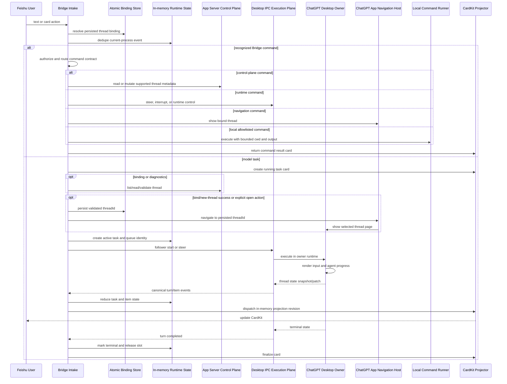
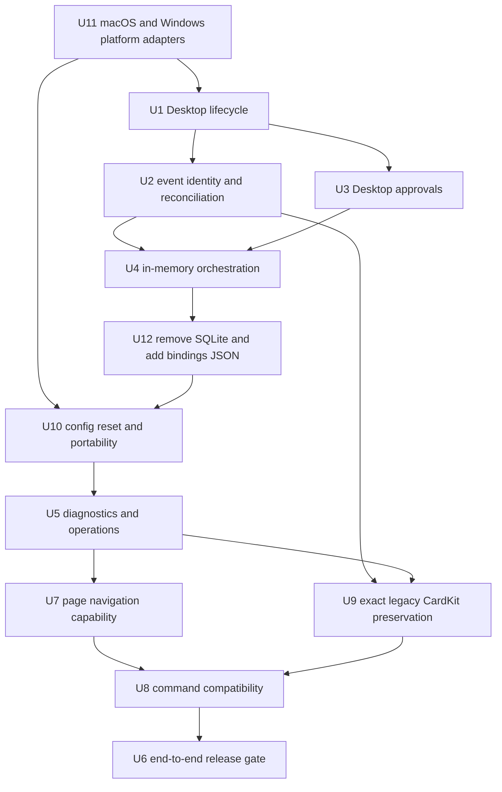
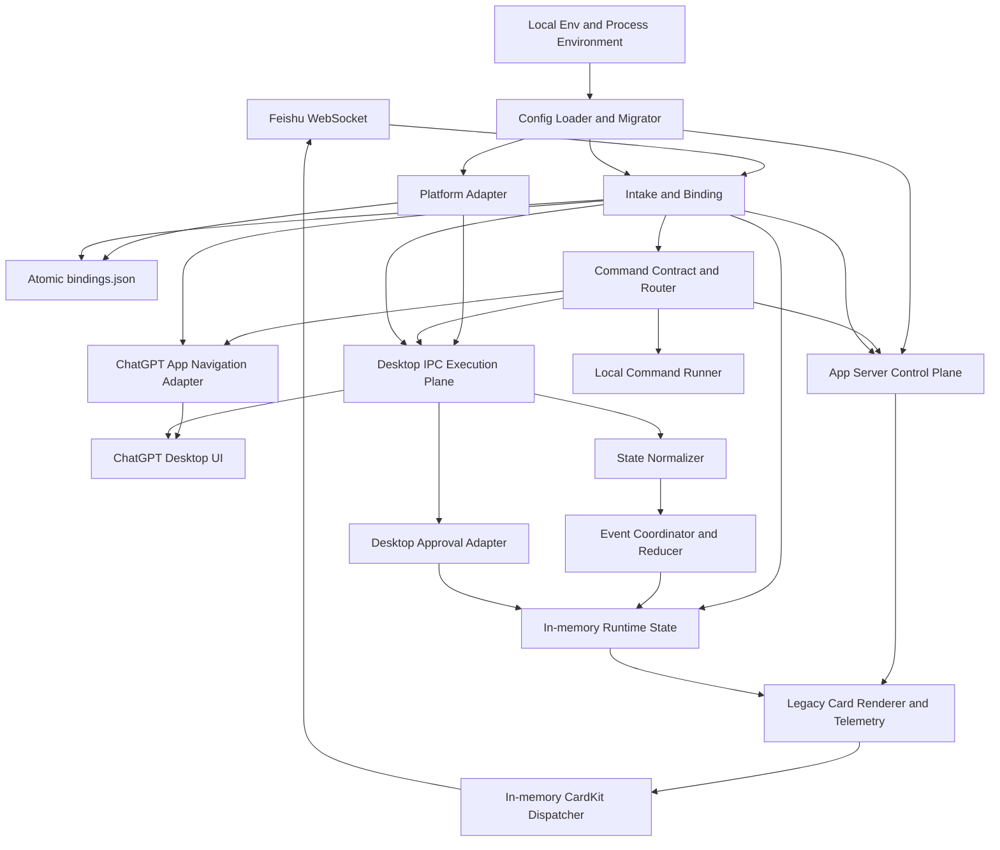

# feat: 飞书与 ChatGPT Desktop 双端实时桥接

## Summary

采用“App Server 控制平面 + ChatGPT Desktop IPC 执行平面”的双平面架构，并将 macOS 与原生 Windows 作为同一版本的一等平台。飞书显式绑定一个 ChatGPT 会话后，任务通过 Desktop owner runtime 执行，使用户输入、推理过程和最终回复直接进入 ChatGPT UI；同一 runtime 的状态广播经 Bridge 归一化后驱动飞书 CardKit 实时卡片。原 Bridge 已公开的命令、别名、技能提及入口、卡片消息投影、窗口用量和上下文统计完整保留，只迁移其内部 owner 与协议实现。Bridge 只用原子 `bindings.json` 保存会话绑定和静态设置，任务、队列、审批与卡片状态全部在内存中，进程崩溃即放弃。平台差异只存在于经过验证的 transport、runtime identity、binary/path/permission 和 lifecycle adapter 中，不进入业务合同。

---

## Problem Frame

独立 `codex app-server` 客户端可以继续既有 thread 并持久化新 turn，但已打开的 ChatGPT Desktop 页面由另一个内存 runtime 驱动，无法可靠接收外部 runtime 的实时失效或刷新信号。纯 App Server 路线可以保证 Bridge 和飞书 UI 更新，却不能保证 ChatGPT 当前页面同步。

本项目需要同时满足两个结果：飞书用户能够选择一个固定 ChatGPT 会话并持续下达指令；ChatGPT 页面实时显示同一轮输入和响应，同时飞书卡片实时投影模型过程和最终结果。实验分支已经证明：只有把 turn 投递给 Desktop owner runtime，并消费该 runtime 的状态广播，才能稳定形成双端 UI 闭环。

---

## Validated Baseline

- 分支：`experiment/desktop-ipc-ui-sync`。
- 提交：`6183db5 experiment: route bound turns through Desktop IPC`。
- 自动化门禁：202 个 App 测试、类型检查、生产构建和 npm package 检查全部通过。
- 真实会话：飞书绑定 ChatGPT 会话“feishu 测试”，目标 thread 短标识为 `019f5e…22cce8`。
- 端到端 turn 短标识为 `019f5f…79f8ec`，飞书输入和 ChatGPT 最终回复均为 `FEISHU_DESKTOP_E2E_001`。
- UI 证据：ChatGPT 页面实时显示输入和回复；飞书任务卡显示相同结果并进入 `SUCCEEDED`。
- 投影证据：普通更新与 terminal finalize 均由当前进程内 CardKit dispatcher 成功投递。

该基线已经完成最小可行链路；本计划不重复实现基线，而是将其生产化。

---

## Requirements

- R1. 飞书 chat 必须先显式选择一个 ChatGPT thread；后续消息始终发送到已绑定 thread，不读取或猜测 ChatGPT 当前打开页面。
- R2. App Server 负责会话发现、读取、绑定校验和现有控制能力；绑定任务的 start、steer 和 interrupt 必须由 Desktop owner runtime 执行。
- R3. ChatGPT Desktop 必须实时渲染飞书输入、模型过程和最终回复，不依赖页面切换、重新打开、deep link 或数据库修改。
- R4. Desktop 状态 snapshot/patch 必须转换为现有 canonical turn/item 事件，继续复用 reducer、CardKit renderer 和当前进程内 dispatcher；不得为了任务恢复写入业务数据库。
- R5. 飞书卡片必须保留当前任务状态、公开 commentary/reasoning summary、工具与命令进度、最终回复、失败原因和取消能力。
- R6. 当前 Bridge 进程内同一飞书事件不得重复启动 turn；同一 thread 同时最多存在一个 Bridge 管理的可写 turn。Bridge 重启后不提供跨进程事件去重。
- R7. 运行中的同 root 补充消息必须 steer 到已知 active turn；其他 root 只进入当前进程内存队列等待，Bridge 退出后队列直接丢弃。
- R8. Desktop IPC 请求必须区分确定未发送、确定失败和结果未知；结果未知时禁止自动重发。
- R9. 请求响应和 Desktop 广播乱序时不得丢失或错绑 turn；其他 Desktop 会话的全局广播不得污染当前任务。
- R10. Desktop IPC 断开、ChatGPT 或 Bridge 重启、协议变化后，当前运行中和排队任务直接放弃，不做恢复或重放；Bridge 重新建立健康连接后只接受新的飞书任务。
- R11. Desktop owner runtime 产生的命令和文件变更审批必须映射为飞书审批卡，并把授权决定回传给同一 Desktop runtime。
- R12. 所有 socket、thread、turn、approval 和 card action 必须受 UID、tenant、chat、binding、connection epoch 和一次性 token 约束。
- R13. Desktop 私有协议必须精确钉住当前验证版本；发现方法、事件版本或 state schema 不匹配时 fail closed，不做旧实现兼容回退。
- R14. 生产链路不得写 ChatGPT/Codex SQLite、注入 Electron、模拟 UI 输入或通过历史文件轮询充当实时事实源。
- R15. 飞书凭证、允许的 chat/user/approver、workspace root 和运行期 CardKit sequence 约束保持不变；Bridge 只持久化会话绑定和每 binding 的静态执行设置。
- R16. 正式发布必须覆盖普通回复、长任务流式输出、steer、interrupt、approval，以及 Bridge/Desktop 重启后放弃旧任务并接受新任务的端到端验收。
- R17. 用户在飞书完成会话绑定、显式点击“在 ChatGPT 中打开”或未来完成新会话创建后，Bridge 必须能够请求 ChatGPT App 导航到准确的 `threadId`，使目标会话页面可见；导航不得改变 binding，也不得被当作 turn 已执行或 UI 已同步的证据。
- R18. 原 Bridge 已公开的飞书命令、别名、技能提及输入、权限边界和用户可见语义必须继续支持；允许重写内部 handler 和协议适配，但不得因为迁移到 Desktop IPC/App 导航而静默删除、改名或把命令当作普通模型 prompt。
- R19. 原 Bridge 的飞书卡片必须原样保留，不做重新设计：初始卡、流式过程卡、动态工具折叠面板、终态卡、审批/命令卡的 CardKit 结构、文案、emoji、颜色、元素顺序与 ID、光标效果、截断提示、图片/文件处理、按钮、消息投递位置和更新节奏均以现有实现为准。页脚继续原样展示状态、耗时、模型、输入/输出 Token、上下文已用/最大值/百分比、API 次数，以及账户 5h/7d 窗口用量、重置时间和可用 credits（源数据存在时）；当前进程存活且任务卡状态仍在内存时，晚到的权威统计继续更新同一张卡，缺失数据不得伪造为零。Bridge 重启后不恢复旧卡更新。
- R20. 已部署实例采用显式重置式升级：保留并升级 `~/.codex-feishu-bridge/.env`，清空该应用目录中的旧数据库、WAL/SHM、历史 JSON、备份、日志、临时文件和锁，不迁移旧 binding 或任何运行状态；升级后用户重新执行 `/bind`。重置必须先 dry-run、要求 Bridge 停止并持有独占目录锁，通过 staging 校验和原子目录切换保证失败时旧目录不被破坏。代码、模板和文档不得硬编码开发者个人路径。
- R21. macOS 和原生 Windows 必须作为同一正式版本的一等平台：绑定、Desktop owner 执行、ChatGPT UI 实时渲染、App 页面导航、原命令、原样飞书卡片、统计、审批、重启放弃语义和配置迁移在两端保持相同产品语义；任何平台缺少真实 UI 证据时不得宣称该平台可用。
- R22. 平台差异必须收敛到明确的 platform adapter：macOS 使用受 UID 保护的 Unix socket 与 POSIX 权限，Windows 使用经实际 Desktop build 验证的 named pipe、当前用户 SID/session/ACL 边界和 Windows 原子文件语义；不得把未验证的 pipe 名称、WindowsApps 路径、POSIX signal/chmod 或路径大小写假设写进共享业务层。
- R23. Bridge 不使用 SQLite 或其他任务数据库，不持久化任务、队列、prompt、回复、item、审批、RPC intent、CardKit payload、outbox 或恢复状态。只允许一个有版本的原子 JSON 文件保存 chat-to-thread binding 和静态执行设置；进程崩溃后丢弃全部运行态，重启不恢复、不补发、不重放旧任务。

### Requirements Traceability

| Requirement | Validated baseline | Remaining unit |
|---|---|---|
| R1–R3 | 显式绑定、Desktop follower start、双端 UI 已验证 | U6 固化发布证据 |
| R4–R5 | canonical normalization 和 CardKit terminal 已验证 | U2 加固乱序；U3 补审批 |
| R6–R9 | 当前实现已有 durable intent，但本方案不再恢复旧任务 | U2、U4 改为进程内 identity、no blind replay 和 restart reset |
| R10 | 启停边界已验证；目标语义是断线/重启放弃旧任务并重新 ready | U1、U4、U5 |
| R11–R12 | 现有 token/权限模型已验证，Desktop approval 未接入 | U3 |
| R13–R14 | 当前 build 协议和无私库写入已验证 | U1、U5、U6 固化门禁 |
| R15 | 白名单、workspace 与 CardKit 约束已存在；业务 SQLite 需要移除 | U3、U5、U12 回归 |
| R16 | 普通文本双端 E2E 已通过 | U6 扩展完整矩阵 |
| R17 | 已确认 App 提供按显式 `threadId` 导航到最近聚焦主窗口的能力；独立 Bridge 调用边界尚待验证 | U7 接入；U6 固化真实 UI 证据 |
| R18 | 旧 router 与帮助卡提供完整命令基线；新 App 入口当前只接管绑定命令 | U8 建立兼容矩阵并迁移；U6 回归全部命令 |
| R19 | 旧 `turn-cards.ts`、`stats.ts`、dispatcher 和 CardKit client 定义完整卡片；新 projector 当前输出另一套简化布局 | U9 以旧卡片 golden master 原样迁移；U6 固化 JSON/截图/真实推送证据 |
| R20 | 现有目录混有 legacy JSON、SQLite/WAL/SHM、备份和临时文件；新版本只需 `.env` 与空 binding store | U10 建立可预览、可回滚的目录重置；U12 不读取旧状态；U6 固化重新绑定验收 |
| R21–R22 | macOS follower IPC 已真实验证；仓库旧 Windows platform class 只有未验证的 pipe fallback，不能作为生产证据 | U11 建立双平台 adapter 并提取 Windows runtime contract；U1、U7、U8 补齐平台行为；U6 执行双平台真实发布门 |
| R23 | 旧 Bridge 以进程内 Map + 原子 JSON 运行；当前新实现把全部业务状态放入 SQLite，超过单用户本机工具需要 | U12 删除业务 SQLite，恢复为内存运行态 + 单一 bindings JSON；U6 固化重启放弃语义 |

---

## Scope Boundaries

- 首期支持本机 macOS 与原生 Windows，Bridge 必须与 ChatGPT/Codex Desktop 运行在同一操作系统用户和同一交互式登录会话。
- 不支持远程 Desktop IPC、公网 socket 或跨主机 owner runtime。
- 不考虑旧 App Server-only UI 同步模式的兼容；Desktop IPC 不可用时停止绑定任务执行并给出稳定错误。
- 不读取 ChatGPT 当前页面来自动选择目标；唯一目标来源是飞书持久化 binding。导航只把页面打开到已确定的目标。
- 不通过 browser/computer automation 驱动 ChatGPT 页面。
- 不把 `codex_app__navigate_to_codex_page` 当作会话创建接口：它只显示一个已经存在且可读取的 thread；未来新会话流程必须先拿到并持久化真实 `threadId`，再触发导航。
- 不在每条飞书消息后抢占 ChatGPT 窗口焦点。默认只在用户完成绑定、新会话创建成功或显式执行 `/open`/卡片按钮时进行一次导航。
- “不考虑旧 ChatGPT 交互兼容”只表示不保留旧 App Server-only、URL Scheme 或 legacy singleton adapter 的内部执行方式，不表示删除飞书用户命令。命令输入、别名、授权和结果语义属于必须保留的产品合同。
- 卡片不是“兼容迁移”而是“原样保留”。新实现不得改变旧 CardKit JSON 的可观察结构、元素 ID、文案、样式或当前进程内更新行为；只允许替换数据采集和进程内投递实现。消息必须继续回到发起消息所在飞书会话/话题，不能重新出现临时会话投递问题。
- 不直接修改 ChatGPT、Codex rollout 或其 SQLite 数据；Bridge 自身也不建立业务 SQLite。
- 不把 raw hidden reasoning/CoT 推送到飞书。
- 不在本计划内实现多实例 Bridge；继续使用单实例进程锁。
- 不把某台开发机的 workspace 复制给其他安装实例。`CODEX_CWD` 和 `ALLOWED_WORKSPACE_ROOTS` 是机器本地安全边界，必须由本机管理员选择；迁移器不得用 Bridge 仓库位置、进程启动目录或最近访问目录静默推断。
- 不为崩溃恢复保存任务状态。prompt、回复、工具输出、审批、队列和卡片投递状态只存在于当前进程内存，进程结束即释放。

### Deferred to Follow-Up Work

- Linux Desktop 支持。
- Windows Desktop 使用 WSL app-server/CLI 的混合执行模式；首期 Windows 只支持原生 Windows Bridge、原生 workspace 路径和原生 Desktop owner runtime。
- 多实例 Bridge 的分布式 lease 与 owner runtime 协调。
- 远程设备通过受认证代理访问本机 Desktop runtime。
- 私有 IPC 被官方公开接口替代后的迁移方案；届时另立方案，不在当前实现中预埋兼容层。

---

## Context & Research

### Relevant Code and Patterns

- `src/app/main.ts`：当前同时装配 App Server 控制平面、Desktop IPC 执行平面和状态流监听。
- `src/app/codex/desktop-ipc-client.ts`：UID socket 校验、长度帧协议、initialize、follower start/steer/interrupt 和投递边界分类。
- `src/app/codex/desktop-thread-stream-normalizer.ts`：Desktop protocol v11 snapshot/patch 到 canonical turn/item notification 的转换。
- `src/app/task-orchestrator.ts`：保留 App Server `thread/resume` 控制接口；实验运行路径跳过每-turn resume，把 mutating RPC 路由到 Desktop execution client。目标实现删除 durable intent，RPC 失败或连接丢失即终止本地 task，不重放。
- `src/app/codex/event-coordinator.ts`：按准确 thread/turn identity 缓冲、归约并忽略无关广播。
- `src/app/codex/event-reducer.ts`：canonical item 生命周期、文本分区和 terminal convergence。
- `src/app/approval-service.ts`：现有 App Server approval 权限、token 和 CardKit 路径可复用其领域模型，但状态改为当前进程内存，并更换 Desktop request/response adapter。
- `src/app/conversation-binding-service.ts`：现有 `/bind`、`/binding`、`/unbind` 和绑定卡 action 的可信入口；可在绑定成功后发出一次非权威导航请求。
- `src/app/lark/event-server.ts` 与 `src/app/cards/layouts.ts`：现有 card action 白名单和卡片按钮布局；导航 action 必须进入相同的鉴权、token 和幂等边界。
- `src/commands/router.ts` 与 `src/commands/handlers/*.ts`：原 Bridge 的命令、别名和用户语义基线；实现中先补 characterization tests，再迁移到新 App 装配层，不能直接复用其中的 legacy singleton、URL Scheme 或未脱敏错误输出。
- `src/cards/templates.ts`：旧 `/help` 卡记录了用户可见命令说明和技能 `@提及` 用法；迁移后的帮助卡必须由同一命令 contract 生成，避免 router 与文档漂移。
- `src/cards/turn-cards.ts`、`src/codex/stats.ts`、`src/codex/dispatcher.ts` 与 `src/feishu/card.ts`：旧卡片的权威 golden master，包括初始/终态 JSON、固定元素 ID、30 ms/3 字符打印配置、动态工具 panel、100 ms dirty flush、统计页脚、进程内 sequence 和晚到统计更新。
- `src/app/cards/projector.ts` 与 `src/app/cards/layouts.ts`：当前投影路径；实施时必须承载旧卡片 renderer 的原样输出，同时删除 SQLite outbox，改为与旧 Bridge 一致的进程内 coalescer/dispatcher。
- `src/app/recovery-service.ts`：当前负责 durable RPC 与任务恢复；目标实现整体移除，不为已放弃任务保留恢复入口。
- `src/app/cards/outbox-worker.ts`：当前 CardKit durable outbox；U12 删除该组件，卡片 sequence、有界重试和 terminal barrier 改为当前进程内逻辑。
- `src/config.ts`：旧入口使用 `dotenv` 读取 `~/.codex-feishu-bridge/.env`，是现有安装的配置来源；迁移后必须保留这一运维入口，但收紧所有者、权限和 symlink 校验。
- `src/app/config.ts` 与 `src/app/preflight.ts`：新入口定义 tenant、chat/user/approver、workspace、数据目录和 App Server 模式等生产门禁；U10 负责把旧文件安全升级到这套合同，而不是要求用户手工重建配置。
- `src/core/platform.ts`：旧架构已有 macOS/Windows binary 与 transport 分支，但 Windows Desktop IPC 使用注释中明确为 fallback 的固定 named pipe，缺少 owner/session/ACL、协议和真实 UI 证据；U11 只能借鉴接口意图，不能直接把它提升为生产实现。
- `src/app/codex/desktop-ipc-client.ts`、`src/app/preflight.ts` 和 `src/app/process-lock.ts`：当前新 runtime 混合了 Unix socket、UID、`chmod` 与 POSIX 路径语义，必须通过 platform adapter 解耦后才能成为 Windows 代码路径。
- `src/app/db/database.ts`、`src/app/db/schema.ts` 与 `src/app/db/repositories.ts`：当前新实现的业务数据库层；目标架构整体删除，不再为不需要的任务容灾设计迁移、retention 或 maintenance。

### Institutional Learnings

- App Server-style event model 继续作为 Bridge 内部 canonical contract；实际执行状态必须来自 Desktop owner broadcast，独立 App Server runtime 不能保证刷新已打开的 Desktop renderer。
- Desktop follower 方法必须发送给 owner runtime；这样 ChatGPT UI 不需要额外刷新动作。
- Desktop `thread-stream-state-changed` 是全局 broadcast，必须按 thread 和真实 turn identity 过滤，不能按“最近事件”猜测归属。
- 当前 Desktop state 使用 canonical `turnHistory`，历史 turn 位于 `history.entitiesByKey`，不能只读取顶层 `turns`。
- 请求写入 socket 后的 timeout/close 不能回退调用普通 `turn/start`，否则可能重复执行用户任务。
- agent message 在 terminal snapshot 中可能没有 item status；turn terminal 必须能够推动 item terminal convergence。

### External References

- 官方 App Server 文档将其定义为 rich client 集成接口，覆盖认证、会话历史、审批和 streamed agent events；文档只承诺连接它的客户端可以消费这些能力。
- `openai/codex#21743` 记录了独立 app-server 追加 turn 后已打开 Desktop thread 不立即刷新的现象。
- `openai/codex#30866` 当前是 draft，方向是 `thread/resume` 时协调持久化 history；它不是 Desktop owner runtime 的实时 push 合同，也不能替代本方案的 follower IPC 实验。
- Desktop follower 方法、版本 1/2 和 state broadcast 版本 11 来自本机已安装 ChatGPT build 的运行时代码与真实 probe，不属于公开稳定 API。
- OpenAI 官方仓库确认 Windows Codex App 已于 2026-03-04 提供；后续官方 issue 显示 Windows Store/MSIX 安装位于 WindowsApps，bundled executable 可能受 ACL 影响，且实际 runtime 会暴露 Windows named pipes。这证明 Windows 是有效目标平台，也证明不能硬编码安装路径或仅凭 pipe 名称判定 owner。
- 当前没有公开文档承诺 Windows Desktop follower IPC 与 macOS 完全同构；Windows 的 pipe 名称、framing、handshake、state/approval 版本和 navigation host seam 必须从目标 Windows build 实测提取并单独钉住。

---

## Key Technical Decisions

| Decision | Choice | Rationale |
|---|---|---|
| 总体架构 | App Server 控制平面 + Desktop IPC 执行平面 | 保留公开 API 的会话管理能力，同时让 turn 进入真正驱动 ChatGPT UI 的 owner runtime |
| 绑定目标 | 飞书显式持久化 thread binding | 用户要求固定选择会话；避免把页面焦点误当业务状态 |
| turn 执行 | follower start/steer/interrupt | 已通过真实 Desktop UI 验证，且不会创建第二个独立 App Server runtime |
| 事件事实源 | Desktop owner state broadcast | 这是同时驱动 ChatGPT UI 和 Bridge 的同一 runtime 状态 |
| Bridge 内部事件 | 归一化为现有 App Server-style canonical events | 最大化复用 reducer 与 CardKit renderer，避免两套业务状态机；canonical state 只存在于当前进程 |
| 协议兼容 | 精确版本钉住并 fail closed | 私有协议漂移时停止执行比静默错绑或重复 turn 更安全 |
| 结果未知 | 当前本地 task 直接终止并停止重试 | 不保存 UNKNOWN 状态、不自动对账、不盲目重放；ChatGPT 端可能继续的 turn 以其 UI/history 为准 |
| 审批 | Desktop request adapter + 复用现有 approval domain | 权限、token 和卡片语义已验证，但 response 必须回到产生请求的 runtime |
| 断线 | Desktop 独立 supervisor，与 App Server supervisor 分离 | 两个 runtime 生命周期不同，不能用一个连接状态掩盖另一个故障 |
| 降级策略 | 不回退到独立 App Server 执行 | 用户不要求兼容；回退会恢复“ChatGPT UI 不刷新”的已知错误语义 |
| 页面导航 | 通过 App host 提供的 `codex_app__navigate_to_codex_page` 等价能力，按 binding 中的准确 `threadId` 导航 | 让已绑定或刚创建的会话立即在 ChatGPT 页面显示，同时保持“目标选择、任务执行、页面导航”三种职责分离 |
| 导航触发 | 绑定成功/新会话创建成功的一次性触发，以及 `/open` 或卡片按钮显式触发 | 满足会话可见性需求，避免每条消息都抢焦点；重复事件不得重复导航 |
| 命令兼容 | 保留原命令和别名合同，内部按 control plane、Desktop execution、App navigation 或本地受控操作重新归属 | 用户无需学习第二套入口；同时彻底移除旧 transport 和 singleton 依赖 |
| 命令安全 | 命令先于普通 prompt 路由，统一经过 tenant/chat/user/role、binding revision、当前进程去重和参数白名单 | 防止命令被模型解释、跨会话执行或在当前进程内因事件重投产生第二次副作用 |
| 卡片 UI | 旧 Bridge CardKit 输出作为 golden master 原样保留 | 用户明确要求完全原样；新简化卡片不得成为正式 UI |
| 遥测事实源 | turn/model/token/context 来自 Desktop owner state；账户窗口来自 App Server control plane | 不混用 runtime，也不从文本、页面或历史文件猜测统计值 |
| 晚到统计 | 当前进程存活期间按旧行为更新同一终态卡 | 卡片外观和用户行为不变；Bridge 重启后不继续旧卡更新 |
| 配置升级 | 显式目录重置，只保留并升级现有 `.env` | 用户接受不兼容和重新绑定；彻底移除多代运行文件，同时不要求重新录入凭证 |
| 配置优先级 | 进程环境 > 本机 `.env` > 安全内部默认值 | 兼顾服务管理器注入与现有本机安装；任何默认值不得扩大 workspace 权限 |
| workspace 选择 | 本机管理员显式指定并 canonicalize | 项目路径因机器和用户而异，不能从开发机路径或启动目录推断 |
| Codex binary | 显式 `CODEX_BIN` 优先；否则由平台 resolver 发现 ChatGPT bundled binary 或 `PATH` | 允许覆盖且不把个人安装路径写入共享模板；解析结果由 doctor 报告 |
| Bridge data directory | 不再设置独立 data 子目录；`bindings.json` 直接位于 config home | 避免重新产生 `app-server-v2/` 等多层状态目录；现有 `BRIDGE_DATA_DIR` 若存在仅报告 deprecated |
| 支持平台 | macOS 与原生 Windows 同版本、同功能门禁 | 用户明确要求双平台；不以“实验性 Windows”降低命令、卡片或重启放弃语义 |
| 平台边界 | transport、runtime attestation、binary discovery、path/permission、process lifecycle 进入 platform adapter | 业务层只消费统一 capability，避免 POSIX 假设散落并产生 Windows 假成功 |
| Windows IPC | 以目标 Windows Desktop build 的实际 named pipe/协议 probe 为合同来源 | 旧 `src/core/platform.ts` 的固定 pipe 只是猜测；真实 probe 通过前 Windows runtime 必须 fail closed |
| Windows runtime identity | 当前用户 SID + interactive session + pipe server process/ACL attestation | 仅连接同名 pipe 无法防止跨用户或伪造 server；安全强度需与 macOS UID socket 等价 |
| 平台发布 | 自动化矩阵 + 每个平台真实 ChatGPT/飞书 E2E | mock named pipe 不能证明 Windows Desktop UI、导航和 Store/MSIX binary 可用 |
| 运行态存储 | active task、queue、approval、dedupe、CardKit sequence/outbox、prompt/回复/item 全部保存在内存 | Bridge 崩溃即丢弃，不做任务恢复；进程生命周期天然限制数据量 |
| 唯一持久化 | 原子 `bindings.json` 保存 chat-to-thread binding 与静态执行设置 | 重启后仍需知道飞书消息发往哪个 ChatGPT thread；文件不保存任务内容、卡片或审批 |
| JSON 写入 | 临时文件 + 同目录原子 rename，单实例进程锁 | 绑定变更频率低，不需要数据库事务、WAL、迁移和 maintenance |
| 重启语义 | 放弃所有旧任务，清空内存 queue/approval/outbox/sequence | 用户接受 Bridge 崩溃后重启；不得尝试补发可能已执行的 prompt |

### Protocol Contract

| Capability | Contract | Version/Boundary |
|---|---|---|
| macOS transport discovery | `$TMPDIR/codex-ipc/ipc-${uid}.sock` | 必须是当前 UID 所有的 Unix socket，拒绝 symlink 和 Electron SingletonSocket |
| Windows transport discovery | 从目标 Windows Desktop build 与当前用户会话发现实际 named pipe | 不接受旧代码中的固定 fallback 作为证据；必须校验当前用户 SID、interactive session、pipe server process/ACL 和 protocol handshake |
| Framing | macOS 已验证为 4-byte little-endian length + UTF-8 JSON | 单帧上限 256 MiB；Windows 必须独立 probe，只有 fixture 一致时才共享实现 |
| Handshake | `initialize` with Desktop-compatible follower identity | READY 前禁止业务请求 |
| Start | `thread-follower-start-turn` | v1 |
| Steer | `thread-follower-steer-turn` | v1，必须带 expected turn identity |
| Interrupt | `thread-follower-interrupt-turn` | v2 |
| State | `thread-stream-state-changed` | v11 snapshot/patch |
| Approval | Desktop follower approval methods | 实施时从当前 ChatGPT build 重新提取并钉住版本 |
| Page navigation | `codex_app__navigate_to_codex_page({ threadId })` 等价的 App host capability | 目标是最近聚焦的 Codex 主窗口；只接受持久化 binding 的准确 thread ID；可用性必须探测，不能假定独立 Node 进程可直接调用 |

Windows 只有在 transport discovery、framing、handshake、follower start/steer/interrupt、state、approval 和 navigation 八项均从同一目标 build 取得 fixture 并通过真实 probe 后，才允许使用上表共享的协议版本。若 Windows build 返回不同版本，则 platform contract 单独钉住并归一化到相同 canonical 事件，禁止为了代码复用伪装成 macOS 合同。

### Command Compatibility Contract

| Capability | Commands and aliases | Target owner after migration |
|---|---|---|
| 帮助 | `/help`、`/h`、`help`、`h` | 新 command service；从统一 contract 生成帮助卡 |
| 会话列表与绑定 | `/list`、`/l`、`/ll`、`/bind`、`/binding`、`/unbind` | App Server control plane + 原子 JSON binding store |
| 新建、派生、归档 | `/new`、`/create`、`/fork`、`/branch`、`/delete`、`/archive` | 受支持的 thread control API；成功后原子更新 binding，并按需导航 |
| 页面打开 | `/open` | U7 App navigation adapter；不再使用 URL Scheme |
| 执行控制 | `/cancel`、`/stop`、运行中同 root 补充消息 | Desktop owner interrupt/steer + 当前进程内 task identity |
| 目标与上下文 | `/goal`、`/compact`、`/compress`、`/plan` | 经 capability gate 路由到目标 thread；静态选择写入 binding JSON 或受支持 runtime API |
| 模型与风格 | `/model`、`/personality`、`/style` | 经白名单校验的 per-binding execution options；后续 turn 统一应用 |
| 工作区 | `/cwd`、`/workspace` | workspace allowlist/canonical path 校验后更新 binding，不扩大 Bridge 根目录权限 |
| 状态与能力 | `/status`、`/usage`、`/quota`、`/mcp`、`/skills` | App Server/control metadata + 当前进程内状态；输出必须脱敏 |
| 本地受控命令 | `/cmd`、`/run`、`/shell`，以及旧 router 的未知 slash fallback | 本地 command service；仅允许 `ALLOWED_SHELL_COMMANDS` 首命令白名单、受控 cwd、超时、输出截断和授权用户 |
| 技能调用 | `@技能名称 [输入]` | 解析为结构化 skill input 后随 turn 进入 Desktop owner runtime，不作为普通未解析文本丢失 |

命令兼容以当前 `src/commands/router.ts` 的匹配顺序、别名和 `src/cards/templates.ts` 的帮助语义为基线。内部协议不可用时，实施阶段必须为该命令找到新 owner 或把它列为发布阻塞项；不能用“暂不支持”卡片冒充兼容完成。

### Exact Card Preservation Contract

| Surface | Must remain exactly as the original Bridge |
|---|---|
| 初始任务卡 | `🌌 Codex Remote Control` 标题、indigo header、`📥 输入 Prompt`、可选 metadata、`🧠 模型推理过程`、`✨ 最终结果输出`、`📊` 页脚、原元素顺序和固定 element ID |
| 流式配置 | `streaming_mode`、`update_multi`、summary、各端 30 ms print frequency、3 字符 print step 和 delay strategy |
| 实时文本 | reasoning/answer 的 `▍` 光标、原截断长度和原中文截断提示、Markdown 图片处理方式 |
| 工具过程 | 原 action cluster 分类、标题/icon、动态 `collapsible_panel`、panel/markdown ID 规则、命令输出尾部 code block 和失败红框 |
| 终态卡 | success/failed/interrupted/history 的原 header 颜色、emoji、标题、段落显隐、最终文本和 footer；先关闭 streaming 再替换完整卡 |
| 统计页脚 | 状态、耗时、模型、输入/输出 Token、上下文 used/max/percent、API 次数、5h/7d used percent 与 reset、credits |
| 晚到事件 | 当前进程存活且任务卡状态仍在内存时，到达 token/context/window 数据继续更新原卡，不新建卡、不改变终态、不重开 streaming；重启后不恢复旧卡更新 |
| 飞书投递 | 卡片仍出现在发起消息所在会话/话题；CardKit message/card identity 仅保存在当前进程内存并更新同一卡；不得投递到临时会话 |
| 其他卡片 | 旧 help、list/table、status、goal、usage、skills、MCP、model、approval 和简单状态卡的内容与布局同样纳入 golden fixtures |

“完全原样”通过 CardKit JSON golden fixtures、事件到 CardKit action 序列 fixtures、飞书截图对比和真实消息落点共同验收；仅比较最终文本不算通过。

### Configuration Directory Reset Contract

升级不兼容旧 binding 和运行状态。用户显式执行重置后，CLI 只从旧目录提取 `.env`，创建全新的应用目录和空 `bindings.json`；成功后旧目录整体删除，用户重新执行 `/bind`。

| Surface | Required behavior |
|---|---|
| Config home | macOS/Linux 形式使用用户 home 下的 `.codex-feishu-bridge`；Windows 使用当前用户 profile 下的同名目录；拒绝 symlink/junction/reparse-point 绕过 |
| Explicit action | 提供 `config reset`；默认先 dry-run，列出“保留配置、删除目录项、需要管理员补齐项、重新绑定提示”，未确认前零写入 |
| Stop gate | 重置前确认 Bridge 已停止并取得独占目录锁；存在活动进程、未知 owner lock 或 Windows 文件占用时 fail closed |
| Preserved input | 只读取旧 `.env`；保留已有非空值、注释、顺序和未知键，不回显 secret；不读取任何旧 JSON 或 SQLite 来恢复 binding/task |
| Fresh output | staging 目录只写升级后的 `.env`、`BRIDGE_CONFIG_VERSION=2` 和空的 versioned `bindings.json`；日志目录、临时目录和 lock 按需延迟创建 |
| Always removed | `sessions.json`、`approvals.json`、`pushed_turns.json`、`app-server-v2/`、`backups/`、`logs/`、`tmp/`、`.DS_Store`、所有 DB/WAL/SHM/lock 与其他旧运行文件 |
| Directory switch | 在同一父目录创建私有 staging；校验配置、权限和 JSON 后，将旧目录改名为临时 rollback 目录，再把 staging 原子切换为正式目录 |
| Rollback | staging 构建或目录切换失败时恢复旧目录；只有新目录通过完整校验后才递归删除 rollback 目录，成功后不永久保留旧备份 |
| Binding behavior | `bindings.json` 初始为空，不迁移 `sessions.json` 或 SQLite binding；首次启动明确提示用户执行 `/bind` |
| Automatically resolvable | `CODEX_BIN` 保留有效显式值，否则由平台 resolver 提议唯一可执行目标；不再新增 `BRIDGE_DATA_DIR` |
| Administrator-required | `LARK_TENANT_KEY`、`ALLOWED_CHATS`、`AUTHORIZED_USERS`、`CODEX_CWD`、`ALLOWED_WORKSPACE_ROOTS` 以及空的 `ALLOWED_APPROVERS` 必须明确补齐 |
| Legacy settings | `RATE_LIMIT_QUERY_INTERVAL_MS`、`LOG_TO_FILE`、`LOG_FILE_PATH`、`ENABLE_AUTO_FILE_UPLOAD` 和 `ALLOWED_SHELL_COMMANDS` 继续按原用户语义接入 |
| Path handling | 只展开开头的 home shorthand，再按平台 canonicalize；Windows 覆盖盘符大小写、UNC、junction/reparse point 和长路径形式 |
| Precedence | 显式进程环境覆盖新 `.env`，但重置器不把临时进程环境值写回文件 |
| Startup gate | 必填项缺失时允许 doctor 运行但拒绝模型任务；binding 为空时允许启动和执行 `/bind`、`/help`、`/status` |
| Idempotency | 已是新目录结构且没有 legacy 项时 reset 返回 no-op；不得清空已有新 `bindings.json`，再次全量重置必须要求单独的 destructive flag |
| Portability | 共享代码、`.env.example`、README 和测试不得包含开发者个人路径；workspace 由每台机器管理员显式配置 |

### Runtime State and Minimal Persistence Contract

Bridge 是本机单用户进程，不承担任务容灾。任务运行态全部存放在内存，进程退出后自然释放；唯一需要跨重启保存的是“这个飞书会话绑定到哪个 ChatGPT thread”以及该 binding 的静态执行设置。

| State group | Storage | Restart behavior |
|---|---|---|
| chat-to-thread binding | `bindings.json` | 恢复 tenant/chat、thread ID、logical workspace ID、model/personality/style/plan 等静态设置 |
| active task、queue、steer/interrupt identity | Memory only | Bridge 崩溃或重启后全部丢弃，不恢复、不重放 |
| prompt、回复、reasoning summary、工具输出、item | Memory only | 从不写入 Bridge 数据文件；ChatGPT UI/history 是任务结果的长期事实源 |
| approval request/action token | Memory only | 重启后旧审批卡失效；需要审批的 ChatGPT turn 由用户在 ChatGPT 处理，或重新发送任务 |
| processed message IDs | Bounded memory TTL | 只防当前进程内重复事件；重启后清空，不建立 dedupe 历史库 |
| CardKit card ID、sequence、pending update/retry | Memory only | 当前进程内按旧逻辑串行更新；重启后不继续旧卡、不补投旧 payload |
| model/token/context/rate-limit cache | Memory only TTL | 重启后按需重新查询，不保存窗口历史 |
| logs | Optional rotated file | 只保存脱敏运行日志，受 `LOG_TO_FILE`、大小和天数上限约束，不保存 prompt/回复/payload |

`bindings.json` 合同：

- 位置从 Bridge config home 派生，不允许仓库路径或 `process.cwd()` 默认值。
- 使用 schema version、临时文件、`fsync`、同目录原子 rename；macOS 为当前 UID 私有文件，Windows 为当前用户 SID 私有 ACL。
- 只允许 binding key、thread ID、logical workspace ID、静态枚举设置、revision 和更新时间；不保存 root message、task、card、prompt、回复、审批、队列或事件历史。
- `/bind`、`/unbind`、`/model`、`/personality`、`/style`、`/plan`、`/cwd` 只在值通过校验后覆盖当前 binding；文件损坏时备份原文件并 fail closed，要求重新绑定，不尝试从 ChatGPT 数据库推断。
- 文件大小设置固定上限，记录数按 tenant/chat 唯一；不存在 migration/retention/VACUUM/WAL/backup 任务。

重启与断线合同：

| Event | Behavior |
|---|---|
| Bridge 进程崩溃或被重启 | 原任务卡保持最后一次已投递内容；内存 queue、approval、outbox 和 task 全部丢弃；重新连接成功后只处理新消息 |
| Desktop IPC 断开 | 当前 task 本地失败并停止卡片更新；不自动重连该 task、不重放 prompt；supervisor 可为后续新任务重新建立连接 |
| ChatGPT Desktop 重启 | ChatGPT 自己负责其 thread/history；Bridge 放弃旧 task，Desktop READY 后新飞书消息继续发往持久化 binding |
| 飞书 WebSocket/CardKit 断开 | 当前进程内做有界重试；超过重试上限即放弃卡片更新，不把 payload 写盘 |
| 结果未知或发送超时 | 不重试 mutating RPC；记录脱敏日志并结束本地 task，避免重复 turn |
| 旧审批按钮在 Bridge 重启后被点击 | 返回“审批已失效，请在 ChatGPT 中处理或重新发送任务”，不恢复旧 request |

---

## Alternative Approaches Considered

| Approach | Decision | Reason |
|---|---|---|
| 独立 App Server 执行所有 turn | Rejected | Bridge 可读到 turn，但已打开 Desktop UI 不可靠刷新，实验和 upstream issue 均已复现 |
| 等待 `thread/resume` history reconciliation | Not a blocker, not the solution | draft PR 改善重新 resume 后的历史协调，不提供当前 owner renderer 的实时 follower push |
| 让 Desktop 与 Bridge 共用公开 App Server transport | Deferred | 当前安装版本没有可验证、受支持的 Desktop attach 配置；不能作为现阶段产品合同 |
| 修改 ChatGPT/Codex SQLite 或 rollout | Rejected | 绕开 runtime 状态机，存在数据损坏、乱序和升级风险 |
| Electron 注入、UI 自动化或自动刷新 | Rejected | 页面焦点不是业务绑定，且无法提供受协议约束的实时事件流 |
| deep link、模拟点击或反复切换页面 | Rejected | 不能证明打开的是准确 thread，也会引入焦点抢占和版本脆弱性 |
| App host 按 thread ID 导航 | Selected with capability gate | 官方 App 工具语义能够打开指定 thread，但 standalone Bridge 的 host 调用通道必须先在 U7 验证 |
| Desktop owner IPC follower | Selected | 已在指定绑定 thread 上完成真实双端 UI 和飞书 CardKit 闭环 |

---

## Open Questions

### Resolved During Planning

- ChatGPT 当前页面是否决定目标会话：否，目标只来自飞书 binding。
- 是否继续用独立 App Server `turn/start`：否，只保留非 mutating 控制能力。
- 是否依赖刷新、切换页面或 deep link 才能同步 turn：否，owner runtime 会直接更新 UI；按 thread ID 的 App 导航只负责让指定页面变得可见。
- 导航是否决定业务目标：否，必须先从持久化 binding 得到准确 thread ID，导航不能修改或替代 binding。
- 导航是否创建新会话：否；新会话必须先由受支持的创建流程返回真实 thread ID，随后才能导航显示。
- 原 Bridge 命令是否随旧 App Server/adapter 一起废弃：否；用户命令是产品合同，只有底层 owner 和实现路径迁移。
- 未知 slash 是否作为普通模型 prompt：否；保持旧 router 的受控本地命令 fallback，但必须继续执行首命令白名单、授权、cwd containment 和输出限制。
- 飞书卡片是否允许按新架构重新设计：否；旧 Bridge 卡片及其消息更新序列是不可变 golden master，新架构只替换数据源与可靠性实现。
- 是否保留飞书 CardKit：是，继续作为移动端实时控制和结果界面。
- 私有协议不兼容时是否回退旧路径：否，启动或运行时 fail closed。
- 是否修改 ChatGPT 数据库：否，任何 ChatGPT/Codex 持久化写入都不在产品边界内。

### Deferred to Implementation

- 当前 ChatGPT build 的 approval follower 方法及 state request schema：在 U3 开始前从本机 runtime fixture 固化。
- late start response 丢失后的当前进程 turn 关联字段：优先使用 `clientUserMessageId`，最终以真实 state fixture 可观察字段决定；无法唯一关联即结束本地任务，不进入恢复流程。
- Desktop reconnect 后的 snapshot 行为只用于协议验证和后续新任务；不得用它恢复断线前的 Bridge task。
- ChatGPT 自动升级后的 build identity 获取方式：在 U5 中选择稳定且不读取敏感应用数据的本机元信息来源。
- 独立 Node Bridge 如何获得 `codex_app__navigate_to_codex_page` 等价的 App host 调用通道：U7 必须先验证可调用的 host/RPC seam；若当前 host 不暴露给后台 Bridge，则该能力不得伪装成 deep link、数据库写入或 UI 自动化，发布状态必须明确标为不可用。
- Desktop protocol v11 中 model、input/output token、total token 和 model context window 的准确 state path/notification：U9 先用真实 turn probe 固化 fixture；若 owner runtime 不提供某字段，必须寻找同 runtime 的受支持查询能力并将缺口标为发布阻塞，不能从回答文本或 rollout 文件估算。
- App Server control plane 的 rate-limit response 在当前版本中的 primary/secondary/credits schema：U9 用真实 `account/rateLimits/read` fixture 钉住，并保留旧 5h/7d/reset 格式。

---

## High-Level Technical Design

> *This illustrates the intended approach and is directional guidance for review, not implementation specification. The implementing agent should treat it as context, not code to reproduce.*

### Runtime state model

```mermaid
stateDiagram-v2
    [*] --> DISCONNECTED
    DISCONNECTED --> CONNECTING
    CONNECTING --> INITIALIZING
    INITIALIZING --> READY
    READY --> DISCONNECTED: socket close; abandon active and queued tasks
    DISCONNECTED --> CONNECTING: bounded reconnect for future tasks
    CONNECTING --> FAILED: retry budget exhausted
    FAILED --> CONNECTING: operator or supervisor restart
    READY --> CLOSING: shutdown
    CLOSING --> CLOSED
```

### Delivery outcome model

| Outcome | In-memory action | User-visible behavior |
|---|---|---|
| Provably unsent | 结束本地 task，释放当前 slot | 明确失败，可由用户重新发送 |
| Definitive rejection | 结束本地 task | 展示稳定错误，不重试 |
| Outcome unknown | 结束本地 task并丢弃 prompt | 提示可能已执行，不对账、不自动重放 |
| Accepted with turn identity | 标记当前进程内 task `RUNNING` | 继续消费 Desktop state；进程退出即丢弃 |

---

## Implementation Units

### U11. 建立 macOS 与 Windows 一等平台适配层

**Goal:** 把 Desktop transport、runtime identity、binary/config/path/permission 和进程生命周期差异封装为可验证的双平台能力，让上层编排、命令和卡片保持单一业务实现。

**Requirements:** R2, R3, R10, R12, R13, R17, R20, R21, R22

**Dependencies:** None

**Files:**
- Create: `src/app/platform/platform-adapter.ts`
- Create: `src/app/platform/macos-platform-adapter.ts`
- Create: `src/app/platform/windows-platform-adapter.ts`
- Modify: `src/app/codex/desktop-ipc-client.ts`
- Modify: `src/app/codex/app-server-client.ts`
- Modify: `src/app/codex/environment.ts`
- Modify: `src/app/preflight.ts`
- Modify: `src/app/process-lock.ts`
- Modify: `src/app/config.ts`
- Modify: `src/app/cli.ts`
- Modify: `src/app/main.ts`
- Create: `test/app/platform/macos-platform-adapter.test.ts`
- Create: `test/app/platform/windows-platform-adapter.test.ts`
- Modify: `test/app/desktop-ipc-client.test.ts`
- Create: `test/app/preflight.test.ts`
- Modify: `test/app/process-lock.test.ts`
- Modify: `test/app/app-server-client.test.ts`
- Modify: `test/app/cli.test.ts`

**Approach:**
- 定义 platform adapter 提供 config home、temporary/data path、binary candidates、Desktop endpoint discovery、runtime attestation、private-file enforcement、canonical path containment、logical workspace ID 解析、process liveness/termination 和 capability diagnostics；业务层不得再直接判断 `process.platform`。
- 保留已验证的 macOS UID-scoped Unix socket 行为，将现有 `lstat`、owner、symlink、mode 和 bundle discovery 移入 macOS adapter，避免迁移时改变当前成功链路。
- 在真实 Windows ChatGPT/Codex Desktop 安装环境提取 owner runtime：记录 app build/package identity、named pipe endpoint、server PID/SID/session、ACL、framing、handshake、follower/state/approval version 和 navigation host seam，生成脱敏 fixture。旧 `src/core/platform.ts` 中的固定 `codex-ipc` fallback 只能作为 probe candidate，不能直接成为默认合同。
- Windows adapter 使用当前用户 SID 与 interactive session 约束 pipe server；若 Node 标准库无法完成 server-process/ACL attestation，则引入范围最小、可签名和可测试的 Windows native probe seam。未完成等价安全校验时 Windows execution capability 必须 unavailable。
- Windows binary resolver 区分 Desktop package discovery 与可执行 Codex CLI discovery；对 Store/MSIX `WindowsApps` 路径先验证实际可执行性，失败时使用管理员显式 `CODEX_BIN` 或 `PATH` 中的原生 Windows binary，不把某个 package version path 写入配置模板。
- Windows config/data 目录应用当前用户专属 ACL；路径 containment 处理盘符、大小写、UNC、junction 和 reparse point。process lock、atomic replace、shutdown/interrupt 不假定 POSIX `chmod`、UID、signal 或 unlink 语义。
- binding 只持久化 logical `workspace_id`；platform/config adapter 从本机 `ALLOWED_WORKSPACE_ROOTS` 映射到 canonical 绝对路径。映射缺失、歧义或路径已逃逸时阻止执行，但允许解绑、doctor 和人工修复。
- 上层 Desktop client 只接收经过 attestation 的 duplex endpoint，继续使用相同 delivery outcome、epoch 和 canonical state contract；平台断开差异不得绕过“放弃旧任务、禁止重发”的规则。

**Patterns to follow:**
- `src/app/codex/desktop-ipc-client.ts` 已验证的 framing、epoch 与 follower request 行为。
- `src/core/platform.ts` 的平台接口意图和 binary candidate 思路，但不沿用未验证 Windows fallback。
- `src/app/preflight.ts` 的 fail-closed 原则和 workspace containment 目标。

**Test scenarios:**
- Happy path: macOS adapter 发现当前 UID socket 并保持现有 follower fixture、权限和路径行为不变。
- Happy path: Windows adapter 在当前 SID 与 interactive session 中发现经验证的 Desktop named pipe，完成 handshake 并把 snapshot/patch 归一化为与 macOS相同的 canonical 事件。
- Edge case: Windows Store/MSIX bundled `codex.exe` 存在但不可执行时 resolver 不误报 ready，转向有效显式配置或 `PATH` candidate。
- Edge case: Windows workspace 包含盘符大小写差异、空格和非 ASCII 字符时 canonical containment 正确；UNC、junction 或 reparse point 逃逸被拒绝。
- Edge case: macOS 与 Windows 分别重启 Desktop 后 connection epoch 只递增一次，pending request 按是否写出进入 provably-unsent 或 unknown。
- Error path: 同名 Windows pipe 属于其他 SID/session、server process 不可信、ACL 过宽或 handshake/version 不匹配时零业务 frame 写出。
- Error path: Windows config/data ACL 无法收紧、原子替换不受支持或 process lock 无法确认 owner 时 fail closed，不退回 POSIX 假实现。
- Integration: 同一 logical workspace ID 在两台机器分别解析到各自本地路径，`bindings.json` 只保存 logical ID；未知 ID 不回退 `process.cwd()`。
- Integration: 同一 canonical contract suite 分别通过 Unix socket fake 与 Windows named pipe fake；平台专属 suite 覆盖 discovery、identity、path、permission、lock 和 shutdown。
- Integration: 在真实 macOS 和 Windows Desktop build 上使用唯一 nonce，均观察到 ChatGPT UI 输入/回复和相同飞书 CardKit 终态；fixture 记录各自 build 与 protocol fingerprint。

**Verification:**
- 共享业务代码中不存在散落的 socket path、WindowsApps path、UID/SID、`chmod`、signal 或路径大小写分支。
- doctor 能分别报告 `platform=macos|windows`、Desktop package/build、transport type、protocol fingerprint 和 capability 状态，且不泄露完整本机路径、SID 或 pipe 名称。

### U1. 完成 Desktop IPC 生命周期和协议门禁

**Goal:** 将当前一次性 Desktop connection 提升为可重连、可观测且严格版本钉住的 runtime client；重连只服务后续新任务，不恢复断线前任务。

**Requirements:** R2, R8, R10, R12, R13, R21, R22

**Dependencies:** U11

**Files:**
- Modify: `src/app/codex/desktop-ipc-client.ts`
- Modify: `src/app/main.ts`
- Modify: `src/app/config.ts`
- Test: `test/app/desktop-ipc-client.test.ts`
- Create: `test/app/main.test.ts`

**Approach:**
- 引入独立 Desktop connection supervisor，采用有界退避和单连接 epoch；断线后立即拒绝新 dispatch，并通知 orchestrator 放弃当前进程内 active task、queue 和 pending approval。
- 启动和每次重连均通过 platform adapter 核验 endpoint type、runtime owner/session attestation、握手响应、follower 方法版本和 state protocol version；任一不匹配都阻止 Bridge 进入可执行状态。
- 未写入 socket 的请求返回 provably unsent；已经写入后发生 timeout/close 返回 outcome unknown。两者都结束当前本地 task，不跨 epoch 重发、对账或恢复。
- 新 epoch 建立后清空旧 listener、pending request、normalizer state 和 task identity；READY 只表示可以接收新任务。
- stop 必须排空 listener、pending request 和重连计时器，避免进程退出后继续持有 socket 或触发回调。

**Patterns to follow:**
- `src/app/codex/app-server-client.ts` 的 epoch、pending request 和受控 stop。
- `src/app/codex/desktop-ipc-client.ts` 已验证的 framing、握手和 outcome 分类。

**Test scenarios:**
- Happy path: UID socket 或已验证 Windows named pipe 可用且协议匹配时完成 initialize 并进入 READY。
- Edge case: response 与 state broadcast 在同一 frame stream 中交错时仍分别路由。
- Error path: endpoint 消失、runtime attestation 不符或握手版本不符时 fail closed，零业务请求写出。
- Error path: 已写请求后 endpoint close 时返回 outcome unknown，当前 task 被放弃且请求不自动重试。
- Integration: 模拟 Desktop 重启后只建立一个新 epoch；旧 active/queued/approval 状态清空，READY 后新的飞书任务可正常执行。

**Verification:**
- ChatGPT 退出或升级不会让 Bridge 保持“假 READY”。
- Desktop 重连后只接受新任务，断线前 prompt 不会被再次发送。

### U2. 加固 Desktop state 归一化与当前进程 turn 身份关联

**Goal:** 确保全局 Desktop 广播、canonical history、patch 乱序和 late response 在当前连接 epoch 内不会造成漏事件、错绑或重复文本。

**Requirements:** R4, R6, R8, R9, R21, R22

**Dependencies:** U1

**Files:**
- Modify: `src/app/codex/desktop-thread-stream-normalizer.ts`
- Modify: `src/app/codex/event-coordinator.ts`
- Modify: `src/app/codex/event-reducer.ts`
- Test: `test/app/desktop-thread-stream-normalizer.test.ts`
- Test: `test/app/event-coordinator.test.ts`
- Test: `test/app/event-reducer.test.ts`

**Approach:**
- 每个 thread 在当前 epoch 内维护独立 authoritative snapshot；没有 snapshot 时拒绝应用 patch，epoch 变化时清空全部旧 state 和 pending identity。
- 只向 coordinator 发出具有真实 thread/turn/item identity 的事件；禁止按更新时间或最近 active task 猜测事件归属。
- 使用当前进程的 client message identity 关联 start request、用户 item 和真实 turn；response timeout 或连接断开时立即结束本地 task，不再从后续 snapshot 恢复它。
- 保持 suffix-only delta 规则；Desktop 重写既有文本时等待 authoritative completion，避免重复或破坏已投影文本。
- terminal turn 推动无显式 item status 的 agent/reasoning item 完成，保证当前进程内最终卡片收敛。

**Patterns to follow:**
- `src/app/codex/event-coordinator.ts` 的 exact-turn pending buffer。
- `src/app/codex/event-reducer.ts` 的 itemId、phase 和 terminal authoritative overwrite。

**Test scenarios:**
- Happy path: canonical snapshot 和连续 patches 生成完整 agent delta、item completion 和 turn completion。
- Edge case: 首个 snapshot 含大量历史 turn 时只处理当前 active identity，不重放历史。
- Edge case: 其他 thread/turn 广播与目标 turn 交错时完全忽略无关事件。
- Error path: patch 先于 snapshot、数组索引无效或 schema 不完整时不污染缓存。
- Error path: start response 丢失后即使晚到 snapshot 存在相似 user item，也不重新认领已放弃 task。
- Integration: epoch 变化后旧 patch 和 late response 均被忽略；新 task 以新 identity 正常完成。

**Verification:**
- 任何事件都不能仅凭 thread 相同而自动认领未知 turn。
- 当前 epoch 内 duplicate snapshot 不产生重复飞书文本；跨 epoch 不恢复旧任务。

### U3. 建立 Desktop approval 双向闭环

**Goal:** 把 Desktop owner runtime 中的命令和文件变更审批安全投影到飞书，并在当前连接 epoch 内把决定回传给同一 runtime。

**Requirements:** R5, R11, R12, R15, R21, R22

**Dependencies:** U1

**Files:**
- Create: `src/app/codex/desktop-approval-adapter.ts`
- Modify: `src/app/approval-service.ts`
- Modify: `src/app/main.ts`
- Modify: `src/app/cards/layouts.ts`
- Test: `test/app/desktop-approval-adapter.test.ts`
- Test: `test/app/approval-service.test.ts`

**Approach:**
- 从当前 Desktop state/request fixture 中解析 approval identity、available decisions、thread/turn/item 和 connection epoch。
- approval request、一次性 action token、TTL 和状态全部保存在当前进程内 Map；继续复用 approver allowlist 和原 CardKit 按钮语义。
- approval response 必须走 Desktop follower approval 方法；旧 epoch、已 terminal turn、重复点击或不在 available decisions 中的选择全部拒绝。
- TTL scheduler 从 Map 删除过期请求并让旧按钮返回稳定“审批已失效”；Bridge 或 Desktop 重启后所有旧审批天然失效，不扫描、不恢复、不补发 decline。
- App Server approval listener 只服务 App Server 控制平面自身请求，不得错误处理 Desktop-owned turn 的审批。

**Patterns to follow:**
- `src/app/approval-service.ts` 的授权检查和 decision 映射。
- `src/app/action-tokens.ts` 的 scope-bound opaque token；实现时将 backing state 改为内存。

**Test scenarios:**
- Happy path: Desktop command approval 生成卡片，授权用户选择 accept 后只回传一次。
- Happy path: available decisions 包含 session approval 时显示并提交 accept-for-session。
- Error path: 未授权用户、过期 token、旧 epoch、重复点击和非法 decision 均不发送 Desktop response。
- Error path: response 写出后断线时结束当前 task，不跨 epoch 重放旧审批。
- Edge case: Bridge 重启后点击旧审批按钮返回稳定失效提示，新进程内没有该 request/token。
- Integration: approval 完成后同一 turn 继续输出并最终更新原任务卡。
- Integration: macOS Unix socket 与 Windows named pipe 分别完成 approval request/action/response/continuation 闭环。

**Verification:**
- 正常运行期间不会出现仅 ChatGPT 页面等待审批、而飞书没有审批提示的状态。
- Bridge 重启后不尝试恢复旧审批，旧按钮不能对新 epoch 产生副作用。

### U4. 建立进程内编排与失败即放弃语义

**Goal:** 用当前进程内状态管理 active task、queue、steer、interrupt 和去重；连接断开或 Bridge 重启后直接放弃，不恢复、不补发、不重放。

**Requirements:** R6, R7, R8, R9, R10, R21, R22, R23

**Dependencies:** U2, U3

**Files:**
- Create: `src/app/runtime-state.ts`
- Modify: `src/app/task-orchestrator.ts`
- Modify: `src/app/codex/event-coordinator.ts`
- Modify: `src/app/main.ts`
- Test: `test/app/runtime-state.test.ts`
- Test: `test/app/task-orchestrator.test.ts`
- Test: `test/app/event-coordinator.test.ts`

**Approach:**
- active task、per-thread queue、pending steer/interrupt identity、processed event TTL 和 card task state 全部进入单实例内存容器；进程启动时为空。
- start 在写 socket 前失败时结束 task 并释放 slot；写出后 timeout/close 时以 outcome unknown 结束本地 task，立即清理 prompt 和队列，不做 Desktop state 对账。
- 当前 epoch 内用有界 Set/Map 抵御飞书重复事件和 Desktop duplicate snapshot；Bridge 重启后不承诺跨进程防重，用户应在看到旧任务可能已执行时决定是否重新发送。
- Desktop disconnect、协议错误或 shutdown 统一调用 abandon-all：停止旧卡更新、使审批失效、清空 queue/buffer/task identity，并释放内存。
- reconnect 后只初始化新的 epoch 和空 runtime state；任何旧 epoch late response、patch 或 card callback 都被拒绝。
- 单个 task terminal 后按当前进程 FIFO 启动下一个队列项；只有进程仍存活且连接健康时才发生。

**Patterns to follow:**
- 旧 `src/core/state.ts` 的进程内 task/approval Map。
- `src/app/task-orchestrator.ts` 的 per-thread single-writer 和 steer/interrupt 路由。
- `src/app/codex/event-coordinator.ts` 的有界 pending buffer。

**Test scenarios:**
- Happy path: 同一 thread 的两个 root message 在当前进程内串行执行，同 root 补充消息 steer 到 active turn。
- Error path: provably unsent、definitive rejection 和 outcome unknown 均释放 slot，且 mutating RPC 调用次数为一次。
- Edge case: 当前进程内重复飞书 event/message ID 只产生一个 task；TTL 到期后按现有 intake 规则处理。
- Edge case: abandon-all 后旧 epoch 的 late state、approval action 和 card callback 全部无效。
- Integration: 构造新 runtime 实例模拟 Bridge 重启，task、queue、approval、dedupe 和 card state 均为空，U12 保存的 binding 仍可用于新的飞书任务。
- Integration: Desktop 断开时 active/queued task 被放弃；重连 READY 后新消息执行成功且旧 prompt 从未重发。

**Verification:**
- 生产调用链中不存在 task recovery、unknown reconciliation 或 durable intent。
- Bridge 重启后的唯一延续状态是 binding 和静态执行设置。

### U12. 删除 Bridge SQLite，改为最小 bindings JSON

**Goal:** 移除 Bridge 业务 SQLite、持久化 outbox 和恢复服务，只用一个原子 JSON 文件保存飞书 chat 到 ChatGPT thread 的绑定及静态执行设置。

**Requirements:** R10, R12, R15, R20, R21, R22, R23

**Dependencies:** U4

**Files:**
- Create: `src/app/binding-store.ts`
- Modify: `src/app/conversation-binding-service.ts`
- Modify: `src/app/task-orchestrator.ts`
- Modify: `src/app/cards/projector.ts`
- Modify: `src/app/approval-service.ts`
- Modify: `src/app/main.ts`
- Modify: `src/app/config.ts`
- Modify: `src/app/doctor.ts`
- Delete: `src/app/db/database.ts`
- Delete: `src/app/db/schema.ts`
- Delete: `src/app/db/repositories.ts`
- Delete: `src/app/cards/outbox-worker.ts`
- Delete: `src/app/recovery-service.ts`
- Create: `test/app/binding-store.test.ts`
- Modify: `test/app/conversation-binding-service.test.ts`
- Modify: `test/app/task-orchestrator.test.ts`
- Modify: `test/app/projector.test.ts`
- Modify: `test/app/approval-service.test.ts`
- Delete: `test/app/database.test.ts`
- Delete: `test/app/repositories.test.ts`
- Delete: `test/app/outbox-worker.test.ts`
- Delete: `test/app/recovery-service.test.ts`

**Approach:**
- `bindings.json` 只保存 schema version、tenant/chat key、thread ID、logical workspace ID、model/personality/style/plan、binding revision 和更新时间；禁止出现 task、root message、prompt、回复、item、approval、card payload/ID/sequence、queue、RPC intent 或事件历史。
- binding store 启动时一次性加载并验证到内存；变更采用临时文件、文件 flush、目录 flush 和同目录原子 replace。macOS 与 Windows 的权限和替换差异由 U11 platform adapter 实现。
- JSON 损坏、超出大小上限或字段不合法时 fail closed，保留原文件供人工检查并要求重新绑定；不得从 ChatGPT SQLite、rollout 或当前页面推断 binding。
- 当前 SQLite、`sessions.json`、`approvals.json` 和 `pushed_turns.json` 不迁移、不读取；由 U10 的显式目录重置在 staging 校验成功后随整个旧目录删除。升级后用户重新执行 `/bind`。
- task repository、approval repository、event inbox、outbox 和 recovery service 全部替换为 U4 的内存结构；CardKit 更新只在当前进程内 coalesce、串行 sequence 和有界重试。
- 配置和 doctor 移除 database、retention、maintenance、WAL、backup、compact 等键和指标；legacy `.env` 中同名未知键保留原文本但报告“已忽略”。
- 生产 import graph 不再依赖 `node:sqlite`，也不再创建 Bridge DB/WAL/SHM 文件。

**Patterns to follow:**
- 旧 `src/core/storage.ts` 的版本化 JSON、临时文件和原子替换意图。
- `src/app/process-lock.ts` 的单实例 ownership。
- U11 platform adapter 的 config/data path、permission 和 atomic replace 合同。

**Test scenarios:**
- Happy path: `/bind`、静态设置更新和 `/unbind` 原子修改文件；新 Bridge 进程能恢复 binding 并向准确 thread 发送新任务。
- Edge case: 新 runtime 启动后 task、queue、approval、dedupe、CardKit sequence/outbox 均为空。
- Error path: 临时写入、flush 或 replace 失败时旧 `bindings.json` 保持可读；损坏文件不会生成猜测 binding。
- Error path: Bridge 在 follower start 已写出后崩溃，重启不重发 prompt、不恢复卡片、不恢复审批。
- Security: JSON 中出现未知字段、task 内容或超长值时校验失败；日志不输出完整 binding 文件内容。
- Integration: macOS 与 Windows 分别验证私有权限、同卷原子替换、路径带空格和非 ASCII 字符。
- Integration: 生产依赖图中无 `node:sqlite`，运行任务后 config home 中不存在 DB/WAL/SHM，且 prompt、回复、工具输出和 CardKit payload 不落盘。
- Integration: U10 重置前的 dry-run 能识别旧 SQLite 和三个 legacy JSON；确认重置后这些文件及 rollback 目录全部不存在，新进程不曾读取其业务内容。

**Verification:**
- Bridge 自有持久化文件只有 `.env`、`bindings.json`、可选轮转日志和进程锁；不再生成三个 legacy JSON。
- 删除所有业务 SQLite、outbox 和 recovery 生产路径；重启语义与 R23 一致。

### U10. 重置升级配置目录并移除个人路径假设

**Goal:** 在不重新录入现有凭证的前提下，把多代 `.codex-feishu-bridge` 目录重置为新方案最小结构；不兼容旧 binding 和运行数据，升级后由用户重新绑定。

**Requirements:** R12, R15, R18, R19, R20, R21, R22, R23

**Dependencies:** U11, U12

**Files:**
- Create: `src/app/config-reset.ts`
- Create: `src/app/config-file.ts`
- Modify: `src/app/config.ts`
- Modify: `src/app/preflight.ts`
- Modify: `src/app/cli.ts`
- Modify: `src/app/doctor.ts`
- Modify: `.env.example`
- Modify: `README.md`
- Create: `test/app/config-reset.test.ts`
- Create: `test/app/config-file.test.ts`
- Modify: `test/app/config.test.ts`
- Modify: `test/app/cli.test.ts`
- Modify: `test/app/doctor.test.ts`

**Approach:**
- 在新 CLI 启动路径恢复对用户 config home 中 `.env` 的安全加载；macOS 检查 UID/mode/symlink，Windows 检查 SID/ACL/reparse point，生产服务仍可用进程环境覆盖。
- 提供显式 `config reset`：第一阶段只扫描目录项和配置字段，输出脱敏 dry-run；明确提示会删除旧 binding、任务、审批、去重、卡片投递历史和日志，并要求 Bridge 停止。
- 只解析旧 `.env`，保留其中所有非空值、注释、顺序和未知键；补充新版本缺失键与 `BRIDGE_CONFIG_VERSION=2`。不得读取 `sessions.json`、`approvals.json`、`pushed_turns.json` 或 SQLite 来推导任何新状态。
- 在 config home 的同一父目录创建当前用户私有 staging，写入升级后的 `.env` 和空 `bindings.json`；完成 schema、权限、workspace、binary 和 doctor preflight 后才切换目录。
- 切换时先把旧目录原子改名为进程唯一 rollback 名，再把 staging 改名为正式目录；第二次校验成功后删除整个 rollback 目录。失败则恢复旧目录，不留下永久 `backups/`。
- 清理采用新目录白名单，而不是维护旧文件黑名单。成功后的静态文件只允许 `.env` 与 `bindings.json`；lock、轮转日志和临时目录由运行期按需创建并受固定生命周期约束。
- 清理验收必须明确不存在 `sessions.json`、`approvals.json`、`pushed_turns.json`、`app-server-v2/`、`backups/`、旧 `logs/`、`tmp/`、`.DS_Store`、DB/WAL/SHM 和 stale lock。
- 若目录已经是新结构，普通 reset 为 no-op，不得清空已有新 binding；真正再次清空必须使用单独 destructive flag，并再次确认。
- 不可从旧配置推导的 tenant、chat、user 和 workspace 边界由管理员显式提供。若只选一个 workspace，`CODEX_CWD` 与 `ALLOWED_WORKSPACE_ROOTS` 可指向同一 canonical path；不得取 Bridge repo 或 `process.cwd()`。
- 不再新增或依赖 `BRIDGE_DATA_DIR`；若旧 `.env` 已含该键则保留原文本并报告 deprecated。`CODEX_BIN` 先尊重有效覆盖，否则由平台 resolver 查找 ChatGPT bundle 或 `PATH`，只有唯一可执行目标才可自动采用。
- `.env.example` 只列键、说明和占位符；README 使用机器无关示例并明确成功重置后的重新 `/bind` 步骤。

**Patterns to follow:**
- `src/config.ts` 的 legacy config-home 入口与现有变量语义。
- `src/app/config.ts` 的严格解析、白名单和稳定错误信息。
- `src/app/preflight.ts` 的 fail-closed 与 workspace containment。
- `src/app/platform/platform-adapter.ts` 的私有目录、独占锁和原子 replace 能力。

**Test scenarios:**
- Happy path: 旧目录含 `.env`、三个 legacy JSON、SQLite/WAL/SHM、备份、日志、tmp 和 lock；dry-run 准确列出删除集合且零写入，确认后新目录只含迁移后的 `.env` 和空 `bindings.json`。
- Happy path: legacy `.env` 的 Lark secret、approver、rate-limit、日志和有效 `CODEX_BIN` 原值与注释保持不变；CLI/日志不回显 secret。
- Happy path: 重置成功后 Bridge 可启动，`/help`、`/status`、`/bind` 可用；普通任务在绑定前被拒绝，重新绑定后进入准确 thread。
- Edge case: 已是新结构且已有 binding 时普通 reset 返回 no-op，不清空 `bindings.json`。
- Edge case: 从不同启动目录运行 reset，config home 和 staging 位置保持一致，不依赖仓库或 `process.cwd()`。
- Error path: Bridge 仍运行、lock owner 不明、Windows 文件占用、权限不安全或 config home 为 link/reparse point 时零清理。
- Error path: staging 写入、flush、校验、第一次 rename、第二次 rename 或删除 rollback 目录失败时返回稳定错误；正式目录始终保持旧版或新版中的一套完整结构。
- Error path: 管理员必填配置缺失时保留已切换的新目录，doctor 明确列字段且允许重新编辑 `.env`；不恢复已声明放弃的旧 binding。
- Security: dry-run、异常和审计日志只显示相对文件类别与大小，不显示 secret、prompt、回复、完整 thread/user ID 或旧 JSON/DB 内容。
- Integration: macOS 与 Windows 分别验证私有 staging、独占锁、目录切换、rollback 和递归删除；成功后旧目录与 rollback 目录均不存在。
- Integration: 静态检查确认共享代码、模板、README 和测试中的开发者个人绝对路径命中数为零。

**Verification:**
- 升级后 config home 不再混有任何旧运行文件；用户无需重新输入已有 Lark secret，但必须重新 `/bind`。
- 重置操作具备明确 dry-run、数据丢失提示、失败回滚和双平台真实验证。

### U5. 增加运行诊断、告警和协议升级门

**Goal:** 让运维能够区分 App Server、Desktop IPC、飞书 WebSocket、CardKit 当前进程投递和 binding store 的独立健康状态。

**Requirements:** R10, R12, R13, R15, R21, R22, R23

**Dependencies:** U10

**Files:**
- Modify: `src/app/doctor.ts`
- Modify: `src/app/main.ts`
- Modify: `src/app/logger.ts`
- Modify: `src/app/cli.ts`
- Modify: `README.md`
- Test: `test/app/doctor.test.ts`
- Test: `test/app/cli.test.ts`

**Approach:**
- doctor 按平台输出 Desktop transport type、owner/session attestation、handshake、protocol version 和 ChatGPT/Codex build 的非敏感摘要；任何协议不匹配都给出稳定错误码。
- runtime 日志分别记录 control-plane state、execution-plane state、connection epoch、reconnect 次数、当前 active/queued task 数和 restart-abandon 计数；不提供跨重启任务历史。
- doctor 检查 `bindings.json` 的存在性、schema version、合法性、记录数和文件大小上限；不输出 prompt、回复、CardKit payload、thread title、raw tenant/chat/thread/user/SID/pipe 或完整路径。
- Bridge 启动成功条件同时包含 binding store 可用、Desktop READY、App Server control plane READY 和飞书 WebSocket READY。
- ChatGPT 自动升级后第一次启动必须重新执行协议 fixture gate；失败时不接收新模型任务。
- 日志采用字段 allowlist、稳定 event schema 和大小/保留期轮转；日志轮转是唯一数据增长治理，不引入 task database maintenance。

**Patterns to follow:**
- `src/app/doctor.ts` 的结构化检查结果。
- `src/app/logger.ts` 的敏感信息脱敏和稳定 event name。

**Test scenarios:**
- Happy path: binding store 和三个外部连接健康时 doctor 明确报告可执行。
- Error path: Desktop endpoint 缺失、协议版本漂移、App Server 失败、飞书未 ready 和 bindings JSON 损坏分别产生不同错误码。
- Edge case: 当前进程 active/queued task 非零仅作为运行状态展示，不承诺重启恢复。
- Integration: ChatGPT restart 期间日志展示旧任务已放弃，重连后 epoch 递增且状态回到 ready。
- Integration: macOS 与 Windows doctor 使用同一字段合同，平台专属失败映射到稳定错误码而不泄露 endpoint、SID 或本机完整路径。
- Security: 构造含 prompt、回复、绝对路径、raw thread/user ID 和 CardKit payload 的异常，日志/doctor 输出均零命中；轮转后总日志大小不超过配置上限。

**Verification:**
- 运维无需读取原始异常或本地敏感路径即可判断故障平面。
- health 不再包含 SQLite、outbox backlog、recovery 或 maintenance 指标。

### U7. 接入 ChatGPT 页面导航能力

**Goal:** 使用 App host 的按 thread 导航能力，让飞书已绑定或刚创建成功的会话立即在 ChatGPT 主窗口显示，同时不改变任务执行和事件事实源。

**Requirements:** R1, R3, R12, R13, R17, R21, R22

**Dependencies:** U1, U5

**Files:**
- Create: `src/app/codex/app-navigation-adapter.ts`
- Modify: `src/app/conversation-binding-service.ts`
- Modify: `src/app/lark/event-server.ts`
- Modify: `src/app/cards/layouts.ts`
- Modify: `src/app/main.ts`
- Modify: `src/app/doctor.ts`
- Create: `test/app/app-navigation-adapter.test.ts`
- Modify: `test/app/conversation-binding-service.test.ts`

**Approach:**
- 先验证 standalone Bridge 是否存在受支持的 App host 调用通道，能力语义必须等价于 `codex_app__navigate_to_codex_page({ threadId })`；未验证前不实现 deep link、UI 模拟或私有数据库替代路径。
- 导航适配器只接受已通过 App Server 校验并写入持久化 binding 的准确 thread ID；请求不能读取当前页面、猜测最近会话或自行改变 binding。
- 用户在绑定卡点击“绑定此会话”本身视为一次明确导航意图：持久化成功后发出一次导航。未来若增加新会话创建，则必须在真实 thread ID 返回并持久化后再发出一次导航。
- 增加 `/open` 和“在 ChatGPT 中打开”卡片 action，复用 tenant/chat/user、binding revision、一次性 token 和幂等约束；旧 binding 的 action 不得打开已被替换的会话。
- 导航是非权威、可失败的 UI side effect。无最近聚焦主窗口、host capability 不可用或导航失败时，返回稳定可见错误，但不得修改 binding、回滚已完成 turn、重放任务或影响 CardKit 最终状态。
- 在当前进程内对同一 chat、binding revision 和用户动作进行去重与短窗口节流；普通飞书消息不自动导航，避免持续抢占用户正在使用的 ChatGPT 窗口。

**Patterns to follow:**
- `src/app/conversation-binding-service.ts` 的绑定 revision、一次性 action token 和 stale picker 拒绝规则。
- `src/app/lark/event-server.ts` 的 card action 类型白名单和归一化边界。
- `src/app/doctor.ts` 的外部能力检查与稳定错误码。

**Test scenarios:**
- Happy path: 用户绑定一个已存在会话后，适配器仅收到一次准确 thread ID，最近聚焦的 ChatGPT 主窗口显示该会话。
- Happy path: 用户执行 `/open` 或点击卡片按钮时，打开当前持久化 binding，而不是 ChatGPT 当前页面或历史 binding。
- Edge case: 未来新会话创建成功后，只在真实 thread ID 已持久化时导航；创建失败或 ID 缺失时零导航调用。
- Edge case: 当前进程内飞书重复 callback、重试和快速重复点击最多产生一次有效导航；Bridge 重启后不恢复旧 action token。
- Error path: binding 已变更、token 过期、用户未授权或 chat 不匹配时零导航调用。
- Error path: App host capability 不可用、没有聚焦主窗口或返回失败时，显示稳定提示且任务执行、binding 和卡片状态保持不变。
- Integration: 导航后截图确认页面 thread 与 binding 一致；随后从飞书发送唯一 nonce，Desktop follower 与 CardKit 继续形成同一 turn 的双端闭环。
- Integration: macOS 与 Windows 分别完成绑定后导航、显式 `/open` 和无主窗口失败验收；两端均只打开 binding 的准确 thread。

**Verification:**
- 导航只改变页面可见性，不改变 thread 选择、turn 状态或事件事实源。
- 任何失败都不会退化为错误 thread、重复 turn、deep link、UI 自动化或 ChatGPT 数据库写入。

### U9. 原样迁移旧 Bridge 飞书卡片与统计

**Goal:** 在新的进程内 runtime 中逐字、逐结构、逐更新行为保留旧 Bridge 的所有飞书卡片，不引入新的任务卡设计。

**Requirements:** R4, R5, R9, R15, R16, R19, R21, R23

**Dependencies:** U2, U5

**Files:**
- Preserve as golden source: `src/cards/turn-cards.ts`
- Preserve as golden source: `src/cards/templates.ts`
- Preserve as golden source: `src/codex/stats.ts`
- Preserve as golden source: `src/codex/dispatcher.ts`
- Preserve as golden source: `src/feishu/card.ts`
- Modify: `src/app/domain.ts`
- Modify: `src/app/codex/protocol.ts`
- Modify: `src/app/codex/desktop-thread-stream-normalizer.ts`
- Modify: `src/app/codex/event-reducer.ts`
- Modify: `src/app/codex/event-coordinator.ts`
- Modify: `src/app/cards/projector.ts`
- Modify: `src/app/cards/layouts.ts`
- Create: `test/fixtures/cards/legacy-cardkit/`
- Create: `test/app/card-golden-contract.test.ts`
- Create: `test/app/turn-telemetry.test.ts`
- Modify: `test/app/projector.test.ts`
- Modify: `test/app/layouts.test.ts`

**Approach:**
- 在改动 renderer 前，先从旧实现生成并人工确认 golden fixtures：初始卡、reasoning 流式更新、answer 流式更新、单/多工具 cluster、命令输出、失败工具、success/failed/interrupted/history 终态、晚到统计、help/status/usage/goal/skills/MCP/model/approval 等卡片。
- golden fixture 同时保存完整 CardKit JSON 和按 sequence 排列的 action stream，包括 create、send/reply、element content update、add-elements、partial element update、close streaming、final PUT 和 late-stats PUT。实施不得只快照最终 JSON。
- 保留 `src/cards/turn-cards.ts` 与 `src/cards/templates.ts` 的文案、emoji、header template、元素顺序、element ID、截断阈值和提示文本；如为新架构拆分 renderer，输出必须与 golden fixture 深度一致。
- 将 Desktop owner snapshot/patch 中的 model、input/output/total tokens、model context window、duration、item/tool state 归一化为结构化 turn telemetry；字段不存在时保留 unknown，不从文本估算，不显示虚假 `0`。
- 账户窗口由 App Server control plane 的 rate-limit capability 提供，保留 primary/secondary 5h/7d percent、reset time 和 credits 格式；只在当前进程内使用共享 TTL cache，在 turn 启动、终态、明确 token-usage 更新和 `/usage` 时刷新。
- 保留旧卡的实时节奏和行为：100 ms dirty flush、30 ms/3 字符 CardKit print 配置、reasoning/answer `▍`、命令尾部 code block、动态工具折叠 panel 及失败红框。coalescer、card/message ID、sequence、pending retry 和 terminal barrier 全部只存在当前进程内。
- 终态继续先关闭 streaming mode，再替换完整最终卡；当前进程存活且卡状态仍在内存时，晚到的权威 token/context/rate-limit 数据只修订同一终态卡，不创建新消息、不改变 header/terminal 状态、不重新开启 streaming。
- Bridge 重启后不恢复旧卡、不查询旧 sequence、不补发 terminal PUT；飞书中的旧卡保持最后一次成功投递状态。新任务创建新卡并重新开始内存 sequence。
- 保留 Markdown 图片处理和成功后最终答案本地文件上传行为，但继续执行 workspace containment、文件大小/类型和敏感信息检查。
- 任务卡必须回复或发送到当前已验证的源 chat/root message 语境，复用当前修复后的 recipient/root-message 定位；不得恢复“临时会话”问题。
- 卡片超过平台限制时必须使用旧卡原截断文案与优先级；现有 29 KiB 安全预算继续作为内部门禁，但不能擅自改变正常尺寸卡片的内容或布局。

**Patterns to follow:**
- `src/cards/turn-cards.ts` 的初始/终态 renderer 和固定 element ID。
- `src/codex/dispatcher.ts` 的 action cluster、光标、dirty flush 和晚到统计行为。
- `src/codex/stats.ts` 的 footer 格式、count/duration/reset time 显示。
- `src/feishu/card.ts` 的进程内 sequence 和 CardKit 更新节奏。

**Test scenarios:**
- Golden: 初始普通任务卡的完整 JSON 与旧 fixture 深度一致，包括 title、indigo、streaming config、元素顺序、ID、emoji、中文文案和 placeholder。
- Golden: reasoning、answer、metadata、工具 cluster、命令输出和失败红框产生的 CardKit action 序列与旧 fixture 一致。
- Golden: success、failed、interrupted 和 history 终态卡的 header、标题、段落显隐、footer 与旧 fixture 一致。
- Happy path: token usage 更新后页脚显示模型、输入/输出 Token 和上下文 used/max/percent；rate-limit 更新后显示原格式 5h/7d percent、reset 和 credits。
- Edge case: token/context/rate-limit 某字段缺失时不显示该片段，不以零替代；百分比只在 used 与 max 都有效时计算。
- Edge case: 当前进程内 terminal 后收到晚到 token usage，只更新同一 card ID 和递增 sequence，终态 header/文本不变且 streaming 保持关闭。
- Edge case: Bridge 在流式 update、close-streaming 或 final PUT 后崩溃；新进程不恢复旧卡、不发送任何旧 payload，也不重放模型任务。
- Error path: CardKit sequence conflict、rate-limit 查询失败和图片处理失败保留原卡可用内容并做当前进程有界重试/降级，不触发模型重跑。
- Security: prompt、reasoning、命令输出、文件路径和 footer 经过现有脱敏/大小边界；卡片 JSON、日志和错误不暴露 token、secret 或绝对敏感路径。
- Integration: 飞书真实截图与旧基线逐区域对比，CardKit 消息出现在发起消息所在窗口/话题；初始、流式、工具、终态和晚到统计全过程均验收。
- Integration: macOS 与 Windows 输入相同 canonical fixture 时产生同一份非动态 CardKit JSON/action stream。
- Integration: 模拟重启后旧卡保持最后投递状态；新任务仍按完整原样合同创建和更新新卡。

**Verification:**
- 旧卡和新 runtime 生成的 golden JSON/action stream 无非预期差异；允许差异仅限运行时 ID、时间、实际统计值等显式动态字段。
- UI 验收不能以“信息都在”替代“原样”：任何文案、颜色、顺序、panel、按钮、更新节奏或消息落点变化均视为失败。

### U8. 迁移并保留原 Bridge 命令合同

**Goal:** 在新的 App 装配层完整保留原 Bridge 的命令、别名、权限和用户语义，同时把每类操作迁移到正确的新 owner。

**Requirements:** R1, R2, R6, R7, R12, R15, R17, R18, R19, R21, R22

**Dependencies:** U4, U7, U9

**Files:**
- Create: `src/app/commands/command-contract.ts`
- Create: `src/app/commands/command-service.ts`
- Modify: `src/app/main.ts`
- Modify: `src/app/conversation-binding-service.ts`
- Modify: `src/commands/router.ts`
- Modify: `src/commands/handlers/bind.ts`
- Modify: `src/commands/handlers/control.ts`
- Modify: `src/commands/handlers/info.ts`
- Modify: `src/commands/handlers/open.ts`
- Modify: `src/commands/handlers/session.ts`
- Modify: `src/cards/templates.ts`
- Create: `test/app/command-contract.test.ts`
- Create: `test/app/command-service.test.ts`
- Modify: `test/app/intake.test.ts`
- Modify: `test/app/conversation-binding-service.test.ts`

**Approach:**
- 先根据当前 router 和帮助卡建立 characterization matrix，锁定所有命令、别名、匹配优先级、必需角色、是否要求 binding、参数语义、持久化副作用和结果卡类型；测试先于 handler 迁移。
- 在 App intake 中按“验证 envelope 与权限 → 当前进程内事件去重 → 命令识别 → 参数校验 → owner dispatch”的固定顺序处理。已识别命令不得落入普通模型 turn；当前进程内重复事件不得再次执行命令副作用。
- 将 handler 从 legacy singleton adapter 和直接 URL Scheme 中解耦，通过显式 command context 调用 App Server control plane、Desktop execution plane、U7 navigation adapter、U12 binding store、U4 runtime state 或受控本地 command runner。
- `/list`、`/l`、`/ll` 保持原入口和展示差异，同时与 `/bind` 共用当前 thread discovery、校验和 binding token；`/binding`、`/unbind` 继续作为新增且稳定的绑定管理命令。
- `/new`、`/create`、`/fork`、`/branch` 必须在 thread 创建/派生成功并取得真实 thread ID 后，原子更新 binding，再触发一次导航；任一步失败都不能留下指向不存在 thread 的 binding。
- `/open` 迁移到 U7 adapter；`/cancel`、`/stop` 迁移到 Desktop interrupt；运行中补充文本仍由 orchestrator steer，避免命令 router 创建第二个 turn。
- `/model`、`/personality`、`/style`、`/plan`、`/cwd`、`/workspace` 的配置按 tenant/chat/binding revision 持久化并在后续 turn 应用；模型名、枚举值和工作区路径必须白名单化。
- `/goal`、`/compact`、`/compress`、`/usage`、`/quota`、`/mcp`、`/skills`、`/status` 必须先做 runtime capability probe。当前目标 owner 缺少等价能力时，将该缺口作为发布阻塞项，不得静默删除或返回虚假成功。
- `/cmd`、`/run`、`/shell` 和旧 unknown-slash fallback 继续使用 `ALLOWED_SHELL_COMMANDS` 首命令白名单，并补齐授权用户、受控 cwd、无 shell 拼接优先、超时、有界输出、敏感信息脱敏和审计。命令解析按平台识别原生可执行文件与 Windows `.exe`/`.cmd` launcher，禁止把用户输入拼接进 `sh`、`cmd.exe` 或 PowerShell；允许命令列表由每台机器本地配置。
- `@技能名称` 在普通任务创建前解析为结构化 skill 选择与剩余输入；解析失败时给出明确提示，不得误选相似技能或扩大 workspace 范围。
- `/help` 卡继续使用旧 renderer 原样输出；command contract 只校验其命令、别名和权限提示与实际 router 一致，不得为了自动生成而改变旧卡 JSON、文案或布局。

**Patterns to follow:**
- `src/commands/router.ts` 的现有命令顺序和别名集合，仅作为行为基线，不复用其隐式全局依赖。
- `src/app/conversation-binding-service.ts` 的命令幂等、binding revision 和过期 action 拒绝规则。
- `src/app/task-orchestrator.ts` 的当前进程唯一 active turn、内存队列和 Desktop delivery outcome 边界。
- `src/app/config.ts` 的 allowlist 配置和 `src/app/sanitizer.ts` 的用户可见输出脱敏规则。

**Test scenarios:**
- Happy path: compatibility matrix 中每个主命令和别名都命中同一 capability，并产生与旧帮助语义一致的结果，不进入普通 turn。
- Happy path: `/new 名称` 与 `/fork 名称` 获得真实 thread ID 后更新 binding、导航到新 thread，后续普通消息进入该 thread。
- Happy path: `/open` 打开当前 binding；`/cancel` 与 `/stop` 只中断当前准确 turn；`/model`、`/personality`、`/plan` 和 `/cwd` 在下一 turn 生效。
- Happy path: `/skills` 展示当前 workspace 技能，`@准确技能名 输入` 将结构化技能选择和剩余文本发送到同一 Desktop turn。
- Edge case: `/list`、`/l`、`/ll`、`/bind` 并存时保持各自入口，旧选择卡、旧 binding revision 和跨 chat action 都不能覆盖当前 binding。
- Edge case: 当前进程内同一命令事件重复投递三次，只产生一次 thread create/fork/archive、interrupt、导航或本地命令执行；重启后不承诺跨进程命令去重。
- Edge case: 命令参数缺失、非法 model/personality/plan 值、cwd 越界、未知技能和 capability 缺失时返回稳定错误，零副作用。
- Error path: `/new` 创建成功但 binding 原子写入失败时不发送普通任务，并提示用户重新绑定；binding 成功但导航失败时保留正确 binding 并提示可再次 `/open`。
- Error path: 未授权用户执行管理命令、本地命令或状态诊断时在 owner dispatch 之前拒绝，不泄露白名单、绝对路径、模型缓存或 raw runtime error。
- Security: `/cmd` 和 unknown slash fallback 覆盖 shell metacharacter、命令替换、路径穿越、超时、超长输出和敏感值场景；白名单以外首命令零执行。
- Integration: 同一命令合同分别在 macOS 与 Windows 执行；Windows 的盘符、反斜杠、空格、`.cmd` launcher 和进程树取消不会改变 slash command、权限、卡片或审计语义。
- Integration: 从 `/help` 提取的命令/别名集合与 router contract 完全一致，并在真实飞书中逐项 smoke，不遗漏旧命令。
- Golden: help、list/table、status、goal、usage、skills、MCP、model、approval 和简单状态卡均通过 U9 原样 fixture，命令迁移不能顺带改卡片。

**Verification:**
- 原 Bridge 帮助卡中列出的每项能力均有新 owner、自动化契约测试和真实 smoke 结果。
- 不存在“命令返回成功但实际调用旧 runtime”“命令被当普通 prompt”“别名失效”或“事件重投重复副作用”的发布路径。

### U6. 建立正式端到端发布门和文档

**Goal:** 用真实 ChatGPT 与飞书验收覆盖双端 UI、重启放弃语义、审批和长任务，并把实验架构转为可运维发布合同。

**Requirements:** R1, R3, R5, R11, R14, R16, R17, R18, R19, R20, R21, R22, R23

**Dependencies:** U8

**Files:**
- Modify: `README.md`
- Modify: `.env.example`
- Modify: `package.json`
- Create: `docs/runbooks/desktop-ipc-validation.md`
- Create: `docs/runbooks/restart-semantics.md`
- Create: `test/app/desktop-ipc-release-contract.test.ts`

**Approach:**
- 将普通文本、长回答、command output、steer、interrupt、approval、Bridge/Desktop restart 和发送结果未知列为发布前验收矩阵。
- 将绑定后一次性导航、显式 `/open`、新会话创建后导航（启用该流程时）、无聚焦主窗口和 host capability 不可用列入 UI 可见性验收矩阵。
- 将 U8 command compatibility contract 的每个主命令、别名、权限级别和关键失败路径列为发布门；帮助卡与 router contract 必须自动比对。
- 将 U9 的完整 CardKit JSON、action sequence、统计页脚、真实截图和消息落点纳入发布门；任何非动态字段差异都必须阻止发布。
- 将 U10 的 config-home dry-run、停止门禁、staging/rollback、`.env` 保值、旧目录递归删除、空 binding、重新 `/bind`、跨 home/workspace 可移植性和 secret 零泄露纳入发布门。
- 将 U11 的平台 contract fixture、Windows pipe/runtime attestation、Windows Store/MSIX binary 可执行性和双平台 capability parity 纳入发布门；Windows mock 通过不能替代真实 Windows Desktop E2E。
- 将 U12 的无 SQLite 生产依赖、bindings JSON 原子写、三个 legacy JSON 永不生成和任务正文零落盘纳入发布门。
- 每个 smoke 使用专用测试 thread 和唯一 nonce，记录 ChatGPT build、Desktop protocol、thread、turn、当前进程 task identity、CardKit delivery 和双端截图。
- CI 在受支持 Node.js 版本上执行 macOS 与 Windows 自动化矩阵；脚本不得依赖 POSIX shell、`chmod`、`SIGTERM` 或正斜杠路径。真实 UI smoke 由两台平台测试机分别留证。
- 自动化门禁验证 framing、normalizer、reducer、进程内 orchestrator、approval、binding store 和 restart reset；真实 UI smoke 作为独立人工发布门。
- README 明确 App Server 与 Desktop IPC 的职责、私有协议风险、启动依赖、fail-closed 行为，以及“Bridge 重启不恢复任务/审批/卡片”的产品语义。

**Patterns to follow:**
- 当前 `check:app` 和 `check:package` 发布门。
- 本次 `FEISHU_DESKTOP_E2E_001` 验证使用的唯一 nonce 和双端证据记录方式。

**Test scenarios:**
- Happy path: 飞书发送长任务，ChatGPT UI 连续显示过程和最终结果，飞书卡片按旧节奏更新并完成。
- Happy path: Desktop approval 在飞书处理后继续原 turn，双端最终状态一致。
- Error path: 执行中重启 Bridge，旧 active/queued task、审批和卡片更新全部消失；重启后新消息仍进入原 binding 且旧 prompt 零重发。
- Error path: 执行中重启 ChatGPT，Bridge 放弃旧 task；Desktop READY 后只接受新任务。
- Error path: 人工制造 sent timeout，卡片提示结果可能未知，本地 slot 释放且零自动对账/重试。
- Error path: 仓库和运行时门禁确认生产链路不写 ChatGPT/Codex SQLite，也不创建 Bridge 业务 SQLite、不注入 Electron、不通过 UI 自动化提交消息。
- Integration: 原 Bridge 命令兼容矩阵全部通过，任何 capability 缺口都阻止正式发布。
- Integration: 旧卡片与新 runtime 在初始、流式、工具、终态、晚到统计五个阶段逐项 golden 对比通过，并确认仍回复到发起消息所在飞书窗口。
- Integration: 从包含 `.env`、`sessions.json`、`approvals.json`、`pushed_turns.json`、SQLite/WAL/SHM、backups/logs/tmp 的 legacy 目录执行重置；新目录只含升级后的 `.env` 与空 `bindings.json`，重新 `/bind` 后通过 doctor 和真实任务。
- Integration: macOS 与 Windows 均完成绑定、普通/长 turn、steer、interrupt、approval、导航、重启放弃、全部旧命令和原样 CardKit 验收；任一平台缺项阻止该版本发布。
- Integration: 运行任务后检查 config home，只有 `.env`、`bindings.json`、可选轮转日志和当前进程锁，且不存在 prompt、回复、工具输出、CardKit payload、legacy JSON 或 DB/WAL/SHM。

**Verification:**
- 发布证据同时包含 ChatGPT UI、飞书 UI、bindings JSON 边界、重启放弃行为和外部投递状态。
- 文档明确不承诺 Bridge 崩溃后的任务恢复、审批恢复或旧卡补发。

---

## System-Wide Impact

- **Interaction graph:** 飞书 intake、binding store、command router、App Server client、Desktop IPC client、App navigation adapter、normalizer、进程内 orchestrator、approval 和 CardKit dispatcher 共同组成链路。
- **Error propagation:** App Server 失败阻止会话发现、绑定和控制平面操作；Desktop 失败立即放弃当前/排队模型任务；飞书失败只触发当前进程有界卡片重试，绝不触发模型重跑。
- **State lifecycle:** binding 与静态设置跨重启；task、queue、approval、dedupe、telemetry、card identity/sequence 和 retry 只存在于当前进程。
- **Restart boundary:** Bridge/Desktop 断开或重启后不恢复旧任务。旧飞书卡保持最后成功投递状态，ChatGPT 端可能继续的 turn 以 ChatGPT UI/history 为准。
- **Security boundary:** macOS Unix socket 只允许当前 UID；Windows named pipe 只接受当前 SID/session 和可信 Desktop server/ACL；飞书 action 继续受 tenant/chat/user/token 约束。
- **API surface parity:** start、steer、interrupt 和 approval response 都使用相同的“写出后不盲重试”规则。
- **Navigation boundary:** 页面导航是独立、非权威的 UI side effect；失败不影响 binding、Desktop 执行或 CardKit 投影。
- **Integration coverage:** mock Unix socket/named pipe 测试不能替代真实 ChatGPT UI smoke；真实 UI smoke也不能替代 restart-reset 和零落盘自动化测试。
- **Unchanged invariants:** 飞书绑定方式、原 CardKit 布局、白名单、workspace containment 和 raw reasoning 禁止规则保持不变。
- **Command parity:** 原命令和别名保持用户语义，但不保留旧 adapter、URL Scheme 或错误的 transport owner。
- **Configuration boundary:** 本机 `.env` 是重置时唯一保留的旧文件，`bindings.json` 是唯一新业务持久化；不再建立独立 data 子目录，仓库路径和启动目录不参与默认选择。
- **Platform boundary:** 业务层只认识经过 attestation 的 Desktop endpoint 和统一 filesystem/process capability；平台差异不得散落到 orchestrator、command service 或 CardKit renderer。

---

## Risks & Dependencies

| Risk | Mitigation / Accepted behavior |
|---|---|
| Desktop IPC 是未公开协议 | 精确钉住已验证 build 和版本；升级前 fixture + smoke；不匹配立即 fail closed |
| Windows IPC 名称或协议被旧 fallback 误导 | 从目标 Windows build 重新 probe endpoint/framing/handshake；旧固定 pipe 不作默认 |
| Windows named pipe 被同名伪造或跨用户访问 | 校验 server process、当前 SID、interactive session 与 ACL；不能等价 attestation 时 Windows execution unavailable |
| Windows Store/MSIX bundled binary 不可执行 | resolver 实际验证可执行性；允许管理员显式指定原生 CLI 或使用 `PATH`，不硬编码 WindowsApps 路径 |
| POSIX 权限、signal、lock 和 rename 假设污染 Windows | U11 platform adapter + 双平台失败测试；Windows 使用 ACL、process tree 和已验证的同卷原子替换 |
| 当前开发环境只有 macOS | 没有原生 Windows Desktop + 飞书真实证据时，Windows 发布状态保持 blocked |
| ChatGPT 不运行或 endpoint 不存在 | start fail closed，飞书返回稳定不可执行状态，不回退独立 App Server |
| Desktop endpoint 断开 | 立即放弃 active/queued task 和 approval；supervisor 只为后续新任务重连 |
| mutating request 写出后 timeout | 结束本地 task并释放 slot，提示“可能已执行”；不自动对账、不重试 |
| Bridge 崩溃时存在运行中或排队任务 | 接受丢失；重启后 runtime state 为空，只恢复 binding |
| Bridge 崩溃后旧飞书卡停在 running/中间态 | 接受旧卡保持最后成功投递状态；不保存 card identity，因此不补写失败或终态 |
| 飞书在 Bridge 重启后重投旧事件 | 不承诺跨进程 dedupe；可能形成新任务。发布文档明确该边界，用户按 ChatGPT UI/history 判断是否需要处理 |
| 全局广播串入其他会话 | exact thread/turn/item filtering；未知 turn 不自动认领 |
| Desktop state schema 漂移 | schema fixture、protocol gate、canonical parser fail closed |
| Desktop approval 未投影飞书 | U3 是发布前置；正常运行期走内存闭环，重启后旧审批失效 |
| CardKit 更新限流或 sequence 冲突 | 当前进程内串行 sequence、节流、terminal barrier 和有界重试；超限后放弃旧卡更新 |
| App Server 和 Desktop 状态分裂 | App Server 只做控制平面；模型执行状态只认 Desktop owner runtime |
| standalone Bridge 无法直接调用 App navigation host | U7 先验证 host/RPC seam；无受支持通道则 doctor 标 unavailable，不以 deep link、数据库写入或 UI 自动化替代 |
| 自动导航抢占用户当前页面 | 只在绑定/创建成功的一次性意图或显式 `/open` 时触发，并在当前进程按 chat + binding revision 去重 |
| thread 尚未创建完成就导航 | 仅在真实 thread ID 已返回、校验并写入 binding 后调用 |
| 命令迁移遗漏别名或改变匹配顺序 | 冻结 compatibility matrix；contract test 覆盖每个主命令、别名和 fallback |
| 本地命令入口扩大攻击面 | 首命令 allowlist、授权、cwd containment、无 shell 拼接优先、超时、输出上限和脱敏 |
| “信息兼容”被误当成“卡片原样” | 旧 renderer golden JSON + action stream + 截图三重门禁 |
| Desktop state 缺少旧 footer 字段 | token/context 只认 owner state，账户窗口只认 control plane；缺失时不显示，不伪造零值 |
| 复用旧发送代码导致临时会话回归 | renderer 可复用；recipient/root-message 使用当前已验证 intake/Lark 路径并做真实落点测试 |
| 目录重置覆盖或泄露现有凭证 | 只从旧 `.env` 提取配置、staging 校验、原子目录切换和 secret redaction；不读取旧业务数据、不把进程环境写回文件 |
| 个人 workspace 路径进入发行物 | repo/template/doc 静态扫描；workspace 只存在本机 `.env` 或显式进程环境 |
| `bindings.json` 损坏 | fail closed、保留原文件、要求重新 `/bind`；不从 ChatGPT 私有数据推断 |
| 旧 SQLite、三个 legacy JSON、备份或日志残留 | U10 重置以新目录白名单整体替换旧目录；发布门要求旧目录、rollback 目录和列举的 legacy 项全部不存在 |
| 重置时 Bridge 仍在运行或 Windows 占用文件 | 必须先通过进程/lock gate；无法取得独占权时零写入并提示先停止 Bridge |
| 重置成功后用户忘记重新绑定 | 空 binding 时只开放 `/bind`、`/help`、`/status` 等安全命令，普通任务明确提示先绑定 |
| 日志长期增长或泄露正文 | 可选文件日志按大小/天数轮转；schema allowlist 禁止 prompt、回复、工具输出、CardKit payload、完整 ID 和绝对敏感路径 |
| 自动升级破坏生产 | 保存已验证 build/protocol fingerprint；升级后先执行专用 thread release gate |

---

## Success Metrics

- 飞书已绑定消息 100% 投递到指定 thread，不受 ChatGPT 当前页面焦点影响。
- 健康环境中，ChatGPT UI 和飞书卡片最终内容、turn identity 与终态一致。
- 普通 Desktop event 到 CardKit ACK 的 p95 不超过 3 秒；terminal event 立即调度 finalize。
- 当前进程内同一飞书 message 最多产生一次 Desktop mutating dispatch。
- Desktop/Bridge 重启后旧 prompt 自动重发数、旧队列恢复数、旧审批恢复数和旧卡补发数均为 0。
- Desktop 重连 READY 后，新飞书任务成功率与冷启动一致。
- outcome unknown 自动对账或重试数为 0；本地 slot 释放率为 100%。
- 正常运行期每个 Desktop approval 都有飞书可见卡片和准确 thread/turn/item/epoch；重启后旧按钮副作用数为 0。
- ChatGPT build 或协议不匹配时，错误启动任务数为 0。
- 当前进程内每个有效绑定或显式打开动作至多发出一次导航，打开 thread ID 与持久化 binding 100% 一致。
- compatibility matrix 中全部旧 Bridge 主命令与别名均有新 owner、自动化测试和真实 smoke；遗漏数为 0。
- 旧卡片 golden fixtures 的非动态 JSON 差异、CardKit action 顺序差异和可见截图差异均为 0。
- 任务卡消息 100% 出现在发起消息所在飞书会话/话题，临时会话误投递数为 0。
- 有权威数据时，模型、输入/输出 Token、上下文 used/max/percent、耗时和 5h/7d 窗口字段完整率为 100%；无数据时虚假零值数为 0。
- 目录重置后 legacy `.env` 的已有非空值、注释和未知键保留率为 100%，secret 泄露数为 0；`sessions.json`、`approvals.json`、`pushed_turns.json`、DB/WAL/SHM、backups/logs/tmp 和 rollback 目录残留数为 0。
- 重置后的 `bindings.json` 初始记录数为 0；用户重新 `/bind` 前错误启动模型任务数为 0，重新绑定后目标 thread 准确率为 100%。
- 共享代码、模板、README 和测试中的开发者个人绝对路径命中数为 0。
- macOS 与原生 Windows 的功能矩阵通过率均为 100%；任一平台未通过时该平台不得标记 ready。
- Bridge 生产 import graph 中 `node:sqlite` 命中数为 0；运行任务后新建 DB/WAL/SHM 文件数为 0。
- `bindings.json` 中 task、prompt、回复、item、approval、card payload/ID/sequence、queue 或 RPC intent 字段命中数为 0。
- config home 和轮转日志中 prompt、回复、工具输出与 CardKit payload 命中数为 0。
- 固定并发运行 24 小时后，除有上限的 `bindings.json` 和轮转日志外，Bridge 持久化数据量不随任务数增长。

---

## Phased Delivery

1. **Validated spike:** `6183db5` 已完成 follower execution、state normalization、双端 UI 和 CardKit terminal 验证。
2. **Platform foundation:** 完成 U11，保留已验证 macOS 行为并从真实 Windows build 建立 named pipe、runtime identity、binary、path/ACL 和 lifecycle 合同。
3. **Runtime hardening:** 完成 U1、U2，解决 reconnect、schema gate、全局广播和当前 epoch turn identity。
4. **In-memory interaction:** 完成 U3、U4，补齐审批、进程内队列、失败即放弃和 restart reset。
5. **Minimal persistence:** 完成 U12，删除 Bridge SQLite/outbox/recovery，只保留原子 `bindings.json`。
6. **Configuration reset:** 完成 U10，建立 config-home dry-run、停止门禁、staging/rollback、旧目录整体清理、空 binding 和重新绑定流程。
7. **Operational readiness:** 完成 U5，建立 doctor、health、日志轮转和协议升级门。
8. **Page visibility:** 完成 U7，在 macOS 与 Windows验证 App host 调用边界并接入绑定后一次性导航与显式打开。
9. **Exact CardKit preservation:** 完成 U9，以旧 renderer、action stream 和截图作为 golden master 原样迁移全部卡片与统计。
10. **Command parity:** 完成 U8，以 characterization-first 方式迁移全部旧 Bridge 命令和别名。
11. **Release certification:** 完成 U6，在钉住的 macOS 与 Windows ChatGPT/Codex build 上执行完整真实矩阵后再合入正式分支。

正式发布门为 U1–U12 全部完成。当前 macOS 实验可用于受控测试；Windows 在 U11 真实 contract 和 U6 E2E 完成前不得标记可用。

---

## Documentation / Operational Notes

- `README.md` 必须从“完全不依赖 Desktop IPC”改为 App Server 控制平面 + Desktop IPC 执行平面的双平面架构。
- 运行服务必须与 ChatGPT/Codex Desktop 位于同一 macOS UID 或 Windows SID、同一交互式登录会话。
- `LARK_APP_SECRET` 等凭证继续从现有私有 `.env` 或受控进程环境读取，不进入仓库、日志或卡片。
- 已有安装继续使用 `~/.codex-feishu-bridge/.env`；升级采用显式 `config reset`，只保留并升级该配置文件，其他旧运行文件全部删除，不迁移 binding。
- README 分别列出“保留键”“安全派生键”“管理员必填键”；缺项时 doctor 可运行但模型 start fail closed。
- `CODEX_CWD` 和 `ALLOWED_WORKSPACE_ROOTS` 只写入各机器自己的私有配置；仓库示例不得出现开发者目录。
- `bindings.json` 直接位于 config home；不再要求 `BRIDGE_DATA_DIR`。进程锁和启用后的轮转日志也位于该应用目录并按生命周期清理。
- README 分别说明 macOS Unix socket/POSIX 权限与 Windows named pipe/ACL/Store-MSIX binary 诊断，不向 Windows 用户展示 `/Applications` 路径。
- 发布文档列出 macOS 与 Windows 各自验证 build、protocol fingerprint、Node.js 版本和真实 E2E 证据；WSL 混合模式标记不支持。
- README 和 `docs/runbooks/restart-semantics.md` 明确：Bridge 崩溃/重启会丢弃 active task、queue、approval、dedupe 和 CardKit 更新状态；旧卡保持最后投递内容，重启不补发、不恢复。
- README 明确飞书事件跨 Bridge 重启不提供持久化去重；如果 ChatGPT 端可能已执行，用户先查看绑定会话再决定是否重发。
- 重置文档必须逐项列出会删除的 `sessions.json`、`approvals.json`、`pushed_turns.json`、`app-server-v2/`、`backups/`、旧 logs/tmp、DB/WAL/SHM 和 stale lock，并明确成功后用户必须重新 `/bind`。
- 重置成功后不保留永久 rollback/backup 目录；失败时必须恢复旧目录并停止，禁止留下半新半旧结构。
- Bridge 启动日志显示 `desktop_ipc_ready`、App Server control plane ready、飞书 WebSocket ready、binding store ready 和 `executionMode=desktop_follower`。
- doctor 和 README 区分 `app_navigation_available` 与 `desktop_ipc_ready`：前者只控制页面能否按需显示，后者才决定任务能否执行。
- 绑定成功后允许一次性打开目标页面；后续普通消息不自动切页。用户需要再次显示时使用 `/open` 或“在 ChatGPT 中打开”。
- README 和 `/help` 列出完整 command compatibility contract，禁止文档先删掉尚未迁移的旧命令。
- README 明确“卡片完全原样保留”；任何卡片 redesign 必须另立需求。
- 升级 ChatGPT 前保存当前验证 build、协议 fixture 和 release evidence；升级后先在专用测试 thread 验证，再恢复正式飞书入口。
- 旧方案文档保留历史并标记 superseded，避免误用“纯 App Server 可实时刷新 Desktop”的结论。

---

## Sources & References

- Superseded plan: `docs/plans/2026-07-13-001-feat-feishu-chatgpt-app-server-bridge-plan.md`
- Validated Desktop client: `src/app/codex/desktop-ipc-client.ts`
- Validated state normalizer: `src/app/codex/desktop-thread-stream-normalizer.ts`
- Runtime assembly: `src/app/main.ts`
- Current orchestrator to simplify: `src/app/task-orchestrator.ts`
- Current SQLite removal targets: `src/app/db/database.ts`, `src/app/db/schema.ts`, `src/app/db/repositories.ts`
- Current durable delivery removal targets: `src/app/cards/outbox-worker.ts`, `src/app/recovery-service.ts`
- Legacy atomic JSON pattern: `src/core/storage.ts`
- Legacy in-memory state pattern: `src/core/state.ts`
- Legacy command contract: `src/commands/router.ts`
- Legacy help semantics: `src/cards/templates.ts`
- Legacy CardKit golden source: `src/cards/turn-cards.ts`
- Legacy telemetry/footer source: `src/codex/stats.ts`
- Legacy streaming/action source: `src/codex/dispatcher.ts`
- Legacy platform abstraction reference: `src/core/platform.ts`
- App host capability: `codex_app__navigate_to_codex_page({ threadId })`
- Official docs: [Codex App Server](https://learn.chatgpt.com/docs/app-server)
- Upstream issue: [Codex Desktop open thread view does not refresh after another app-server client appends a turn](https://github.com/openai/codex/issues/21743)
- Upstream draft PR: [fix(app-server): reconcile loaded thread history on resume](https://github.com/openai/codex/pull/30866)
- OpenAI Codex Windows App availability: [openai/codex#10794](https://github.com/openai/codex/issues/10794)
- Windows Store/MSIX and ACL risk evidence: [openai/codex#15179](https://github.com/openai/codex/issues/15179)
- Windows named pipe and bundled executable evidence: [openai/codex#20206](https://github.com/openai/codex/issues/20206)
