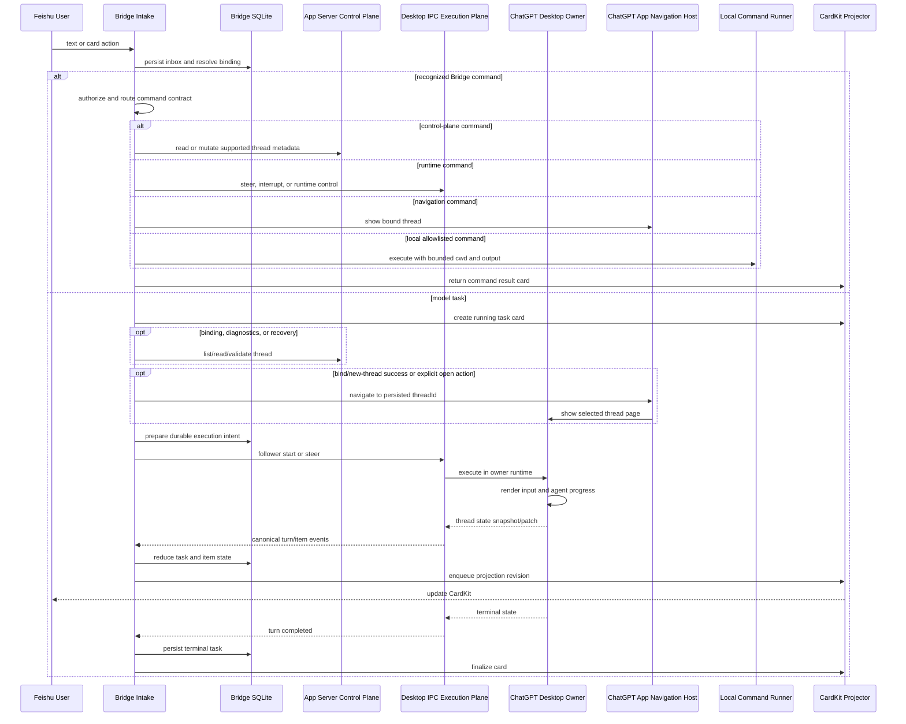
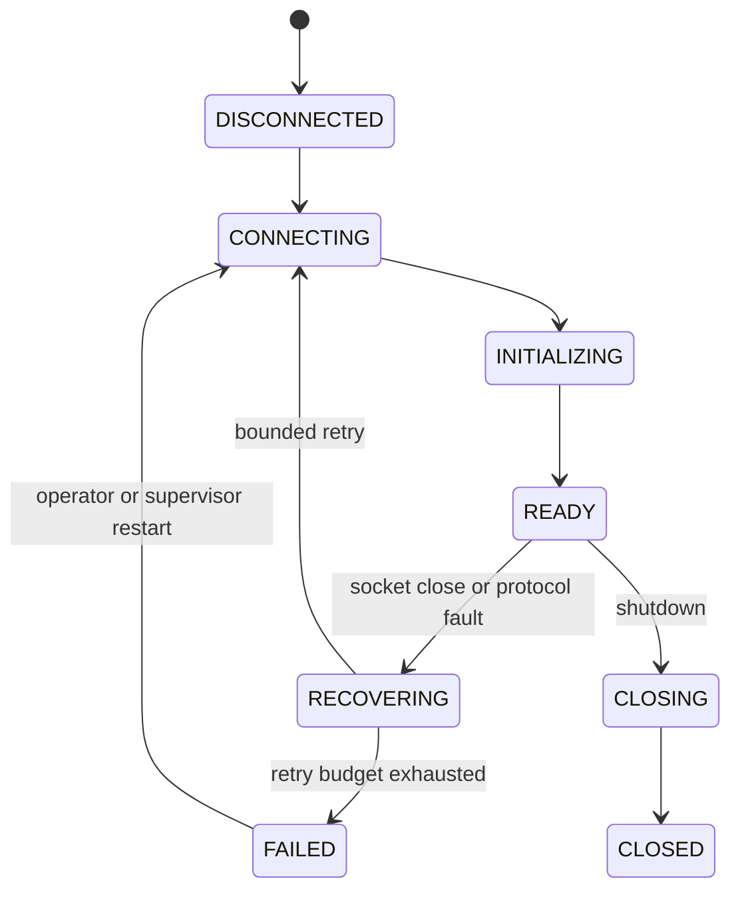
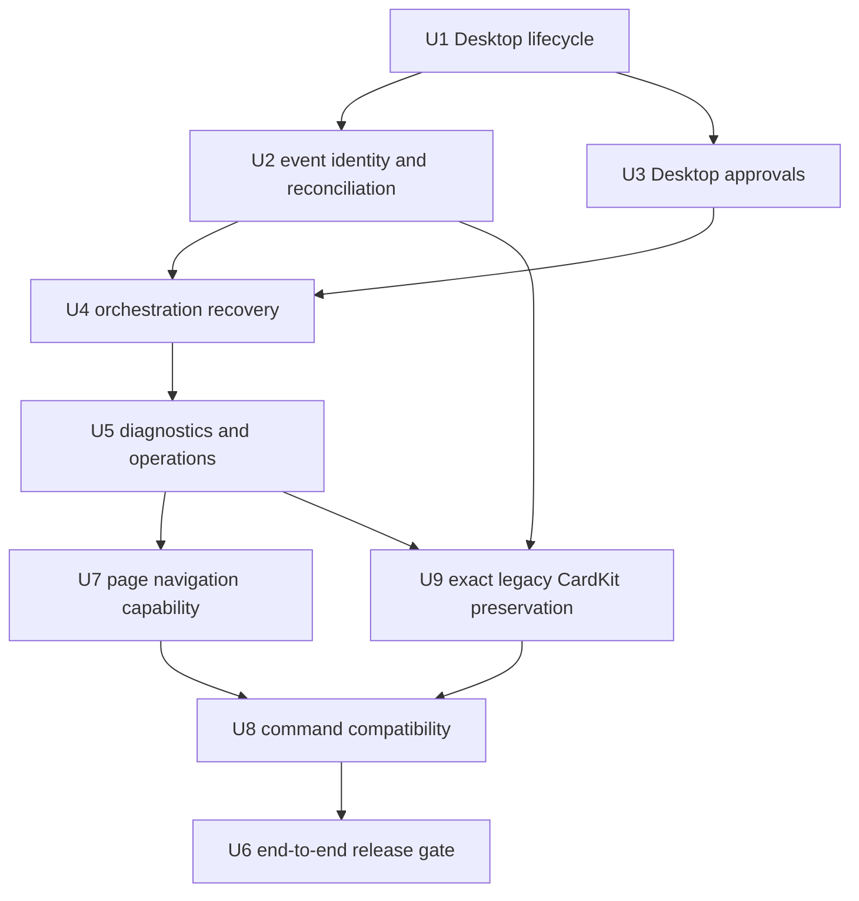
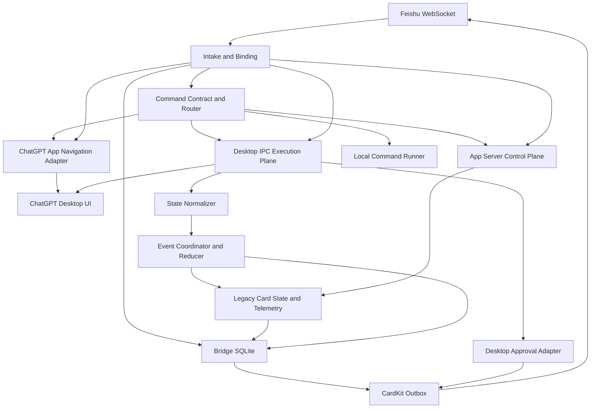

# feat: 飞书与 ChatGPT Desktop 双端实时桥接

## Summary

采用“App Server 控制平面 + ChatGPT Desktop IPC 执行平面”的双平面架构。飞书显式绑定一个 ChatGPT 会话后，任务通过 Desktop owner runtime 执行，使用户输入、推理过程和最终回复直接进入 ChatGPT UI；同一 runtime 的状态广播经 Bridge 归一化后驱动飞书 CardKit 实时卡片。原 Bridge 已公开的命令、别名、技能提及入口、卡片消息投影、窗口用量和上下文统计完整保留，只迁移其内部 owner 与协议实现。

---

## Problem Frame

独立 `codex app-server` 客户端可以继续既有 thread 并持久化新 turn，但已打开的 ChatGPT Desktop 页面由另一个内存 runtime 驱动，无法可靠接收外部 runtime 的实时失效或刷新信号。纯 App Server 路线可以保证 Bridge 和飞书 UI 更新，却不能保证 ChatGPT 当前页面同步。

本项目需要同时满足两个结果：飞书用户能够选择一个固定 ChatGPT 会话并持续下达指令；ChatGPT 页面实时显示同一轮输入和响应，同时飞书卡片实时投影模型过程和最终结果。实验分支已经证明：只有把 turn 投递给 Desktop owner runtime，并消费该 runtime 的状态广播，才能稳定形成双端 UI 闭环。

---

## Validated Baseline

- 分支：`experiment/desktop-ipc-ui-sync`。
- 提交：`6183db5 experiment: route bound turns through Desktop IPC`。
- 自动化门禁：202 个 App 测试、类型检查、生产构建和 npm package 检查全部通过。
- 真实会话：飞书绑定 ChatGPT 会话“feishu 测试”，目标 thread 短标识为 `019f5e…22cce8`。
- 端到端 turn 短标识为 `019f5f…79f8ec`，飞书输入和 ChatGPT 最终回复均为 `FEISHU_DESKTOP_E2E_001`。
- UI 证据：ChatGPT 页面实时显示输入和回复；飞书任务卡显示相同结果并进入 `SUCCEEDED`。
- 投影证据：普通更新与 terminal finalize 均由 CardKit outbox 成功投递。

该基线已经完成最小可行链路；本计划不重复实现基线，而是将其生产化。

---

## Requirements

- R1. 飞书 chat 必须先显式选择一个 ChatGPT thread；后续消息始终发送到已绑定 thread，不读取或猜测 ChatGPT 当前打开页面。
- R2. App Server 负责会话发现、读取、绑定校验和现有控制能力；绑定任务的 start、steer 和 interrupt 必须由 Desktop owner runtime 执行。
- R3. ChatGPT Desktop 必须实时渲染飞书输入、模型过程和最终回复，不依赖页面切换、重新打开、deep link 或数据库修改。
- R4. Desktop 状态 snapshot/patch 必须转换为现有 canonical turn/item 事件，继续复用 reducer、SQLite、CardKit projector 和 outbox。
- R5. 飞书卡片必须保留当前任务状态、公开 commentary/reasoning summary、工具与命令进度、最终回复、失败原因和取消能力。
- R6. 同一飞书事件不得重复启动 turn；同一 thread 同时最多存在一个 Bridge 管理的可写 turn。
- R7. 运行中的同 root 补充消息必须 steer 到已知 active turn；其他 root 按现有持久化队列等待。
- R8. Desktop IPC 请求必须区分确定未发送、确定失败和结果未知；结果未知时禁止自动重发。
- R9. 请求响应和 Desktop 广播乱序时不得丢失或错绑 turn；其他 Desktop 会话的全局广播不得污染当前任务。
- R10. Desktop IPC 断开、ChatGPT 重启或协议变化后，Bridge 必须进入可观测恢复状态并自动重连；在恢复完成前禁止继续投递新 turn。
- R11. Desktop owner runtime 产生的命令和文件变更审批必须映射为飞书审批卡，并把授权决定回传给同一 Desktop runtime。
- R12. 所有 socket、thread、turn、approval 和 card action 必须受 UID、tenant、chat、binding、connection epoch 和一次性 token 约束。
- R13. Desktop 私有协议必须精确钉住当前验证版本；发现方法、事件版本或 state schema 不匹配时 fail closed，不做旧实现兼容回退。
- R14. 生产链路不得写 ChatGPT/Codex SQLite、注入 Electron、模拟 UI 输入或通过历史文件轮询充当实时事实源。
- R15. 飞书凭证、允许的 chat/user/approver、workspace root、Bridge SQLite 和 CardKit sequence 约束保持不变。
- R16. 正式发布必须覆盖普通回复、长任务流式输出、steer、interrupt、approval、Desktop 重启和结果未知恢复的端到端验收。
- R17. 用户在飞书完成会话绑定、显式点击“在 ChatGPT 中打开”或未来完成新会话创建后，Bridge 必须能够请求 ChatGPT App 导航到准确的 `threadId`，使目标会话页面可见；导航不得改变 binding，也不得被当作 turn 已执行或 UI 已同步的证据。
- R18. 原 Bridge 已公开的飞书命令、别名、技能提及输入、权限边界和用户可见语义必须继续支持；允许重写内部 handler 和协议适配，但不得因为迁移到 Desktop IPC/App 导航而静默删除、改名或把命令当作普通模型 prompt。
- R19. 原 Bridge 的飞书卡片必须原样保留，不做重新设计：初始卡、流式过程卡、动态工具折叠面板、终态卡、审批/命令卡的 CardKit 结构、文案、emoji、颜色、元素顺序与 ID、光标效果、截断提示、图片/文件处理、按钮、消息投递位置和更新节奏均以现有实现为准。页脚继续原样展示状态、耗时、模型、输入/输出 Token、上下文已用/最大值/百分比、API 次数，以及账户 5h/7d 窗口用量、重置时间和可用 credits（源数据存在时）；终态后晚到的权威统计继续更新同一张卡，缺失数据不得伪造为零。

### Requirements Traceability

| Requirement | Validated baseline | Remaining unit |
|---|---|---|
| R1–R3 | 显式绑定、Desktop follower start、双端 UI 已验证 | U6 固化发布证据 |
| R4–R5 | canonical normalization 和 CardKit terminal 已验证 | U2 加固乱序；U3 补审批 |
| R6–R9 | durable intent、early buffer、no-client-found 边界已验证 | U2、U4 完成 unknown reconciliation |
| R10 | 启停边界已验证，自动重连未完成 | U1、U4、U5 |
| R11–R12 | 现有 token/权限模型已验证，Desktop approval 未接入 | U3 |
| R13–R14 | 当前 build 协议和无私库写入已验证 | U1、U5、U6 固化门禁 |
| R15 | 白名单、workspace、SQLite/CardKit 约束已存在 | U3、U5 回归 |
| R16 | 普通文本双端 E2E 已通过 | U6 扩展完整矩阵 |
| R17 | 已确认 App 提供按显式 `threadId` 导航到最近聚焦主窗口的能力；独立 Bridge 调用边界尚待验证 | U7 接入；U6 固化真实 UI 证据 |
| R18 | 旧 router 与帮助卡提供完整命令基线；新 App 入口当前只接管绑定命令 | U8 建立兼容矩阵并迁移；U6 回归全部命令 |
| R19 | 旧 `turn-cards.ts`、`stats.ts`、dispatcher 和 CardKit client 定义完整卡片；新 projector 当前输出另一套简化布局 | U9 以旧卡片 golden master 原样迁移；U6 固化 JSON/截图/真实推送证据 |

---

## Scope Boundaries

- 首期只支持本机 macOS、同一系统用户和正在运行的 ChatGPT Desktop。
- 不支持远程 Desktop IPC、公网 socket 或跨主机 owner runtime。
- 不考虑旧 App Server-only UI 同步模式的兼容；Desktop IPC 不可用时停止绑定任务执行并给出稳定错误。
- 不读取 ChatGPT 当前页面来自动选择目标；唯一目标来源是飞书持久化 binding。导航只把页面打开到已确定的目标。
- 不通过 browser/computer automation 驱动 ChatGPT 页面。
- 不把 `codex_app__navigate_to_codex_page` 当作会话创建接口：它只显示一个已经存在且可读取的 thread；未来新会话流程必须先拿到并持久化真实 `threadId`，再触发导航。
- 不在每条飞书消息后抢占 ChatGPT 窗口焦点。默认只在用户完成绑定、新会话创建成功或显式执行 `/open`/卡片按钮时进行一次导航。
- “不考虑旧 ChatGPT 交互兼容”只表示不保留旧 App Server-only、URL Scheme 或 legacy singleton adapter 的内部执行方式，不表示删除飞书用户命令。命令输入、别名、授权和结果语义属于必须保留的产品合同。
- 卡片不是“兼容迁移”而是“原样保留”。新实现不得改变旧 CardKit JSON 的可观察结构、元素 ID、文案、样式或更新行为；只允许替换数据采集、状态持久化和投递可靠性内部实现。消息必须继续回到发起消息所在飞书会话/话题，不能重新出现临时会话投递问题。
- 不直接修改 ChatGPT、Codex rollout 或 SQLite 数据。
- 不把 raw hidden reasoning/CoT 推送到飞书。
- 不在本计划内实现多实例 Bridge；继续使用单实例进程锁。

### Deferred to Follow-Up Work

- Windows/WSL 和 Linux Desktop socket 发现及权限模型。
- 多实例 Bridge 的分布式 lease 与 owner runtime 协调。
- 远程设备通过受认证代理访问本机 Desktop runtime。
- 私有 IPC 被官方公开接口替代后的迁移方案；届时另立方案，不在当前实现中预埋兼容层。

---

## Context & Research

### Relevant Code and Patterns

- `src/app/main.ts`：当前同时装配 App Server 控制平面、Desktop IPC 执行平面和状态流监听。
- `src/app/codex/desktop-ipc-client.ts`：UID socket 校验、长度帧协议、initialize、follower start/steer/interrupt 和投递边界分类。
- `src/app/codex/desktop-thread-stream-normalizer.ts`：Desktop protocol v11 snapshot/patch 到 canonical turn/item notification 的转换。
- `src/app/task-orchestrator.ts`：保留 App Server `thread/resume` 控制接口；实验运行路径跳过每-turn resume，把 mutating RPC 路由到 Desktop execution client，并维护 durable intent。
- `src/app/codex/event-coordinator.ts`：按准确 thread/turn identity 缓冲、归约并忽略无关广播。
- `src/app/codex/event-reducer.ts`：canonical item 生命周期、文本分区和 terminal convergence。
- `src/app/approval-service.ts`：现有 App Server approval 持久化、权限、token 和 CardKit 路径，可复用其领域模型，但必须更换 Desktop request/response adapter。
- `src/app/conversation-binding-service.ts`：现有 `/bind`、`/binding`、`/unbind` 和绑定卡 action 的可信入口；可在绑定成功后发出一次非权威导航请求。
- `src/app/lark/event-server.ts` 与 `src/app/cards/layouts.ts`：现有 card action 白名单和卡片按钮布局；导航 action 必须进入相同的鉴权、token 和幂等边界。
- `src/commands/router.ts` 与 `src/commands/handlers/*.ts`：原 Bridge 的命令、别名和用户语义基线；实现中先补 characterization tests，再迁移到新 App 装配层，不能直接复用其中的 legacy singleton、URL Scheme 或未脱敏错误输出。
- `src/cards/templates.ts`：旧 `/help` 卡记录了用户可见命令说明和技能 `@提及` 用法；迁移后的帮助卡必须由同一命令 contract 生成，避免 router 与文档漂移。
- `src/cards/turn-cards.ts`、`src/codex/stats.ts`、`src/codex/dispatcher.ts` 与 `src/feishu/card.ts`：旧卡片的权威 golden master，包括初始/终态 JSON、固定元素 ID、30 ms/3 字符打印配置、动态工具 panel、100 ms dirty flush、统计页脚、sequence recovery 和晚到统计更新。
- `src/app/cards/projector.ts` 与 `src/app/cards/layouts.ts`：当前 durable 投影路径；实施时必须承载旧卡片 renderer 的原样输出，不能继续以当前简化布局作为目标 UI。SQLite outbox、严格 sequence 和 terminal barrier 作为内部可靠性增强保留。
- `src/app/recovery-service.ts`：现有 App Server 重连和 durable RPC 恢复边界，可扩展 Desktop runtime 恢复。
- `src/app/cards/projector.ts` 与 `src/app/cards/outbox-worker.ts`：已验证的 CardKit projection、sequence 和 terminal barrier。

### Institutional Learnings

- App Server-style event model 继续作为 Bridge 内部 canonical contract；实际执行状态必须来自 Desktop owner broadcast，独立 App Server runtime 不能保证刷新已打开的 Desktop renderer。
- Desktop follower 方法必须发送给 owner runtime；这样 ChatGPT UI 不需要额外刷新动作。
- Desktop `thread-stream-state-changed` 是全局 broadcast，必须按 thread 和真实 turn identity 过滤，不能按“最近事件”猜测归属。
- 当前 Desktop state 使用 canonical `turnHistory`，历史 turn 位于 `history.entitiesByKey`，不能只读取顶层 `turns`。
- 请求写入 socket 后的 timeout/close 不能回退调用普通 `turn/start`，否则可能重复执行用户任务。
- agent message 在 terminal snapshot 中可能没有 item status；turn terminal 必须能够推动 item terminal convergence。

### External References

- 官方 App Server 文档将其定义为 rich client 集成接口，覆盖认证、会话历史、审批和 streamed agent events；文档只承诺连接它的客户端可以消费这些能力。
- `openai/codex#21743` 记录了独立 app-server 追加 turn 后已打开 Desktop thread 不立即刷新的现象。
- `openai/codex#30866` 当前是 draft，方向是 `thread/resume` 时协调持久化 history；它不是 Desktop owner runtime 的实时 push 合同，也不能替代本方案的 follower IPC 实验。
- Desktop follower 方法、版本 1/2 和 state broadcast 版本 11 来自本机已安装 ChatGPT build 的运行时代码与真实 probe，不属于公开稳定 API。

---

## Key Technical Decisions

| Decision | Choice | Rationale |
|---|---|---|
| 总体架构 | App Server 控制平面 + Desktop IPC 执行平面 | 保留公开 API 的会话管理能力，同时让 turn 进入真正驱动 ChatGPT UI 的 owner runtime |
| 绑定目标 | 飞书显式持久化 thread binding | 用户要求固定选择会话；避免把页面焦点误当业务状态 |
| turn 执行 | follower start/steer/interrupt | 已通过真实 Desktop UI 验证，且不会创建第二个独立 App Server runtime |
| 事件事实源 | Desktop owner state broadcast | 这是同时驱动 ChatGPT UI 和 Bridge 的同一 runtime 状态 |
| Bridge 内部事件 | 归一化为现有 App Server-style canonical events | 最大化复用 reducer、数据库、CardKit 和恢复边界，避免两套业务状态机 |
| 协议兼容 | 精确版本钉住并 fail closed | 私有协议漂移时停止执行比静默错绑或重复 turn 更安全 |
| 结果未知 | 保持 durable UNKNOWN，基于稳定消息 identity 对账 | 外部副作用无法由 SQLite 提供 exactly-once，禁止盲目重试 |
| 审批 | Desktop request adapter + 复用现有 approval domain | 权限、token 和卡片语义已验证，但 response 必须回到产生请求的 runtime |
| 断线 | Desktop 独立 supervisor，与 App Server supervisor 分离 | 两个 runtime 生命周期不同，不能用一个连接状态掩盖另一个故障 |
| 降级策略 | 不回退到独立 App Server 执行 | 用户不要求兼容；回退会恢复“ChatGPT UI 不刷新”的已知错误语义 |
| 页面导航 | 通过 App host 提供的 `codex_app__navigate_to_codex_page` 等价能力，按 binding 中的准确 `threadId` 导航 | 让已绑定或刚创建的会话立即在 ChatGPT 页面显示，同时保持“目标选择、任务执行、页面导航”三种职责分离 |
| 导航触发 | 绑定成功/新会话创建成功的一次性触发，以及 `/open` 或卡片按钮显式触发 | 满足会话可见性需求，避免每条消息都抢焦点；重复事件不得重复导航 |
| 命令兼容 | 保留原命令和别名合同，内部按 control plane、Desktop execution、App navigation 或本地受控操作重新归属 | 用户无需学习第二套入口；同时彻底移除旧 transport 和 singleton 依赖 |
| 命令安全 | 命令先于普通 prompt 路由，统一经过 tenant/chat/user/role、binding revision、幂等和参数白名单 | 防止命令被模型解释、跨会话执行或因事件重投产生第二次副作用 |
| 卡片 UI | 旧 Bridge CardKit 输出作为 golden master 原样保留 | 用户明确要求完全原样；新简化卡片不得成为正式 UI |
| 遥测事实源 | turn/model/token/context 来自 Desktop owner state；账户窗口来自 App Server control plane | 不混用 runtime，也不从文本、页面或历史文件猜测统计值 |
| 晚到统计 | 按旧行为更新同一终态卡，同时通过 durable sequence 防重 | 卡片外观和用户行为不变，内部避免重启后 sequence 猜测 |

### Protocol Contract

| Capability | Contract | Version/Boundary |
|---|---|---|
| Socket discovery | `$TMPDIR/codex-ipc/ipc-${uid}.sock` | 必须是当前 UID 所有的 Unix socket，拒绝 symlink 和 Electron SingletonSocket |
| Framing | 4-byte little-endian length + UTF-8 JSON | 单帧上限 256 MiB |
| Handshake | `initialize` with Desktop-compatible follower identity | READY 前禁止业务请求 |
| Start | `thread-follower-start-turn` | v1 |
| Steer | `thread-follower-steer-turn` | v1，必须带 expected turn identity |
| Interrupt | `thread-follower-interrupt-turn` | v2 |
| State | `thread-stream-state-changed` | v11 snapshot/patch |
| Approval | Desktop follower approval methods | 实施时从当前 ChatGPT build 重新提取并钉住版本 |
| Page navigation | `codex_app__navigate_to_codex_page({ threadId })` 等价的 App host capability | 目标是最近聚焦的 Codex 主窗口；只接受持久化 binding 的准确 thread ID；可用性必须探测，不能假定独立 Node 进程可直接调用 |

### Command Compatibility Contract

| Capability | Commands and aliases | Target owner after migration |
|---|---|---|
| 帮助 | `/help`、`/h`、`help`、`h` | 新 command service；从统一 contract 生成帮助卡 |
| 会话列表与绑定 | `/list`、`/l`、`/ll`、`/bind`、`/binding`、`/unbind` | App Server control plane + durable binding service |
| 新建、派生、归档 | `/new`、`/create`、`/fork`、`/branch`、`/delete`、`/archive` | 受支持的 thread control API；成功后原子更新 binding，并按需导航 |
| 页面打开 | `/open` | U7 App navigation adapter；不再使用 URL Scheme |
| 执行控制 | `/cancel`、`/stop`、运行中同 root 补充消息 | Desktop owner interrupt/steer + durable intent |
| 目标与上下文 | `/goal`、`/compact`、`/compress`、`/plan` | 经 capability gate 路由到目标 thread；状态写入 durable binding metadata 或受支持 runtime API |
| 模型与风格 | `/model`、`/personality`、`/style` | 经白名单校验的 per-binding execution options；后续 turn 统一应用 |
| 工作区 | `/cwd`、`/workspace` | workspace allowlist/canonical path 校验后更新 binding，不扩大 Bridge 根目录权限 |
| 状态与能力 | `/status`、`/usage`、`/quota`、`/mcp`、`/skills` | App Server/control metadata + Bridge durable state；输出必须脱敏 |
| 本地受控命令 | `/cmd`、`/run`、`/shell`，以及旧 router 的未知 slash fallback | 本地 command service；仅允许 `ALLOWED_SHELL_COMMANDS` 首命令白名单、受控 cwd、超时、输出截断和授权用户 |
| 技能调用 | `@技能名称 [输入]` | 解析为结构化 skill input 后随 turn 进入 Desktop owner runtime，不作为普通未解析文本丢失 |

命令兼容以当前 `src/commands/router.ts` 的匹配顺序、别名和 `src/cards/templates.ts` 的帮助语义为基线。内部协议不可用时，实施阶段必须为该命令找到新 owner 或把它列为发布阻塞项；不能用“暂不支持”卡片冒充兼容完成。

### Exact Card Preservation Contract

| Surface | Must remain exactly as the original Bridge |
|---|---|
| 初始任务卡 | `🌌 Codex Remote Control` 标题、indigo header、`📥 输入 Prompt`、可选 metadata、`🧠 模型推理过程`、`✨ 最终结果输出`、`📊` 页脚、原元素顺序和固定 element ID |
| 流式配置 | `streaming_mode`、`update_multi`、summary、各端 30 ms print frequency、3 字符 print step 和 delay strategy |
| 实时文本 | reasoning/answer 的 `▍` 光标、原截断长度和原中文截断提示、Markdown 图片处理方式 |
| 工具过程 | 原 action cluster 分类、标题/icon、动态 `collapsible_panel`、panel/markdown ID 规则、命令输出尾部 code block 和失败红框 |
| 终态卡 | success/failed/interrupted/history 的原 header 颜色、emoji、标题、段落显隐、最终文本和 footer；先关闭 streaming 再替换完整卡 |
| 统计页脚 | 状态、耗时、模型、输入/输出 Token、上下文 used/max/percent、API 次数、5h/7d used percent 与 reset、credits |
| 晚到事件 | terminal 后到达 token/context/window 数据时继续更新原卡，不新建卡、不改变终态、不重开 streaming |
| 飞书投递 | 卡片仍出现在发起消息所在会话/话题；CardKit message/card identity 持久化，更新同一卡；不得投递到临时会话 |
| 其他卡片 | 旧 help、list/table、status、goal、usage、skills、MCP、model、approval 和简单状态卡的内容与布局同样纳入 golden fixtures |

“完全原样”通过 CardKit JSON golden fixtures、事件到 CardKit action 序列 fixtures、飞书截图对比和真实消息落点共同验收；仅比较最终文本不算通过。

---

## Alternative Approaches Considered

| Approach | Decision | Reason |
|---|---|---|
| 独立 App Server 执行所有 turn | Rejected | Bridge 可读到 turn，但已打开 Desktop UI 不可靠刷新，实验和 upstream issue 均已复现 |
| 等待 `thread/resume` history reconciliation | Not a blocker, not the solution | draft PR 改善重新 resume 后的历史协调，不提供当前 owner renderer 的实时 follower push |
| 让 Desktop 与 Bridge 共用公开 App Server transport | Deferred | 当前安装版本没有可验证、受支持的 Desktop attach 配置；不能作为现阶段产品合同 |
| 修改 ChatGPT/Codex SQLite 或 rollout | Rejected | 绕开 runtime 状态机，存在数据损坏、乱序和升级风险 |
| Electron 注入、UI 自动化或自动刷新 | Rejected | 页面焦点不是业务绑定，且无法提供 durable delivery 和跨系统幂等 |
| deep link、模拟点击或反复切换页面 | Rejected | 不能证明打开的是准确 thread，也会引入焦点抢占和版本脆弱性 |
| App host 按 thread ID 导航 | Selected with capability gate | 官方 App 工具语义能够打开指定 thread，但 standalone Bridge 的 host 调用通道必须先在 U7 验证 |
| Desktop owner IPC follower | Selected | 已在指定绑定 thread 上完成真实双端 UI 和飞书 CardKit 闭环 |

---

## Open Questions

### Resolved During Planning

- ChatGPT 当前页面是否决定目标会话：否，目标只来自飞书 binding。
- 是否继续用独立 App Server `turn/start`：否，只保留非 mutating 控制能力。
- 是否依赖刷新、切换页面或 deep link 才能同步 turn：否，owner runtime 会直接更新 UI；按 thread ID 的 App 导航只负责让指定页面变得可见。
- 导航是否决定业务目标：否，必须先从持久化 binding 得到准确 thread ID，导航不能修改或替代 binding。
- 导航是否创建新会话：否；新会话必须先由受支持的创建流程返回真实 thread ID，随后才能导航显示。
- 原 Bridge 命令是否随旧 App Server/adapter 一起废弃：否；用户命令是产品合同，只有底层 owner 和实现路径迁移。
- 未知 slash 是否作为普通模型 prompt：否；保持旧 router 的受控本地命令 fallback，但必须继续执行首命令白名单、授权、cwd containment 和输出限制。
- 飞书卡片是否允许按新架构重新设计：否；旧 Bridge 卡片及其消息更新序列是不可变 golden master，新架构只替换数据源与可靠性实现。
- 是否保留飞书 CardKit：是，继续作为移动端实时控制和结果界面。
- 私有协议不兼容时是否回退旧路径：否，启动或运行时 fail closed。
- 是否修改 ChatGPT 数据库：否，任何 ChatGPT/Codex 持久化写入都不在产品边界内。

### Deferred to Implementation

- 当前 ChatGPT build 的 approval follower 方法及 state request schema：在 U3 开始前从本机 runtime fixture 固化。
- late start response 丢失后的唯一 turn 关联字段：优先使用 `clientUserMessageId`，最终以真实 state fixture 可观察字段决定。
- Desktop reconnect 后是否自动重放完整 snapshot：由 U1 的真实 restart probe 确认；若没有，U2 必须主动请求 owner state 或进入人工恢复。
- ChatGPT 自动升级后的 build identity 获取方式：在 U5 中选择稳定且不读取敏感应用数据的本机元信息来源。
- 独立 Node Bridge 如何获得 `codex_app__navigate_to_codex_page` 等价的 App host 调用通道：U7 必须先验证可调用的 host/RPC seam；若当前 host 不暴露给后台 Bridge，则该能力不得伪装成 deep link、数据库写入或 UI 自动化，发布状态必须明确标为不可用。
- Desktop protocol v11 中 model、input/output token、total token 和 model context window 的准确 state path/notification：U9 先用真实 turn probe 固化 fixture；若 owner runtime 不提供某字段，必须寻找同 runtime 的受支持查询能力并将缺口标为发布阻塞，不能从回答文本或 rollout 文件估算。
- App Server control plane 的 rate-limit response 在当前版本中的 primary/secondary/credits schema：U9 用真实 `account/rateLimits/read` fixture 钉住，并保留旧 5h/7d/reset 格式。

---

## High-Level Technical Design

> *This illustrates the intended approach and is directional guidance for review, not implementation specification. The implementing agent should treat it as context, not code to reproduce.*

### Runtime state model

### Delivery outcome model

| Outcome | Durable action | User-visible behavior |
|---|---|---|
| Provably unsent | intent `FAILED`; release early buffer | 明确失败，可由用户重新发送 |
| Definitive rejection | intent `FAILED`; task `FAILED` | 展示稳定错误，不重试 |
| Outcome unknown | intent `UNKNOWN`; task `DISPATCH_UNKNOWN` | 提示可能已执行，禁止重复提交并启动对账 |
| Accepted with turn identity | intent `RESOLVED`; task `RUNNING` | 继续消费 Desktop state |

---

## Implementation Units

### U1. 完成 Desktop IPC 生命周期和协议门禁

**Goal:** 将当前一次性 Desktop connection 提升为可恢复、可观测且严格版本钉住的 runtime client。

**Requirements:** R2, R8, R10, R12, R13

**Dependencies:** None

**Files:**
- Modify: `src/app/codex/desktop-ipc-client.ts`
- Modify: `src/app/main.ts`
- Modify: `src/app/config.ts`
- Test: `test/app/desktop-ipc-client.test.ts`
- Create: `test/app/main.test.ts`

**Approach:**
- 引入独立 Desktop connection supervisor，采用有界退避和单连接 epoch；断线后先冻结新 dispatch，再重连和重建状态订阅。
- 启动时核验 socket owner/type、握手响应、follower 方法版本和 state protocol version；任一不匹配都阻止 Bridge 进入可执行状态。
- 连接断开时，未发送请求明确失败，已发送请求进入 outcome unknown；不得跨 epoch 重用 request identity。
- stop 必须排空 listener、pending request 和重连计时器，避免进程退出后继续持有 socket 或触发回调。

**Patterns to follow:**
- `src/app/codex/app-server-client.ts` 的 epoch、pending request 和受控 stop。
- `src/app/recovery-service.ts` 的 supervisor/recovery 串行边界。

**Test scenarios:**
- Happy path: UID socket 可用且协议匹配时完成 initialize 并进入 READY。
- Edge case: response 与 state broadcast 在同一 frame stream 中交错时仍分别路由。
- Error path: socket 消失、symlink、owner 不符、握手版本不符时 fail closed，零业务请求写出。
- Error path: 已写请求后 socket close 时返回 outcome unknown，不自动重试。
- Integration: 模拟 Desktop 重启后只建立一个新 epoch，并在恢复完成前拒绝新 turn。

**Verification:**
- ChatGPT 退出或升级不会让 Bridge 保持“假 READY”。
- Desktop 恢复后无需重启 Bridge 即可重新接受新任务。

### U2. 加固 Desktop state 归一化与 turn 身份关联

**Goal:** 确保全局 Desktop 广播、canonical history、patch 乱序和 late response 都不会造成漏事件、错绑或重复文本。

**Requirements:** R4, R6, R8, R9

**Dependencies:** U1

**Files:**
- Modify: `src/app/codex/desktop-thread-stream-normalizer.ts`
- Modify: `src/app/codex/event-coordinator.ts`
- Modify: `src/app/codex/event-reducer.ts`
- Test: `test/app/desktop-thread-stream-normalizer.test.ts`
- Test: `test/app/event-coordinator.test.ts`
- Test: `test/app/event-reducer.test.ts`

**Approach:**
- 每个 thread 维护独立 authoritative snapshot；没有 snapshot 时拒绝应用 patch，重连 epoch 变化时清空旧 state。
- 只向 coordinator 发出具有真实 thread/turn/item identity 的事件；禁止按更新时间或最近 active task 归属事件。
- 使用稳定 client message identity 关联 start intent、用户 item 和真实 turn；响应超时后仍能从 state 中唯一恢复 turn identity。
- 保持 suffix-only delta 规则；Desktop 重写既有文本时等待 authoritative completion，避免重复或破坏已投影文本。
- 对 terminal turn 推动无显式 item status 的 agent/reasoning item 完成，保证最终卡片收敛。

**Patterns to follow:**
- `src/app/codex/event-coordinator.ts` 的 exact-turn pending buffer。
- `src/app/codex/event-reducer.ts` 的 itemId、phase 和 terminal authoritative overwrite。

**Test scenarios:**
- Happy path: canonical snapshot 和连续 patches 生成完整 agent delta、item completion 和 turn completion。
- Edge case: 首个 snapshot 含大量历史 turn 时只处理当前相关 turn，不重放历史。
- Edge case: 其他 thread/turn 广播与目标 turn 交错时完全忽略无关事件。
- Error path: patch 先于 snapshot、数组索引无效或 schema 不完整时不污染缓存。
- Integration: start response 丢失但 state 中存在唯一 matching user item 时，任务恢复真实 turn 并完成；多候选时保持 unknown。

**Verification:**
- 任何事件都不能凭 thread 相同而自动认领未知 turn。
- 重连和 duplicate snapshot 不产生重复飞书文本或第二个 terminal 状态。

### U3. 建立 Desktop approval 双向闭环

**Goal:** 把 Desktop owner runtime 中的命令和文件变更审批安全投影到飞书，并把决定回传给同一 runtime。

**Requirements:** R5, R11, R12, R15

**Dependencies:** U1

**Files:**
- Create: `src/app/codex/desktop-approval-adapter.ts`
- Modify: `src/app/approval-service.ts`
- Modify: `src/app/main.ts`
- Modify: `src/app/cards/layouts.ts`
- Test: `test/app/desktop-approval-adapter.test.ts`
- Test: `test/app/approval-service.test.ts`

**Approach:**
- 从当前 Desktop state/request fixture 中解析 approval identity、available decisions、thread/turn/item 和 connection epoch。
- 将 Desktop request 转换为现有 approval domain record，继续使用一次性 token、approver allowlist、TTL 和 CardKit 按钮。
- approval response 必须走 Desktop follower approval 方法；旧 epoch、已 terminal turn、重复点击或不在 available decisions 中的选择全部拒绝。
- App Server approval listener 只服务 App Server 控制平面自身请求，不得错误处理 Desktop-owned turn 的审批。

**Patterns to follow:**
- `src/app/approval-service.ts` 的持久化状态机和授权检查。
- `src/app/action-tokens.ts` 的 scope-bound opaque token。

**Test scenarios:**
- Happy path: Desktop command approval 生成卡片，授权用户选择 accept 后只回传一次。
- Happy path: available decisions 包含 session approval 时显示并提交 accept-for-session。
- Error path: 未授权用户、过期 token、旧 epoch、重复点击和非法 decision 均不发送 Desktop response。
- Error path: response 写出后断线进入 unknown，不跨 epoch 重放旧审批。
- Integration: approval 完成后同一 turn 继续输出并最终更新原任务卡。

**Verification:**
- 不会出现仅 ChatGPT 页面等待审批、而飞书没有审批提示的状态。
- 每个审批决定具备完整 tenant/chat/thread/turn/item/epoch 审计。

### U4. 完成编排、未知结果对账和恢复收敛

**Goal:** 让 Desktop disconnect、late response 和 Bridge crash 不会永久占用 active slot，也不会重复执行用户任务。

**Requirements:** R6, R7, R8, R9, R10

**Dependencies:** U2, U3

**Files:**
- Modify: `src/app/task-orchestrator.ts`
- Modify: `src/app/recovery-service.ts`
- Modify: `src/app/db/repositories.ts`
- Modify: `src/app/db/schema.ts`
- Test: `test/app/task-orchestrator.test.ts`
- Test: `test/app/recovery-service.test.ts`
- Test: `test/app/database.test.ts`

**Approach:**
- 将 Desktop runtime epoch 和 client message identity 持久化到 dispatch intent，支持重启后的唯一候选对账。
- outcome unknown 时冻结同 thread 和全局写 slot，优先从 Desktop authoritative state 恢复；唯一匹配则绑定 turn，多候选或无证据则进入人工恢复。
- provably unsent 和 definitive failure 必须释放 early-event buffer、active slot 和队列；unknown 只有在确认 terminal、确认未执行或管理员决策后释放。
- steer、interrupt 和 approval response 使用相同投递边界，禁止按不同规则处理同类外部副作用。

**Patterns to follow:**
- `rpc_intent` 的 PREPARED/SENT/UNKNOWN/RESOLVED 状态。
- `src/app/recovery-service.ts` 的 fail-closed reconciliation 顺序。

**Test scenarios:**
- Happy path: Bridge 重启后根据唯一 client message identity 恢复 active turn 并继续投影。
- Edge case: Desktop state 中存在多个候选 turn 时保持 `NEEDS_REVIEW`，不自动认领。
- Error path: no-client-found 被记录为确定未发送并释放队列，不进入永久 unknown。
- Error path: sent timeout 保持 unknown，后续 late state 只关联一次。
- Integration: unknown start 最终完成后，卡片终态收敛并启动下一个持久化队列任务。

**Verification:**
- 不存在因 Desktop timeout 永久阻塞所有后续任务的正常故障路径。
- 自动恢复既不创建第二个 turn，也不把其他会话 turn 绑定到当前任务。

### U5. 增加运行诊断、告警和协议升级门

**Goal:** 让运维能够区分 App Server、Desktop IPC、飞书 WebSocket、CardKit outbox 和任务恢复的独立健康状态。

**Requirements:** R10, R12, R13, R15

**Dependencies:** U4

**Files:**
- Modify: `src/app/doctor.ts`
- Modify: `src/app/main.ts`
- Modify: `src/app/logger.ts`
- Modify: `src/app/cli.ts`
- Modify: `README.md`
- Test: `test/app/doctor.test.ts`
- Test: `test/app/cli.test.ts`

**Approach:**
- doctor 输出 Desktop socket、owner、handshake、protocol version 和 ChatGPT build 的非敏感摘要；任何协议不匹配都给出稳定错误码。
- runtime 日志分别记录 control-plane state、execution-plane state、connection epoch、reconnect 次数、active unknown 数和 outbox backlog。
- Bridge 启动成功条件同时包含 Desktop READY、App Server control plane READY 和飞书 WebSocket READY。
- ChatGPT 自动升级后第一次启动必须重新执行协议 fixture gate；失败时不接收新模型任务。

**Patterns to follow:**
- `src/app/doctor.ts` 的结构化检查结果。
- `src/app/logger.ts` 的敏感信息脱敏和稳定 event name。

**Test scenarios:**
- Happy path: 三个外部连接健康时 doctor 明确报告可执行。
- Error path: Desktop socket 缺失、协议版本漂移、App Server 失败和飞书未 ready 分别产生不同错误码。
- Edge case: failed outbox 或 unknown task 非零时 health 进入 degraded，而不是误报 healthy。
- Integration: ChatGPT restart 期间日志展示 recovering，恢复后 epoch 递增且状态回到 ready。

**Verification:**
- 运维无需读取原始异常或本地敏感路径即可判断故障平面。
- 协议升级失败不会静默进入错误兼容模式。

### U7. 接入 ChatGPT 页面导航能力

**Goal:** 使用 App host 的按 thread 导航能力，让飞书已绑定或刚创建成功的会话立即在 ChatGPT 主窗口显示，同时不改变任务执行和事件事实源。

**Requirements:** R1, R3, R12, R13, R17

**Dependencies:** U1, U5

**Files:**
- Create: `src/app/codex/app-navigation-adapter.ts`
- Modify: `src/app/conversation-binding-service.ts`
- Modify: `src/app/lark/event-server.ts`
- Modify: `src/app/cards/layouts.ts`
- Modify: `src/app/main.ts`
- Modify: `src/app/doctor.ts`
- Create: `test/app/app-navigation-adapter.test.ts`
- Modify: `test/app/conversation-binding-service.test.ts`

**Approach:**
- 先验证 standalone Bridge 是否存在受支持的 App host 调用通道，能力语义必须等价于 `codex_app__navigate_to_codex_page({ threadId })`；未验证前不实现 deep link、UI 模拟或私有数据库替代路径。
- 导航适配器只接受已通过 App Server 校验并写入持久化 binding 的准确 thread ID；请求不能读取当前页面、猜测最近会话或自行改变 binding。
- 用户在绑定卡点击“绑定此会话”本身视为一次明确导航意图：持久化成功后发出一次导航。未来若增加新会话创建，则必须在真实 thread ID 返回并持久化后再发出一次导航。
- 增加 `/open` 和“在 ChatGPT 中打开”卡片 action，复用 tenant/chat/user、binding revision、一次性 token 和幂等约束；旧 binding 的 action 不得打开已被替换的会话。
- 导航是非权威、可失败的 UI side effect。无最近聚焦主窗口、host capability 不可用或导航失败时，返回稳定可见错误，但不得修改 binding、回滚已完成 turn、重放任务或影响 CardKit 最终状态。
- 对同一 chat、binding revision 和用户动作进行去重与短窗口节流；普通飞书消息不自动导航，避免持续抢占用户正在使用的 ChatGPT 窗口。

**Patterns to follow:**
- `src/app/conversation-binding-service.ts` 的绑定 revision、一次性 action token 和 stale picker 拒绝规则。
- `src/app/lark/event-server.ts` 的 card action 类型白名单和归一化边界。
- `src/app/doctor.ts` 的外部能力检查与稳定错误码。

**Test scenarios:**
- Happy path: 用户绑定一个已存在会话后，适配器仅收到一次准确 thread ID，最近聚焦的 ChatGPT 主窗口显示该会话。
- Happy path: 用户执行 `/open` 或点击卡片按钮时，打开当前持久化 binding，而不是 ChatGPT 当前页面或历史 binding。
- Edge case: 未来新会话创建成功后，只在真实 thread ID 已持久化时导航；创建失败或 ID 缺失时零导航调用。
- Edge case: 飞书重复 callback、进程重试和快速重复点击最多产生一次有效导航。
- Error path: binding 已变更、token 过期、用户未授权或 chat 不匹配时零导航调用。
- Error path: App host capability 不可用、没有聚焦主窗口或返回失败时，显示稳定提示且任务执行、binding 和卡片状态保持不变。
- Integration: 导航后截图确认页面 thread 与 binding 一致；随后从飞书发送唯一 nonce，Desktop follower 与 CardKit 继续形成同一 turn 的双端闭环。

**Verification:**
- 导航只改变页面可见性，不改变 thread 选择、turn 状态或事件事实源。
- 任何失败都不会退化为错误 thread、重复 turn、deep link、UI 自动化或 ChatGPT 数据库写入。

### U9. 原样迁移旧 Bridge 飞书卡片与统计

**Goal:** 在新的 durable runtime 中逐字、逐结构、逐更新行为保留旧 Bridge 的所有飞书卡片，不引入新的任务卡设计。

**Requirements:** R4, R5, R9, R15, R16, R19

**Dependencies:** U2, U5

**Files:**
- Preserve as golden source: `src/cards/turn-cards.ts`
- Preserve as golden source: `src/cards/templates.ts`
- Preserve as golden source: `src/codex/stats.ts`
- Preserve as golden source: `src/codex/dispatcher.ts`
- Preserve as golden source: `src/feishu/card.ts`
- Modify: `src/app/domain.ts`
- Modify: `src/app/codex/protocol.ts`
- Modify: `src/app/codex/desktop-thread-stream-normalizer.ts`
- Modify: `src/app/codex/event-reducer.ts`
- Modify: `src/app/codex/event-coordinator.ts`
- Modify: `src/app/cards/projector.ts`
- Modify: `src/app/cards/layouts.ts`
- Modify: `src/app/cards/outbox-worker.ts`
- Modify: `src/app/db/schema.ts`
- Modify: `src/app/db/repositories.ts`
- Create: `test/fixtures/cards/legacy-cardkit/`
- Create: `test/app/card-golden-contract.test.ts`
- Create: `test/app/turn-telemetry.test.ts`
- Modify: `test/app/projector.test.ts`
- Modify: `test/app/layouts.test.ts`
- Modify: `test/app/outbox-worker.test.ts`
- Modify: `test/app/recovery-service.test.ts`

**Approach:**
- 在改动 renderer 前，先从旧实现生成并人工确认 golden fixtures：初始卡、reasoning 流式更新、answer 流式更新、单/多工具 cluster、命令输出、失败工具、success/failed/interrupted/history 终态、晚到统计、help/status/usage/goal/skills/MCP/model/approval 等卡片。
- golden fixture 同时保存完整 CardKit JSON 和按 sequence 排列的 action stream，包括 create、send/reply、element content update、add-elements、partial element update、close streaming、final PUT 和 late-stats PUT。实施不得只快照最终 JSON。
- 保留 `src/cards/turn-cards.ts` 与 `src/cards/templates.ts` 的文案、emoji、header template、元素顺序、element ID、截断阈值和提示文本；如为新架构拆分 renderer，输出必须与 golden fixture 深度一致。
- 将 Desktop owner snapshot/patch 中的 model、input/output/total tokens、model context window、duration、item/tool state 归一化为结构化 turn telemetry；字段不存在时保留 unknown，不从文本估算，不显示虚假 `0`。
- 账户窗口继续由 App Server control plane 的 rate-limit capability 提供，保留 primary/secondary 5h/7d percent、reset time 和 credits 格式。使用有 TTL 的共享快照，在 turn 启动、终态、明确 token-usage 更新和 `/usage` 时刷新，禁止每个 delta 发远程查询。
- 把卡片渲染所需状态与统计持久化，使 Bridge 重启后能恢复原卡、原 element/update 阶段、下一个 CardKit sequence 和 terminal/streaming 标志；不得依靠进程内 `Map` 猜 sequence。
- 保留旧卡的实时节奏和行为：100 ms dirty flush、30 ms/3 字符 CardKit print 配置、reasoning/answer `▍`、命令尾部 code block、动态工具折叠 panel 及失败红框。内部可用 coalescer/outbox 实现，但外部 action 时序必须满足 golden contract。
- 终态继续先关闭 streaming mode，再替换完整最终卡；两步均作为 durable checkpoint。晚到权威 token/context/rate-limit 数据只修订同一终态卡，不创建新消息、不改变 header/terminal 状态、不重新开启 streaming。
- 保留 Markdown 图片处理和成功后最终答案本地文件上传行为，但继续执行 workspace containment、文件大小/类型和敏感信息检查。
- 任务卡必须回复或发送到当前已验证的源 chat/root message 语境，复用当前修复后的 recipient/root-message 定位；不得因为复用旧 `sendCardKitMessage` 而恢复“临时会话”问题。
- 卡片超过平台限制时必须使用旧卡原截断文案与优先级；现有 29 KiB 安全预算继续作为内部门禁，但不能擅自改变正常尺寸卡片的内容或布局。

**Patterns to follow:**
- `src/cards/turn-cards.ts` 的初始/终态 renderer 和固定 element ID。
- `src/codex/dispatcher.ts` 的 action cluster、光标、dirty flush 和晚到统计行为。
- `src/codex/stats.ts` 的 footer 格式、count/duration/reset time 显示。
- `src/app/cards/outbox-worker.ts` 的 durable sequence、幂等 delivery 和 terminal barrier。

**Test scenarios:**
- Golden: 初始普通任务卡的完整 JSON 与旧 fixture 深度一致，包括 title、indigo、streaming config、元素顺序、ID、emoji、中文文案和 placeholder。
- Golden: reasoning、answer、metadata、工具 cluster、命令输出和失败红框产生的 CardKit action 序列与旧 fixture 一致，包含相同光标和截断提示。
- Golden: success、failed、interrupted 和 history 终态卡的 header、标题、段落显隐、footer 与旧 fixture 一致。
- Happy path: token usage 更新后页脚显示模型、输入/输出 Token 和上下文 used/max/percent；rate-limit 更新后显示原格式 5h/7d percent、reset 和 credits。
- Edge case: token/context/rate-limit 某字段缺失时不显示该片段，不以零替代；百分比只在 used 与 max 都有效时计算，并约束异常值。
- Edge case: terminal 后收到晚到 token usage，只更新同一 card ID 和递增 sequence，终态 header/文本不变且 streaming 保持关闭。
- Edge case: Bridge 在流式 element update、close-streaming 或 final PUT 后崩溃，恢复后从 durable checkpoint 继续，不重复消息、不跳错 sequence、不创建替代卡。
- Error path: CardKit sequence conflict、rate-limit 查询失败和图片处理失败保留原卡可用内容并进入可观测重试/降级，不触发模型重跑。
- Security: prompt、reasoning、命令输出、文件路径和 footer 经过现有脱敏/大小边界；卡片 JSON、日志和错误不暴露 token、secret 或绝对敏感路径。
- Integration: 飞书真实截图与旧基线逐区域对比，CardKit 消息出现在发起消息所在窗口/话题；初始、流式、工具、终态和晚到统计全过程均验收。

**Verification:**
- 旧卡和新 runtime 生成的 golden JSON/action stream 无非预期差异；允许差异仅限运行时 ID、时间、实际统计值等显式动态字段。
- UI 验收不能以“信息都在”替代“原样”：任何文案、颜色、顺序、panel、按钮、更新节奏或消息落点变化均视为失败。

### U8. 迁移并保留原 Bridge 命令合同

**Goal:** 在新的 App 装配层完整保留原 Bridge 的命令、别名、权限和用户语义，同时把每类操作迁移到正确的新 owner。

**Requirements:** R1, R2, R6, R7, R12, R15, R17, R18, R19

**Dependencies:** U4, U7, U9

**Files:**
- Create: `src/app/commands/command-contract.ts`
- Create: `src/app/commands/command-service.ts`
- Modify: `src/app/main.ts`
- Modify: `src/app/conversation-binding-service.ts`
- Modify: `src/commands/router.ts`
- Modify: `src/commands/handlers/bind.ts`
- Modify: `src/commands/handlers/control.ts`
- Modify: `src/commands/handlers/info.ts`
- Modify: `src/commands/handlers/open.ts`
- Modify: `src/commands/handlers/session.ts`
- Modify: `src/cards/templates.ts`
- Create: `test/app/command-contract.test.ts`
- Create: `test/app/command-service.test.ts`
- Modify: `test/app/intake.test.ts`
- Modify: `test/app/conversation-binding-service.test.ts`

**Approach:**
- 先根据当前 router 和帮助卡建立 characterization matrix，锁定所有命令、别名、匹配优先级、必需角色、是否要求 binding、参数语义、持久化副作用和结果卡类型；测试先于 handler 迁移。
- 在 App intake 中按“验证 envelope 与权限 → 幂等落库 → 命令识别 → 参数校验 → owner dispatch”的固定顺序处理。已识别命令不得落入普通模型 turn；重复事件不得再次执行命令副作用。
- 将 handler 从 legacy singleton adapter、进程全局 session state 和直接 URL Scheme 中解耦，通过显式 command context 调用 App Server control plane、Desktop execution plane、U7 navigation adapter、durable repositories 或受控本地 command runner。
- `/list`、`/l`、`/ll` 保持原入口和展示差异，同时与 `/bind` 共用当前 thread discovery、校验和 binding token；`/binding`、`/unbind` 继续作为新增且稳定的绑定管理命令。
- `/new`、`/create`、`/fork`、`/branch` 必须在 thread 创建/派生成功并取得真实 thread ID 后，原子更新 binding，再触发一次导航；任一步失败都不能留下指向不存在 thread 的 binding。
- `/open` 迁移到 U7 adapter；`/cancel`、`/stop` 迁移到 Desktop interrupt；运行中补充文本仍由 orchestrator steer，避免命令 router 创建第二个 turn。
- `/model`、`/personality`、`/style`、`/plan`、`/cwd`、`/workspace` 的配置按 tenant/chat/binding revision 持久化并在后续 turn 应用；模型名、枚举值和工作区路径必须白名单化。
- `/goal`、`/compact`、`/compress`、`/usage`、`/quota`、`/mcp`、`/skills`、`/status` 必须先做 runtime capability probe。当前目标 owner 缺少等价能力时，将该缺口作为发布阻塞项，不得静默删除或返回虚假成功。
- `/cmd`、`/run`、`/shell` 和旧 unknown-slash fallback 继续使用 `ALLOWED_SHELL_COMMANDS` 首命令白名单，并补齐授权用户、受控 cwd、无 shell 拼接优先、超时、有界输出、敏感信息脱敏和审计。任何用户输入不得拼接进未受控 shell。
- `@技能名称` 在普通任务创建前解析为结构化 skill 选择与剩余输入；解析失败时给出明确提示，不得误选相似技能或扩大 workspace 范围。
- `/help` 卡继续使用旧 renderer 原样输出；command contract 只校验其命令、别名和权限提示与实际 router 一致，不得为了自动生成而改变旧卡 JSON、文案或布局。

**Patterns to follow:**
- `src/commands/router.ts` 的现有命令顺序和别名集合，仅作为行为基线，不复用其隐式全局依赖。
- `src/app/conversation-binding-service.ts` 的命令幂等、binding revision 和过期 action 拒绝规则。
- `src/app/task-orchestrator.ts` 的 durable intent、唯一 active turn 和 Desktop delivery outcome 边界。
- `src/app/config.ts` 的 allowlist 配置和 `src/app/sanitizer.ts` 的用户可见输出脱敏规则。

**Test scenarios:**
- Happy path: compatibility matrix 中每个主命令和别名都命中同一 capability，并产生与旧帮助语义一致的结果，不进入普通 turn。
- Happy path: `/new 名称` 与 `/fork 名称` 获得真实 thread ID 后更新 binding、导航到新 thread，后续普通消息进入该 thread。
- Happy path: `/open` 打开当前 binding；`/cancel` 与 `/stop` 只中断当前准确 turn；`/model`、`/personality`、`/plan` 和 `/cwd` 在下一 turn 生效。
- Happy path: `/skills` 展示当前 workspace 技能，`@准确技能名 输入` 将结构化技能选择和剩余文本发送到同一 Desktop turn。
- Edge case: `/list`、`/l`、`/ll`、`/bind` 并存时保持各自入口，旧选择卡、旧 binding revision 和跨 chat action 都不能覆盖当前 binding。
- Edge case: 同一命令事件重复投递三次，只产生一次 thread create/fork/archive、interrupt、导航或本地命令执行。
- Edge case: 命令参数缺失、非法 model/personality/plan 值、cwd 越界、未知技能和 capability 缺失时返回稳定错误，零副作用。
- Error path: `/new` 创建成功但 binding transaction 失败时进入可对账状态，不发送普通任务；binding 成功但导航失败时保留正确 binding 并提示可再次 `/open`。
- Error path: 未授权用户执行管理命令、本地命令或状态诊断时在 dispatch intent 之前拒绝，不泄露白名单、绝对路径、模型缓存或 raw runtime error。
- Security: `/cmd` 和 unknown slash fallback 覆盖 shell metacharacter、命令替换、路径穿越、超时、超长输出和敏感值场景；白名单以外首命令零执行。
- Integration: 从 `/help` 提取的命令/别名集合与 router contract 完全一致，并在真实飞书中逐项 smoke，不遗漏旧命令。
- Golden: help、list/table、status、goal、usage、skills、MCP、model、approval 和简单状态卡均通过 U9 原样 fixture，命令迁移不能顺带改卡片。

**Verification:**
- 原 Bridge 帮助卡中列出的每项能力均有新 owner、自动化契约测试和真实 smoke 结果。
- 不存在“命令返回成功但实际调用旧 runtime”“命令被当普通 prompt”“别名失效”或“事件重投重复副作用”的发布路径。

### U6. 建立正式端到端发布门和文档

**Goal:** 用真实 ChatGPT 与飞书验收覆盖双端 UI、恢复、审批和长任务，并把实验架构转为可运维发布合同。

**Requirements:** R1, R3, R5, R11, R14, R16, R17, R18, R19

**Dependencies:** U8

**Files:**
- Modify: `README.md`
- Modify: `.env.example`
- Modify: `package.json`
- Create: `docs/runbooks/desktop-ipc-validation.md`
- Create: `test/app/desktop-ipc-release-contract.test.ts`

**Approach:**
- 将普通文本、长回答、command output、steer、interrupt、approval、Desktop restart 和 unknown recovery 列为发布前验收矩阵。
- 将绑定后一次性导航、显式 `/open`、新会话创建后导航（启用该流程时）、无聚焦主窗口和 host capability 不可用列入 UI 可见性验收矩阵。
- 将 U8 command compatibility contract 的每个主命令、别名、权限级别和关键失败路径列为发布门；帮助卡与 router contract 必须自动比对。
- 将 U9 的完整 CardKit JSON、action sequence、统计页脚、真实截图和消息落点纳入发布门；任何非动态字段差异都必须阻止发布。
- 每个 smoke 使用专用测试 thread 和唯一 nonce，记录 ChatGPT build、Desktop protocol、thread、turn、Bridge task、CardKit delivery 和双端截图。
- 自动化门禁验证 framing、normalizer、reducer、orchestrator、approval 和 recovery；真实 UI smoke 作为独立人工发布门，不伪装成单元测试。
- README 明确 App Server 与 Desktop IPC 的职责、私有协议风险、启动依赖和 fail-closed 行为。

**Patterns to follow:**
- 当前 `check:app` 和 `check:package` 发布门。
- 本次 `FEISHU_DESKTOP_E2E_001` 验证使用的唯一 nonce 和双端证据记录方式。

**Test scenarios:**
- Happy path: 飞书发送长任务，ChatGPT UI 连续显示过程和最终结果，飞书卡片按节流窗口更新并完成。
- Happy path: Desktop approval 在飞书处理后继续原 turn，双端最终状态一致。
- Error path: 执行中退出并重启 ChatGPT，Bridge 自动恢复或明确进入人工恢复，绝不重复 turn。
- Error path: 人工制造 sent timeout，验证唯一关联和队列释放。
- Error path: 仓库和运行时门禁确认生产链路不写 ChatGPT/Codex SQLite、不注入 Electron，也不通过 UI 自动化提交消息。
- Integration: 完整矩阵在已钉住 ChatGPT build 上通过，生成可审计验收记录。
- Integration: 原 Bridge 命令兼容矩阵全部通过，任何 capability 缺口都阻止正式发布，不能以删除帮助条目规避。
- Integration: 旧卡片与新 runtime 在初始、流式、工具、终态、晚到统计五个阶段逐项 golden 对比通过，并确认仍回复到发起消息所在飞书窗口。

**Verification:**
- 发布证据同时包含 ChatGPT UI、飞书 UI、Bridge durable state 和外部投递状态。
- 文档不再声称生产代码“不依赖 Desktop IPC”。

---

## System-Wide Impact

- **Interaction graph:** 飞书 intake、command router、binding、App Server client、Desktop IPC client、App navigation adapter、normalizer、orchestrator、recovery、approval、SQLite 和 CardKit outbox 均在链路内。
- **Error propagation:** App Server 失败阻止会话发现、绑定和控制平面对账；Desktop 失败阻止模型执行和 owner state 恢复；飞书失败只积压卡片投影，不得触发模型重跑。
- **State lifecycle risks:** 最大风险是 private protocol 漂移、全局 broadcast 错绑、sent timeout、approval 旧 epoch 和 Desktop restart 后缺失 snapshot。
- **Security boundary:** Unix socket 只允许当前 UID；飞书 action 继续受 tenant/chat/user/token 约束；本地路径、socket path 和 raw payload 不进入用户卡片。
- **API surface parity:** start、steer、interrupt 和 approval response 都必须遵守相同的 delivery outcome 模型。
- **Navigation boundary:** 页面导航是独立、非权威的 UI side effect；失败只影响“是否立即显示目标页面”，不影响 binding、Desktop 执行或 CardKit 投影。
- **Integration coverage:** mock socket 测试不能替代真实 ChatGPT UI smoke；真实 UI smoke 也不能替代 durable crash/recovery 自动化测试。
- **Unchanged invariants:** 飞书绑定方式、CardKit 布局、SQLite 事务、白名单、workspace containment 和 raw reasoning 禁止规则保持不变。
- **Command parity:** 原命令和别名保持用户语义兼容，但不保留旧 adapter、URL Scheme、全局 session JSON 或错误的 transport owner。
- **Card identity:** 原 CardKit UI、action sequence 和消息落点完全保留；仅状态来源、持久化和重试机制替换为新架构。

---

## Risks & Dependencies

| Risk | Mitigation |
|---|---|
| Desktop IPC 是未公开协议 | 精确钉住已验证 build 和版本；升级前 fixture + smoke；不匹配立即 fail closed |
| ChatGPT 不运行或 socket 不存在 | 启动门禁失败，飞书返回稳定不可执行状态，不回退独立 App Server |
| socket 断开导致任务停在运行中 | 独立 Desktop supervisor、epoch、authoritative state reconciliation |
| sent timeout 造成重复 turn | durable intent + outcome unknown + stable client message identity；禁止盲重试 |
| 全局广播串入其他会话 | exact thread/turn/item filtering；未知 turn 不自动认领 |
| Desktop state schema 漂移 | schema fixture、protocol gate、canonical parser fail closed |
| Desktop approval 未投影飞书 | U3 作为正式发布前置条件，未完成时禁止执行可能审批的任务策略 |
| 飞书 CardKit 更新限流或 sequence 冲突 | 复用 outbox、串行 sequence、节流和 terminal barrier |
| 私有协议包含敏感 runtime state | 只提取任务所需字段；不记录 raw frame、token、完整路径或 hidden reasoning |
| App Server 和 Desktop 状态分裂 | App Server 只做控制平面；模型执行状态只认 Desktop owner runtime |
| standalone Bridge 无法直接调用 App tool | U7 先验证 App host/RPC seam；无受支持通道则 fail closed 并在 doctor 中标为 unavailable，不以 deep link 或 UI 自动化伪装完成 |
| 自动导航抢占用户当前页面 | 只在绑定/创建成功的一次性用户意图或显式 `/open` 时触发，并按 chat + binding revision 去重节流 |
| thread 尚未创建完成就导航 | 仅在真实 thread ID 已返回、校验并持久化后调用；导航本身不得承担创建职责 |
| 命令迁移遗漏别名或改变匹配顺序 | 由旧 router 和帮助卡生成冻结 compatibility matrix；contract test 覆盖每个主命令、别名和 fallback |
| 旧命令依赖新 runtime 未提供的能力 | 实施时 capability probe 并纳入发布阻塞清单；不得静默删命令、伪造成功或退回错误 owner |
| 本地命令入口扩大攻击面 | 保留首命令 allowlist，增加授权、cwd containment、无 shell 拼接优先、超时、输出上限、脱敏和审计 |
| “信息兼容”被误当成“卡片原样” | 用旧 renderer 生成 golden JSON + action stream + 截图三重门禁；任何静态字段或交互差异都失败 |
| Desktop state 缺少旧 footer 字段 | 分字段 capability probe；token/context 只认 owner state，窗口只认 control plane；缺失时保持 unknown，不伪造零值 |
| 晚到统计破坏终态或产生新卡 | terminal telemetry-only durable revision，复用原 card/message ID 和递增 sequence，不重开 streaming |
| 复用旧发送代码导致临时会话回归 | renderer 可复用，recipient/root-message 解析必须使用当前已验证的新 intake/Lark 路径，并做真实落点测试 |
| 自动升级破坏生产 | 固定 ChatGPT build 或由服务管理流程在升级后先执行 release gate |

---

## Success Metrics

- 飞书已绑定消息 100% 投递到指定 thread，不受 ChatGPT 当前页面焦点影响。
- 在健康环境中，ChatGPT UI 和飞书卡片最终内容、turn identity 与终态一致。
- 普通 Desktop event 到 CardKit ACK 的 p95 不超过 3 秒；terminal event 立即调度 finalize。
- 同一飞书 message 最多产生一次自动 Desktop mutating dispatch。
- Desktop restart 后 30 秒内恢复可执行状态，或进入稳定、可操作的人工恢复状态。
- 所有 outcome unknown 最终收敛为唯一 turn、确定未执行或人工处理，不永久占用队列。
- 所有 Desktop approval 都有飞书可见卡片和 tenant/chat/thread/turn/item/epoch 审计。
- ChatGPT build 或协议不匹配时，错误启动任务数为 0。
- 每个有效绑定、创建后显示请求或显式打开动作至多发出一次导航，并且打开的 thread ID 与当时持久化 binding 100% 一致。
- 导航 host 不可用、无聚焦主窗口或调用失败时，错误 thread 打开数、binding 变更数和额外 turn 数均为 0。
- compatibility matrix 中全部旧 Bridge 主命令与别名均有新 owner、自动化测试和真实 smoke；遗漏数为 0。
- 重复飞书命令事件导致的重复 thread create/fork/archive、interrupt、导航或本地命令执行数为 0。
- 旧卡片 golden fixtures 的非动态 JSON 差异、CardKit action 顺序差异和可见截图差异均为 0。
- 任务卡消息 100% 出现在发起消息所在飞书会话/话题，临时会话误投递数为 0。
- 有权威数据时，模型、输入/输出 Token、上下文 used/max/percent、耗时和 5h/7d 窗口字段完整率为 100%；无数据时虚假零值数为 0。

---

## Phased Delivery

1. **Validated spike:** `6183db5` 已完成 follower execution、state normalization、双端 UI 和 CardKit terminal 验证。
2. **Runtime hardening:** 完成 U1、U2，解决 reconnect、schema gate、全局广播和 late turn identity。
3. **Interaction completeness:** 完成 U3、U4，补齐审批、unknown reconciliation 和队列释放。
4. **Operational readiness:** 完成 U5，建立 doctor、health、告警和升级门。
5. **Page visibility:** 完成 U7，验证 App host 调用边界并接入绑定后一次性导航与显式打开动作。
6. **Exact CardKit preservation:** 完成 U9，以旧 renderer、action stream 和截图作为 golden master 原样迁移全部卡片与统计。
7. **Command parity:** 完成 U8，以 characterization-first 方式迁移全部旧 Bridge 命令和别名。
8. **Release certification:** 完成 U6，在钉住的 ChatGPT build 上执行完整真实矩阵后再合入正式分支。

正式发布门为 U1–U9 全部完成。当前实验可以用于受控测试，不作为无人值守生产服务。

---

## Documentation / Operational Notes

- `README.md` 必须从“完全不依赖 Desktop IPC”改为双平面架构说明。
- 运行服务必须在同一 macOS 用户、同一登录会话中访问 ChatGPT Desktop socket。
- `LARK_APP_SECRET` 等凭证继续从受控进程环境注入，不进入仓库、日志或卡片。
- Bridge 启动日志必须显示 `desktop_ipc_ready`、App Server control plane ready、飞书 WebSocket ready 和 `executionMode=desktop_follower`。
- doctor 和 README 必须明确区分 `app_navigation_available` 与 `desktop_ipc_ready`：前者只控制页面能否按需显示，后者才决定任务能否进入 ChatGPT owner runtime。
- 绑定成功后允许一次性打开目标页面；后续普通消息不自动切页。用户需要再次显示时使用 `/open` 或“在 ChatGPT 中打开”。
- README 和 `/help` 必须列出完整 command compatibility contract；命令帮助由同一 contract 生成或在测试中强制一致，禁止文档先删掉尚未迁移的旧命令。
- 迁移说明必须明确“命令兼容、内部实现不兼容”：用户继续使用原命令，运维不再依赖 legacy singleton adapter、URL Scheme 或旧 App Server-only 执行路径。
- README 必须明确“卡片完全原样保留”：旧卡片是正式 UI 基线，任何卡片 redesign 必须另立需求，不能夹带在 runtime 迁移中。
- 升级 ChatGPT 前保存当前验证 build、协议 fixture 和 release evidence；升级后先在专用测试 thread 验证，再恢复正式飞书入口。
- 旧方案文档保留为历史记录并标记 superseded，避免后续误用“纯 App Server 可实时刷新 Desktop”的结论。

---

## Sources & References

- Superseded plan: `docs/plans/2026-07-13-001-feat-feishu-chatgpt-app-server-bridge-plan.md`
- Validated implementation: `src/app/codex/desktop-ipc-client.ts`
- Validated implementation: `src/app/codex/desktop-thread-stream-normalizer.ts`
- Runtime assembly: `src/app/main.ts`
- Durable orchestration: `src/app/task-orchestrator.ts`
- Tests: `test/app/desktop-ipc-client.test.ts`
- Tests: `test/app/desktop-thread-stream-normalizer.test.ts`
- Tests: `test/app/task-orchestrator.test.ts`
- Legacy command contract: `src/commands/router.ts`
- Legacy help semantics: `src/cards/templates.ts`
- Legacy CardKit golden source: `src/cards/turn-cards.ts`
- Legacy telemetry/footer source: `src/codex/stats.ts`
- Legacy streaming/action source: `src/codex/dispatcher.ts`
- App host capability: `codex_app__navigate_to_codex_page({ threadId })`，导航最近聚焦的 Codex 主窗口到指定 thread
- Official docs: [Codex App Server](https://learn.chatgpt.com/docs/app-server)
- Upstream issue: [Codex Desktop open thread view does not refresh after another app-server client appends a turn](https://github.com/openai/codex/issues/21743)
- Upstream draft PR: [fix(app-server): reconcile loaded thread history on resume](https://github.com/openai/codex/pull/30866)
