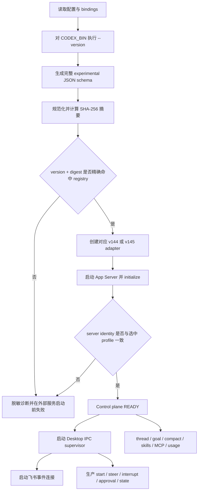

# feat: 升级 App Server 0.145 协议并支持多版本自动选择

## Summary

本计划分两阶段实施：第一阶段优先让 Bridge 现有 App Server 控制平面能力完整运行在 `codex-cli 0.145.0-alpha.18`；第二阶段保留已打标的 `0.144.3` 合同，通过启动时的版本、完整实验 schema 摘要和实际握手身份自动选择精确协议适配器。生产 turn 继续由 ChatGPT Desktop IPC 执行，App Server 升级不得改变现有任务、审批、卡片和重启放弃语义。

---

## Problem Frame

当前实现把 App Server 合同固化为单个 `0.144.3` schema 摘要，并且版本解析只接受稳定三段式版本。配置为 `0.145.0-alpha.18` 时，Bridge 会先因预发布版本格式或 schema 摘要变化而拒绝启动；如果只放宽正则或跳过摘要校验，又会把实验协议漂移静默带入会话管理、目标、compact、skills、MCP 和用量等现有能力。

App Server 官方仍将实验接口定义为按 Codex 版本生成 schema、且实验能力不承诺向后兼容。因此本次不能用宽松版本范围代替协议识别，也不能把 145 的新增字段扩散到 Desktop IPC 执行平面。

---

## Requirements

- R1. 第一里程碑必须使所有当前已用的 App Server 控制平面能力在 `codex-cli 0.145.0-alpha.18` 上可用，而不是只通过启动检查。
- R2. 生产任务的 start、steer、interrupt、状态流和审批继续由现有 ChatGPT Desktop IPC 路径负责；App Server 不重新成为生产 turn 执行器。
- R3. 第二里程碑必须继续支持精确的 `0.144.3` 合同，并在进程启动时自动选择 `0.144.3` 或 `0.145.0-alpha.18` 协议档案。
- R4. 协议选择必须同时校验配置 CLI 的版本输出、`--experimental` 完整 JSON schema 摘要和已启动 App Server 的 initialize 身份；只有注册表中的精确一致组合可进入 READY。
- R5. 版本解析必须正确支持 SemVer 预发布标识，同时拒绝非 Codex 输出、未知版本、未知摘要和版本/摘要交叉错配。
- R6. 145 适配范围必须覆盖当前实际调用矩阵：initialize、thread list/read/resume/start/fork/name/archive、goal get/set/clear、compact、skills、MCP status、rate limits，以及实验 UI sync validator 使用的 turn/notification 路径。
- R7. 升级不得要求清空 `.env`、`bindings.json` 或重新绑定；现有持久化格式和 binding 语义保持不变。
- R8. 协议只在启动时检测一次；不实现运行期热切换、自动下载/降级 CLI、跨进程恢复、旧任务回放或多 App Server 并存。
- R9. doctor、启动日志和错误输出必须报告已选协议档案、CLI 版本、schema 摘要和支持状态，同时不泄露凭证、完整环境或服务器内部路径。
- R10. 必须恢复有针对性的自动化测试，并以真实 `0.145.0-alpha.18` smoke 验证第一里程碑；第二里程碑还需完成 144/145 双版本选择与错配门禁验证。
- R11. 发布文档必须区分 Bridge tag、Codex CLI 版本、schema 摘要和协议档案 ID；完成双版本验收后，版本匹配 tag 才能作为支持声明。
- R12. Desktop IPC protocol v11、Desktop runtime attestation、内存任务/审批/卡片状态，以及 Bridge 重启后放弃旧任务的既有不变量不得因本次改动而放宽。

### Requirements Traceability

| Requirement | Implementation units | Release evidence |
|---|---|---|
| R1, R6 | U1, U3, U4, U5 | 145 控制平面测试矩阵与真实 smoke |
| R2, R12 | U3, U4, U5 | Desktop IPC 回归与生产装配检查 |
| R3–R5 | U2, U6 | 双档案选择、握手证言和 fail-closed 测试 |
| R7–R9 | U2, U4, U6 | doctor 输出、启动错误、原 binding 读取验证 |
| R10 | U1, U5, U6 | 自动化门禁与双版本验收记录 |
| R11 | U7 | 支持矩阵、运行手册和版本匹配 tag |

---

## Scope Boundaries

- 只支持两个精确协议档案：`0.144.3` 与 `0.145.0-alpha.18`。`0.145.0-alpha.19`、`alpha.20` 或其他 patch 即使结构相近，也必须先生成证据并显式注册。
- 不用 `^0.145`、`>=0.144` 或“同 minor 即兼容”等范围推断实验协议兼容性。
- 不把完整生成 schema 作为运行时领域模型，也不把 145 的所有新增实验字段暴露给 Bridge 业务层。
- 不重新启用旧 App Server turn/recovery/event reducer 生产路径；`ui-sync-validator` 保持实验验证工具身份。
- 不修改 Desktop 私有 IPC 的 discovery、framing、handshake、state v11 或审批合同。
- 不新增数据库、协议缓存、任务恢复、重放、跨进程幂等或运行期协议热切换。
- 不在 Bridge 内下载、安装、替换或自动降级 Codex CLI。
- 不把已有 `v0.144.3` tag 移动到新提交，也不把 tag 名当作运行时协议检测输入。
- 不将 App Server child 的常驻监督、崩溃重启和控制平面高可用扩展成本次主线；子进程启动或调用失败继续显式失败，不重放可能产生副作用的请求。

### Deferred to Follow-Up Work

- 新增其他 Codex 版本：每个版本单独采集 schema、审查已用方法差异、增加档案与回归证据。
- App Server child 运行期监督与安全重连：需要单独定义非幂等请求边界和 UI/命令失败语义。
- 将实验 UI sync validator 迁移到其他验证接口：等待生产控制平面升级稳定后另立计划。

---

## Context & Research

### Relevant Code and Patterns

- `src/app/codex/runtime-contract.ts`：当前通过配置 CLI 获取版本、生成实验 JSON schema 并计算规范化摘要，是启动探测的正确落点；现有稳定版正则和单摘要断言需要替换为档案解析。
- `src/app/codex/contract.ts`：当前只保存 `0.144.3` 摘要；应演进为不可变协议档案注册表，而不是增加第二个无上下文常量。
- `src/app/codex/app-server-client.ts`：负责 transport、initialize/initialized 和 RPC/notification 路由；握手身份必须与启动选中的档案一致，且预发布版本不能被现有稳定版解析拒绝。
- `src/app/codex/protocol.ts`：同时承载手工裁剪的 App Server wire 类型和 Desktop canonical 类型。实施时要保持 Desktop canonical 稳定，并把版本相关 wire 差异收口到独立适配层。
- `src/app/main.ts`：当前在外部服务启动前验证 runtime，之后创建 App Server client、Desktop supervisor 和飞书连接；检测与握手证言必须保持这个 fail-closed 顺序。
- `src/app/conversation-binding-service-v3.ts`、`src/app/command-service.ts`、`src/app/rate-limit-cache.ts`：当前 App Server 控制平面消费者，是 145 功能矩阵的真实边界。
- `src/app/ui-sync-validator.ts`：额外使用 thread resume、turn start 和通知，是实验能力的独立兼容面，不能误当生产任务路径。
- `src/app/doctor.ts`：已有 CLI 版本和 schema 摘要诊断，应增加档案 ID、支持状态和错配原因。
- `src/app/codex/desktop-ipc-client.ts`、`src/app/codex/desktop-thread-stream-normalizer.ts`、`src/app/in-memory-orchestrator.ts`：生产执行与状态不变量的回归边界，本次不改变协议。
- `package.json`：当前 `check` 只有 typecheck、build 和 package 检查；仓库已删除测试入口，需要恢复最小而关键的协议门禁测试。

### Validated Protocol Evidence

| Protocol profile | CLI identity | Full experimental schema digest | Status |
|---|---|---|---|
| `app-server-0.144.3` | `codex-cli 0.144.3` | `3b1af113954376a68d0d2382190f4bde6ca58c02a5c9a5cfebcd01f1747e79e7` | 已有 Bridge 基线，tag `v0.144.3` |
| `app-server-0.145.0-alpha.18` | `codex-cli 0.145.0-alpha.18` | `7a5aaea66a649faae713d43313289ddd79b4883086c10875f9031a56ec00bd5c` | 已从本机目标 binary 生成完整 experimental schema，待实现功能验收 |

摘要继续使用当前“文件相对路径 + 规范化 JSON 内容”的 SHA-256 算法。摘要是保守的完整协议身份：即使上游只新增未使用字段，也要求显式审查后再支持，避免实验协议静默漂移。

### 0.145 Upgrade Direction

上游 `0.144.3` 到 `0.145.0-alpha.18` 的 App Server schema 变化以新增可选字段和通知为主，包括 thread/turn 的 permissions、environment、runtime workspace roots、multi-agent 等参数，以及 rate limit 的 spend-control 状态。当前 Bridge 只需要保留现有字段语义并容忍已审查的新增字段；不得把尚未使用的新能力顺手接入业务。

本次 145 的关键升级不是“复制全部新 schema”，而是：

1. 接受预发布版本身份并精确验证 schema；
2. 为当前调用矩阵建立 145 wire 解析与 canonical 输出；
3. 用 initialize 返回的实际 server identity 证明启动的 daemon 就是所选档案；
4. 对每个现有功能执行正向、缺字段、额外字段和错误响应测试；
5. 保持 Desktop IPC 执行平面不变。

### External References

- OpenAI Codex App Server README：App Server 使用 JSON-RPC 风格协议，并要求 initialize/initialized 握手；每个 Codex 版本可以生成 TypeScript 或 JSON schema，实验接口需显式包含。
- OpenAI Codex 官方 releases：`0.145.0-alpha.18` 是预发布版本，不能按稳定 patch 版本解析。
- OpenAI Codex App Server 官方说明：实验 API 不提供向后兼容保证，因此本计划采用精确档案而非宽松范围。

---

## Key Technical Decisions

| Decision | Choice | Rationale |
|---|---|---|
| 交付顺序 | 先完成 145 单版本可用，再接回 144 自动选择 | 直接服务当前升级目标；避免在 145 wire 行为尚未稳定前先抽象一个未经验证的通用层 |
| 协议身份 | 精确 CLI version + 完整 experimental schema digest + initialize server identity | CLI 文件、生成 schema 的进程和实际 daemon 可能不是同一个实现，三者一致才可证明合同正确 |
| 兼容策略 | 注册表只列明确验证过的档案，不接受版本范围 | App Server 实验 API 不保证兼容；未知组合 fail closed 更符合当前安全边界 |
| 适配边界 | 版本相关 wire DTO/解析进入 v144/v145 adapter；业务层只使用窄控制平面接口和 canonical 类型 | 防止 145 新字段污染 Desktop canonical model，也便于后续按版本测试和删除 |
| schema 使用 | 启动时生成完整 schema并比摘要；仓库只保存档案清单和已用消息 fixture | 保留强身份校验，同时避免把庞大生成物变成手工维护的运行时代码 |
| 145 字段策略 | 已用字段严格解析，已审查的新增可选字段可忽略，缺少必需字段或类型错误立即失败 | 兼顾上游 additive change 与当前业务数据正确性；不默默制造默认值 |
| 握手绑定 | AppServerClient 必须接收选中的 profile，并核对 initialize identity | 修复 managed proxy 或 PATH/bundled binary 指向不同 daemon 时的假阳性 |
| 探测时机 | 配置与本地 binding 读取后、Desktop/飞书外部连接前，仅执行一次 | 保持当前启动顺序和可预测失败，不引入运行期热切换状态机 |
| 失败语义 | 未知/交叉错配/生成失败/握手错配均阻止 READY；诊断输出脱敏 | 不能让部分控制命令在错误协议上偶发工作 |
| 回归策略 | 恢复目标化 Node test harness，并把协议门禁纳入 `check` | 当前零测试无法证明多版本选择与既有 Desktop 不变量；恢复整个历史套件则超出本次范围 |
| 发布标识 | Bridge tag 与 App Server 支持版本同名，但运行时仍以 profile 证据为准 | 满足版本对齐的发布约定，同时避免把 Git tag 误作协议检测机制 |

---

## Alternative Approaches Considered

- 只把版本正则改为支持 `-alpha.18`：无法解决 schema 差异和 daemon 身份错配，可能在未知协议上继续运行。
- 只比较 CLI 版本：PATH、bundled binary 或 managed proxy 可能让探测进程与实际 App Server 不一致。
- 只比较 schema 摘要：能识别 wire 合同，但诊断不清晰，也不能证明实际 daemon 与生成 schema 的 binary 相同。
- 以 minor/patch 范围自动兼容：与实验 API 的兼容承诺不符，且后续 alpha 版本已经存在。
- 直接导入全部生成 TypeScript：生成面远大于 Bridge 实际使用面，会把上游无关实验字段传播到业务层并显著增加 review 面积。
- 保留一个通用 `Record<string, unknown>` parser：编译器无法约束必需字段，协议错误容易延迟到命令或卡片渲染阶段。
- 同时升级 Desktop IPC：会把两个独立高风险协议混在一个发布中，无法隔离回归来源。

---

## Open Questions

### Resolved During Planning

- 先做 145 还是先建设通用多版本框架：先完成 145 当前功能，再将同一精确适配边界扩展回 144。
- 兼容哪些版本：仅 `0.144.3` 和 `0.145.0-alpha.18` 两个精确合同。
- 如何识别协议：启动探测 version + full schema digest，启动 daemon 后再用 initialize identity 证言。
- 是否迁移现有配置或 binding：不迁移格式、不清空、不要求重新绑定。
- 是否让 App Server 接管生产 turn：不接管，继续采用 Desktop IPC owner runtime。
- tag 如何命名：支持版本里程碑继续使用 App Server 版本名；现有 `v0.144.3` 保持不动。

### Deferred to Implementation

- initialize identity 的原始 userAgent 是否在两种目标 binary 上完全一致：实施时用真实 145 和可获得的真实 144 binary 采样；适配层只依赖经 fixture 证明稳定的版本片段，不依赖构建路径等易变文本。
- 144 真实 binary 的验收来源：若本机不可用，需从已归档 release 获取经过校验的官方 binary；在拿到真实 smoke 证据前，不得把第二里程碑标记完成。
- 现有 UI sync validator 在 145 新通知并存时的事件过滤细节：以生成 schema和真实 notification fixture 为准，只消费当前已知 turn/item 生命周期。

---

## Output Structure

    src/app/codex/
      app-server-protocol-registry.ts
      app-server-protocol-adapter.ts
      app-server-protocol-v144.ts
      app-server-protocol-v145.ts
      app-server-control-plane.ts
      app-server-client.ts
      runtime-contract.ts
      protocol.ts
    scripts/
      capture-app-server-contract.mjs
    test/
      app/
        runtime-contract.test.ts
        app-server-client.test.ts
        app-server-control-plane.test.ts
        doctor.test.ts
        ui-sync-validator.test.ts
        desktop-ipc-regression.test.ts
      fixtures/app-server/
        0.144.3/
        0.145.0-alpha.18/
    tsconfig.test.json

该结构是范围声明而非强制文件数量。实施时可以合并过小文件，但必须保留“档案注册、版本 wire 适配、窄控制平面、Desktop canonical”四个职责边界。

---

## High-Level Technical Design

> *以下图示用于约束边界和评审方向，不是需要逐字复现的实现代码。*

控制平面调用的方向性合同：

1. command/binding/rate-limit 服务只调用 `AppServerControlPlane` 的已用操作，不直接解析任意 JSON；
2. control plane 将 canonical request 交给选中版本 adapter；
3. adapter 生成版本 wire request，并把 response/notification 解析成当前业务所需的 canonical shape；
4. transport client 只负责 framed JSONL、request ID、握手、路由和 lifecycle；
5. Desktop IPC 的 canonical 事件和 in-memory orchestrator 不依赖 App Server profile。

---

## Phased Delivery

### Phase 1 — `0.145.0-alpha.18` 当前功能可用

- U1 恢复协议证据和目标化测试门禁。
- U2 建立精确档案身份、预发布解析和启动探测结果。
- U3 实现 145 窄 wire adapter 与完整现有控制平面矩阵。
- U4 把选中档案贯穿 startup、handshake、doctor 和 validator。
- U5 完成 145 自动化回归、真实 App Server smoke 和 Desktop 不变量验收。

Phase 1 完成后，可以在只注册 145 档案的情况下交付当前升级成果；不得为了等待双版本框架而推迟 145 的真实可用验证。

### Phase 2 — `0.144.3` / `0.145.0-alpha.18` 自动选择

- U6 加入 144 档案与 adapter，执行双版本、交叉错配和配置保持回归。
- U7 更新支持矩阵、运维手册、发布证据，并在验收后创建版本匹配 tag。

---

## Implementation Units

### U1. 恢复协议证据与目标化测试门禁

**Goal:** 为 145 升级和后续双版本选择建立可重复、可审计的 schema/fixture 证据与自动化测试入口。

**Requirements:** R1, R6, R10, R12

**Dependencies:** None

**Files:**

- Create: `scripts/capture-app-server-contract.mjs`
- Modify: `scripts/clean-app-build.mjs`
- Create: `tsconfig.test.json`
- Create: `test/fixtures/app-server/0.145.0-alpha.18/manifest.json`
- Create: `test/fixtures/app-server/0.145.0-alpha.18/*.json`
- Create: `test/app/runtime-contract.test.ts`
- Modify: `package.json`

**Approach:**

- 复用 `runtime-contract.ts` 的 schema 规范化算法，提供只读采集脚本：记录 CLI identity、完整摘要、生成时间和当前已用方法的代表性 request/response/notification fixture。
- fixture 只保存控制平面实际消费的最小消息和 manifest，不提交整个巨大生成目录；manifest 必须允许 reviewer 追溯到完整摘要。
- 恢复最小 Node test 编译/执行入口，并把协议测试纳入 `check`；不恢复与本次范围无关的历史测试。
- test 编译前显式清理 `dist-test`，避免已删除或改名的编译产物在后续运行中继续被执行。
- 先以当前 145 binary 捕获证据，再写实现，避免根据手工记忆推断 alpha 协议。

**Execution note:** Characterization-first；fixture 与失败样本先于 adapter 实现落地。

**Patterns to follow:**

- `src/app/codex/runtime-contract.ts` 的 canonical JSON digest。
- Git 历史中曾使用的 `tsconfig.test.json` 与 Node test runner 结构，但仅恢复必要部分。

**Test scenarios:**

- Happy path：相同 schema 文件内容、不同 JSON key 顺序 -> 摘要完全一致。
- Edge case：schema 文件集合、相对路径或字段内容变化 -> 摘要变化。
- Error path：CLI 执行失败、schema 输出缺失、JSON 非法或超时 -> 采集/探测明确失败且清理临时目录。
- Integration：145 manifest 摘要与目标 binary 实时生成摘要一致。

**Verification:**

- `check` 会执行目标化协议测试；fixture 能复现 `0.145.0-alpha.18` 的已用消息合同和完整摘要。

---

### U2. 建立精确协议档案注册与启动探测

**Goal:** 将单版本常量演进为可证明、可诊断的协议档案选择器，并安全支持预发布版本。

**Requirements:** R3, R4, R5, R8, R9

**Dependencies:** U1

**Files:**

- Create: `src/app/codex/app-server-protocol-registry.ts`
- Create: `src/app/codex/app-server-protocol-adapter.ts`
- Modify: `src/app/codex/contract.ts`
- Modify: `src/app/codex/runtime-contract.ts`
- Test: `test/app/runtime-contract.test.ts`

**Approach:**

- 定义不可变 profile：稳定 ID、精确 Codex CLI 版本、完整 schema digest、adapter factory 和诊断标签。
- 使用受约束的 Codex version parser 接受标准三段版本及合法 prerelease/build 元数据；匹配仍以注册表的精确规范化版本字符串为准。
- 探测返回选中的完整 profile，而不只返回 version/digest 字符串；下游不得再次猜测 adapter。
- 对“已知版本 + 未知摘要”“未知版本 + 已知摘要”“144 版本 + 145 摘要”等情况生成区分清晰但脱敏的错误。
- Phase 1 首先只启用 145 profile；profile 模型从一开始允许 U6 无分支地补入 144。

**Patterns to follow:**

- `src/app/codex/runtime-contract.ts` 的 fail-closed preflight 与临时目录清理。
- `src/app/domain.ts` 的只读配置/领域对象风格。

**Test scenarios:**

- Happy path：`codex-cli 0.145.0-alpha.18` + 145 digest -> 选择唯一 145 profile。
- Edge case：合法 prerelease/build 格式可以解析，但未注册版本仍拒绝。
- Error path：稳定版正则可接受的未知版本、非法 user output、空输出、未知摘要、144/145 交叉组合 -> 均阻止选择。
- Error path：schema generation 超时或输出超限 -> 安全失败并不留下临时目录。

**Verification:**

- 每一个可启动的 version/digest 组合都能映射到唯一 profile；注册表之外没有隐式 fallback。

---

### U3. 实现 145 窄协议适配与控制平面

**Goal:** 让所有现有 App Server 控制能力在 145 上具备显式、可测试的 wire-to-canonical 合同。

**Requirements:** R1, R2, R6, R12

**Dependencies:** U1, U2

**Files:**

- Create: `src/app/codex/app-server-protocol-v145.ts`
- Create: `src/app/codex/app-server-control-plane.ts`
- Modify: `src/app/codex/protocol.ts`
- Modify: `src/app/conversation-binding-service-v3.ts`
- Modify: `src/app/command-service.ts`
- Modify: `src/app/rate-limit-cache.ts`
- Create: `test/app/app-server-control-plane.test.ts`
- Create: `test/app/conversation-binding-service-v3.test.ts`
- Create: `test/app/command-service.test.ts`

**Approach:**

- 为 R6 方法矩阵建立窄 control-plane operation；业务服务不再通过通用 raw request 自己断言字段。
- 145 adapter 只定义已用字段，将新增的可选 permissions/environment/runtime roots/multi-agent 等视为不透明扩展；除非当前功能需要，不透传也不保存。
- 对 thread、goal、skills、MCP 和 rate-limit response 执行边界解析：必需字段缺失、类型错误或错误 envelope 直接产生稳定内部错误；额外字段可忽略。
- 将 App Server 返回的 error message、error data、stderr 和 userAgent 一律视为不可信输入：对外只暴露稳定内部错误码，丢弃 `rpcError.data`，对有界调试字段清除控制字符并脱敏 token、环境片段和本机路径。
- `RateLimitSnapshot.spendControlReached` 等新增字段只有在现有用户可见合同明确需要时才进入 canonical 类型，否则保持向后兼容的忽略策略。
- 将 App Server wire 类型从 Desktop canonical 类型旁边逐步抽离；不得改动 Desktop normalizer 的输入/输出合同。

**Execution note:** 按“fixture -> failing parser test -> adapter -> service integration”顺序逐项完成方法矩阵。

**Patterns to follow:**

- `src/app/codex/app-server-client.ts` 的 RPC transport 和 error routing。
- `src/app/conversation-binding-service-v3.ts`、`src/app/command-service.ts` 当前用户可见语义。
- `src/app/codex/desktop-thread-stream-normalizer.ts` 的边界归一化思想，但不共享版本 wire DTO。

**Test scenarios:**

- Happy path：R6 中每个 method 的 145 fixture -> canonical 结果与当前 144 用户语义一致。
- Edge case：145 response 增加未知可选字段 -> 当前功能仍成功且未知字段不进入领域对象。
- Error path：必需字段缺失、错误类型、RPC error、重复/未知 response ID -> 返回稳定失败，不产生部分 binding 或缓存更新。
- Security：RPC error、stderr 或 identity 中包含 token、本机路径、多行控制文本和超大 data -> doctor、Bridge 日志和飞书响应均不泄露原始内容。
- Integration：list/read/resume/start/fork/name/archive、goal、compact、skills、MCP 和 rate limits 经 control plane 调用到 fake transport，method、参数和结果全部匹配 fixture。
- Regression：Desktop start/steer/interrupt 不经过 `AppServerControlPlane`。

**Verification:**

- 145 adapter、canonical control plane 和各消费者接口已就绪；生产装配切换由 U4 完成，生产 turn owner 始终是 Desktop IPC。

---

### U4. 贯通 145 profile、握手证言和诊断

**Goal:** 把启动选中的 profile 绑定到实际 App Server client，并让 doctor、主进程和实验 validator 使用同一选择结果。

**Requirements:** R1, R4, R5, R8, R9

**Dependencies:** U2, U3

**Files:**

- Modify: `src/app/codex/app-server-client.ts`
- Modify: `src/app/main.ts`
- Modify: `src/app/doctor.ts`
- Modify: `src/app/ui-sync-validator.ts`
- Create: `test/app/app-server-client.test.ts`
- Create: `test/app/doctor.test.ts`
- Create: `test/app/ui-sync-validator.test.ts`

**Approach:**

- `main.ts` 只执行一次 runtime detection，并把不可变 selected profile 注入 AppServerClient、control plane、doctor 报告上下文和 validator。
- AppServerClient 初始化时核对 server userAgent/identity 与 profile 允许的精确 identity；验证失败时发送不了业务 RPC，也不启动 Desktop/飞书连接。
- 预发布版本解析逻辑集中复用，不在 runtime-contract 和 client 内各维护一套正则。
- doctor 在成功时输出 profile ID/version/digest/mode，在失败时输出预期与实际的脱敏差异；不输出 token、env、完整 cwd 或命令行参数。
- transport 层不得把原始 RPC error data 或无界 stderr 传播到通用 Error、日志、doctor 或飞书卡片；所有协议失败统一映射为稳定、可关联但不含服务端原文的内部诊断。
- validator 通过同一 control-plane/adapter 接口消费 145 turn 通知，只允许实验命令显式启动，不能影响生产装配。

**Patterns to follow:**

- `src/app/main.ts` 现有 preflight-before-external-services 启动顺序。
- `src/app/doctor.ts` 的结构化诊断输出。

**Test scenarios:**

- Happy path：145 version/digest + 145 initialize identity -> client READY，随后才允许业务请求。
- Error path：探测使用 145 binary、实际 daemon 报 144/未知 identity -> 握手失败并关闭 child/transport。
- Error path：initialize 成功但 initialized 未完成、child 提前退出、非法 handshake response -> 不进入 READY。
- Integration：main 装配把同一个 profile 实例传给 client/control plane；doctor 和 validator 报告相同 profile ID。
- Regression：协议失败发生在 Desktop supervisor 和飞书 websocket 启动前，现有 bindings 文件不被改写。

**Verification:**

- 日志和 doctor 能说明“选中了哪个合同、为什么支持或拒绝”；配置 binary 与实际 daemon 不一致时无法假启动。

---

### U5. 完成 145 功能回归与真实验收

**Goal:** 证明第一里程碑是“145 上当前功能可用”，而不只是 schema 检查通过。

**Requirements:** R1, R2, R6, R10, R12

**Dependencies:** U3, U4

**Files:**

- Create: `test/app/desktop-ipc-regression.test.ts`
- Modify: `test/app/app-server-control-plane.test.ts`
- Modify: `test/app/ui-sync-validator.test.ts`
- Modify: `README.md`

**Approach:**

- 自动化覆盖完整控制平面方法矩阵、错误路径、额外字段容忍和 handshake attestation。
- 补一组最小 Desktop 回归：start/steer/interrupt/approval/state 仍指向 Desktop client；in-memory orchestrator 的任务、队列和重启放弃语义未变化。
- 用本机官方 `0.145.0-alpha.18` binary 执行真实 doctor、initialize、thread list/read，以及只读的 goal/skills/MCP/rate-limit 验证；mutating thread/goal/compact 场景在专用测试 thread 上执行并记录结果。
- 执行一轮飞书到 ChatGPT Desktop 的现有 E2E，证明 App Server 升级没有改变生产 turn owner、ChatGPT UI 和飞书卡片结果。
- 第一里程碑报告明确列出尚未启用 144 自动选择，避免提前宣称多版本完成。

**Patterns to follow:**

- `docs/plans/2026-07-14-001-feat-feishu-chatgpt-desktop-ipc-bridge-plan.md` 的双平面验收和真实 UI 证据要求。
- `README.md` 当前 doctor 与运行说明。

**Test scenarios:**

- Integration：真实 145 server 完成 initialize/initialized 与全部可安全执行的控制平面调用，结果可被现有服务消费。
- Integration：专用 thread 完成 start/fork/name/archive、goal set/get/clear 和 compact；操作对象和结果均可追溯，不污染用户现有 binding。
- End-to-end：飞书消息 -> Desktop owner turn -> ChatGPT UI 与飞书卡同结果；App Server 仅参与控制/统计。
- Error path：启动探测或握手阶段 App Server 不可用，或 145 schema/identity 不匹配 -> Bridge 不连接飞书、不接受新任务。
- Error path：进入 READY 后 App Server child 退出 -> 仅依赖 App Server 的控制命令显式失败；不重放、不 fallback、不在本计划内新增监督，并保持既定 Desktop turn 语义。
- Regression：Bridge 重启后旧任务不恢复、不补发，binding 仍可读取；Desktop IPC protocol v11 gate 未变化。

**Verification:**

- 145 功能矩阵、自动化 `check`、真实 App Server smoke 和双端 E2E 全部通过后，Phase 1 才可标记完成。

**Current evidence (2026-07-18):**

- 使用显式 `CODEX_144_BIN` 与 `CODEX_145_BIN` 完成双版本真实 daemon 门禁，协议测试 47/47、0 skipped；
  完整 `npm run check` 与 `git diff --check` 通过。
- 两版均在临时 `CODEX_HOME` 和 workspace 上验证 thread list/start/name/read/resume/fork/archive、goal
  set/get/clear、skills 与 MCP status，不访问用户现有 binding。
- 隔离未认证环境中的 `account/rateLimits/read` 对两版均返回稳定 `REQUEST_FAILED`，作为能力不可用边界记录，
  不视为协议代码失败。
- `thread/compact/start` 因会触发模型操作未纳入自动 smoke；真实飞书到 Desktop E2E 也尚未执行。两项都需要
  已授权的专用测试账号/线程，因此本计划继续保持 `active`，不得据此宣称发布验收完成。

---

### U6. 接回 144 档案并完成双版本自动选择

**Goal:** 在不削弱 145 精确校验的前提下，使同一 Bridge 启动时自动选择已验证的 144 或 145 adapter。

**Requirements:** R3, R4, R5, R7, R8, R10, R12

**Dependencies:** U4, U5

**Files:**

- Create: `src/app/codex/app-server-protocol-v144.ts`
- Create: `test/fixtures/app-server/0.144.3/manifest.json`
- Create: `test/fixtures/app-server/0.144.3/*.json`
- Modify: `src/app/codex/app-server-protocol-registry.ts`
- Modify: `src/app/codex/app-server-control-plane.ts`
- Modify: `test/app/runtime-contract.test.ts`
- Modify: `test/app/app-server-control-plane.test.ts`
- Modify: `test/app/app-server-client.test.ts`

**Approach:**

- 从已标记的 144 基线和真实 `0.144.3` binary 捕获对应 fixture，禁止用 145 fixture 反推 144。
- 实现 v144 wire adapter，使其输出与 v145 相同的窄 canonical control-plane 结果；版本差异只存在于 adapter 内。
- 将两个 profile 同时注册，startup detection 精确选择 adapter；下游业务服务不出现版本分支。
- 执行 2×2 交叉矩阵：144 version/digest/handshake 只配 144 adapter，145 只配 145；交叉或未知组合全部失败。
- 用同一份 `.env` 和 `bindings.json` 分别启动 144/145，验证无需清理、迁移或重新绑定；运行时只存在一个已选 server/profile。

**Execution note:** 先锁定真实 144 fixture，再启用第二个 registry entry；没有真实 binary smoke 时不发布双版本声明。

**Patterns to follow:**

- U3 的 v145 adapter 边界和 control-plane canonical contract。
- `v0.144.3` tag 下的现有方法语义与 schema digest。

**Test scenarios:**

- Happy path：144 version/digest/identity -> v144；145 version/digest/identity -> v145。
- Edge case：两版都有相同 canonical 字段但不同额外字段 -> 业务服务得到同一语义。
- Error path：144 version + 145 digest、145 version + 144 digest、匹配 digest + 错误 daemon identity、未注册 alpha -> 均 fail closed。
- Integration：同一 binding 分别在 144 和 145 下完成 list/read/goal/skills/MCP/usage，不发生格式迁移。
- Regression：切换仅发生于进程重启后的启动探测；运行中替换 binary 不触发热切换或请求重放。

**Verification:**

- 两个真实版本各自通过方法矩阵与 startup smoke，所有交叉组合均被拒绝，业务层没有按版本分支。

---

### U7. 固化支持矩阵、发布与运维合同

**Goal:** 让支持范围、诊断、升级/回滚和 tag 约定可被用户与维护者独立验证。

**Requirements:** R9, R10, R11

**Dependencies:** U5, U6

**Files:**

- Modify: `README.md`
- Create: `docs/app-server-support-matrix.md`
- Create: `docs/app-server-upgrade-runbook.md`
- Modify: `.env.example`
- Modify: `package.json`

**Approach:**

- 支持矩阵列出 profile ID、精确 CLI version、schema digest、验证日期、功能矩阵状态和对应 Bridge release/tag。
- runbook 描述升级前 doctor、停止 Bridge、替换 `CODEX_BIN`、启动检测、功能 smoke 和回滚到旧 binary 的步骤；强调无需清理 binding，且运行任务在重启时放弃。
- README 解释双平面架构和“App Server 控制平面多版本、Desktop IPC 独立精确钉住”的差异，避免用户把 145 支持理解为 Desktop 协议升级。
- Phase 1 只发布“145 可用”证据；Phase 2 双版本全部通过后，才创建/推送与目标 App Server 版本一致的新 tag。tag 操作独立于实现 commit，并在执行前复核指向。

**Patterns to follow:**

- `README.md` 当前安装、doctor、运行和协议说明。
- 已创建的 `v0.144.3` annotated tag 作为不可移动基线。

**Test scenarios:**

- Documentation：支持矩阵中的 version/digest/profile 与 registry 和 fixture manifest 一致。
- Operational：按 runbook 从 144 切到 145、再回滚到 144，binding 保留，启动都选择预期 profile。
- Error path：将 binary 替换为未支持版本 -> doctor 给出可行动错误，run 命令不连接飞书。
- Release：候选 tag 指向通过双版本门禁的提交，tag 名、release notes 和矩阵中的支持版本一致。

**Verification:**

- 新维护者只依赖 doctor、支持矩阵和 runbook 即可判断当前 binary 是否受支持、如何升级以及如何安全回滚。

---

## System-Wide Impact

- **Interaction graph:** `main.ts` 的启动探测产生唯一 selected profile，向 AppServerClient 与 control plane 注入；binding/command/rate-limit/validator 通过 control plane 消费；Desktop supervisor 与飞书连接只在 App Server 合同证明成功后启动。
- **Error propagation:** 探测和握手错误属于启动阻塞；业务 RPC/schema parsing 错误通过当前命令错误边界返回，不伪装为空结果；App Server 失败不得触发 Desktop turn 重试或 App Server turn fallback。
- **State lifecycle risks:** schema 临时目录始终清理；profile 仅在内存中且不可变；`.env`、`bindings.json`、任务、队列、审批和卡片状态均不做格式迁移。运行中 binary 变化直到下次启动才生效。
- **API surface parity:** command service、binding service、rate-limit cache 与 UI sync validator 都必须走相同 profile/control-plane；doctor 读取同一 registry，不能维护第二份支持列表。
- **Integration coverage:** fake transport 能证明 wire 解析，但不能证明配置 binary、实际 daemon 和 Desktop/Feishu 的组合；必须有真实 145 smoke、真实 144 smoke 和现有双端 E2E。
- **Unchanged invariants:** Desktop IPC v11 继续精确钉住；生产 turn、审批和状态事实源仍为 Desktop owner runtime；Bridge 无任务数据库、重启不恢复；现有 binding 文件与用户命令语义不变。
- **Security boundary:** 所有 CLI 调用继续使用参数数组且禁用 shell；错误输出脱敏；adapter 只接受已知字段类型，不把 server 返回值直接用于路径、命令或 SQL。
- **Performance:** schema generation 仅在启动/doctor 执行一次，接受额外启动时延以换取协议证明；不在每个 RPC 或飞书事件上重新计算摘要。

---

## Success Metrics

- 使用官方 `codex-cli 0.145.0-alpha.18` 启动时，doctor 识别 `app-server-0.145.0-alpha.18`，所有 R6 控制平面功能与现有双端 E2E 通过。
- 使用官方 `codex-cli 0.144.3` 启动时，doctor 识别 `app-server-0.144.3`，相同控制平面语义和 binding 数据通过。
- 144/145 交叉错配、未知 alpha、未知摘要和 daemon identity 错配 100% 在 READY 前失败。
- 所有目标化协议、control-plane、handshake、doctor 和 Desktop invariant 测试进入 `npm run check`，不存在仅靠手工 smoke 才能发现的已知门禁。
- 升级与回滚不清空 `.env`/`bindings.json`，也不产生任务恢复、重复 turn 或 App Server fallback。
- 支持矩阵中每个“支持”条目都有 exact version、digest、profile、fixture 和真实 smoke 证据。

---

## Risk Analysis & Mitigation

| Risk | Likelihood | Impact | Mitigation |
|---|---|---|---|
| alpha 版本快速漂移，后续 alpha 看似相近但 schema 已变 | High | High | 只注册 exact version + digest；新增版本必须独立证据和回归 |
| 完整摘要因未用字段新增而变化，造成保守拒绝 | High | Medium | 明确接受这一安全权衡；采集脚本与支持矩阵降低审查成本，不做自动放宽 |
| 配置 binary 与 managed proxy/实际 daemon 不是同一版本 | Medium | High | initialize identity 二次证言，错配时关闭 transport 并阻止 READY |
| `protocol.ts` 同时含 App Server 与 Desktop 类型，145 改动污染执行平面 | Medium | High | 独立 version adapter 和 control plane；Desktop regression tests 固化 owner 与 v11 不变量 |
| 当前仓库零测试，协议回归只能运行时发现 | High | High | U1 先恢复目标化 test harness，feature-bearing unit 必须先有 fixture/失败测试 |
| raw JSON 宽松解析把缺字段变成 undefined/默认值 | Medium | High | wire boundary 严格验证必需字段；错误不写 binding/cache，不伪造空结果 |
| 真实 144 binary 暂不可用，第二阶段只有 mock 证据 | Medium | High | 将真实 144 smoke 设为 release blocker；未满足时仅宣布 Phase 1 的 145 支持 |
| UI sync validator 的 App Server turn 路径被误接入生产 | Low | High | 保持独立 CLI/实验装配；production main 不注册其 turn notification flow |
| 文档/tag 被误解为 runtime detection 依据 | Medium | Medium | doctor 与 registry 以版本/摘要/握手为事实源，tag 只表示发布支持声明 |
| App Server 运行期退出导致部分控制命令失败 | Medium | Medium | 维持显式失败且不重放；监督/重连另立计划，避免本次引入副作用恢复 |

---

## Dependencies / Prerequisites

- 官方 `codex-cli 0.145.0-alpha.18` binary，用于 schema capture、handshake 和真实 smoke。
- 可验证来源的官方 `codex-cli 0.144.3` binary，用于第二阶段真实双版本门禁。
- 专用测试 thread/account，允许验证 fork/name/archive/goal/compact 而不影响用户生产 binding。
- ChatGPT Desktop 当前验证 build 与飞书测试 chat，用于证明 Desktop IPC 执行平面没有回归。
- 当前 `v0.144.3` annotated tag 保持不可移动；发布新 tag 前人工复核 commit 与门禁结果。

---

## Documentation / Operational Notes

- `README.md` 首屏继续强调 App Server 是控制平面、Desktop IPC 是生产执行平面。
- `docs/app-server-support-matrix.md` 是人类可读支持声明；registry 和 fixture manifest 是代码事实源，文档检查必须防止漂移。
- `docs/app-server-upgrade-runbook.md` 说明启动检测可能增加一次 schema generation 时间，这是预期行为，不应通过关闭校验优化。
- 日志建议使用稳定事件名区分 `protocol_detected`、`protocol_rejected`、`server_identity_mismatch` 和 `control_plane_ready`，但不得记录 schema 全文或敏感环境。
- 回滚只需要停止 Bridge、恢复受支持的 Codex binary 路径并重启；不修改 binding。重启期间的旧运行任务按既有合同放弃。
- `0.145.0-alpha.18` 之后的版本必须遵循同一“capture -> diff used surface -> adapter/profile -> automated matrix -> real smoke -> support matrix”流程。

---

## Sources & References

- Builds on: `docs/plans/2026-07-14-001-feat-feishu-chatgpt-desktop-ipc-bridge-plan.md`
- Superseded App Server-only design（仅作历史参考）: `docs/plans/2026-07-13-001-feat-feishu-chatgpt-app-server-bridge-plan.md`
- Runtime gate: `src/app/codex/runtime-contract.ts`
- Current single digest: `src/app/codex/contract.ts`
- Transport and handshake: `src/app/codex/app-server-client.ts`
- Current control-plane consumers: `src/app/conversation-binding-service-v3.ts`, `src/app/command-service.ts`, `src/app/rate-limit-cache.ts`, `src/app/ui-sync-validator.ts`
- Production execution boundary: `src/app/codex/desktop-ipc-client.ts`, `src/app/codex/desktop-thread-stream-normalizer.ts`, `src/app/in-memory-orchestrator.ts`
- OpenAI Codex App Server README: https://github.com/openai/codex/blob/main/codex-rs/app-server/README.md
- OpenAI Codex releases: https://github.com/openai/codex/releases
