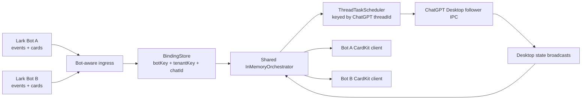
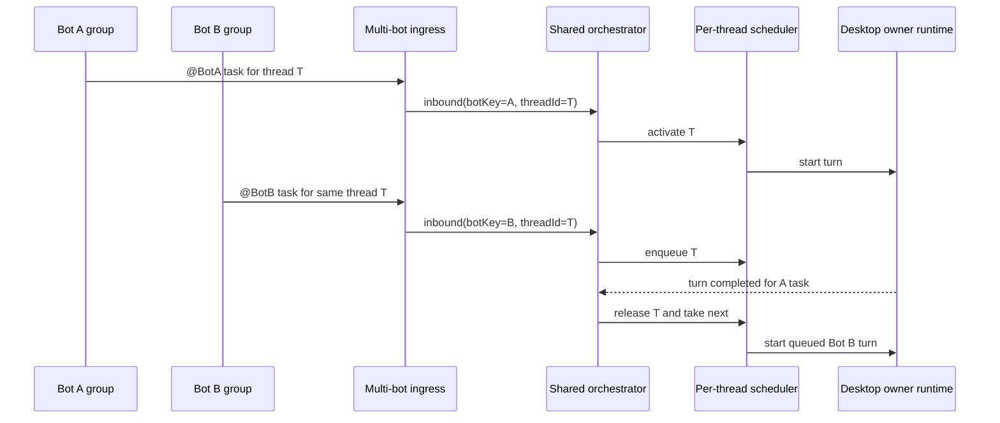

# feat: Support multiple Lark bots with shared Desktop execution

## Summary

Introduce first-class multi-bot support in one Bridge process: multiple Lark application bots can receive events, own their own chat permissions and CardKit delivery, and bind their chats to either different ChatGPT threads or the same thread. All bots share one Desktop execution plane and one per-thread scheduler, so a ChatGPT thread still has exactly one active writable turn at a time.

---

## Problem Frame

The current Bridge is built around one Lark app credential pair and one event server. That is enough for one robot, but it cannot safely support several robots with separate visibility, permission, and delivery identities. Running multiple Bridge processes would split the per-thread lock and would allow two robots to start overlapping turns against the same ChatGPT Desktop thread.

---

## Requirements

- R1. One Bridge process must support multiple Lark application bots, each with independent credentials, bot identity, tenant scope, chat allowlist, user allowlist, approver allowlist, and WebSocket lifecycle.
- R2. A chat binding must be scoped by bot identity, tenant, and chat, so two robots can bind the same `chatId` differently without overwriting each other.
- R3. Different bots may bind to the same ChatGPT thread, but that thread must still allow only one active writable Desktop turn at a time.
- R4. Queued work for the same ChatGPT thread must be FIFO across all bots, not just within one bot or one chat.
- R5. Card creation, card updates, acknowledgement, image download, output-file upload, and approval replies must use the originating bot's Lark credentials.
- R6. Card actions must be routed by bot identity and validated against bot, tenant, chat, message, binding revision, operator, and token scope.
- R7. Desktop-originated turns on a thread with multiple bot/chat bindings must not be auto-projected to all bots; fan-out is unsafe without an explicit originating Bridge task.
- R8. Existing single-bot configuration must continue to work, with a deterministic migration path to the multi-bot config model.
- R9. Runtime health, doctor output, logs, and setup/reset flows must report bot-level status without recording prompt, answer, reasoning, approval payloads, or CardKit payloads.
- R10. Group chat support must stay fail-closed: a bot only handles events for configured or explicitly authorized chats, and group messages are accepted only when the event is for an allowed bot mention unless a future explicit all-group-message mode is added.
- R11. Group chats have two lanes: owner-only management for the current group, and ordinary `@current bot` task messages after binding. Non-owner users and bot senders must never execute group management commands such as bind, unbind, model, CWD, access, setup, or diagnostics.
- R12. Desktop approval decisions must be admin-only. A group member may start a task when the binding policy allows it, but only the bot's owner/admin approval set can decide approvals.
- R13. Any group binding or configuration action must target a concrete group identity. In-group management targets the current event's `botKey + tenantKey + chatId`; private-chat management targets an explicit discovered group selected by that same identity. Group names are display-only and cannot be the binding key.
- R14. Multi-bot QR registration must create or replace exactly one bot record. A QR scan registers one Lark app credential set, fetches the robot identity/name, generates an internal `botKey`, and must not overwrite other bots, claim ownership, or bind any group to a ChatGPT thread.
- R15. Management must support explicit unbind, group removal, bot disable, and bot removal flows. These operations must be scoped, confirmed, and must not delete ChatGPT threads or replay/abort unrelated tasks silently.
- R16. Bot availability must be explicit but fail-closed. Unknown or removed bots remain silent because Bridge has no trusted local runtime for them. A locally configured but disabled bot may keep a reply-only event path; when it is `@mentioned` or a stale card action is clicked, Bridge must return the disabled reason and must not accept tasks, commands, approvals, binding changes, or card-side effects.
- R17. Existing single-bot installs must upgrade in place. A previously scanned robot and existing `bindings.json` v1 records must continue to work as the reserved `default` bot without requiring QR re-registration or chat re-binding.

---

## Scope Boundaries

- No multi-process official design for multiple robots. Multiple Bridge processes cannot share the in-memory per-thread scheduler and are not acceptable for same-thread concurrency control.
- No database-backed task recovery. Active tasks, queues, approvals, card sequences, and dedupe remain current-process memory only.
- No automatic broadcast of Desktop-originated turns to all robots bound to a thread.
- No sensitive `im:message.group_msg` dependency for group chat MVP. The preferred permission remains group `@bot` message events.
- No cross-host or remote Desktop owner runtime support.
- No change to ChatGPT Desktop execution semantics: all turns still go through the verified Desktop follower IPC path.

### Deferred to Follow-Up Work

- Administrative UI for managing bots and bot/chat bindings.
- Explicit fan-out rules for Desktop-originated turns, if a product owner later defines them.
- Per-bot rate-limit dashboards beyond content-free runtime health counters.
- Distributed locking for multiple Bridge instances.

---

## Context & Research

### Relevant Code and Patterns

- `src/app/config.ts` currently parses one `LARK_APP_ID` and `LARK_APP_SECRET` into `BridgeConfig`.
- `src/app/main.ts` constructs one Lark API client, one WebSocket client, one `LarkEventServer`, one `CardKitClient`, one `LarkMessageAcknowledgement`, one `InboundImageStore`, and one `OutputFileUploader`.
- `src/app/lark/event-server.ts` owns Lark event normalization and first-private-message scope bootstrap.
- `src/app/lark/intake.ts` normalizes incoming messages and already carries tenant, chat, sender, message, root, image, and mention fields.
- `src/app/binding-store.ts` persists `bindings.json`; the current binding key is `tenantKey + chatId`.
- `src/app/in-memory-orchestrator.ts` already shares task state in memory and uses a `ThreadTaskScheduler` keyed by `threadId`.
- `src/app/task-scheduler.ts` already enforces per-thread active ownership and bounded FIFO queues.
- `src/app/desktop-approval-service.ts` routes approvals through the current active task context.
- `src/app/runtime-health.ts` publishes content-free runtime status and task counters.

### Institutional Learnings

- The Bridge production path is App Server control plane plus ChatGPT Desktop IPC execution plane; live task state must come from Desktop owner runtime events.
- Desktop visible refresh and Bridge/Feishu projection are separate validation targets.
- Avoid treating "App Server can run a task" or "multiple processes can start" as proof that Feishu/Desktop UI synchronization and same-thread safety are correct.

### External References

- Feishu message docs: `im.message.receive_v1` supports single-chat messages, group `@bot` messages, and all group messages depending on app scopes.
- Feishu FAQ: application bots can receive and respond to user messages; custom webhook bots cannot respond to user `@bot` messages.

---

## Key Technical Decisions

- Use a single Bridge runtime with multiple Lark bot ingress adapters and one shared execution/orchestrator layer. This preserves per-thread serialization.
- Introduce stable `botKey` as the internal identity for each robot. `botKey` is not a secret; it is the routing key used in binding, card action, health, logs, and idempotency scopes.
- Store multi-bot credentials in `lark-bots.json` under the Bridge config home. Legacy `.env` `LARK_APP_ID` and `LARK_APP_SECRET` remain the backward-compatible source for the default bot.
- Reserve `botKey = "default"` for legacy single-bot compatibility. `bot add` must never generate this key.
- Keep Lark API clients per bot. Lark credentials, tenant tokens, CardKit message updates, reactions, and resource downloads cannot be shared across bots.
- Keep Desktop/App Server control clients shared. ChatGPT threads belong to the local Desktop runtime, not to a Lark bot.
- Upgrade binding identity to `botKey + tenantKey + chatId`. A binding points to one ChatGPT thread and stores static execution settings for that bot/chat pair.
- Keep thread concurrency keyed only by ChatGPT `threadId`. If bot A and bot B both bind to the same thread, their tasks queue behind one active turn.
- Route task cards and approvals by originating task context, not by reverse lookup from thread alone.
- Preserve `getUniqueByThreadId` fail-closed behavior for Desktop-originated events when more than one binding points at a thread.
- Make target-group management first-class in group chat. When the owner sends `@current bot /bind`, `/unbind`, `/model`, `/cwd`, or access commands in a group, the target is the current `botKey + tenantKey + chatId`.
- Keep private chat as an optional management console for the same operations. Private management must require an explicit group selection from discovered or bound groups before mutating any group binding.
- Treat non-owner group slash-like or management-like input as non-actionable. It must not mutate configuration or Desktop state.
- Deliver approval requests to the bot's admin approval channel, or otherwise ensure the action token can only be decided by an admin. Non-admin clicks must be rejected even when the non-admin started the group task.
- Separate three lifecycle concepts: QR credential registration (`botKey -> appId/appSecret/bot identity`), owner claim (`botKey -> tenant/owner/admins`), and group thread binding (`botKey + tenantKey + chatId -> threadId`). No command should silently perform more than one lifecycle step.
- Separate removal meanings:
  - Unbind group: remove only the current group's `threadId` binding and keep the group discovered/authorized.
  - Remove group: remove the current group's binding, mention policy, and authorization for that bot; the bot may still physically remain in the Feishu group.
  - Disable bot: keep credentials and bindings, start only a reply-capable Lark event path when credentials are still usable, and reject inbound tasks/actions with an explicit disabled reason.
  - Remove bot: delete the bot record and all its discovered-group and binding records from Bridge local config after confirmation.
- Use silent drop semantics for unknown or removed bot events. Bridge may write redacted local diagnostics, but it must not post a group/private reply, acknowledgement card, or hint for those bots. For locally disabled bots that still deliver events to Bridge, return the disabled reason and do not create acknowledgements, tasks, commands, approvals, or binding mutations.
- Use read-compatible legacy migration. If `lark-bots.json` is absent and legacy `.env` contains valid `LARK_APP_ID`/`LARK_APP_SECRET`, Bridge synthesizes the reserved `default` bot at runtime. Existing `bindings.json` schema v1 records are read as `default + tenantKey + chatId` bindings.

---

## Operator Interaction Model

### Bot Credential Registration

- The existing `setup` command remains backward-compatible and registers the default bot when legacy `LARK_APP_ID` and `LARK_APP_SECRET` are missing.
- Additional bots use explicit bot subcommands. Recommended CLI shape:
  - `codex-feishu-bridge bot add` prints one QR code, registers one Lark app, fetches the robot identity/name, generates an internal `botKey`, and writes one bot entry.
  - `codex-feishu-bridge bot import --app-id cli_xxx --app-secret ...` adds an existing Lark app without QR registration, then fetches identity/name and generates the internal `botKey`.
  - `codex-feishu-bridge bot migrate-default` reads existing legacy credentials, probes the current robot identity/name, and materializes the reserved default bot without QR registration.
  - `codex-feishu-bridge bot rebind` opens an interactive bot selector, prints one QR code, and replaces only the selected bot's credentials.
  - `codex-feishu-bridge bot disable` opens an interactive bot selector and disables one bot's task-capable runtime without deleting local records.
  - `codex-feishu-bridge bot remove` opens an interactive bot selector and removes one bot from Bridge local config after showing affected groups/bindings.
  - `codex-feishu-bridge bot list` and `codex-feishu-bridge bot doctor` report bot status without secrets.
- `cfb` is a short npm command alias for `codex-feishu-bridge`; both names run the same CLI entrypoint and accept the same arguments.
- A single CLI invocation should show at most one active QR code. Operators add multiple robots by repeating `bot add`, which avoids mixing registration status between robots.
- `botKey` is not part of the normal add flow. It is generated by Bridge, persisted in `lark-bots.json`, and shown only in diagnostic or advanced output.
- The robot display name is fetched from the registered app/bot identity after credentials are available. User-provided display names are optional aliases, not the source of truth.
- QR registration writes credentials only. The robot remains `unclaimed` until an owner claims it in private chat.
- Rebinding through QR creates or selects a different Lark app identity. Because Feishu open IDs are app-scoped and group membership belongs to the app robot, rebinding a selected bot must mark owner/admin identities and discovered groups as needing re-verification before the bot can process group tasks again.
- `botKey` stays stable for an existing bot record across rebind. It is the Bridge routing key; `appId` is the Lark app identity behind that key.

### BotKey Generation Rule

- Operators never provide `botKey` during normal `bot add` or `bot import`.
- For a new bot record, generate the candidate key from the canonical Lark app identity, not from the robot name:
  - Canonical seed: `lark-app:${appId.toLowerCase()}`.
  - Digest: `sha256(seed)`.
  - Candidate key: `bot_${base32url(digest).toLowerCase().slice(0, 12)}`.
- The generated key is stable for the same `appId`, does not expose the raw `appId`, and is unaffected by robot display-name changes.
- `default` is reserved for legacy single-bot compatibility and must never be generated.
- If the generated key collides with an existing different bot, extend the digest suffix in 4-character increments until unique; if no unique key can be produced within the maximum key length, fail closed.
- If the same `appId` is already present in `lark-bots.json`, `bot add` or `bot import` must not create a duplicate; it should route the operator to list/rebind/enable the existing bot.
- For `bot rebind`, do not regenerate `botKey`. The selected existing bot record keeps its current `botKey`, even when the new QR registration returns a different `appId`; owner/admin and group state then require re-verification.
- `displayName` is fetched and persisted separately. It is used for human-readable cards and selectors only, never as a routing key.

### Legacy Upgrade Compatibility

- On upgrade, an existing installation with only legacy `.env` bot credentials is treated as one enabled bot with reserved `botKey = "default"`.
- Startup must not force QR re-registration. If legacy credentials are valid, Bridge can start the default bot runtime from `.env`.
- Startup must not force chat re-binding. Existing `bindings.json` schema v1 records are loaded as default-bot bindings by injecting `botKey = "default"` in memory.
- Legacy `.env` policy fields map to the default bot:
  - `LARK_TENANT_KEY` becomes the default bot tenant scope.
  - `ALLOWED_CHATS` becomes the default bot allowed/discovered chat scope.
  - `AUTHORIZED_USERS` becomes the initial default bot owner/admin management set for compatibility with existing binding permissions.
  - `ALLOWED_APPROVERS` remains the approval decision set; if empty, existing owner/admin bootstrap rules still apply.
- If owner/admin cannot be inferred from legacy config, the default bot enters `claim_required` for management actions, but already-bound allowed chats still keep their thread bindings. The owner must claim before changing settings.
- Persistent migration is write-through. A read-only `run`, `status`, or `doctor` may operate from legacy files without rewriting them. `bot add`, explicit migration, or the next binding/config mutation materializes `lark-bots.json` and writes `bindings.json` in the upgraded schema atomically.
- Rollback remains possible before materialization because the legacy `.env` and v1 bindings are not destructively rewritten during read-only startup.

### Legacy Default Migration Command

- Add `codex-feishu-bridge bot migrate-default` as the formal migration path for installations that already have one robot configured through legacy `.env` keys.
- The command does not accept `botKey`, robot name, or open ID from the operator. It reads the legacy `LARK_APP_ID`, `LARK_APP_SECRET`, and domain settings, then uses app authentication to resolve the robot identity.
- Identity probe:
  - Get `tenant_access_token` with the legacy app credentials.
  - Call `GET /open-apis/bot/v3/info` with the token.
  - Persist `bot.open_id` as `botOpenId`, `bot.app_name` as `displayName`, `bot.avatar_url` as optional avatar metadata, and `bot.activate_status` as the last known Feishu activation state.
- The target `botKey` is always the reserved `default` key. This command migrates the existing single-bot installation; it must not hash-generate a new bot key because that would force existing v1 bindings to be renamed.
- Default mode is preview: print the migration plan with secrets redacted, including target `botKey`, resolved `displayName`, masked `botOpenId`, activation status, number of bindings to upgrade, and owner/admin policy source. `--write` materializes the plan atomically; non-interactive automation may also pass `--yes`.
- If the identity probe fails, migration fails closed and does not materialize a bot entry. The operator should fix credentials, robot capability, publication, or network access before retrying.
- If `activate_status` is not enabled, the command must not create an enabled runtime. It may report a disabled migration plan; Bridge can only return an unavailable reason if Feishu still delivers events for that bot.
- The command is idempotent. If `lark-bots.json` already contains `default` with the same app ID or bot open ID, rerunning the command refreshes display metadata and leaves bindings intact. If `default` exists with a different app ID/open ID, the command stops and requires an explicit `bot rebind` or manual conflict resolution path.

### Private Admin Chat

- An added robot starts as unclaimed and only responds to private owner/admin setup commands.
- The first authorized owner claims the robot in private chat. Existing owners/admins can later add or remove admins.
- Private chat can manage groups as an optional console: the owner opens the bot's discovered or bound group list, selects one exact group, selects or creates the target ChatGPT thread, sets the group mention policy, and saves the binding.
- The group list is keyed by `botKey + tenantKey + chatId`, not by group name. Cards may display group name for readability, but must also include a short chat ID suffix and discovery source to avoid same-name ambiguity.
- Private group-management cards are optional parity with in-group owner commands. They must never infer a target group from the private chat itself.
- Private group-management cards support bind, unbind, remove group authorization, model, CWD, and access-policy updates after an explicit group selection.
- Robot-level actions such as claiming the robot, rotating credentials, disabling/removing the bot, and bot-level doctor/status remain private-chat or CLI actions.

### Group Owner Management

- Owner management in a group is the primary interaction for that group's binding because the target group is unambiguous.
- `@current bot /bind` in a group opens a thread picker for the current group. If the group is not yet discovered, the same owner command first records the group candidate and then opens the picker.
- `@current bot /unbind`, `/remove`, `/model`, `/cwd`, and access-policy commands mutate only the current group's binding/authorization and require the robot owner.
- `@current bot /unbind` removes only the current group's ChatGPT thread binding. The group remains authorized and can be rebound later.
- `@current bot /remove` removes the current group's authorization and binding for this bot. It does not physically remove the Lark app robot from the Feishu group unless a future Feishu API-backed leave operation is explicitly implemented.
- Group owner management cards and action tokens include `botKey`, `tenantKey`, `chatId`, operator open ID, binding revision, and TTL.
- Admins who are not the owner may approve Desktop actions if configured as approvers, but they do not get group binding/configuration authority unless a future role policy explicitly adds it.

### Group Discovery

- A group becomes selectable only after Bridge has evidence that the robot is in that group.
- Preferred discovery source: a subscribed bot-added-to-group event for that robot, carrying `botKey`, `tenantKey`, and `chatId`.
- Fallback discovery source: an unbound group mentions the current robot once. If the sender is the owner and the message is an owner management command, Bridge may immediately continue the in-group binding flow; otherwise it records the group as `pending_binding` and sends, at most, a non-actionable group hint that the owner must bind the group.
- Unbound group mentions never start a ChatGPT task and never execute group commands.
- If a group is not in the private admin list, the owner can add the robot to the group and use in-group `@current bot /bind`, or rely on the bot-added event if available.

### Group Chat

- A group must already be bound before it can start tasks.
- A group message is accepted only when it mentions the current robot and passes that binding's mention access policy.
- The accepted group message body is treated as ordinary task input after removing the current robot mention.
- Non-owner group slash commands and management commands are not supported. They must not mutate binding state, change settings, or trigger approval decisions.
- Other users or robots may mention the current robot only when the group binding policy allows that sender class.

### Approvals

- Approval requests belong to the originating task, bot, and thread, but the decision authority is admin-only.
- If a group task reaches `AWAITING_APPROVAL`, the group task card may show a waiting state, while the actionable approval card goes to the bot's private admin control chat when possible.
- If approval cards must appear in the original group for delivery reasons, action tokens still require admin identity and reject ordinary group members.

---

## Open Questions

### Resolved During Planning

- Should official support be multi-process? No. Same-thread concurrency control requires a shared scheduler in one process.
- Can two bots bind to one ChatGPT thread? Yes, but all writes to that thread serialize through the same `ThreadTaskScheduler`.
- Should bot-level CardKit delivery share one Lark client? No. Delivery must use the originating bot credential.
- Should Desktop-originated turns fan out? No. Without an originating bot/chat/root task, the safe behavior is no projection.
- How are multiple bots QR-registered? `bot add` registers one new bot at a time and generates the internal `botKey`; `bot rebind` selects one existing bot before QR registration; `setup` remains the backward-compatible default-bot flow.

### Deferred to Implementation

- Exact `lark-bots.json` field names and migration mechanics should be finalized during implementation, but the source split is decided: `.env` for global and legacy default-bot values, `lark-bots.json` for named multi-bot credentials.

---

## High-Level Technical Design

> *This illustrates the intended approach and is directional guidance for review, not implementation specification. The implementing agent should treat it as context, not code to reproduce.*

---

## Implementation Units

### U1. Multi-Bot Domain And Configuration Model

**Goal:** Represent multiple Lark bots without duplicating the Desktop execution stack.

**Requirements:** R1, R8, R9, R14, R17

**Dependencies:** None

**Files:**
- Modify: `src/app/domain.ts`
- Modify: `src/app/config.ts`
- Modify: `src/app/config-file.ts`
- Modify: `src/app/setup.ts`
- Modify: `.env.example`
- Test: `test/app/config-reset.test.ts`
- Test: `test/app/doctor.test.ts`

**Approach:**
- Add a `LarkBotConfig` concept with `botKey`, `appId`, `appSecret`, tenant/chat/user/approver policy, and optional resolved bot open ID.
- Keep existing single-bot `.env` keys as the default bot for backward compatibility.
- Reserve the `default` bot key for legacy single-bot installs and reject generated or imported duplicate use of that key.
- Introduce `lark-bots.json` under config home as the named multi-bot credential source.
- If `lark-bots.json` is absent, synthesize the default bot from legacy `.env` values at runtime without rewriting files.
- Store QR-registered additional bots as generated `botKey` entries instead of rewriting the legacy default app credentials.
- Generate `botKey` internally during `bot add` and `bot import`; normal operators should not need to provide or remember it.
- Implement generated `botKey` as `bot_${base32url(sha256("lark-app:" + lowerAppId)).slice(0, 12)}` with collision extension and reserved-key rejection.
- Fetch and persist the robot display name from the Lark bot/app identity after credentials are available. Manual names are aliases only.
- Model bot credential status separately from owner claim status and group binding status.
- Ensure secrets are never emitted in logs, health snapshots, doctor JSON, or setup output.

**Patterns to follow:**
- Existing `BridgeConfig` parsing and `ConfigurationError` fail-closed behavior in `src/app/config.ts`.
- Existing setup-managed `.env` rendering in `src/app/setup.ts`.

**Test scenarios:**
- Happy path: existing single-bot `.env` parses into exactly one default bot.
- Happy path: legacy `.env` without `lark-bots.json` starts as enabled `default` bot without QR re-registration.
- Happy path: two configured bots parse into two unique `botKey` entries.
- Happy path: same `appId` produces the same generated `botKey` candidate.
- Happy path: QR registration through `bot add` creates one generated bot entry with fetched display name.
- Edge case: duplicate `botKey` fails startup.
- Edge case: generated/imported bot cannot use reserved `default` key.
- Edge case: display-name change does not change `botKey`.
- Edge case: hash collision extends the generated suffix or fails closed without overwriting another bot.
- Edge case: duplicate app IDs with different secrets require explicit rejection or documented behavior.
- Edge case: rebind of one bot does not overwrite other bots and marks app-scoped owner/group state for re-verification.
- Error path: missing app secret for one bot fails startup without printing the secret values of other bots.
- Integration: doctor reports bot count and per-bot readiness status without exposing credentials.

**Verification:**
- Single-bot tests keep passing.
- Multi-bot config tests prove stable parsing, validation, and redaction.

### U2. Bot-Aware Lark Runtime Registry

**Goal:** Start and supervise one Lark API/WebSocket/CardKit stack per bot while sharing the Desktop/App Server stack.

**Requirements:** R1, R5, R9, R10, R16

**Dependencies:** U1

**Files:**
- Create: `src/app/lark/bot-runtime-registry.ts`
- Modify: `src/app/main.ts`
- Modify: `src/app/lark/client.ts`
- Modify: `src/app/lark/event-server.ts`
- Test: `test/app/lark-client.test.ts`

**Approach:**
- Build a `LarkBotRuntime` bundle per bot: API client, WebSocket client, CardKit client, acknowledgements, inbound image store, output uploader, and event server.
- Resolve bot open ID per bot using the official bot info API, cache it in memory, and inject it into group mention policy.
- Start all bot event servers during Bridge startup. Enabled bots start the full task-capable runtime; disabled bots start only a reply-capable event path when their credentials are still usable.
- Disabled bots remain visible in local status as disabled. Their event path may only reply with the disabled reason and must not acknowledge, create, mutate, approve, cancel, or route tasks.
- If an event is somehow delivered for an unknown or removed bot, the registry must return no runtime and the event must be silently dropped.
- Surface per-bot WebSocket state in runtime health.

**Patterns to follow:**
- Existing `createLarkRuntimeClients` connection-state reporting.
- Existing `CachedTenantTokenProvider` redaction and timeout boundaries.

**Test scenarios:**
- Happy path: two bots create independent WebSocket starts with distinct app IDs.
- Happy path: bot identity resolution populates each event server with the correct bot open ID.
- Happy path: disabled bot is listed as disabled, starts only a reply-capable event path, and returns a disabled reason when mentioned.
- Error path: one bot WebSocket terminal failure transitions global status to degraded and identifies the bot key.
- Error path: failed bot identity lookup fails startup without leaking raw API payload.
- Error path: event for unknown or removed bot is dropped without Feishu reply.
- Error path: disabled bot card action returns a disabled-reason toast without routing the original action.

**Verification:**
- Runtime startup constructs multiple Lark event servers and one shared Desktop supervisor.

### U3. Binding Store Schema Upgrade

**Goal:** Persist bot-scoped chat bindings and allow multiple bindings to point at the same ChatGPT thread.

**Requirements:** R2, R3, R7, R8, R11, R13, R15, R17

**Dependencies:** U1

**Files:**
- Modify: `src/app/binding-store.ts`
- Modify: `src/app/conversation-binding-service-v3.ts`
- Modify: `src/app/command-service.ts`
- Test: `test/app/conversation-binding-service-v3.test.ts`
- Test: `test/app/desktop-ipc-regression.test.ts`

**Approach:**
- Add `botKey` to `ChatThreadBinding`.
- Upgrade binding document schema version.
- New binding key is `botKey + tenantKey + chatId`.
- Existing schema v1 bindings migrate to the default bot key.
- Loading schema v1 bindings must be non-destructive: normalize them in memory as `botKey = "default"` and preserve model/personality/style/plan/activeSkill/workspace fields.
- Persist upgraded binding schema only during explicit migration or the next binding-store mutation, using the existing atomic replacement path.
- Replace `get(tenantKey, chatId)` callers with bot-aware lookup.
- Keep `getUniqueByThreadId` fail-closed when multiple bindings point at one thread.
- Track discovered group candidates separately from active bindings. A discovered group records bot, tenant, chat, chat type, optional display name, discovery source, discovery time, and binding status.
- Persist group-level mention policy on the binding, including whether ordinary group users and bot senders may start tasks.
- Bind, unbind, CWD, model, and access changes for a group are allowed from in-group owner context targeting the current group.
- The same group-management changes may also be applied from private owner context only after selecting an explicit discovered or bound group.
- Group unbind removes only `threadId` and static execution settings for that `botKey + tenantKey + chatId`; discovered-group status remains.
- Group remove deletes the discovered-group authorization, binding, and group policy for that `botKey + tenantKey + chatId`.
- Bot removal deletes all local records owned by the selected `botKey`, including credentials, owner/admin claim state, discovered groups, and bindings, after confirming affected scope.

**Patterns to follow:**
- Existing same-directory atomic replacement and schema validation in `BindingStore`.

**Test scenarios:**
- Happy path: schema v1 binding loads as default bot binding.
- Happy path: schema v1 binding keeps its threadId, workspaceId, settings, revision, and updatedAtMs after in-memory normalization.
- Happy path: next bind/unbind/config mutation writes the upgraded schema atomically without requiring chat re-binding.
- Happy path: bot A and bot B can bind the same tenant/chat to different threads.
- Happy path: bot A and bot B can bind different chats to the same thread.
- Happy path: owner runs `@current bot /bind` in a group and binds that exact group to a thread.
- Happy path: owner selects one discovered group by stable chat identity in private chat and binds it to a thread.
- Edge case: duplicate `botKey + tenantKey + chatId` is rejected.
- Edge case: two groups with the same display name remain distinguishable by chat identity.
- Edge case: private owner cannot bind a group that has not been discovered for the current bot.
- Edge case: non-owner group member cannot bind, unbind, change model, change CWD, or change access policy.
- Edge case: group unbind preserves discovered group and allows later owner rebind.
- Edge case: group remove prevents later task start until owner binds/authorizes the group again.
- Edge case: bot removal refuses or requires explicit force while that bot has active or queued tasks.
- Error path: unknown keys or malformed bot keys fail closed.
- Integration: command services update only the originating bot's binding.
- Integration: owner group commands update only the current group's binding; non-owner group commands cannot create, update, or delete bindings.

**Verification:**
- `bindings.json` stays small, atomic, and free of runtime task state.

### U4. Bot-Aware Inbound Message And Card Action Routing

**Goal:** Carry bot identity from event ingress through commands, binding, image aggregation, tasks, approvals, and card actions.

**Requirements:** R1, R5, R6, R10, R11, R13, R16

**Dependencies:** U2, U3

**Files:**
- Modify: `src/app/lark/intake.ts`
- Modify: `src/app/lark/event-server.ts`
- Modify: `src/app/lark/inbound-message-aggregator.ts`
- Modify: `src/app/lark/message-acknowledgement.ts`
- Modify: `src/app/lark/output-file-uploader.ts`
- Modify: `src/app/lark/inbound-image-store.ts`
- Test: `test/app/lark-image-input.test.ts`

**Approach:**
- Add `botKey` and `chatType` to `InboundMessage`.
- Add `botKey` to card actions and verify action context against the bot that created the card.
- Use `(botKey, tenantKey, chatId, senderOpenId)` as the image aggregation key.
- For group messages, require bot mention unless a future explicit all-group-message mode is enabled.
- Only remove the current bot's mention placeholder from message text.
- In group chat, route only owner management commands and accepted task text. Non-owner slash commands and management phrases are rejected before mutating state.
- For unbound group mentions, record or refresh a pending discovered-group candidate and do not create a task; owner `/bind` may continue into the binding flow.
- Enforce binding-level mention access before task creation, including optional rejection of bot senders.
- Before any task, command, card side effect, or image handling, require an enabled bot runtime. Disabled bot contexts may only emit the explicit unavailable reason. Unknown or removed bot contexts must return a silent-drop result with no Feishu message.

**Patterns to follow:**
- Existing intake rejection reasons and message normalization.
- Existing image aggregator conversation key design, extended with bot identity.

**Test scenarios:**
- Happy path: group `@current bot` text message is accepted and bot mention is stripped.
- Happy path: allowed non-admin group member can start an ordinary task when the binding allows all group users.
- Happy path: unbound group owner `@current bot /bind` creates a pending group candidate and opens a binding picker for the current group.
- Happy path: unbound group non-owner `@current bot` creates or refreshes a pending group candidate without starting a task.
- Edge case: group message mentioning another bot is rejected.
- Edge case: group message with no mention is rejected.
- Edge case: group message mentioning a disabled Bridge bot returns the disabled reason and creates no task/discovered group.
- Edge case: event for a removed or unknown bot app ID gets no reply and creates no task/discovered group.
- Edge case: non-owner group `/bind`, `/unbind`, `/remove`, `/cwd`, `/model`, `/status`, and `/doctor` do not reach mutating command handlers.
- Edge case: owner group `/bind`, `/unbind`, `/remove`, `/cwd`, `/model`, and access-policy commands are scoped to the current group only.
- Edge case: group sender outside the binding mention policy is ignored or receives a non-actionable hint.
- Edge case: bot sender is ignored when the binding disables bot senders.
- Edge case: two bots in one chat have independent image batches for the same sender.
- Error path: card action from bot A card cannot mutate bot B binding/task.
- Integration: acknowledgement and reply use the originating bot runtime.

**Verification:**
- Group chat support works through official event push and remains fail-closed locally.

### U5. Shared Execution Scheduler And Cross-Bot Queue Semantics

**Goal:** Ensure same-thread concurrency is serialized across all bots.

**Requirements:** R3, R4, R7

**Dependencies:** U3, U4

**Files:**
- Modify: `src/app/in-memory-orchestrator.ts`
- Modify: `src/app/task-scheduler.ts`
- Test: `test/app/task-scheduler.test.ts`
- Test: `test/app/desktop-ipc-regression.test.ts`

**Approach:**
- Keep `ThreadTaskScheduler` keyed by ChatGPT `threadId`, not bot or chat.
- Queue entries must include bot-aware message and binding context.
- A follow-up steer is allowed only when the active task has the same thread and same root message identity for the originating task. Other bot/root messages queue.
- Dedupe keys should include bot identity so duplicate event IDs from different bot apps cannot collide.
- Runtime health counters remain content-free but should include total active/queued plus optional per-bot counts.

**Patterns to follow:**
- Existing `handleInbound` exclusive lock by thread.
- Existing active/queued behavior in `ThreadTaskScheduler`.

**Test scenarios:**
- Happy path: bot A starts thread T and bot B message for thread T queues.
- Happy path: bot B starts after bot A reaches terminal state.
- Happy path: bot A same-root follow-up steers active turn.
- Edge case: bot B same thread but different root queues, not steer.
- Edge case: different threads from different bots run concurrently.
- Error path: queue full is reported to the originating bot/chat only.

**Verification:**
- No code path can start two Desktop turns for the same thread from Bridge-managed work.

### U6. Bot-Scoped Card Projection And Approval Handling

**Goal:** Ensure all visible Lark side effects return through the originating robot.

**Requirements:** R5, R6, R7, R9, R12

**Dependencies:** U2, U4, U5

**Files:**
- Modify: `src/app/in-memory-orchestrator.ts`
- Modify: `src/app/desktop-approval-service.ts`
- Modify: `src/app/cards/cardkit-client.ts`
- Test: `test/app/desktop-ipc-regression.test.ts`
- Test: `test/app/lark-client.test.ts`

**Approach:**
- Store `botKey` in each runtime task from the inbound message.
- Resolve the correct `CardKitClient`, acknowledgement client, and output uploader from a bot runtime registry.
- Approval cards use the active task's bot runtime and admin approval destination.
- Approval action tokens include bot scope, admin operator scope, and reject cross-bot replay.
- Card update retries remain in memory and scoped to the card client that created the message.

**Patterns to follow:**
- Existing cancel token and approval token validation.
- Existing per-task card sequence and retry logic.

**Test scenarios:**
- Happy path: bot A task creates and updates cards through bot A client.
- Happy path: approval for bot B group task is posted to bot B admin approval destination and decided through bot B client.
- Edge case: bot A operator clicks bot B approval card and is rejected unless authorized for bot B and token scope matches.
- Edge case: ordinary group member starts a task but cannot decide any approval for that task.
- Error path: bot A card update failure does not poison bot B task card updates.
- Integration: terminal card for queued cross-bot task returns to its original message root.

**Verification:**
- Every Lark side effect can be traced to exactly one `botKey` without payload logging.

### U7. Setup, Reset, Doctor, Status, And Documentation

**Goal:** Make multi-bot operation understandable and operable without weakening existing single-bot setup.

**Requirements:** R1, R8, R9, R10, R11, R12, R13, R14, R15, R16, R17

**Dependencies:** U1, U2, U3

**Files:**
- Modify: `src/app/setup.ts`
- Modify: `src/app/config-reset.ts`
- Modify: `src/app/doctor.ts`
- Modify: `src/app/runtime-health.ts`
- Modify: `README.md`
- Modify: `.env.example`
- Test: `test/app/config-reset.test.ts`
- Test: `test/app/doctor.test.ts`
- Test: `test/app/runtime-health.test.ts`

**Approach:**
- Preserve single-bot `setup` behavior.
- Preserve legacy single-bot runtime behavior: existing scanned credentials and v1 bindings run as the reserved `default` bot without re-scan or re-bind.
- Add explicit documentation and CLI help for configuring additional bots through QR registration or existing app import.
- Add `bot add`, `bot import`, `bot migrate-default`, `bot rebind`, `bot disable`, `bot remove`, `bot list`, and `bot doctor` command design. `bot add` and `bot import` generate `botKey` automatically; `bot migrate-default` uses the reserved `default` key; commands targeting an existing bot use an interactive selector or advanced explicit ID.
- Implement identity hydration for `bot add`, `bot import`, and `bot migrate-default` through `GET /open-apis/bot/v3/info`, persisting robot open ID, display name, avatar metadata, and activation status without logging secrets.
- Report per-bot readiness: configured, identity resolved, WebSocket ready, allowed chat count, authorized user count, degraded reason.
- Report disabled and removed-local states explicitly. Disabled bots can only reply with an unavailable reason when Bridge still receives their events; removed-local bots cannot receive or reply through Bridge.
- Reset must preserve bot configuration while clearing only runtime/non-current files according to existing reset semantics.
- Document group chat permissions: prefer `im:message.group_at_msg` / readonly equivalent; avoid sensitive all-group-message scope unless separately justified.
- Document local-only removal semantics clearly: Bridge can remove local credentials/bindings, but does not guarantee deletion of the Feishu app or physical removal from Feishu groups unless a separately verified Feishu API flow is implemented.
- Document upgrade compatibility: old `.env` Lark keys remain valid for `default`, v1 `bindings.json` loads as default-bot bindings, and persistent migration is write-through or explicit.

**Patterns to follow:**
- Existing content-free runtime health and redacted logging.
- Existing config reset dry-run/confirm/destructive split.

**Test scenarios:**
- Happy path: doctor reports one default bot for legacy config.
- Happy path: legacy config with existing binding shows the same thread binding under `default` and does not ask for QR.
- Happy path: `bot migrate-default --write` probes `/open-apis/bot/v3/info`, materializes `lark-bots.json` and upgraded `bindings.json`, stores `botOpenId`/`displayName`, and keeps old thread bindings under `default`.
- Happy path: `bot add` prints one QR, fetches bot identity/name, generates one internal key, and writes one bot without touching `default`.
- Happy path: `bot rebind` selects one existing bot, replaces only that bot's credentials, and requires owner/group re-verification.
- Happy path: `bot disable` keeps records but stops the selected bot from starting a task-capable runtime.
- Happy path: `bot remove` shows affected bindings/groups, requires confirmation, and removes only the selected bot's local records.
- Happy path: existing app credentials can be imported without QR.
- Happy path: doctor reports multiple bots without secrets.
- Error path: reset refuses malformed multi-bot config.
- Error path: importing an app ID that already belongs to an existing bot record fails or explicitly routes to rebind.
- Error path: `bot migrate-default` with invalid credentials, missing robot capability, failed identity probe, or disabled activation status does not create an enabled runtime.
- Error path: QR registration failure leaves the previous bot entry unchanged.
- Error path: `bot remove` refuses or requires explicit force while the selected bot has active or queued tasks.
- Error path: malformed legacy binding still fails closed and does not produce partial upgraded files.
- Integration: after `bot disable`, `@that bot` receives a disabled-reason reply and starts no task when Bridge still receives the event.
- Integration: README explains same-thread queue behavior and no Desktop-origin fan-out.

**Verification:**
- Operators can configure and diagnose multiple bots without reading source code.

---

## System-Wide Impact

- **Interaction graph:** Lark ingress becomes one-to-many. Desktop execution remains one shared path. Binding, command, orchestrator, approvals, and cards all need bot-aware context.
- **Error propagation:** Per-bot Lark failures degrade that bot and global readiness, but must not restart Desktop execution or corrupt other bots' active tasks.
- **State lifecycle risks:** Runtime state remains memory-only. Bot-scoped queues and card identities disappear on restart, while bot-scoped bindings survive.
- **API surface parity:** CLI `run/start/status/doctor/setup/config reset` and README must describe both single-bot and multi-bot behavior.
- **Integration coverage:** Same-thread cross-bot serialization needs orchestrator-level tests, not only unit tests on the scheduler.
- **Unchanged invariants:** No task database, no task replay, no direct ChatGPT database writes, no Desktop-origin fan-out, no hidden prompt/output logging.

---

## Risks & Dependencies

| Risk | Mitigation |
|------|------------|
| Cross-bot card action accidentally mutates another bot's task | Include `botKey` in action normalization and token scope; verify against originating card context |
| Two bots start turns on the same ChatGPT thread | Keep exactly one shared `ThreadTaskScheduler` keyed by `threadId`; reject multi-process official design |
| Multi-bot config leaks secrets in doctor/status/logs | Use redacted structured status and tests that assert secrets are absent |
| Group message scope becomes too broad | Prefer group `@bot` event permission and retain local `mentionedBot` gate |
| Binding migration loses existing single-bot installs | Schema v1 migrates to the default bot key and remains atomic |
| One degraded Lark bot hides otherwise healthy bots | Health reports per-bot state plus aggregate degraded status |

---

## Documentation / Operational Notes

- Document multi-bot as an advanced configuration of one Bridge process, not multiple daemon instances.
- Document that bots can bind to the same ChatGPT thread, but execution is serialized by thread.
- Document that card replies and approvals always return through the bot that received the original message.
- Document that Desktop-originated turns are not broadcast to all robots bound to the same thread.
- Document required Feishu scopes for single chat, group `@bot`, message resources, CardKit updates, and reactions.

---

## Sources & References

- Related code: `src/app/config.ts`
- Related code: `src/app/main.ts`
- Related code: `src/app/lark/event-server.ts`
- Related code: `src/app/lark/intake.ts`
- Related code: `src/app/binding-store.ts`
- Related code: `src/app/in-memory-orchestrator.ts`
- Related code: `src/app/task-scheduler.ts`
- Related docs: `README.md`
- External docs: `https://open.feishu.cn/document/server-docs/im-v1/introduction?lang=zh-CN`
- External docs: `https://open.feishu.cn/document/server-docs/im-v1/faq`
