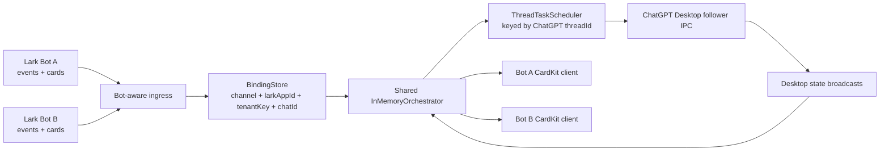
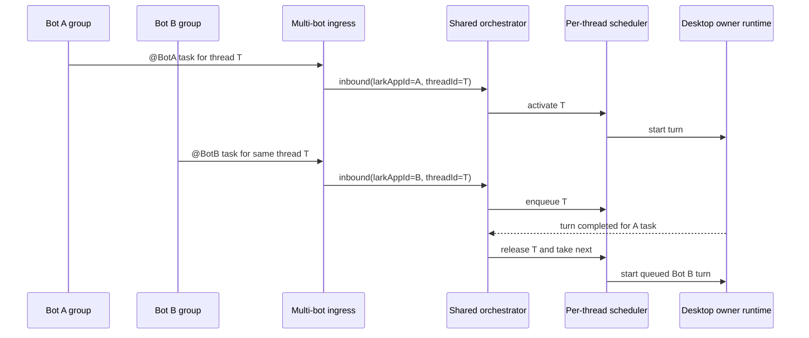

# feat: 支持多个飞书机器人共享 Desktop 执行面

## 概要

在一个 Bridge 进程内引入正式的多机器人支持：多个飞书应用机器人可以接收事件，拥有各自的聊天权限和 CardKit 投递身份，并把各自的聊天绑定到不同的 ChatGPT 会话，或绑定到同一个 ChatGPT 会话。所有机器人共享一个 Desktop 执行面和一个按 thread 串行的调度器，因此一个 ChatGPT thread 在任意时刻仍然只能有一个活跃的可写 turn。

## 2026-07-31 设计修订：使用 AppID 作为机器人标识

本修订覆盖本文早期关于生成式本地 key 和 `default` 机器人的设计。正式配置模型改为：一个 bot 配置项就是一个飞书应用机器人，`appId` 是该配置项的唯一标识。`botOpenId` 只用于飞书消息里的真实 `@` 和事件识别，机器人名称只用于展示。

- 新 `channels/feishu/bots.json` 不再写入生成式本地 key，每条记录以 `appId` 表示一个机器人。
- 新 `bindings.json` 写入 `larkAppId + tenantKey + chatId`，不再把生成式本地 key 作为绑定主键。
- 旧 `.env` 单机器人安装通过 `cfb config migrate` 一键迁移：读取 `LARK_APP_ID`/`LARK_APP_SECRET`，调用 `/open-apis/bot/v3/info` 获取机器人 open ID、名称和启用状态，生成 `channels/feishu/bots.json`，并把旧 bindings 物化为新 schema。
- `bot add` 和 `bot import` 添加的是新的飞书应用机器人。如果扫码/导入得到另一个 `appId`，就是新机器人，不会修改已有机器人配置。
- `bot enable`、`bot disable`、`bot remove` 和同类管理命令使用 `--app-id` 选择机器人；公开 CLI 不再接受 `--bot-key`。

## 2026-07-31 设计修订：使用 `config.toml` 作为运行配置

本修订覆盖本文早期关于 `.env` fallback 和只读 legacy 启动的设计。正式运行配置文件改为 `config.toml`，方便 operator 在进程级配置旁保留行内注释。Legacy `.env` 是唯一的一次性迁移来源。

- `~/.codex-feishu-bridge/config.toml` 是当前配置标志。只要它存在，Bridge 就加载它，并清理残留的 legacy `.env`。
- 如果 `config.toml` 不存在但 legacy `.env` 存在，Bridge 会自动物化 `config.toml`，把 bot 凭证迁移到 `channels/feishu/bots.json`，随后删除 legacy `.env`。
- 新的 setup/init 流程写入 `config.toml`，不再写 `.env`。
- `cfb config migrate` 仍可显式执行，用于把 legacy 单机器人 hydrate 到 `channels/feishu/bots.json` 并物化旧 bindings；启动时如果 `channels/feishu/bots.json` 不存在，也会物化当前 `appId` 机器人。
- 当前群聊开发分支尚未发布多机器人/群聊配置格式，因此允许破坏性迁移。

## 2026-07-31 设计修订：按渠道目录拆分配置

本修订为同一个本机 Bridge 进程同时接入飞书、企业微信等多个消息渠道做准备。渠道自有凭证和发现目录放在渠道目录下；跨渠道 binding 仍保留在根目录，因为它描述的是哪些渠道端点订阅哪个 ChatGPT thread。

- 根目录 `config.toml` 仍然只保存进程级运行配置，不保存渠道凭证。
- 根目录 `bindings.json` 仍然是跨渠道 binding 索引。每条持久化 binding 包含 `channel + appId + tenantKey + chatId -> threadId`。
- 飞书机器人凭证迁移到 `channels/feishu/bots.json`。
- 飞书外部机器人发现目录迁移到 `channels/feishu/external-bots.json`。
- 面向用户的正式升级迁移只导入旧单聊版本 `.env`。开发期根目录 `lark-bots.json` 和 `external-bots.json` 不是已发布兼容输入，不得为其他用户自动迁移。
- 后续新增渠道使用独立目录，例如 `channels/wecom/`，不再往 `config.toml` 增加渠道专属凭证字段。
- 多个渠道端点可以绑定同一个 ChatGPT thread。调度器继续按 `threadId` 串行；renderer/channel-adapter fan-out 后续必须基于 `threadId -> bindings[]` 为每个当前 binding 渲染并投递一份 outbound projection。

---

## 问题背景

当前 Bridge 围绕一组 Lark app 凭证和一个事件服务构建。这对单机器人足够，但不能安全支持多个拥有不同可见性、权限和投递身份的机器人。运行多个 Bridge 进程会拆散按 thread 加锁的能力，并允许两个机器人对同一个 ChatGPT Desktop thread 启动重叠 turn。

---

## 需求

- R1. 一个 Bridge 进程必须支持多个飞书应用机器人，每个机器人都有独立凭证、机器人身份、租户范围、聊天白名单、用户白名单、审批人白名单和 WebSocket 生命周期。
- R2. 聊天绑定必须按机器人身份、租户和聊天作用域区分，使两个机器人可以把同一个 `chatId` 绑定到不同会话而不互相覆盖。
- R3. 不同机器人可以绑定到同一个 ChatGPT thread，但该 thread 任意时刻仍然只能有一个活跃的可写 Desktop turn。
- R4. 同一个 ChatGPT thread 的排队工作必须在所有机器人之间 FIFO，而不是只在单个机器人或单个聊天内 FIFO。
- R5. 卡片创建、卡片更新、消息回执、图片下载、输出文件上传和审批回复必须使用发起任务的机器人的飞书凭证。
- R6. 卡片 action 必须按机器人身份路由，并按机器人、租户、聊天、消息、绑定 revision、操作者和 token 作用域校验。
- R7. 当一个 thread 有多个机器人/聊天绑定时，Desktop 侧发起的 turn 不得自动投影到所有机器人；没有明确发起 Bridge task 时 fan-out 不安全。
- R8. 现有单机器人配置必须继续可用，并提供确定性的迁移路径到多机器人配置模型。
- R9. runtime health、doctor 输出、日志和 setup/reset 流程必须报告机器人级状态，但不得记录 prompt、answer、reasoning、approval payload 或 CardKit payload。
- R10. 群聊支持必须保持 mention-gated：群消息只在事件是当前 bot mention 时接收，除非未来显式增加群全量消息模式。
  外部群成员的普通 mention 默认通过 binding 级策略允许，不要求 sender tenant 或 chat allowlist 校验；owner 可以按群手动关闭该策略。
- R11. 群聊有两条通道：owner-only 的当前群管理通道，以及绑定后的普通 `@current bot` 任务消息通道。非 owner 用户和 bot sender 永远不能执行群管理命令，例如 bind、unbind、model、CWD、access、setup 或 diagnostics。
- R12. Desktop 审批决策必须 admin-only。群成员在绑定策略允许时可以发起任务，但只有机器人的 owner/admin approval set 可以决定审批。
- R13. 任何群绑定或配置动作都必须指向一个具体的群身份。群内管理指向当前事件的 `larkAppId + tenantKey + chatId`；私聊管理指向按同一身份显式选择的已发现群。群名只用于展示，不能作为绑定 key。
- R14. 多机器人扫码注册必须创建或替换恰好一个 bot record。一次 QR 扫码注册一组 Lark app 凭证，获取机器人身份/名称，使用 `appId` 作为机器人标识，且不得覆盖其他机器人、认领 owner 或把任何群绑定到 ChatGPT thread。
- R15. 管理必须支持显式解绑、移除群、禁用机器人和移除机器人流程。这些操作必须有明确作用域、确认机制，且不得静默删除 ChatGPT threads 或重放/中止无关任务。
- R16. 机器人可用性必须显式表达，但保持 fail-closed。未知或已移除的机器人继续静默，因为 Bridge 没有可信的本地 runtime。一个本地已配置但 disabled 的机器人可以保留只回复事件通道；当它被 `@mention` 或旧卡片 action 被点击时，Bridge 必须返回禁用原因，且不得接收任务、命令、审批、绑定变更或产生卡片副作用。
- R17. 现有单机器人安装必须原地升级。已经扫码的机器人和现有 `bindings.json` v1 记录必须作为保留的 `default` bot 继续工作，且不要求重新 QR 注册或重新绑定聊天。

---

## 范围边界

- 不把多进程作为多机器人正式设计。多个 Bridge 进程无法共享内存中的按 thread 调度器，不能满足同一 thread 并发控制。
- 不引入数据库型任务恢复。活跃任务、队列、审批、卡片序列和去重仍只存在于当前进程内存。
- 不自动把 Desktop 侧发起的 turn 广播到所有绑定该 thread 的机器人。
- 群聊 MVP 不依赖敏感的 `im:message.group_msg` 权限。首选权限仍然是群内 `@bot` 消息事件。
- 不支持跨主机或远程 Desktop owner runtime。
- 不改变 ChatGPT Desktop 执行语义：所有 turn 仍走已验证的 Desktop follower IPC 路径。

### 后续工作

- 管理机器人和机器人/聊天绑定的管理 UI。
- 如果产品后续定义，再增加 Desktop-originated turn 的显式 fan-out 规则。
- 超出 content-free runtime health counters 的机器人级 rate-limit dashboard。
- 多 Bridge 实例的分布式锁。

---

## 上下文与调研

### 相关代码和模式

- `src/app/config.ts` 当前把一个 `LARK_APP_ID` 和 `LARK_APP_SECRET` 解析到 `BridgeConfig`。
- `src/app/main.ts` 当前构造一个 Lark API client、一个 WebSocket client、一个 `LarkEventServer`、一个 `CardKitClient`、一个 `LarkMessageAcknowledgement`、一个 `InboundImageStore` 和一个 `OutputFileUploader`。
- `src/app/lark/event-server.ts` 负责 Lark 事件归一化和首次私聊消息的 scope bootstrap。
- `src/app/lark/intake.ts` 归一化入站消息，并已经携带 tenant、chat、sender、message、root、image 和 mention 字段。
- `src/app/binding-store.ts` 持久化 `bindings.json`；当前 binding key 是 `tenantKey + chatId`。
- `src/app/in-memory-orchestrator.ts` 已经在内存中共享 task 状态，并使用按 `threadId` keyed 的 `ThreadTaskScheduler`。
- `src/app/task-scheduler.ts` 已经强制 per-thread active ownership 和有界 FIFO 队列。
- `src/app/desktop-approval-service.ts` 通过当前 active task context 路由审批。
- `src/app/runtime-health.ts` 发布不含内容的 runtime status 和 task counters。

### 既有经验

- Bridge 生产路径是 App Server 控制面加 ChatGPT Desktop IPC 执行面；实时 task state 必须来自 Desktop owner runtime events。
- Desktop 可见刷新和 Bridge/飞书投影是两个独立验收目标。
- 不能把“App Server 可以跑任务”或“多个进程可以启动”当作飞书/Desktop UI 同步和同 thread 安全性的证明。

### 外部参考

- 飞书消息文档：`im.message.receive_v1` 根据应用权限支持单聊消息、群内 `@bot` 消息和群全量消息。
- 飞书 FAQ：应用机器人可以接收并回复用户消息；自定义 webhook 机器人不能回复用户 `@bot` 消息。

---

## 关键技术决策

- 使用一个 Bridge runtime，包含多个 Lark bot ingress adapter 和一个共享执行/orchestrator 层。这样保留按 thread 串行能力。
- 使用稳定的飞书 `appId` 作为每个机器人的内部身份。`appId` 不是密钥；它是 binding、card action、health、logs 和 idempotency scope 使用的路由 key。
- 多机器人凭证存放在 Bridge config home 下的 `channels/feishu/bots.json`。旧 `.env` 里的 `LARK_APP_ID` 和 `LARK_APP_SECRET` 只作为一次性迁移来源，用于生成一个 appId 作用域的机器人。
- `default` 只作为读取旧单聊 schema v1 binding 且尚未迁移 appId 时的临时 fallback。
- 每个机器人使用独立 Lark API client。Lark 凭证、tenant token、CardKit message updates、reactions 和资源下载不能跨机器人共享。
- Desktop/App Server 控制 client 保持共享。ChatGPT threads 属于本地 Desktop runtime，不属于某个 Lark bot。
- 绑定身份升级为 `larkAppId + tenantKey + chatId`。一个 binding 指向一个 ChatGPT thread，并存储该 bot/chat pair 的静态执行设置。
- thread 并发仍只按 ChatGPT `threadId` keyed。如果 bot A 和 bot B 都绑定到同一个 thread，它们的任务排在同一个 active turn 后面。
- task 卡片和审批按发起任务的上下文路由，而不是单独从 thread 反查。
- 当多个 binding 指向同一 thread 时，保留 `getUniqueByThreadId` 对 Desktop-originated events 的 fail-closed 行为。
- 群内目标管理是一等交互。当 owner 在群里发送 `@current bot /bind`、`/unbind`、`/model`、`/cwd` 或 access 命令时，目标就是当前 `larkAppId + tenantKey + chatId`。
- 私聊作为同类操作的可选管理控制台保留。私聊管理在修改任何群 binding 之前，必须显式从已发现或已绑定的群中选择目标群。
- 非 owner 群内 slash-like 或 management-like 输入视为 non-actionable。它不得修改配置或 Desktop 状态。
- 审批请求投递到 bot 的 admin approval channel，或至少保证 action token 只能由 admin 决定。即使非 admin 发起了群任务，非 admin 点击也必须被拒绝。
- 拆分三个生命周期概念：QR 凭证注册（`appId -> appSecret/bot identity`）、owner 认领（`appId -> tenant/owner/admins`）和群 thread 绑定（`larkAppId + tenantKey + chatId -> threadId`）。任何命令都不应静默执行多个生命周期步骤。
- 拆分移除语义：
  - 解绑群：只移除当前群的 `threadId` 绑定，保留群的 discovered/authorized 状态。
  - 移除群：移除当前群对该 bot 的 binding、mention policy 和 authorization；bot 可能仍然物理留在飞书群中。
  - 禁用 bot：保留凭证和 bindings；如果凭证仍可用，只启动可回复的 Lark event path，并用明确的禁用原因拒绝 inbound tasks/actions。
  - 移除 bot：确认后删除该 bot record 以及 Bridge 本地配置中所有归属它的 discovered-group 和 binding records。
- 对未知或已移除 bot events 使用 silent drop 语义。Bridge 可以写脱敏本地诊断，但不得为这些 bot 发送群/私聊回复、acknowledgement card 或 hint。对于仍能把事件投递到 Bridge 的本地 disabled bot，返回禁用原因，且不创建 acknowledgement、task、command、approval 或 binding mutation。
- 使用一次性 legacy migration。如果 `config.toml` 不存在且 legacy `.env` 包含有效 `LARK_APP_ID`/`LARK_APP_SECRET`，Bridge 写入 `config.toml`，物化一个以该 `appId` 标识的 `channels/feishu/bots.json` 记录，并移除 `.env`。现有 `bindings.json` schema v1 记录在可用时按迁移后的 `appId` 读取；物化前仅使用临时内存 `default` fallback。

---

## 操作交互模型

### 机器人凭证注册

- 现有 `setup` 命令创建 `config.toml`，并在没有飞书机器人记录时注册一个 appId 作用域 bot。
- 额外机器人使用显式 bot 子命令。推荐 CLI 形态：
  - `codex-feishu-bridge bot add` 打印一个 QR code，注册一个 Lark app，获取机器人 identity/name，并写入一个 appId 作用域 bot entry。
  - `codex-feishu-bridge bot import --app-id cli_xxx --app-secret ...` 不扫码，导入已有 Lark app，然后获取 identity/name，并写入一个 appId 作用域 bot entry。
  - `codex-feishu-bridge bot migrate-default` 读取现有 legacy credentials，探测当前机器人 identity/name，并在不扫码的情况下物化一个 appId 作用域 bot。
  - `codex-feishu-bridge bot rebind` 打开交互式 bot selector，打印一个 QR code，并只替换选中 bot 的 credentials。
  - `codex-feishu-bridge bot disable` 打开交互式 bot selector，禁用一个 bot 的 task-capable runtime，但不删除本地 records。
  - `codex-feishu-bridge bot remove` 打开交互式 bot selector，展示受影响的 groups/bindings 后，从 Bridge 本地配置中移除一个 bot。
  - `codex-feishu-bridge bot list` 和 `codex-feishu-bridge bot doctor` 报告 bot 状态但不暴露 secrets。
- `cfb` 是 `codex-feishu-bridge` 的短 npm command alias；两个名称运行同一个 CLI entrypoint，并接受相同参数。
- 单次 CLI 调用最多显示一个 active QR code。operator 通过重复执行 `bot add` 添加多个机器人，避免混淆不同机器人的注册状态。
- 生成式本地 bot key 不属于公开 add/import 流程。持久化标识是飞书 `appId`。
- 机器人 display name 在凭证可用后，从已注册 app/bot identity 获取。用户提供的 display name 只作为可选 alias，不是事实来源。
- QR 注册只写 credentials 和 bot identity。群绑定仍是独立步骤。
- 通过 QR rebind 会创建或选择一个不同的 Lark app identity。因为飞书 open ID 是 app-scoped，且群成员身份归属于该 app robot，rebind 某个选中的 bot 后，必须把 owner/admin identities 和 discovered groups 标记为需要重新验证，然后该 bot 才能继续处理群任务。
- 对已有 bot record 执行 rebind 时，`appId` 保持稳定。rebind 只刷新同一个 Lark app identity 的凭证。

### AppId 身份规则

- 正常 `bot add` 或 `bot import` 期间，operator 永远不提供生成式本地 bot key。
- 一个 bot record 由飞书 `appId` 唯一标识。
- 官方配置不持久化、也不接受生成式本地 bot key。
- `default` 只保留为读取旧单聊 schema v1 binding 时的临时内存 fallback。
- 如果同一个 `appId` 已经存在于 `channels/feishu/bots.json`，`bot add` 或 `bot import` 不得创建重复记录；应引导 operator 去 list/rebind/enable 现有 bot。
- 对 `bot rebind`，扫码返回的 `appId` 必须与现有记录一致；不同 `appId` 是另一个机器人，应作为新记录添加。
- `displayName` 单独获取和持久化。它只用于人类可读的 cards 和 selectors，永远不作为 routing key。

### Legacy Upgrade Compatibility

- 升级时，只有 legacy `.env` bot credentials 的现有安装会迁移成一个 enabled appId 作用域 bot record。
- 启动不得强制 QR 重新注册。如果 legacy credentials 有效，Bridge 可以直接从 `.env` 物化该 bot。
- 启动不得强制聊天重新绑定。现有 `bindings.json` schema v1 记录在可用时按迁移后的 `appId` 加载；物化前可以使用临时内存 `default` fallback。
- Legacy `.env` policy fields 映射到迁移后的 appId 作用域 bot：
  - `LARK_TENANT_KEY` 成为该 bot 的 tenant scope。
  - `ALLOWED_CHATS` 成为该 bot 的 allowed/discovered chat scope。
  - `AUTHORIZED_USERS` 为兼容现有 binding permissions，成为初始 management set。
  - `ALLOWED_APPROVERS` 仍是 approval decision set。
- 持久迁移自动且单向：一旦 `config.toml` 存在，`.env` 不再参与 runtime loading，并可被移除。

### Legacy 默认机器人迁移指令

- 增加 `codex-feishu-bridge bot migrate-default`，作为已经通过 legacy `.env` keys 配置过一个机器人的安装实例的正式迁移路径。
- 该命令不接受 operator 传入生成式本地 bot key、机器人名称或 open ID。它读取 legacy `LARK_APP_ID`、`LARK_APP_SECRET` 和 domain settings，然后使用 app authentication 解析机器人 identity。
- Identity probe：
  - 使用 legacy app credentials 获取 `tenant_access_token`。
  - 带 token 调用 `GET /open-apis/bot/v3/info`。
  - 将 `bot.open_id` 持久化为 `botOpenId`，将 `bot.app_name` 持久化为 `displayName`，将 `bot.avatar_url` 持久化为可选 avatar metadata，并将 `bot.activate_status` 持久化为上次已知的飞书启用状态。
- 目标标识是 legacy `LARK_APP_ID`。该命令迁移现有 single-bot installation，不生成任何额外 bot key。
- 默认模式是 preview：打印已脱敏的 migration plan，包括目标 `appId`、解析到的 `displayName`、脱敏后的 `botOpenId`、activation status、待升级 bindings 数量，以及 owner/admin policy source。`--write` 原子物化该 plan；非交互 automation 也可以传 `--yes`。
- 如果 identity probe 失败，migration fail closed，且不物化 bot entry。operator 应先修复 credentials、机器人能力、发布状态或网络访问后再重试。
- 如果 `activate_status` 不是 enabled，该命令不得创建 enabled runtime。它可以报告 disabled migration plan；只有飞书仍然投递该 bot 的事件时，Bridge 才能返回 unavailable reason。
- 该命令是幂等的。如果 `channels/feishu/bots.json` 已经包含相同 `appId` 或 bot open ID，重复执行只刷新 display metadata，并保持 bindings 不变。不同 `appId` 是另一个机器人，必须作为独立记录添加。

### 私聊管理

- 新增机器人初始为 unclaimed，只响应私聊 owner/admin setup commands。
- 第一个授权 owner 在私聊中认领机器人。现有 owners/admins 后续可以添加或移除 admins。
- 私聊可以作为可选 group 管理控制台：owner 打开 bot 的已发现或已绑定群列表，选择一个精确群，选择或创建目标 ChatGPT thread，设置群 mention policy，并保存 binding。
- 群列表按 `larkAppId + tenantKey + chatId` keyed，而不是按群名。卡片可以显示群名便于阅读，但必须同时包含短 chat ID 后缀和 discovery source，以避免同名群歧义。
- 私聊群管理卡片是群内 owner 命令的可选等价入口。它们绝不能从私聊本身推断目标群。
- 私聊群管理卡片在显式选择群后支持 bind、unbind、remove group authorization、model、CWD 和 access-policy 更新。
- 机器人级动作，例如认领机器人、轮换凭证、禁用/移除 bot 和 bot-level doctor/status，仍属于私聊或 CLI 动作。

### 群内 Owner 管理

- 群内 owner 管理是该群 binding 的主交互，因为目标群没有歧义。
- 群里的 `@current bot /bind` 打开当前群的 thread picker。如果该群尚未被发现，同一个 owner 命令先记录 group candidate，然后继续打开 picker。
- `@current bot /unbind`、`/remove`、`/model`、`/cwd` 和 access-policy 命令只修改当前群的 binding/authorization，并要求操作者是 robot owner。
- `@current bot /unbind` 只移除当前群的 ChatGPT thread binding。该群仍保持 authorized，可以之后重新 bind。
- `@current bot /remove` 移除当前群对该 bot 的 authorization 和 binding。除非未来显式实现并验证 Feishu API-backed leave operation，否则它不物理移除飞书群中的 Lark app robot。
- 群内 owner 管理卡片和 action tokens 包含 `larkAppId`、`tenantKey`、`chatId`、operator open ID、binding revision 和 TTL。
- 如果配置为 approvers，非 owner admins 可以审批 Desktop actions，但默认不获得群 binding/configuration 权限，除非未来角色策略显式增加。

### 群发现

- 只有当 Bridge 有证据证明机器人在某个群里时，该群才变成可选择对象。
- 首选发现来源：订阅该机器人的 bot-added-to-group event，携带 `larkAppId`、`tenantKey` 和 `chatId`。
- 兜底发现来源：未绑定群先 mention 当前机器人一次。如果发送者是 owner 且消息是 owner management command，Bridge 可以立即继续群内绑定流程；否则记录该群为 `pending_binding`，并最多发送一个 non-actionable group hint，提示 owner 需要绑定该群。
- 未绑定群 mention 永远不会启动 ChatGPT task，也不会执行群命令。
- 如果某个群不在私聊管理列表中，owner 可以把机器人加入群后在群内执行 `@current bot /bind`，或依赖 bot-added event。

### 群聊

- 群必须先绑定，才能启动任务。
- 群消息只有在 mention 当前机器人并通过该 binding 的 mention access policy 时才会被接受。
- 外部群成员默认可以 mention 当前机器人发起普通任务消息。
  该宽松路径跳过 sender tenant 和 chat allowlist 校验，但不授权群管理命令、卡片审批或 bot sender 任务。
- 外部群成员访问策略存储在当前群 binding 上。owner 可以在对应群中使用 `@current bot /external off` 停止响应外部群成员 mention，使用 `@current bot /external on` 恢复默认允许。
- 接受的群消息在移除当前机器人 mention 后，作为普通 task input。
- 非 owner 群 slash commands 和 management commands 不支持。它们不得修改 binding state、修改 settings 或触发 approval decisions。
- 其他用户或机器人只有在群 binding policy 允许该 sender class 时，才可以 mention 当前机器人。

### 审批

- 审批请求属于发起任务、bot 和 thread，但决策权限是 admin-only。
- 如果群任务进入 `AWAITING_APPROVAL`，群 task card 可以显示等待状态，而可操作的审批卡在可行时发送到该 bot 的私聊 admin control chat。
- 如果出于投递原因审批卡必须出现在原群中，action tokens 仍必须要求 admin identity，并拒绝普通群成员。

---

## 开放问题

### 规划期间已解决

- 正式支持是否应该走多进程？不应该。同 thread 并发控制要求一个进程内的共享 scheduler。
- 两个 bot 能否绑定到同一个 ChatGPT thread？可以，但所有写入该 thread 的操作都通过同一个 `ThreadTaskScheduler` 串行。
- bot 级 CardKit 投递是否共享一个 Lark client？不共享。投递必须使用发起机器人的 credential。
- Desktop-originated turns 是否 fan out？不 fan out。没有发起 bot/chat/root task 时，安全行为是不投影。
- 多个 bot 如何 QR 注册？`bot add` 每次注册一个新 bot 并按 `appId` 存储；`bot rebind --app-id` 只在扫码返回同一个 `appId` 时刷新该 bot 凭证；`setup` 保留为当前单 bot 的 setup 流程。

### 延后到实现

- `channels/feishu/bots.json` 的精确字段名和迁移机制在实现期间最终确定，但来源拆分已经确定：`config.toml` 用于当前进程级配置和一次性 legacy `.env` 导入，`channels/feishu/bots.json` 用于 appId 作用域的 bot credentials。

---

## 高层技术设计

> *本图展示预期方法，是供评审使用的方向性指导，不是实现规范。实现 agent 应把它作为上下文，而不是要照抄的代码。*

---

## 实施单元

### U1. 多机器人领域与配置模型

**目标：** 在不复制 Desktop 执行栈的前提下表示多个 Lark bots。

**需求：** R1, R8, R9, R14, R17

**依赖：** 无

**文件：**
- 修改：`src/app/domain.ts`
- 修改：`src/app/config.ts`
- 修改：`src/app/config-file.ts`
- 修改：`src/app/setup.ts`
- 修改：`config.example.toml`
- 测试：`test/app/config-reset.test.ts`
- 测试：`test/app/doctor.test.ts`

**方法：**
- 增加 `LarkBotConfig` 概念，包含 `appId`、`appSecret`、tenant/chat/user/approver policy，以及可选的 resolved bot open ID。
- 将现有单 bot `.env` keys 直接迁移为一个 appId 作用域的 bot record，而 `config.toml` 只接收进程级配置。
- `default` 只作为未迁移 schema v1 binding 的内存 fallback；新记录不再持久化它。
- 在 config home 下引入 `channels/feishu/bots.json` 作为 named multi-bot credential source。
- 如果 `channels/feishu/bots.json` 不存在，则把 legacy `.env` credentials 物化为一个 appId 作用域的 bot record，然后通过写入干净的 `config.toml` 移除 legacy credentials。
- QR 注册的额外 bot 以 appId 作用域 entries 存储，而不是改写当前 bot credentials。
- operator 不需要提供或记住生成式本地 bot key；正常管理使用 `--app-id`。
- 在凭证可用后，从 Lark bot/app identity 获取并持久化机器人 display name。手工名称只作为 alias。
- 将 bot credential status、owner claim status 和 group binding status 分开建模。
- 确保 secrets 永远不出现在 logs、health snapshots、doctor JSON 或 setup output 中。

**遵循模式：**
- `src/app/config.ts` 中现有 `BridgeConfig` parsing 和 `ConfigurationError` fail-closed 行为。
- `src/app/setup.ts` 中现有 setup-managed `.env` rendering。

**测试场景：**
- Happy path：现有单 bot `.env` 迁移成恰好一个 appId 作用域 bot。
- Happy path：没有 `channels/feishu/bots.json` 的 legacy `.env` 在迁移后启动，不要求 QR 重新注册。
- Happy path：两个 configured bots 解析为两个唯一的 `appId` entries。
- Happy path：通过 `bot add` QR 注册会创建一个带 fetched display name 的 appId 作用域 bot entry。
- Edge case：重复 `appId` 导致启动失败。
- Edge case：display-name 变化不改变 routing identity。
- Edge case：相同 app IDs 搭配不同 secrets 时，需要显式拒绝或记录清楚行为。
- Edge case：rebind 一个 bot 不会覆盖其他 bots，并将 app-scoped owner/group state 标记为需要重新验证。
- Error path：某个 bot 缺少 app secret 时启动失败，且不会打印其他 bot 的 secret values。
- Integration：doctor 报告 bot count 和 per-bot readiness status，且不暴露 credentials。

**验证：**
- 单 bot 测试继续通过。
- 多 bot config 测试证明 parsing、validation 和 redaction 稳定。

### U2. Bot-Aware Lark Runtime Registry

**目标：** 每个 bot 启动并监管一套 Lark API/WebSocket/CardKit stack，同时共享 Desktop/App Server stack。

**需求：** R1, R5, R9, R10, R16

**依赖：** U1

**文件：**
- 新增：`src/app/lark/bot-runtime-registry.ts`
- 修改：`src/app/main.ts`
- 修改：`src/app/lark/client.ts`
- 修改：`src/app/lark/event-server.ts`
- 测试：`test/app/lark-client.test.ts`

**方法：**
- 为每个 bot 构建一个 `LarkBotRuntime` bundle：API client、WebSocket client、CardKit client、acknowledgements、inbound image store、output uploader 和 event server。
- 使用官方 bot info API 解析每个 bot 的 open ID，缓存在内存中，并注入 group mention policy。
- Bridge 启动期间启动所有 bot event servers。Enabled bots 启动完整可接任务 runtime；disabled bots 在凭证仍可用时只启动可回复 event path。
- Disabled bots 在本地 status 中显示为 disabled。它的 event path 只能回复禁用原因，不得 acknowledge、create、mutate、approve、cancel 或 route tasks。
- 如果某个 unknown 或 removed bot 的事件仍然被投递，registry 必须返回无 runtime，并 silent drop 该事件。
- 在 runtime health 中暴露 per-bot WebSocket state。

**遵循模式：**
- 现有 `createLarkRuntimeClients` connection-state reporting。
- 现有 `CachedTenantTokenProvider` redaction 和 timeout boundaries。

**测试场景：**
- Happy path：两个 bots 使用不同 app IDs 创建独立 WebSocket starts。
- Happy path：bot identity resolution 为每个 event server 填充正确的 bot open ID。
- Happy path：disabled bot 列为 disabled，只启动可回复 event path，并在被 mention 时返回禁用原因。
- Error path：一个 bot WebSocket terminal failure 将 global status 转为 degraded，并标识 bot `appId`。
- Error path：bot identity lookup 失败时启动失败，但不泄露 raw API payload。
- Error path：unknown 或 removed bot 的事件被丢弃，不回复飞书。
- Error path：disabled bot card action 返回禁用原因 toast，且不路由原始 action。

**验证：**
- runtime startup 构造多个 Lark event servers 和一个共享 Desktop supervisor。

### U3. Binding Store Schema Upgrade

**目标：** 持久化 bot-scoped chat bindings，并允许多个 bindings 指向同一个 ChatGPT thread。

**需求：** R2, R3, R7, R8, R11, R13, R15, R17

**依赖：** U1

**文件：**
- 修改：`src/app/binding-store.ts`
- 修改：`src/app/conversation-binding-service-v3.ts`
- 修改：`src/app/command-service.ts`
- 测试：`test/app/conversation-binding-service-v3.test.ts`
- 测试：`test/app/desktop-ipc-regression.test.ts`

**方法：**
- 给持久化 `ChatThreadBinding` document 增加 `larkAppId`，内部 runtime context 使用同一个 appId。
- 升级 binding document schema version。
- 新 binding key 为 `channel + larkAppId + tenantKey + chatId`。
- 现有 schema v1 bindings 在可用时迁移到 legacy `.env` 中的 appId，否则在配置迁移完成前使用临时 `default` fallback。
- 加载 schema v1 bindings 必须是非破坏性的，并保留 model/personality/style/plan/activeSkill/workspace 字段。
- 只在显式 migration 或下一次 binding-store mutation 时，通过现有 atomic replacement 路径持久化升级后的 binding schema。
- 将 `get(tenantKey, chatId)` 调用方替换为 bot-aware lookup。
- 当多个 bindings 指向同一 thread 时，保留 `getUniqueByThreadId` fail-closed 行为。
- 将 discovered group candidates 与 active bindings 分开追踪。一个 discovered group 记录 bot、tenant、chat、chat type、optional display name、discovery source、discovery time 和 binding status。
- 在 binding 上持久化 group-level mention policy，包括普通群用户和 bot senders 是否可以启动任务。
- 群的 bind、unbind、CWD、model 和 access changes 可以从 in-group owner context 执行，目标是当前群。
- 同样的 group-management changes 也可以从 private owner context 执行，但必须先选择一个明确的 discovered 或 bound group。
- Group unbind 只移除 `larkAppId + tenantKey + chatId` 下的 `threadId` 和静态执行设置；discovered-group status 保留。
- Group remove 删除 `larkAppId + tenantKey + chatId` 下的 discovered-group authorization、binding 和 group policy。
- Bot removal 在确认影响范围后，删除所选 `appId` 拥有的所有本地 records，包括 credentials、owner/admin claim state、discovered groups 和 bindings。

**遵循模式：**
- `BindingStore` 中现有同目录 atomic replacement 和 schema validation。

**测试场景：**
- Happy path：schema v1 binding 在可用时按迁移后的 appId 加载。
- Happy path：schema v1 binding 在内存归一化后保留 threadId、workspaceId、settings、revision 和 updatedAtMs。
- Happy path：下一次 bind/unbind/config mutation 原子写入升级后的 schema，且不要求聊天重新绑定。
- Happy path：bot A 和 bot B 可以把同一个 tenant/chat 绑定到不同 threads。
- Happy path：bot A 和 bot B 可以把不同 chats 绑定到同一个 thread。
- Happy path：owner 在群里执行 `@current bot /bind`，并将该精确群绑定到一个 thread。
- Happy path：owner 在私聊中按稳定 chat identity 选择一个 discovered group，并绑定到一个 thread。
- Edge case：重复 `channel + larkAppId + tenantKey + chatId` 被拒绝。
- Edge case：两个 display name 相同的群仍可按 chat identity 区分。
- Edge case：private owner 不能绑定当前 bot 尚未发现的群。
- Edge case：非 owner 群成员不能 bind、unbind、改 model、改 CWD 或改 access policy。
- Edge case：group unbind 保留 discovered group，并允许之后 owner rebind。
- Edge case：group remove 后，在 owner 重新 bind/authorize 之前，不能启动任务。
- Edge case：bot removal 在该 bot 有 active 或 queued tasks 时拒绝，或要求显式 force。
- Error path：unknown keys 或 malformed `appId` values fail closed。
- Integration：command services 只更新发起 bot 的 binding。
- Integration：owner group commands 只更新当前群 binding；non-owner group commands 不能创建、更新或删除 bindings。

**验证：**
- `bindings.json` 保持小体积、atomic，且不包含 runtime task state。

### U4. Bot-Aware Inbound Message And Card Action Routing

**目标：** 将 bot identity 从 event ingress 贯穿到 commands、binding、image aggregation、tasks、approvals 和 card actions。

**需求：** R1, R5, R6, R10, R11, R13, R16

**依赖：** U2, U3

**文件：**
- 修改：`src/app/lark/intake.ts`
- 修改：`src/app/lark/event-server.ts`
- 修改：`src/app/lark/inbound-message-aggregator.ts`
- 修改：`src/app/lark/message-acknowledgement.ts`
- 修改：`src/app/lark/output-file-uploader.ts`
- 修改：`src/app/lark/inbound-image-store.ts`
- 测试：`test/app/lark-image-input.test.ts`

**方法：**
- 给 `InboundMessage` 增加 `larkAppId` 和 `chatType`。
- 给 card actions 增加 `larkAppId`，并校验 action context 与创建该 card 的 bot 匹配。
- 使用 `(larkAppId, tenantKey, chatId, senderOpenId)` 作为 image aggregation key。
- 对群消息，要求 bot mention，除非未来显式启用 all-group-message mode。
- 只移除当前 bot 的 mention placeholder。
- 在群聊中，只路由 owner management commands 和 accepted task text。Non-owner slash commands 和 management phrases 在修改状态前被拒绝。
- 对未绑定群 mention，记录或刷新 pending discovered-group candidate，且不创建任务；owner `/bind` 可以继续进入 binding flow。
- 在创建任务前执行 binding-level mention access，包括可选拒绝 bot senders。
- 在处理任何 task、command、card side effect 或 image 前，要求存在 enabled bot runtime。Disabled bot contexts 只能发出明确的 unavailable reason。Unknown 或 removed bot contexts 必须返回 silent-drop result，不发送飞书消息。

**遵循模式：**
- 现有 intake rejection reasons 和 message normalization。
- 现有 image aggregator conversation key design，并扩展 bot identity。

**测试场景：**
- Happy path：群 `@current bot` text message 被接受并移除 bot mention。
- Happy path：外部群成员的 `@current bot` text message 默认被接受，即使 sender tenant 不同
  且 chat 不在 bot allowlist。
- Happy path：binding 允许 all group users 时，允许的非 admin 群成员可以启动普通任务。
- Happy path：未绑定群 owner 执行 `@current bot /bind`，创建 pending group candidate 并为当前群打开 binding picker。
- Happy path：未绑定群 non-owner 执行 `@current bot`，只创建或刷新 pending group candidate，不启动任务。
- Edge case：mention 另一个 bot 的群消息被拒绝。
- Edge case：没有 mention 的群消息被拒绝。
- Edge case：mention disabled Bridge bot 的群消息返回禁用原因，且不创建 task/discovered group。
- Edge case：removed 或 unknown bot app ID 的事件没有回复，不创建 task/discovered group。
- Edge case：non-owner group `/bind`、`/unbind`、`/remove`、`/cwd`、`/model`、`/status` 和 `/doctor` 不进入 mutating command handlers。
- Edge case：owner group `/bind`、`/unbind`、`/remove`、`/cwd`、`/model` 和 access-policy commands 只作用于当前群。
- Edge case：binding mention policy 之外的 group sender 被忽略，或只收到 non-actionable hint。
- Edge case：当 binding 禁用 bot senders 时，bot sender 被忽略。
- Edge case：同一 chat 中两个 bots 对同一 sender 拥有独立 image batches。
- Error path：bot A card action 不能修改 bot B binding/task。
- Integration：acknowledgement 和 reply 使用发起 bot runtime。

**验证：**
- 群聊支持通过官方 event push 工作，并在本地保持 fail-closed。

### U5. 共享执行调度器与跨 Bot 队列语义

**目标：** 确保同 thread 并发在所有 bots 间串行。

**需求：** R3, R4, R7

**依赖：** U3, U4

**文件：**
- 修改：`src/app/in-memory-orchestrator.ts`
- 修改：`src/app/task-scheduler.ts`
- 测试：`test/app/task-scheduler.test.ts`
- 测试：`test/app/desktop-ipc-regression.test.ts`

**方法：**
- 保持 `ThreadTaskScheduler` 按 ChatGPT `threadId` keyed，而不是按 bot 或 chat keyed。
- Queue entries 必须包含 bot-aware message 和 binding context。
- follow-up steer 只在 active task 具有同 thread 且同发起任务 root message identity 时允许。其他 bot/root messages 排队。
- Dedupe keys 应包含 bot identity，避免不同 bot apps 的重复 event IDs 冲突。
- Runtime health counters 保持 content-free，但应包含 total active/queued 和可选 per-bot counts。

**遵循模式：**
- 现有 `handleInbound` 按 thread 的 exclusive lock。
- `ThreadTaskScheduler` 中现有 active/queued 行为。

**测试场景：**
- Happy path：bot A 启动 thread T，bot B 对 thread T 的消息排队。
- Happy path：bot A 进入 terminal state 后，bot B 启动。
- Happy path：bot A same-root follow-up steer active turn。
- Edge case：bot B 同 thread 但 different root 会排队，而不是 steer。
- Edge case：不同 bots 的不同 threads 可以并行运行。
- Error path：queue full 只报告给发起 bot/chat。

**验证：**
- Bridge-managed work 中没有任何路径可以对同一个 thread 启动两个 Desktop turns。

### U6. Bot-Scoped Card Projection And Approval Handling

**目标：** 确保所有可见 Lark side effects 都通过发起机器人返回。

**需求：** R5, R6, R7, R9, R12

**依赖：** U2, U4, U5

**文件：**
- 修改：`src/app/in-memory-orchestrator.ts`
- 修改：`src/app/desktop-approval-service.ts`
- 修改：`src/app/cards/cardkit-client.ts`
- 测试：`test/app/desktop-ipc-regression.test.ts`
- 测试：`test/app/lark-client.test.ts`

**方法：**
- 从 inbound message 中把 `larkAppId` 存到每个 runtime task。
- 从 bot runtime registry 中解析正确的 `CardKitClient`、acknowledgement client 和 output uploader。
- 审批卡使用 active task 的 bot runtime 和 admin approval destination。
- Approval action tokens 包含 bot scope、admin operator scope，并拒绝 cross-bot replay。
- Card update retries 保留在内存中，并 scoped 到创建该 message 的 card client。

**遵循模式：**
- 现有 cancel token 和 approval token validation。
- 现有 per-task card sequence 和 retry logic。

**测试场景：**
- Happy path：bot A task 通过 bot A client 创建并更新 cards。
- Happy path：bot B 群任务的 approval 发送到 bot B admin approval destination，并通过 bot B client 决策。
- Edge case：bot A operator 点击 bot B approval card 时被拒绝，除非它被 bot B 授权且 token scope 匹配。
- Edge case：普通群成员发起任务，但不能决定该任务的任何 approval。
- Error path：bot A card update failure 不污染 bot B task card updates。
- Integration：queued cross-bot task 的 terminal card 回到它原始 message root。

**验证：**
- 每个 Lark side effect 都可以无 payload logging 地追溯到恰好一个 `larkAppId`。

### U7. Setup, Reset, Doctor, Status, And Documentation

**目标：** 让多 bot 操作可理解、可运维，同时不削弱现有单 bot setup。

**需求：** R1, R8, R9, R10, R11, R12, R13, R14, R15, R16, R17

**依赖：** U1, U2, U3

**文件：**
- 修改：`src/app/setup.ts`
- 修改：`src/app/config-reset.ts`
- 修改：`src/app/doctor.ts`
- 修改：`src/app/runtime-health.ts`
- 修改：`README.md`
- 修改：`config.example.toml`
- 测试：`test/app/config-reset.test.ts`
- 测试：`test/app/doctor.test.ts`
- 测试：`test/app/runtime-health.test.ts`

**方法：**
- 保留单 bot `setup` 行为。
- 通过自动 `.env -> config.toml + channels/feishu/bots.json` 迁移和 appId 作用域 binding 物化，保留 legacy single-bot runtime 行为，不要求重新扫码或重新绑定。
- 增加通过 QR registration 或 existing app import 配置额外 bots 的明确文档和 CLI help。
- 增加 `bot add`、`bot import`、`config migrate`、`bot rebind`、`bot disable`、`bot remove`、`bot list` 和 `bot doctor` command design。Bot add/import/migration 存储 appId 作用域记录；针对 existing bot 的命令使用 `--app-id`。
- 为 `bot add`、`bot import` 和 `config migrate` 通过 `GET /open-apis/bot/v3/info` 实现 identity hydration，持久化机器人 open ID、display name、avatar metadata 和 activation status，且不记录 secrets。
- 报告 per-bot readiness：configured、identity resolved、WebSocket ready、allowed chat count、authorized user count、degraded reason。
- 明确报告 disabled 和 removed-local states。Disabled bots 只有在 Bridge 仍收到其事件时才能回复 unavailable reason；removed-local bots 不能通过 Bridge 接收或回复。
- Reset 必须按现有 reset semantics 保留 bot configuration，同时只清理 runtime/non-current files。
- 记录群聊权限：优先 `im:message.group_at_msg` / readonly equivalent；除非单独论证，避免 sensitive all-group-message scope。
- 清楚记录 local-only removal semantics：Bridge 可以移除本地 credentials/bindings，但除非单独实现并验证 Feishu API flow，不保证删除 Feishu app 或物理移出飞书群。
- 记录升级兼容性：旧 `.env` Lark keys 一次性导入 `channels/feishu/bots.json`，v1 `bindings.json` 作为 appId 作用域 bindings 加载，持久迁移自动发生或通过 `config migrate` 显式执行。

**遵循模式：**
- 现有 content-free runtime health 和 redacted logging。
- 现有 config reset dry-run/confirm/destructive split。

**测试场景：**
- Happy path：doctor 对 legacy config 报告一个 appId 作用域 bot。
- Happy path：包含现有 binding 的 legacy config 在迁移后的 appId 下显示同一个 thread binding，且不要求 QR。
- Happy path：`bot migrate-default --write` 探测 `/open-apis/bot/v3/info`，物化 `channels/feishu/bots.json` 和升级后的 `bindings.json`，存储 `botOpenId`/`displayName`，并把旧 thread bindings 保留在迁移后的 appId 下。
- Happy path：`bot add` 打印一个 QR，获取 bot identity/name，并写入一个 appId 作用域 bot。
- Happy path：`bot rebind` 选择一个 existing bot，只替换该 bot credentials，并要求 owner/group re-verification。
- Happy path：`bot disable` 保留 records，但停止所选 bot 启动 task-capable runtime。
- Happy path：`bot remove` 展示受影响 bindings/groups，要求确认，并只移除所选 bot 的 local records。
- Happy path：existing app credentials 可以不经 QR 导入。
- Happy path：doctor 报告多个 bots，且不含 secrets。
- Error path：reset 拒绝 malformed multi-bot config。
- Error path：导入一个已属于 existing bot record 的 app ID 时失败，或显式路由到 rebind。
- Error path：`bot migrate-default` 遇到 invalid credentials、缺少机器人能力、identity probe 失败或 disabled activation status 时，不创建 enabled runtime。
- Error path：QR registration failure 保留 previous bot entry 不变。
- Error path：`bot remove` 在所选 bot 有 active 或 queued tasks 时拒绝，或要求显式 force。
- Error path：malformed legacy binding 仍然 fail closed，且不产生部分升级文件。
- Integration：`bot disable` 后，如果 Bridge 仍收到该事件，`@that bot` 会收到禁用原因回复，且不启动任务。
- Integration：README 解释 same-thread queue behavior 和 no Desktop-origin fan-out。

**验证：**
- Operators 不需要读源码即可配置和诊断多个 bots。

---

## 系统影响

- **交互图：** Lark ingress 从一对一变为一对多。Desktop execution 仍然是一个共享路径。Binding、command、orchestrator、approvals 和 cards 都需要 bot-aware context。
- **错误传播：** Per-bot Lark failures 会让该 bot 和 global readiness degraded，但不得重启 Desktop execution，也不得破坏其他 bots 的 active tasks。
- **状态生命周期风险：** Runtime state 仍只在内存中。Bot-scoped queues 和 card identities 在重启时消失，而 bot-scoped bindings 保留。
- **API surface parity：** CLI `run/start/status/doctor/setup/config reset` 和 README 必须同时描述 single-bot 和 multi-bot behavior。
- **集成覆盖：** Same-thread cross-bot serialization 需要 orchestrator-level tests，不能只测 scheduler unit tests。
- **不变约束：** 没有 task database、没有 task replay、不直接写 ChatGPT database、没有 Desktop-origin fan-out、没有隐藏 prompt/output logging。

---

## 风险与依赖

| 风险 | 缓解 |
|------|------|
| Cross-bot card action 意外修改另一个 bot 的 task | 在 action normalization 和 token scope 中包含 `larkAppId`；按 originating card context 校验 |
| 两个 bots 对同一 ChatGPT thread 启动 turns | 保持一个按 `threadId` keyed 的共享 `ThreadTaskScheduler`；拒绝多进程正式设计 |
| Multi-bot config 在 doctor/status/logs 中泄露 secrets | 使用 redacted structured status，并用 tests 断言 secrets 缺失 |
| 群消息 scope 变得过宽 | 优先使用 group `@bot` event permission，并保留本地 `mentionedBot` gate |
| Binding migration 丢失现有 single-bot installs | Schema v1 在可用时迁移到 legacy appId，并保持 atomic |
| 一个 degraded Lark bot 掩盖其他 healthy bots | Health 报告 per-bot state 和 aggregate degraded status |

---

## 文档 / 运维说明

- 将 multi-bot 记录为一个 Bridge 进程的高级配置，而不是多个 daemon instances。
- 记录 bots 可以绑定到同一个 ChatGPT thread，但 execution 按 thread 串行。
- 记录 card replies 和 approvals 总是通过接收原始消息的 bot 返回。
- 记录 Desktop-originated turns 不会广播到所有绑定同一 thread 的机器人。
- 记录单聊、群 `@bot`、message resources、CardKit updates 和 reactions 所需的飞书 scopes。

---

## 来源与参考

- 相关代码：`src/app/config.ts`
- 相关代码：`src/app/main.ts`
- 相关代码：`src/app/lark/event-server.ts`
- 相关代码：`src/app/lark/intake.ts`
- 相关代码：`src/app/binding-store.ts`
- 相关代码：`src/app/in-memory-orchestrator.ts`
- 相关代码：`src/app/task-scheduler.ts`
- 相关文档：`README.md`
- 外部文档：`https://open.feishu.cn/document/server-docs/im-v1/introduction?lang=zh-CN`
- 外部文档：`https://open.feishu.cn/document/server-docs/im-v1/faq`
