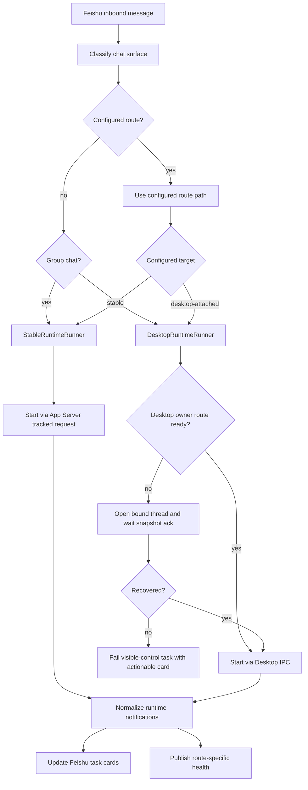
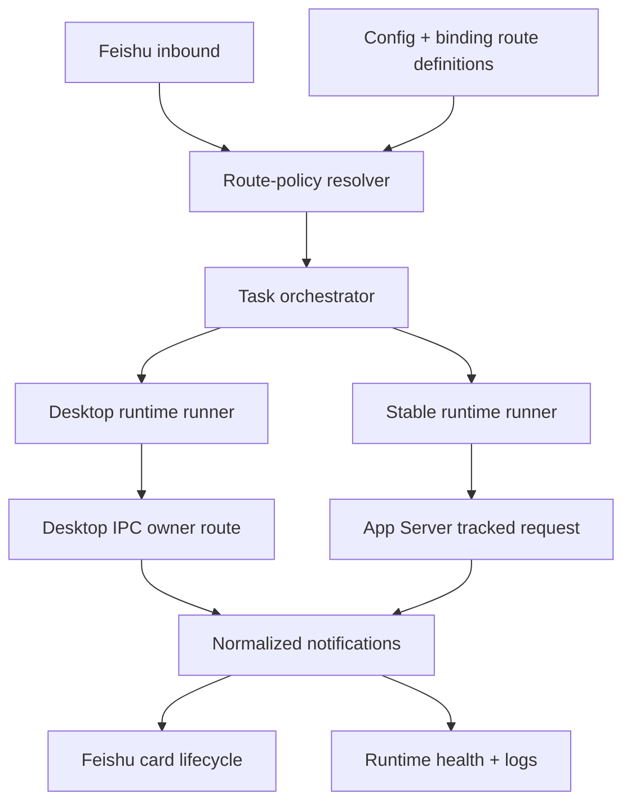

# feat: Add route-based runtime execution modes

## Summary

Introduce a configurable route-based execution policy rather than a single hard-coded execution path. Feishu group-chat messages should use the stable App Server execution path by default, because group control needs reliable execution and should not depend on one user's ChatGPT Desktop UI owner route. Mobile or direct single-chat messages can keep the existing Desktop-attached path by default where visible ChatGPT Desktop control is still useful. These defaults are not restrictions: authorized users can freely define and switch the execution path at global or chat-binding scope.

---

## Problem Frame

The current Feishu-to-ChatGPT path depends on ChatGPT Desktop owning and routing the bound conversation. When the Desktop owner is unavailable, Bridge can hit `no-client-found`; the new `/open` recovery can load many missing owners, but it still depends on UI state.

The product behavior should not make every Feishu entry point share that same dependency. Group chats are collaboration surfaces where reliability and non-duplication often matter more than showing the running turn in a local Desktop window. Direct or mobile single-chat control can continue to use the current Desktop-attached path when the operator expects visible control of the bound ChatGPT Desktop session.

The default route policy is only the starting behavior. Bridge should make the execution path a first-class configurable policy so operators can intentionally define a group chat as Desktop-attached, define a direct chat as stable, or change those definitions later without code changes.

---

## Assumptions

*These are plan-time assumptions inferred from the current product direction and codebase; confirm them before implementation if product behavior needs to differ.*

- Feishu group-chat messages should default to stable execution, called "方案 4" in the current product discussion.
- Feishu direct single-chat messages, especially mobile one-on-one control, can keep the existing Desktop-attached execution path by default.
- Feishu event payloads may not reliably expose whether the sender used mobile or desktop. If device type is unavailable, route primarily by chat type: group chat uses stable execution; direct chat uses Desktop-attached execution.
- Stable execution prioritizes reliable task execution and Feishu result delivery over real-time visibility in the ChatGPT Desktop UI.
- Stable execution can use App Server `thread/start`, `thread/resume`, and `turn/start` contracts already present in the control-plane adapter, but implementation must verify exact streaming and notification behavior before enabling group-chat execution broadly.
- Route definitions are a normal product capability. Authorized users should be able to define or switch the route at global and chat-binding scope.
- Automatic chat-type routing remains the fallback when no explicit route definition exists, so users are not forced to choose an execution path for every message.

---

## Requirements

- R1. Bridge classifies inbound Feishu messages by chat surface before task start.
- R2. Bridge supports explicit route definitions at global and chat-binding scope.
- R3. Group-chat tasks use stable App Server execution by default when no explicit route definition exists.
- R4. Direct single-chat tasks use Desktop-attached execution by default when no explicit route definition exists.
- R5. Desktop-attached execution preserves current behavior: tasks appear in ChatGPT Desktop when Desktop owner routing is available, and `no-client-found` recovery uses navigation plus snapshot acknowledgement.
- R6. Stable execution does not fail because the ChatGPT Desktop UI has not loaded a conversation owner.
- R7. Feishu cards clearly show the selected route policy and whether ChatGPT Desktop UI visibility is expected.
- R8. Route policy changes must not silently replay old turns, duplicate execution, or mix runtime events across execution paths.
- R9. Health, logs, and diagnostics expose route-policy decision, path-specific readiness, delivery outcome, and fallback reason.
- R10. Existing Desktop IPC compatibility and App Server version compatibility gates remain enforced.

---

## Scope Boundaries

- This plan does not remove Desktop IPC or current real-time Desktop projection behavior.
- This plan does not require group-chat stable execution turns to appear live inside the ChatGPT Desktop UI.
- This plan does not broaden App Server protocol compatibility by version range; exact protocol profile and schema digest checks remain required.
- This plan does not try to prove or depend on first-party ChatGPT mobile/Desktop synchronization behavior.
- This plan does not require every message to manually choose an execution path; routing has automatic defaults plus explicit configurable route definitions.
- This plan does not add UI automation through AppleScript/accessibility as a primary loading strategy.

### Deferred to Follow-Up Work

- More granular sender-device detection can be added if Feishu exposes a reliable device/source signal later.
- Cross-device ChatGPT mobile/Desktop behavior research can be handled separately if a future product direction depends on it.
- A full web management UI for route-policy configuration is deferred; this plan uses config and Feishu command/card controls for authorized route definitions and switches.

---

## Context & Research

### Relevant Code and Patterns

- `src/app/main.ts` wires `InMemoryOrchestrator` to Desktop IPC, App Server control-plane metadata, Feishu cards, runtime health, and route recovery.
- `src/app/in-memory-orchestrator.ts` owns task scheduling, card lifecycle, Desktop delivery reporting, and the new `no-client-found` route-recovery hook.
- `src/app/codex/desktop-ipc-client.ts` owns Desktop IPC `thread-follower-start-turn`, `thread-follower-steer-turn`, `thread-follower-interrupt-turn`, follower subscriptions, and snapshot acknowledgement.
- `src/app/codex/app-server-control-plane.ts` and `src/app/codex/app-server-protocol-adapter.ts` already expose validated App Server methods including `thread/start`, `thread/resume`, and `turn/start`.
- `src/app/codex/app-server-client.ts` already supports tracked requests and server notifications, which are the likely base for stable execution mode.
- `src/app/codex/event-coordinator.ts` and `src/app/codex/event-reducer.ts` provide event ordering and projection patterns that should be reused instead of introducing a second ad hoc event pipeline.
- `src/app/runtime-health.ts` currently models Desktop route readiness; it should be extended rather than replaced.
- `test/app/desktop-ipc-regression.test.ts`, `test/app/app-server-control-plane.test.ts`, and related App Server tests provide the main regression coverage pattern.

### Institutional Learnings

- App Server compatibility is exact-version and schema-digest gated; `routeState=unknown` is not itself a protocol break.
- App connector discovery methods such as `app/list`, `app/read`, and `app/installed` are metadata/runtime-snapshot surfaces, not production task-control authority.
- Earlier architecture notes already separated `desktop-attached` and `headless`: Desktop-attached requires visible ChatGPT App runtime ownership; headless guarantees Feishu execution events only.

### External References

- None used. The plan is based on current local code and known project decisions; no third-party public API behavior is assumed.

---

## Key Technical Decisions

| Decision | Rationale |
|---|---|
| Introduce an explicit route-policy and runner abstraction | Prevents Desktop IPC and App Server execution semantics from being mixed inside `InMemoryOrchestrator`, while making the chat-surface decision auditable. |
| Route group chats to stable execution by default | Group-chat tasks should keep working even when no local ChatGPT Desktop window currently owns the bound conversation. |
| Keep direct/mobile single chats on Desktop-attached execution by default | Preserves the visible-control behavior that makes sense for one-on-one remote control from a phone. |
| Treat route policy as configurable product state | Defaults are useful, but operators must be able to freely define and switch a chat between stable and Desktop-attached execution. |
| Use App Server tracked requests for group-chat stable execution | App Server already has request tracking and notifications; stable execution should reuse this instead of shelling out or parsing history as execution. |
| Treat `thread/read` and history as recovery/display only | Reading history does not prove a live runtime or Desktop owner and must not be used as execution confirmation. |
| Make route decision visible in card and health output | Operators need to know whether a missing Desktop UI update is a bug or expected stable-route behavior. |
| Fail closed on unknown delivery outcomes | Stable execution can retry only when the runtime contract proves the request was not used; Desktop-attached execution keeps the same duplicate-execution safeguards. |

---

## Open Questions

### Resolved During Planning

- Should both paths coexist instead of replacing Desktop-attached execution? Yes. The product needs both, selected by message route rather than by a global either/or setting.
- Is this a hard-coded group/direct split? No. Group-chat and direct-chat defaults exist, but route definitions can freely switch a chat to either path.
- Should `/open` remain relevant? Yes. It remains a Desktop-attached recovery mechanism only.
- Are route switches normal product behavior? Yes. They are authorized configuration and can be used to define product behavior per chat or binding.

### Deferred to Implementation

- Exact App Server request shape for continuing an existing thread on the stable path: verify against the current protocol profile before enabling.
- Exact stable-route approval behavior: implementation must confirm whether App Server notifications expose the same approval request/response lifecycle as Desktop IPC.
- Whether group-chat stable tasks should bind to existing ChatGPT thread IDs or create Bridge-owned threads by default: decide after characterizing App Server `turn/start` and `thread/start` behavior with tests.
- Whether Feishu exposes a reliable sender-device signal for "mobile single chat"; if not, direct-chat routing remains the practical proxy.

---

## High-Level Technical Design

> *This illustrates the intended approach and is directional guidance for review, not implementation specification. The implementing agent should treat it as context, not code to reproduce.*

Mode comparison:

| Capability | Direct/mobile Desktop-attached path | Group-chat stable path |
|---|---|---|
| Primary route owner | Feishu direct chat by default, or explicit route definition | Feishu group chat by default, or explicit route definition |
| Primary runtime | ChatGPT Desktop owner via Desktop IPC | App Server runtime via tracked JSON-RPC |
| ChatGPT Desktop UI visibility | Expected | Not guaranteed |
| `no-client-found` exposure | Possible; recover with open + snapshot ack | Not applicable to execution path |
| Feishu realtime card updates | Yes | Yes, from App Server notifications |
| Best for | Interactive remote control and visible Desktop validation | Collaborative group commands and reliability-sensitive execution |
| Main risk | Desktop owner route unavailable | App Server streaming/approval parity gaps |

Route-policy flow:

---

## Implementation Units

### U1. Define route policy model and configuration

**Goal:** Add explicit route-policy identity to configuration, bindings, runtime health, and user-facing state.

**Requirements:** R1, R2, R3, R6, R8

**Dependencies:** None

**Files:**
- Modify: `src/app/domain.ts`
- Modify: `src/app/config.ts`
- Modify: `src/app/config-file.ts`
- Modify: `src/app/binding-store.ts`
- Modify: `src/app/runtime-health.ts`
- Test: `test/app/config.test.ts`
- Test: `test/app/runtime-health.test.ts`

**Approach:**
- Add a small set of supported execution paths, using stable names suitable for config and diagnostics.
- Add a route-policy resolver with clear precedence: chat-binding route definition, then global configured defaults, then built-in chat-surface defaults.
- Extend config and binding data so authorized users can define stable or Desktop-attached execution explicitly for a chat.
- Keep existing binding compatibility: older bindings without a route definition inherit the automatic chat-surface policy.
- Extend runtime health with both overall status and path-specific readiness so `Desktop route unknown` does not incorrectly degrade group-chat stable execution.

**Execution note:** Characterization-first: lock current config and binding defaults before adding new fields.

**Patterns to follow:**
- Existing safe config parsing in `src/app/config.ts`.
- Existing optional binding evolution pattern in `src/app/binding-store.ts`.
- Existing content-free health shape in `src/app/runtime-health.ts`.

**Test scenarios:**
- Happy path: config without route-policy fields loads with automatic group/direct routing.
- Happy path: global defaults can define group chat as Desktop-attached or direct chat as stable.
- Happy path: chat-binding route definition takes precedence over automatic chat-surface routing.
- Happy path: group-chat message resolves to stable execution.
- Happy path: direct-chat message resolves to Desktop-attached execution.
- Edge case: binding without route definition remains usable after reading old `bindings.json`.
- Edge case: if device type is unavailable, direct-chat routing still works without relying on mobile detection.
- Error path: unknown route-policy definition in config fails closed with a clear config validation error.
- Integration: runtime health reports Desktop route as unknown while group-chat stable execution remains independently diagnosable.

**Verification:**
- Operators can see the effective route decision for a message, including whether it came from explicit chat definition, global defaults, or automatic chat-surface policy.
- Existing config and bindings remain backward compatible.

---

### U2. Extract a runtime runner boundary from the orchestrator

**Goal:** Move task start, steer, interrupt, and delivery classification behind an explicit runtime runner interface.

**Requirements:** R1, R7, R8

**Dependencies:** U1

**Files:**
- Modify: `src/app/in-memory-orchestrator.ts`
- Create: `src/app/runtime/task-runner.ts`
- Create: `src/app/runtime/desktop-runtime-runner.ts`
- Test: `test/app/task-runner.test.ts`
- Test: `test/app/desktop-ipc-regression.test.ts`

**Approach:**
- Introduce a runner boundary that owns runtime-specific start/steer/interrupt behavior and returns normalized delivery outcomes.
- Move Desktop-specific `no-client-found` recovery and Desktop IPC request mapping into `DesktopRuntimeRunner`.
- Keep `InMemoryOrchestrator` responsible for scheduling, card lifecycle, queueing, image cleanup, and notification projection.
- Snapshot the effective route policy at task creation so later binding changes do not mutate an active or queued task.
- Preserve existing duplicate-execution semantics: only provably unsent failures may be retried.

**Execution note:** Refactor under existing regression tests before adding stable-path behavior.

**Patterns to follow:**
- Current `DesktopTurnClient` boundary in `src/app/in-memory-orchestrator.ts`.
- Existing delivery outcome reporting shape in `src/app/in-memory-orchestrator.ts`.

**Test scenarios:**
- Happy path: Desktop runner starts a task and orchestrator receives a running task with unchanged card behavior.
- Error path: Desktop `no-client-found` triggers one recovery attempt and at most one retry.
- Error path: Desktop `OUTCOME_UNKNOWN` does not retry.
- Integration: active task queueing and image cleanup behavior remain unchanged after runner extraction.
- Integration: group-chat and direct-chat tasks created close together do not cross-update cards or runtime events.

**Verification:**
- The orchestrator no longer needs to know whether task execution is Desktop IPC or App Server.
- Existing Desktop IPC regression tests continue to pass.

---

### U3. Harden Desktop-attached execution as the direct/mobile visible-control path

**Goal:** Preserve and formalize current Desktop-attached behavior for direct or mobile single-chat control, including `/open` route recovery and route readiness checks.

**Requirements:** R3, R4, R6, R7, R8

**Dependencies:** U1, U2

**Files:**
- Modify: `src/app/runtime/desktop-runtime-runner.ts`
- Modify: `src/app/codex/desktop-ipc-client.ts`
- Modify: `src/app/main.ts`
- Modify: `src/app/cards/layouts.ts`
- Test: `test/app/desktop-ipc-regression.test.ts`
- Test: `test/app/lark-card-layout.test.ts`

**Approach:**
- Keep Desktop-attached execution as the only path that attempts `openThread` navigation.
- Require snapshot acknowledgement before considering route recovery successful.
- Add explicit logs for route recovery trigger, navigation result, snapshot result, and retry result.
- Show Desktop-attached route on Feishu task cards so users know visible ChatGPT Desktop UI is expected.
- Avoid history-push fallback on live `no-client-found` failures; live task failure and binding history recovery remain separate workflows.

**Patterns to follow:**
- Current `recoverDesktopThreadRoute` hook in `src/app/main.ts`.
- Current route state fields in `src/app/runtime-health.ts`.
- Current task card footer/status patterns in `src/app/cards/layouts.ts`.

**Test scenarios:**
- Happy path: missing Desktop owner recovers through navigation and snapshot ack, then task starts.
- Edge case: navigation succeeds but snapshot ack times out; card shows actionable Desktop route failure.
- Error path: navigation fails; task fails without retrying start.
- Error path: Desktop delivery outcome unknown; no retry happens.
- Integration: route label appears on Desktop-attached cards and health output.

**Verification:**
- Desktop-attached execution remains functionally equivalent to current successful direct-chat workflow.
- `no-client-found` no longer becomes an unexplained failure when `/open` can load the route.

---

### U4. Add stable runtime execution for group-chat messages

**Goal:** Implement the group-chat stable path using App Server tracked execution so group tasks do not depend on ChatGPT Desktop owner routing.

**Requirements:** R1, R2, R5, R6, R7, R9

**Dependencies:** U1, U2

**Files:**
- Create: `src/app/runtime/stable-runtime-runner.ts`
- Modify: `src/app/codex/app-server-control-plane.ts`
- Modify: `src/app/codex/app-server-protocol-adapter.ts`
- Modify: `src/app/codex/app-server-protocol-validator.ts`
- Modify: `src/app/main.ts`
- Test: `test/app/stable-runtime-runner.test.ts`
- Test: `test/app/app-server-control-plane.test.ts`
- Test: `test/app/runtime-contract.test.ts`

**Approach:**
- Use App Server tracked requests for start so request identity is durable before transport write.
- Normalize App Server start responses into the same task identity consumed by the orchestrator.
- Subscribe to App Server notifications already flowing through `AppServerClient.onNotification`.
- Reuse existing event coordination/reducer behavior for turn events instead of building a separate renderer.
- Fail closed unless the selected App Server protocol profile validates the required request and response contracts.
- Mark stable-path tasks as not requiring Desktop route readiness.
- Make group-chat task creation choose this runner by default through the route-policy resolver.

**Execution note:** Start with characterization tests for App Server `turn/start`/`thread/start` behavior under the current verified protocol profile before changing product defaults.

**Patterns to follow:**
- Existing tracked request support in `src/app/codex/app-server-client.ts`.
- Existing method whitelist in `src/app/codex/app-server-protocol-adapter.ts`.
- Existing notification processing in `src/app/main.ts`.

**Test scenarios:**
- Happy path: group-chat task starts a turn through App Server and receives live notifications into the same card lifecycle.
- Happy path: group-chat stable execution works when Desktop `routeState` is unknown or unavailable.
- Edge case: App Server returns a valid start response before `turn/started` notification; event coordinator prevents lost first events.
- Error path: unsupported protocol method blocks stable-path execution at startup or route resolution.
- Error path: invalid App Server response fails closed without exposing raw payload.
- Integration: group-chat stable card reaches terminal completed state without any Desktop IPC calls.

**Verification:**
- Group-chat stable execution can run with ChatGPT Desktop closed or with Desktop route unavailable, subject to App Server availability.
- App Server compatibility remains exact-profile gated.

---

### U5. Expose route-policy status and switching in Feishu commands and cards

**Goal:** Let authorized users inspect route decisions and freely switch the execution path for a chat or binding, without making every message require a manual choice.

**Requirements:** R1, R6, R7

**Dependencies:** U1, U3, U4

**Files:**
- Modify: `src/app/command-service.ts`
- Modify: `src/app/conversation-binding-service-v3.ts`
- Modify: `src/app/lark/event-server.ts`
- Modify: `src/app/cards/layouts.ts`
- Test: `test/app/command-service.test.ts`
- Test: `test/app/conversation-binding-service-v3.test.ts`

**Approach:**
- Add command/card status output that explains why the current message chose stable or Desktop-attached execution.
- Add command/card controls to define the current chat binding as stable, Desktop-attached, or automatic.
- Keep `/open` available only as a Desktop-attached action; group-chat stable execution can offer “open Desktop view” as optional navigation but not as a prerequisite.
- Include the effective route policy in `/status`, binding status, and task cards.
- Require explicit confirmation before changing a route definition if queued tasks exist; active tasks keep the route snapshot captured at creation.

**Patterns to follow:**
- Existing `/status`, `/open`, `/binding`, and picker-card command handling.
- Existing action-token validation for card buttons.

**Test scenarios:**
- Happy path: `/status` shows chat type, configured route definition, and current effective route.
- Happy path: group-chat binding without explicit route definition reports stable execution.
- Happy path: direct-chat binding without explicit route definition reports Desktop-attached execution.
- Happy path: authorized user switches a group chat to Desktop-attached execution and subsequent tasks use Desktop IPC.
- Happy path: authorized user switches a direct chat to stable execution and subsequent tasks use App Server execution.
- Happy path: authorized user resets a chat to automatic routing.
- Edge case: old binding without route definition renders as automatic routing.
- Error path: unauthorized user cannot change route definition.
- Integration: route switch via card action updates binding store and only subsequent tasks use the new route.

**Verification:**
- Authorized users can inspect and switch route decisions from Feishu.
- Users are not forced into a route decision for each message.

---

### U6. Separate history recovery, live execution, and diagnostics by route path

**Goal:** Prevent live execution failures from causing confusing history pushes, and make diagnostics route-aware.

**Requirements:** R6, R7, R8

**Dependencies:** U1, U2, U3, U4

**Files:**
- Modify: `src/app/conversation-binding-service-v3.ts`
- Modify: `src/app/in-memory-orchestrator.ts`
- Modify: `src/app/runtime-health.ts`
- Modify: `src/app/logger.ts`
- Modify: `src/app/doctor.ts`
- Test: `test/app/conversation-binding-service-v3.test.ts`
- Test: `test/app/runtime-health.test.ts`
- Test: `test/app/doctor.test.ts`

**Approach:**
- Keep binding-history push strictly tied to binding actions or explicit history commands.
- Ensure live task start failures update only the live task card, not history cards.
- Add path-specific health: Desktop route state for direct/mobile Desktop-attached execution, App Server execution readiness for group-chat stable execution.
- Add logs that distinguish route recovery, App Server execution failure, user cancellation, and history replay.
- Update doctor/status output to explain whether a degraded state blocks only direct/mobile Desktop-attached execution, group-chat stable execution, or all execution.

**Patterns to follow:**
- Existing runtime health publisher.
- Existing log switch policy: logs remain controlled by the configured logging switch and avoid task payload content.

**Test scenarios:**
- Happy path: stable-path task failure does not trigger history push.
- Happy path: Desktop route failure updates live card only.
- Happy path: group-chat route diagnostics identify App Server execution readiness rather than Desktop route readiness.
- Happy path: direct-chat route diagnostics identify Desktop owner route readiness.
- Edge case: switching binding while a task is active does not cause stale cards from another thread to update.
- Error path: logs remain content-free and controlled by the existing log switch.
- Integration: doctor reports Desktop-attached path degraded while group-chat stable path can still be ready.

**Verification:**
- Users can tell whether a card is a live execution card or a history card.
- Diagnostics identify the blocked route path instead of reporting ambiguous Bridge degradation.

---

### U7. Document route policy, rollout, and compatibility behavior

**Goal:** Make the route-based product behavior understandable for operators and safe to roll out.

**Requirements:** R6, R8, R9

**Dependencies:** U1, U3, U4, U5, U6

**Files:**
- Modify: `docs/app-server-upgrade-runbook.md`
- Modify: `docs/app-server-support-matrix.md`
- Create: `docs/runtime-route-policy.md`
- Test: `test/app/runtime-contract.test.ts`

**Approach:**
- Document the default route policy: group chat uses stable execution; direct/mobile single chat uses Desktop-attached execution.
- Document the expected behavior of `/open`, route recovery, stable execution, and Desktop UI visibility.
- Document protocol compatibility requirements for group-chat stable execution.
- Add rollout guidance: validate stable execution on one group chat first, preserve direct-chat Desktop-attached behavior, then enable group-chat stable routing broadly.

**Patterns to follow:**
- Existing App Server upgrade and support-matrix docs.
- Existing compatibility test structure in `test/app/runtime-contract.test.ts`.

**Test scenarios:**
- Test expectation: none for prose docs, but compatibility tests must confirm stable-path required App Server methods remain supported by each approved protocol profile.

**Verification:**
- Operators can understand and validate route decisions without reading code.
- A future ChatGPT/Codex update cannot silently remove a method the stable path depends on.

---

## System-Wide Impact

- **Interaction graph:** Feishu inbound events now resolve a route policy before task start; Desktop IPC and App Server become peer execution surfaces behind the orchestrator.
- **Error propagation:** Desktop route failures remain Desktop-attached path failures; App Server execution failures remain stable-path failures; unknown outcomes continue to avoid automatic duplicate execution.
- **State lifecycle risks:** Route definitions can affect queued tasks; implementation should snapshot effective route at task creation.
- **API surface parity:** `/status`, binding cards, task cards, doctor, and runtime health must all expose the effective route consistently.
- **Integration coverage:** Unit tests must be backed by at least one end-to-end manual validation for each path because Desktop UI visibility and App Server streaming are cross-process behaviors.
- **Unchanged invariants:** Existing protocol compatibility checks, Feishu authorization, card idempotency, image cleanup, approval security, and log switch behavior remain in force.

---

## Risks & Dependencies

| Risk | Mitigation |
|------|------------|
| Stable App Server execution does not expose all needed live events | Characterize current protocol before enabling group-chat stable routing; fail closed if events are insufficient. |
| Group-chat users expect execution to update ChatGPT Desktop UI | Make route visible on cards and docs; phrase group-chat stable route as reliability-first, not Desktop-visible. |
| Route definition changes behavior for queued tasks | Snapshot effective route at task creation and avoid retroactive route mutation. |
| Duplicate execution from retrying uncertain outcomes | Only retry provably unsent failures; preserve existing outcome classification. |
| Approval behavior differs between Desktop and App Server | Treat approval parity as an implementation gate before enabling the stable path for approval-heavy group-chat tasks. |
| Feishu does not expose reliable mobile-vs-desktop sender device | Use chat type as the primary route signal; reserve device-specific handling for future proof. |
| Diagnostics become harder with two paths | Add route-specific logs, health fields, and doctor explanations. |

---

## Documentation / Operational Notes

- Default rollout should keep direct-chat Desktop-attached behavior and enable stable execution for one test group chat first.
- Group-chat stable execution should initially be documented as beta until App Server streaming and approval parity have been validated.
- Runtime logs must remain content-free and controlled by the existing logging switch.
- Health output should avoid treating Desktop route unknown as a global failure when the current route is group-chat stable execution.

---

## Sources & References

- Existing Desktop IPC plan: `docs/plans/2026-07-14-001-feat-feishu-chatgpt-desktop-ipc-bridge-plan.md`
- Existing App Server compatibility plan: `docs/plans/2026-07-18-001-feat-app-server-145-multi-version-compatibility-plan.md`
- Related code: `src/app/main.ts`
- Related code: `src/app/in-memory-orchestrator.ts`
- Related code: `src/app/codex/desktop-ipc-client.ts`
- Related code: `src/app/codex/app-server-client.ts`
- Related code: `src/app/codex/app-server-control-plane.ts`
