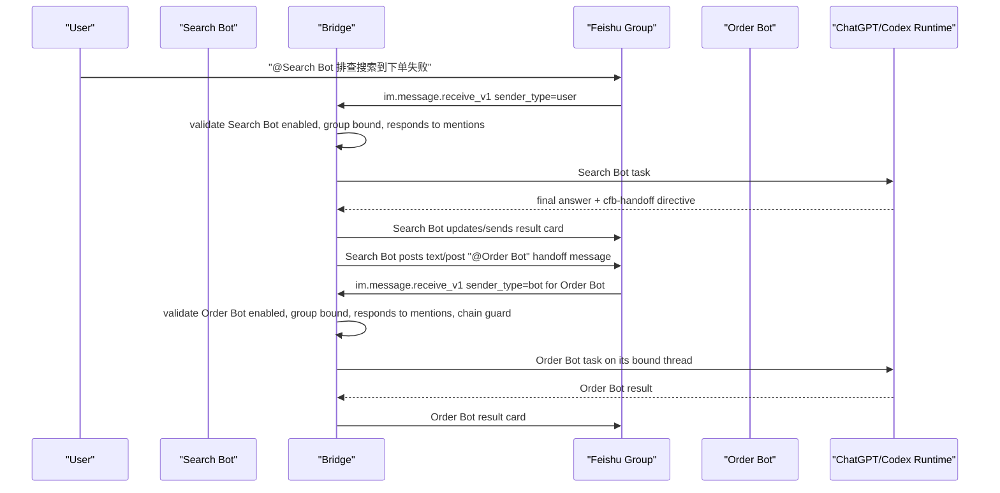

# feat: Enable real Feishu bot-to-bot collaboration

## Summary

Support Scheme B: different owner-managed Feishu application robots can collaborate inside the same group through real Feishu `@bot` messages. A source bot can decide that another domain bot should continue investigation or implementation, post a normal group message that explicitly mentions the target bot, and the target bot receives that message through Feishu's bot-including group `@bot` event permission.

For the MVP validation release, collaboration is open by default. People may mention bots, bots may mention bots, and bots may mention people. The only bridge-side response control is whether the target bot is enabled and configured to respond to group mentions. The MVP does not add tenant-key checks, human/bot allowlists, source-target grants, or mutual owner authorization.

---

## Problem Frame

The bridge is evolving from a single remote-control bot into a multi-agent work surface. In a production troubleshooting or feature-development group, separate teams may own separate robots:

- Search Bot: owned by the search team, trained/configured with flight search domain knowledge and data.
- Order Bot: owned by the order team, trained/configured with booking and order-domain knowledge and data.
- Other future bots: pricing, policy, settlement, after-sales, release, SRE, and QA.

The business goal is that a user can ask one bot to investigate, and that bot can autonomously involve another domain bot when the task crosses team boundaries. The bridge must support AI decision, AI work, and AI troubleshooting while preserving visible group collaboration, task serialization, and runaway-message protection.

---

## Requirements

- R1. A group may contain multiple bridge-managed application bots owned by different owners or teams.
- R2. Human group members may mention any bridge-managed bot in the group.
- R3. A source bot may post a real Feishu group message that mentions a target bot and includes a bounded handoff request.
- R4. A bot may mention a human group member for notification or escalation when the channel supports a real user mention.
- R5. A target bot may receive and process user-sender or bot-sender group mentions when the target app has Feishu's bot-including `@bot` event permission, the bot exists, the bot is enabled, the group is bound for that bot, and the bot's group-mention response switch is on.
- R6. MVP authorization is intentionally simple: no tenant-key validation, no member allowlist, no bot-sender allowlist, and no source-target mutual grant. Future stricter access policy must be designed separately after MVP validation.
- R7. Bot senders may start only ordinary task turns. They must never execute group management commands, mutate bindings, change model/CWD/access settings, or decide approvals.
- R8. Handoffs must preserve the visible Feishu message boundary: source bot output, target bot mention, target task, and final result are visible in the group or thread.
- R9. Handoffs must be idempotent by `chainId + handoffId + source message id + target bot`.
- R10. The chain must carry bounded-execution protection: hop limit, TTL, duplicate handoff tracking, and per-pair rate limiting. MVP does not reject a handoff only because the target appears in the advisory visited set.
- R11. A target bot may bind the same group to a different ChatGPT thread than the source bot, or both bots may bind to the same thread. Same-thread execution must keep the existing per-thread serialization.
- R12. A disabled, unknown, removed, or unbound target bot must not accept the handoff. Locally configured disabled/unavailable/unbound bots may return a safe reason; unknown/removed bots remain silent.
- R13. Handoff payloads must avoid dumping long prompts, private chain-of-thought, credentials, raw logs, or unbounded task history into the group.
- R14. Runtime health, doctor output, and logs must expose collaboration readiness without recording task payload content.
- R15. The Feishu collaboration protocol must be platform-independent, but execution runner readiness must be reported per runtime route and per host platform.
- R16. macOS Desktop-attached execution may be the first supported Desktop route. Windows Desktop-attached execution must stay unavailable until native named-pipe discovery and owner/session attestation are implemented.
- R17. Cross-platform group collaboration should prefer App Server stable execution when available because it does not depend on platform-specific ChatGPT Desktop IPC.

---

## Scope Boundaries

- No all-group-message listener. The feature uses explicit target-bot mentions, not sensitive full group-message ingestion.
- No bot-sender management plane. Bot-originated `/bind`, `/external`, `/model`, `/cwd`, `/status`, approval, and card-management actions remain blocked.
- No new permission model in the MVP. Response is controlled only by the target bot's existing enabled/respond-to-mentions switches.
- No tenant-key check or member allowlist in the MVP. This keeps the validation version open and easy to test.
- No cross-bridge distributed locking in the first implementation. Collaboration is reliable for bots managed by the same local bridge process; external bridge instances are future work.
- No hidden fan-out to all domain bots. A handoff targets one explicit bot per directive unless a later policy explicitly adds fan-out.
- No automatic training-data sharing between teams. A bot exposes only its configured role description and accepts bounded task input; its owner-managed data remains behind that bot's runtime.
- No unlimited autonomous chatter. Multi-hop is allowed only within configured hop, TTL, duplicate, and cooldown limits.
- No claim that Windows Desktop-attached execution is supported in the first implementation. Windows remains fail-closed unless a native probe can attest the named-pipe endpoint.
- The Feishu handoff protocol is cross-platform, but whether the resulting task can execute is determined by the selected runtime route.

### Deferred to Follow-Up Work

- Stricter access policy if MVP validation proves it is needed.
- Cross-process or remote bridge federation with shared chain state.
- Web UI for bot collaboration topology and audit review.
- Multi-target fan-out and merge/reducer bots.
- Team-specific cost accounting and SLA dashboards.
- Windows Desktop IPC native probe and signed endpoint attestation.

---

## Context & Research

### Existing Code Patterns

- `src/app/lark/intake.ts` already distinguishes `sender_type=user` and `sender_type=bot`, and currently rejects group bot senders unless the bot config enables bot mentions.
- `src/app/config.ts`, `.env.example`, `src/app/bot-config-store.ts`, and `src/app/bot-command.ts` already carry `ALLOW_GROUP_BOT_MENTIONS` / `allowGroupBotMentions`. For the MVP, this existing bot-level switch is the response gate for bot-sender group mentions.
- `src/app/binding-store.ts` persists bot-scoped group bindings with `botKey + tenantKey + chatId`.
- `src/app/conversation-binding-service-v3.ts` already owns owner-only group binding/status policy commands.
- `src/app/main.ts` routes accepted inbound events to the bot-specific binding service and shared orchestrator.
- `src/app/in-memory-orchestrator.ts` and `src/app/task-scheduler.ts` already serialize by ChatGPT thread id, which is the right concurrency boundary when two bots bind to the same thread.
- `README.md` documents that the currently verified Desktop IPC path is macOS and Windows is future work.
- `src/app/platform/macos-platform-adapter.ts` attests macOS Unix socket endpoints.
- `src/app/platform/windows-platform-adapter.ts` intentionally fails closed without an attested native probe and must not guess named-pipe paths.
- `docs/plans/2026-07-28-001-feat-dual-runtime-modes-plan.md` defines Desktop-attached and App Server stable execution routes. Group collaboration should reuse that route policy instead of inventing another execution mode.

### External References

- Feishu `im.message.receive_v1` supports a separate permission for receiving group messages where users and other bots mention the current bot: `im:message.group_at_msg.include_bot:readonly`.
- The same receive event exposes `sender_type`, which is the contract bridge should use to distinguish users from bots.
- Sending a group message requires the application bot to be in the group, have send permission, and call the IM send/reply APIs with a de-duplication UUID.
- Feishu cards can display `@` mentions and may notify people, but bridge must not rely on card-rendered mentions to trigger another robot's `im.message.receive_v1` event.
- Feishu text/post messages are the collaboration trigger surface. Implementation must verify the exact target-bot and user mention format for text/post through the current Feishu API explorer before enabling production handoffs.

---

## High-Level Technical Design

This diagram illustrates the MVP approach and is directional guidance for review, not implementation specification.



Use a double-message model for collaboration. Cards remain the display and interaction surface for task progress, final answers, approvals, and manual controls. A separate Feishu `text` or `post` message is the only automatic bot-to-bot `@` trigger.

The cross-channel message rendering abstraction is defined separately in `docs/plans/2026-07-28-003-feat-channel-neutral-message-renderer-plan.md`. This document only depends on that layer for rendering bounded bot/user mention messages and preserving task card output.

Handoff envelope shape:

```text
@Order Bot
[cfb-handoff v1 chain=... handoff=... from=search-bot hop=1 ttl=...]
目标: 排查订单创建失败是否由库存/锁座/下单参数导致
上下文摘要: Search Bot 已确认搜索接口返回了可下单价格...
证据: requestId=..., searchTraceId=...
期望输出: 给出订单域判断、下一步动作和需要搜索域补充的信息
```

The envelope is intentionally human-readable. Bridge may parse the structured header, but group members can still understand why the target bot was called.

---

## Key Technical Decisions

- Use real Feishu messages for inter-bot handoff. The source bot must call Feishu send/reply APIs and explicitly mention the target bot.
- Use a double-message model for group collaboration: keep result/progress output as cards, and emit a separate `text` or `post` message when the bridge needs to trigger another bot. Card-rendered `@` mentions are allowed for human readability, but they are not the bot-to-bot trigger contract.
- Bot-to-human mentions are notifications, not task triggers. They use the same renderer/transport boundary but do not create a bridge task.
- Use the separate channel-neutral message renderer plan for formatting, pagination, mention rendering, and fallback decisions; this bot-to-bot plan should not define channel rendering primitives.
- MVP collaboration is open by default. The bridge does not require source-target grants, sender allowlists, member allowlists, or tenant-key checks.
- The target bot's enabled state and group-mention response switch are the only response gates in the MVP.
- Add a bot role profile separate from response control. Role profiles help AI decide who to call, but they do not grant or deny access.
- Maintain a per-source-bot external bot directory for bots owned by other Bridge instances or other owners. The directory stores only `sourceBotKey + tenantKey + chatId + external bot open_id + display name`, and is used only to render a real Feishu `@external bot` mention.
- Drive AI decision through an explicit directive contract. The model may request a handoff by emitting a bounded `cfb-handoff` directive in its final output. Bridge validates and materializes it as a real Feishu `@target bot` message.
- Keep the directive parser conservative. Invalid, unknown-target, disabled-target, unbound-target, overlong, or expired directives are ignored or converted to a visible non-actionable note, never executed optimistically.
- Keep bot-sender messages task-only. If a bot sender text begins with `/`, it is never routed to command services.
- Use `chainId`, `handoffId`, `parentMessageId`, source `botKey`, target `botKey`, target `chatId`, and target `threadId` for dedupe and audit.
- Use the existing thread scheduler for same-thread concurrency. Collaboration adds cross-bot ingress, not a second execution lock.
- Prefer one-hop automatic handoff for the MVP. Multi-hop works only within the configured hop, TTL, duplicate, and per-pair cooldown guards.
- Reply with clear reasons only for locally known disabled/unavailable/unbound target bots. Unknown or removed bot events remain silent.
- Separate collaboration protocol from execution runner. Feishu receive/send, handoff parsing, chain guards, and response toggles must be OS-neutral; runtime routing decides whether the accepted task can execute through macOS Desktop IPC, Windows Desktop IPC, or App Server stable.
- Treat macOS Desktop-attached as the initial Desktop-supported collaboration route.
- Treat Windows Desktop-attached as not ready until native named-pipe probing and endpoint attestation are implemented and tested.
- Prefer App Server stable for groups that need Windows/macOS compatible collaboration behavior.

---

## Implementation Units

### U1. Define MVP Mention Collaboration Model

**Goal:** Persist bot role profiles and reuse existing response switches without introducing source/receiver authorization policy.

**Requirements:** R1, R5, R6, R7, R11

**Dependencies:** None

**Files:**
- `src/app/bot-config-store.ts`
- `src/app/domain.ts`
- `test/app/bot-config-store.test.ts`

**Approach:**

- Extend bot records with optional `roleProfile`: display role name, owner/team label, short domain description, and safe collaboration instructions.
- Treat the existing bot enabled state plus group-mention response switches as the only MVP response controls.
- Default MVP mention collaboration to open for configured/enabled bots unless an explicit response switch disables it.
- Do not add per-group `allowedBotSenderKeys`, `allowedBotSenderOpenIds`, `allowedHandoffTargetBotKeys`, or tenant/member allowlists for the MVP.
- Keep schema loading backward-compatible for existing bindings and bots.

**Patterns to follow:** Existing schema validation, atomic write, and read-compatible defaulting in `src/app/bot-config-store.ts`.

**Test scenarios:**
- Existing bot and binding files without collaboration policy fields load normally.
- Existing migrated bots receive a generated bot key and keep their current direct-chat behavior.
- A disabled bot or a bot with group mention response turned off does not start group tasks.
- Bot role metadata is persisted and redacted from secret-bearing diagnostic output.

**Verification:** Existing single-bot and multi-bot startup behavior remains unchanged, while configured/enabled bots can participate in open group mention collaboration.

### U2. Receive Human and Bot Mentions Through One Task Path

**Goal:** Accept explicit group mentions from users or bots when the target bot is ready to respond.

**Requirements:** R2, R3, R5, R6, R7, R9, R12

**Dependencies:** U1

**Files:**
- `src/app/lark/intake.ts`
- `src/app/lark/event-server.ts`
- `src/app/main.ts`
- `src/app/group-access-policy.ts`
- `test/app/lark-image-input.test.ts`
- `test/app/group-access-policy.test.ts`

**Approach:**

- Normalize `sender_type=user` and `sender_type=bot` group messages through the same inbound shape.
- Require an explicit mention of the current bot before task creation.
- After binding lookup, validate only MVP readiness:
  - target bot exists,
  - target bot is enabled,
  - target group binding exists,
  - target bot responds to group mentions,
  - chain guard accepts the envelope when the sender is a bot.
- Do not check tenant-key membership, member allowlists, source bot allowlists, or source-target grants.
- Do not execute commands from bot senders even when the target bot accepts ordinary task mentions.
- Return an explicit disabled/unavailable/unbound reason only when the target bot is locally known and the failure is safe to reveal.
- Keep unknown or removed bot events silent.

**Patterns to follow:** Existing command/task split and external group member policy suppression boundaries.

**Test scenarios:**
- Human group member mention starts an ordinary task for the mentioned bot.
- Bot sender mention is normalized when the current bot is explicitly mentioned.
- Bot sender mention starts an ordinary task by default when the target bot is enabled, bound, and responding.
- Bot sender slash command is ignored and does not mutate binding or bot config.
- Mentioning a different bot is rejected before task creation.
- Disabled, non-responding, or unbound local target bots return a short safe reason; unknown targets remain silent.

**Verification:** Enabling Feishu's bot-including group `@bot` event permission is sufficient for one configured bot to invoke another configured bot, while the command path remains closed to bot senders.

### U3. Emit Real Feishu Mentions From Bot Output

**Goal:** Let a source bot post normal Feishu group messages that mention a target bot or a human member.

**Requirements:** R3, R4, R8, R9, R10, R13

**Dependencies:** U1

**Files:**
- `src/app/lark/handoff-message-emitter.ts`
- `src/app/external-bot-directory.ts`
- `src/app/lark/group-bot-discovery.ts`
- `src/app/lark/client.ts`
- `src/app/main.ts`
- `test/app/external-bot-directory.test.ts`
- `test/app/group-bot-discovery.test.ts`
- `test/app/lark-handoff-message-emitter.test.ts`

**Approach:**

- Add a small sender that uses the source bot's Lark credentials to send or reply with a text/post message into the current group.
- For bot-to-bot handoff, include a real target-bot mention and a bounded human-readable handoff envelope.
- For bot-to-human notification, include a real user mention and a short notification body. This must not create a bridge task.
- For externally owned bots, refresh Feishu's group-bot list through `GET /open-apis/im/v1/chats/:chat_id/members/bots` when the source bot receives a group message, completes a group binding, starts with new-version group bindings, or receives bot membership events. Store discovered external bot open IDs in `external-bots.json`.
- New bindings store `chatType` metadata, and startup backfill scans only `chatType=group` bindings. Older bindings without that field are refreshed by the next group mention or by re-running `/bind`, avoiding accidental bulk group-member calls for private bindings.
- Treat bot membership events as accelerators, not the only discovery path. Feishu's bot-added event is delivered to the newly added bot and robot-invites-robot may not trigger it, so ordinary group-message refresh remains required.
- Do not use task result cards, card `lark_md`, or card title mentions as the automatic trigger for the target bot. Cards may include a visible handoff summary and manual controls, but the target bot must be invoked by the separate text/post message.
- Prefer `post` for structured handoff content because it can carry a target mention, summary, evidence, and expected output in a readable shape. Keep `text` as the fallback for the smallest viable trigger.
- Use Feishu `uuid` for send de-duplication based on `chainId + handoffId + sourceBotKey + targetBotKey`.
- Cap envelope size and strip raw reasoning, credentials, raw logs, local paths, and oversized context.
- Verify target bot and user mention formatting through Feishu API explorer before production rollout. Until verified, keep the emitter behind a feature flag.

**Patterns to follow:** Existing `CardKitClient` and reply/send card idempotency handling.

**Test scenarios:**
- Emitter builds a handoff message with target bot mention, chain header, task summary, evidence, and expected output.
- Emitter builds a human notification message with a real user mention and no handoff header.
- Emitter sends bot handoff as `post` or `text`, never as an `interactive` card.
- Source task card can display a handoff summary, but removing that summary does not affect whether the target-bot trigger message is emitted.
- Group-bot discovery records external bot open IDs and names, filters local configured bots, and throttles repeated refreshes for the same source bot and group.
- Handoff can target a discovered external bot by display name or open ID without importing that target bot's app secret into the source Bridge.
- Oversized handoff content is summarized/truncated before send.
- Same handoff id sends at most once within the dedupe window.
- Missing target bot open ID or user open ID fails closed before calling Feishu.
- Feishu send failure is surfaced as a source bot diagnostic card without starting target work.

**Verification:** Source bot can visibly post a target-bot mention in a test group, and Feishu renders it as an actual mention of the target bot. Source bot can also visibly mention a human member for notification.

### U4. Parse AI Handoff Directives

**Goal:** Convert an AI decision into a validated handoff request.

**Requirements:** R3, R5, R6, R9, R10, R13

**Dependencies:** U1, U3

**Files:**
- `src/app/collaboration/handoff-directive.ts`
- `src/app/collaboration/handoff-coordinator.ts`
- `src/app/in-memory-orchestrator.ts`
- `test/app/handoff-directive.test.ts`
- `test/app/handoff-coordinator.test.ts`

**Approach:**

- Define a conservative final-answer directive block, for example:
  - target bot key or display name,
  - reason,
  - bounded task,
  - context summary,
  - evidence IDs,
  - expected output,
  - optional confidence.
- Parse directives only from terminal assistant output.
- Resolve the target bot from the local bot registry and the current group binding.
- Validate the target bot exists, is enabled, is bound to the current group, responds to group mentions, has an open ID, has a ready route when locally knowable, and passes chain guard.
- Do not validate the directive against source-target grants or allowlists in the MVP.
- Remove or hide the directive from user-facing final cards only after the handoff is successfully materialized; otherwise show a short failure note.
- Create one handoff per final output initially. Defer multi-target fan-out.

**Patterns to follow:** Existing content sanitizer and idempotent card update boundaries.

**Test scenarios:**
- Well-formed directive resolves a target bot and creates a handoff request.
- Unknown target, disabled target, unbound target, malformed directive, and oversized directive are rejected.
- A final answer without directive behaves exactly as today.
- A directive from a bot-sender task respects hop, TTL, duplicate, and cooldown limits.
- Directive payload redaction removes credentials, local file paths, and raw large logs.

**Verification:** Search Bot can decide to call Order Bot by emitting the directive; bridge posts one visible Feishu handoff message.

### U5. Add Collaboration Prompt Context

**Goal:** Give each bot enough role and group context to decide when to collaborate.

**Requirements:** R1, R3, R5, R6, R13

**Dependencies:** U1, U4

**Files:**
- `src/app/collaboration/collaboration-context.ts`
- `src/app/main.ts`
- `src/app/in-memory-orchestrator.ts`
- `test/app/collaboration-context.test.ts`

**Approach:**

- For each group task, derive a short collaboration context from the current group:
  - current bot role,
  - other configured bots in the same group that are enabled, bound, and responding to group mentions,
  - each target bot's role description,
  - directive syntax,
  - constraints: one target, bounded context, no secrets, no management.
- Keep the context read-only and advisory. It helps the model choose a collaborator, but it is not an authorization list.
- Add this context to the task sent to Codex in a way that is visible enough for audit and stable enough for model behavior.
- Keep role profiles concise and owner-controlled.
- If no other responding bots are available in the group, do not alter prompts.

**Patterns to follow:** Existing task text preparation and command/task split in `src/app/main.ts`.

**Test scenarios:**
- A group with no other responding bots produces no collaboration context.
- A group with one responding target bot produces bounded role and directive instructions.
- Context excludes disabled, unbound, or non-responding bots.
- Context size is capped and deterministic.

**Verification:** Search Bot knows Order Bot exists and when to hand off, but cannot invent unavailable targets.

### U6. Enforce Chain State and Rate Limits

**Goal:** Prevent unbounded autonomous chatter and duplicate handoffs.

**Requirements:** R9, R10, R11, R12, R14

**Dependencies:** U2, U3, U4

**Files:**
- `src/app/collaboration/handoff-chain-store.ts`
- `src/app/collaboration/handoff-coordinator.ts`
- `src/app/runtime-health.ts`
- `test/app/handoff-chain-store.test.ts`

**Approach:**

- Keep current-process chain state with TTL:
  - `chainId`,
  - advisory visited bot keys for traceability,
  - emitted handoff IDs,
  - hop count,
  - parent message IDs,
  - per source-target pair cooldown.
- Default max hop count to 1 for MVP validation. Raise to 2 only after one-hop behavior is stable.
- Stop on expired chain, max-hop breach, duplicate handoff ID, or cooldown breach. Do not stop solely because the target appears in the advisory visited set.
- Publish content-free counters: emitted, accepted, blocked, and duplicate. Keep the deprecated loop-blocked field at zero for health-schema compatibility while visited-loop validation is disabled.
- Treat restart as loss of in-memory guard; rely on Feishu message IDs and send UUIDs for duplicate reduction after restart.

**Patterns to follow:** Existing in-memory task scheduler and runtime health publisher.

**Test scenarios:**
- First handoff in a chain is accepted and recorded.
- Duplicate handoff ID is rejected.
- A target already present in the advisory visited set is still allowed in the MVP.
- Max hop and TTL are enforced.
- Rate-limited source-target pair does not emit another message.

**Verification:** Misbehaving prompts cannot create unbounded bot chatter in one bridge runtime because max hop, TTL, duplicate, and cooldown guards still apply.

### U7. Add Readiness Diagnostics and Documentation

**Goal:** Make setup and rollout inspectable for operators and bot owners.

**Requirements:** R3, R5, R12, R14

**Dependencies:** U1-U6

**Files:**
- `src/app/doctor.ts`
- `src/app/bot-command.ts`
- `README.md`
- `docs/plans/2026-07-28-002-feat-bot-to-bot-collaboration-plan.md`
- `test/app/doctor.test.ts`
- `test/app/bot-command.test.ts`

**Approach:**

- `bot doctor` reports collaboration readiness per bot:
  - has bot-including group mention permission configured/documented,
  - bot open ID available,
  - bot enabled,
  - group-mention response switch status,
  - role profile configured,
  - groups bound for the bot,
  - disabled, non-responding, unbound, or unavailable target gaps.
- `bot list` stays concise but includes enabled/responding summary.
- README documents Feishu permission requirements and the MVP workflow.
- Add a troubleshooting section for "source bot posted @ target but target did not respond".

**Patterns to follow:** Existing bot list/doctor output and content-free runtime diagnostics.

**Test scenarios:**
- Doctor shows not-ready when target bot open ID is missing.
- Doctor shows not-ready when target bot is disabled or not responding to mentions.
- Doctor shows ready for a group where the target bot is enabled, bound, and responding.
- Diagnostic output never prints app secrets or task payloads.

**Verification:** Before testing in a real group, owners can tell whether a missing response is caused by Feishu permission, bot response switch, binding, or runtime readiness.

### U8. Add Platform and Route Readiness for Collaboration

**Goal:** Keep the Feishu collaboration protocol cross-platform while failing closed for runtime routes that are not ready on the current host.

**Requirements:** R14, R15, R16, R17

**Dependencies:** U1, U2, U4, U7

**Files:**
- `src/app/platform/create-platform-adapter.ts`
- `src/app/platform/macos-platform-adapter.ts`
- `src/app/platform/windows-platform-adapter.ts`
- `src/app/runtime-health.ts`
- `src/app/doctor.ts`
- `src/app/main.ts`
- `docs/plans/2026-07-28-001-feat-dual-runtime-modes-plan.md`
- `test/app/doctor.test.ts`
- `test/app/platform-adapter.test.ts`

**Approach:**

- Add a collaboration readiness check that combines:
  - Feishu readiness: bot open ID, group binding, target mention permission, target bot enabled/responding.
  - Runner readiness: selected route, host platform, route health, and Desktop/App Server protocol compatibility.
- Before emitting a handoff, verify that the target binding has a ready execution route when that route is locally knowable.
- Before accepting a bot-sender handoff, verify the receiver route again so stale diagnostics cannot start work on an unavailable runner.
- On macOS Desktop-attached routes, rely on the existing macOS adapter endpoint attestation.
- On Windows Desktop-attached routes, fail closed until the Windows adapter has a native named-pipe probe and owner/session attestation.
- On App Server stable routes, treat runner readiness as OS-neutral once the App Server schema and health checks pass.
- Extend `bot doctor` / runtime diagnostics with per-group collaboration readiness:
  - `feishuReady`
  - `runnerReady`
  - `route`
  - `platform`
  - `reason`

**Patterns to follow:** Existing route health and compatibility reporting in `src/app/runtime-health.ts` and `src/app/doctor.ts`.

**Test scenarios:**
- macOS Desktop-attached target is ready only when the macOS adapter attests the socket endpoint.
- Windows Desktop-attached target is not ready without a native named-pipe probe.
- App Server stable target is not blocked by Windows Desktop IPC readiness when the App Server contract is healthy.
- Handoff to a target with unavailable runner is blocked with a safe diagnostic before target task creation.
- Doctor reports Feishu readiness and runner readiness separately.

**Verification:** Operators can tell whether a group collaboration failure is caused by Feishu permission/bot response state/binding or by the selected execution route.

---

## Phased Delivery

### Phase 1: MVP Receive and Diagnostics

- Keep collaboration open by default for configured/enabled bots that respond to group mentions.
- Do not add source-target grants, tenant-key checks, member allowlists, or bot-sender allowlists.
- Add readiness diagnostics and bot-sender inbound validation.
- Add route/platform readiness diagnostics for collaboration, including explicit Windows Desktop-attached not-ready reasons.
- Do not emit automatic handoff messages yet.
- Validate Feishu permission `im:message.group_at_msg.include_bot:readonly` in a real group.

### Phase 2: One-Hop Automatic Handoff

- Add directive parser, prompt context, and handoff emitter.
- Consume the separate channel-neutral renderer for handoff trigger and human mention formatting when that layer is available.
- Enable one handoff per final answer with max hop count 1 only when the target binding's execution route is ready.
- Support macOS Desktop-attached and App Server stable routes first. Keep Windows Desktop-attached disabled until the native probe is complete.
- Keep fan-out disabled.

### Phase 3: Controlled Expansion

- Raise hop limit only after one-hop behavior is stable.
- Add audit improvements and operator summaries.
- Consider source bot follow-up after target bot result only after stable cross-bridge participant identity is available.
- Design stricter access policy only if MVP validation shows that default-open collaboration is insufficient.

---

## Risk Analysis & Mitigation

| Risk | Mitigation |
| --- | --- |
| Infinite bot loops | Chain TTL, max hops, duplicate handoff IDs, per-pair cooldown, one handoff per final answer initially |
| MVP default-open bot invocation is too broad | Keep only for validation groups, expose bot enabled/responding switches, log content-free chain IDs, and revisit stricter policy after MVP |
| Bot sender executes management commands | Hard route bot senders only to ordinary tasks; slash commands ignored before command services |
| Feishu permission missing | Doctor readiness and rollout checklist require `im:message.group_at_msg.include_bot:readonly` on target bots |
| Mention message does not render as a real bot/user mention | Keep emitter behind feature flag until API explorer/live group verifies mention syntax |
| Card mention is mistaken for a bot trigger | Document and test the double-message model: card for display, text/post for automatic `@bot` trigger |
| Group noise from failures | Unknown/removed bots stay silent; known local failures use short non-actionable reason cards |
| Secret/context leakage | Handoff envelope cap, sanitizer, redaction, evidence IDs instead of raw logs |
| Same ChatGPT thread concurrent writes | Existing scheduler remains keyed by thread ID across all bots |
| Plan appears cross-platform while execution is macOS-only | Document protocol/runner separation; doctor reports route/platform readiness; prefer App Server stable for cross-platform groups |
| Windows named-pipe endpoint spoofing | Keep Windows Desktop IPC fail-closed until native owner/session attestation is implemented |

---

## Acceptance Scenarios

- Search Bot and Order Bot are both in one group, both are configured in the bridge, both are enabled, both are bound to the group, and both respond to group mentions. A user asks Search Bot to investigate search-to-order failure. Search Bot completes search analysis, emits one directive, bridge keeps the Search Bot result in a card and separately posts a real `text`/`post` `@Order Bot` handoff message. Order Bot receives that message and starts its own bound task.
- Search Bot mentions a human member in the group for notification. Feishu renders the member mention as a real mention, but the bridge does not create a task for that human mention.
- If Order Bot is disabled, not responding to group mentions, or not bound to the group, Search Bot may still complete its own answer, but bridge does not start Order Bot work. The group receives a short safe reason only when Order Bot is locally known.
- If Order Bot lacks Feishu bot-including `@bot` event permission, doctor reports not-ready and the live handoff does not silently appear successful.
- If Search Bot tries to call Order Bot twice with the same handoff ID, only one Feishu message is emitted.
- If Order Bot tries to hand back to Search Bot in the same chain after the hop limit is reached, bridge blocks the handoff and posts no recursive task.
- If Search Bot and Order Bot bind to the same ChatGPT thread, their turns are serialized by the existing thread scheduler.
- On macOS, a Desktop-attached target can accept a handoff only after the macOS endpoint is attested and the route is healthy.
- On Windows without a native Desktop IPC probe, a Desktop-attached target is reported as not ready and no target task is created.
- On Windows or macOS with App Server stable selected and healthy, Feishu handoff can execute without depending on Desktop IPC.

---

## Operational Rollout Notes

- Start with two internal bots in a dedicated test group: Search Bot and Order Bot.
- Require each target bot app to add Feishu permission `im:message.group_at_msg.include_bot:readonly` and publish the app version.
- Require source bot apps that need external bot discovery to add Feishu permission `im:chat.members:read` and publish the app version.
- Subscribe to Feishu `im.chat.member.bot.added_v1` and `im.chat.member.bot.deleted_v1` where available, but rely on group-message refresh for eventual discovery of other bots.
- Keep MVP collaboration default-open for configured/enabled bots that respond to group mentions.
- Use the existing bot response switch to stop a bot from responding to group `@` messages.
- Do not configure tenant-key checks, member allowlists, bot-sender allowlists, or source-target grants for MVP validation.
- Enable automatic collaboration first for one group, one-hop only.
- Prefer App Server stable for cross-platform group collaboration trials. Use macOS Desktop-attached only when the bridge host is macOS and the Desktop route is attested.
- Do not mark Windows Desktop-attached collaboration supported until the Windows native probe and attestation work is implemented.
- Capture logs by chain ID and content-free counters; do not log prompt or answer payload.
- Treat live validation as required because Feishu bot/user mention rendering and bot-sender event delivery are external contracts.
- In live validation, verify that a card-only `@Order Bot` display does not count as the trigger path, and that the separate text/post handoff message produces the target bot's `im.message.receive_v1` event.
