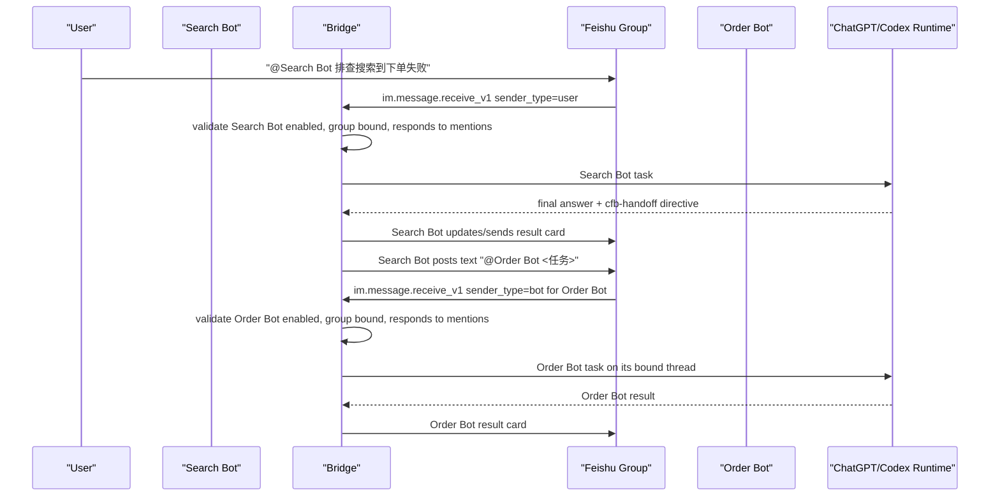

# feat: 支持真实飞书机器人协作

## 概要

支持方案 B：不同 owner 管理的飞书应用机器人可以在同一个群里通过真实的飞书 `@机器人` 消息协作。源机器人可以判断另一个领域机器人应该继续排查或实现，然后在群里发送一条显式 @ 目标机器人的普通消息；目标机器人通过飞书“包含机器人发送者的群 @ 机器人事件”权限收到该消息。

MVP 验证版本默认开放协作。人可以 @ 机器人，机器人可以 @ 机器人，机器人也可以 @ 人。bridge 侧唯一的响应控制是目标机器人是否启用，以及是否配置为响应群 @。MVP 不新增 tenant_key 校验、人或机器人成员白名单、source-target grant、双 owner 授权关系。

---

## 问题背景

bridge 正在从单个远程控制机器人演进成多 agent 工作界面。在生产排障或需求开发群中，不同团队可能拥有不同机器人：

- Search Bot：搜索团队拥有，配置/训练了机票搜索领域知识和数据。
- Order Bot：订单团队拥有，配置/训练了预订和订单领域知识和数据。
- 未来其他机器人：价格、政策、结算、售后、发布、SRE、QA。

业务目标是：用户可以让一个机器人开始排查，当任务跨团队边界时，该机器人可以自主拉起另一个领域机器人。bridge 必须支持 AI 决策、AI 工作和 AI 排障，同时保留可见群协作、任务串行和防刷屏保护。

---

## 需求

- R1. 一个群可以包含多个 bridge 管理的应用机器人，这些机器人可归属于不同 owner 或团队。
- R2. 群成员可以 @ 群里的任意 bridge 管理机器人。
- R3. 源机器人可以在飞书群里发送一条真实消息，@ 目标机器人，并携带有边界的 handoff 请求。
- R4. 当渠道支持真实用户 mention 时，机器人可以 @ 群里的普通成员进行通知或升级。
- R5. 当目标应用具备飞书“包含机器人发送者的 @ 机器人事件”权限、目标机器人存在、目标机器人启用、该群已绑定到该机器人、且该机器人群 @ 响应开关开启时，目标机器人可以接收并处理用户或机器人发送者的群 @ 消息。
- R6. MVP 授权模型刻意保持简单：不校验 tenant_key、不校验成员白名单、不校验 bot sender 白名单、不要求 source-target 双向 grant。未来如果需要更严格访问策略，必须在 MVP 验证后单独设计。
- R7. 机器人发送者只能启动普通任务轮次，绝不能执行群管理命令、修改绑定、修改模型/CWD/访问设置，或决定审批。
- R8. handoff 必须保留可见的飞书消息边界：源机器人输出、目标机器人 mention、目标任务和最终结果都能在群里或话题中看到。
- R9. handoff 必须按 `chainId + handoffId + source message id + target bot` 幂等。
- R10. chain 必须携带有边界执行保护：跳数限制、TTL、重复 handoff 记录和每对 bot 的限流。MVP 不因为目标出现在 advisory visited set 中就拒绝 handoff。
- R11. 目标机器人可以把同一个群绑定到与源机器人不同的 ChatGPT 线程，也可以绑定到同一个线程。同线程执行必须沿用现有按线程串行。
- R12. 禁用、未知、已移除或未绑定的目标机器人不得接受 handoff。本地已配置的禁用/不可用/未绑定机器人可以返回安全原因；未知或已移除机器人保持静默。
- R13. handoff payload 不得把长 prompt、私有思维链、凭证、原始日志或无边界任务历史倾倒到群里。
- R14. runtime health、doctor 输出和日志必须暴露协作就绪状态，但不能记录任务 payload 内容。
- R15. 飞书协作协议必须平台无关，但执行 runner 的就绪状态必须按 runtime route 和宿主平台报告。
- R16. macOS Desktop-attached 执行可以作为第一个支持的 Desktop route。Windows Desktop-attached 在实现 native named-pipe discovery 和 owner/session attestation 前必须保持不可用。
- R17. 跨平台群协作应优先使用 App Server stable，因为它不依赖平台特定的 ChatGPT Desktop IPC。

---

## 范围边界

- 不监听全量群消息。该功能使用显式 @ 目标机器人，而不是敏感的全群消息摄取。
- 不开放机器人发送者管理面。机器人发出的 `/bind`、`/external`、`/model`、`/cwd`、`/status`、审批和卡片管理动作继续阻断。
- MVP 不新增权限模型。是否响应只由目标机器人已有的启用/响应 @ 开关控制。
- MVP 不做 tenant_key 校验或成员白名单。这让验证版本保持开放且便于测试。
- 首版不做跨 bridge 进程的分布式锁。协作在同一本地 bridge 进程管理的机器人之间可靠；外部 bridge 实例是后续工作。
- 不做隐藏 fan-out 到所有领域机器人。除非后续策略明确增加 fan-out，否则一个 directive 只指向一个明确机器人。
- 不自动共享团队训练数据。机器人只暴露配置的角色描述并接受有边界任务输入；owner 管理的数据仍留在该机器人的 runtime 后面。
- 不允许无限自主刷屏。多跳只有在配置的跳数、TTL、重复和 cooldown 限制内才允许。
- 首版不声明支持 Windows Desktop-attached 执行。除非 native probe 能证明 named-pipe endpoint，否则 Windows 保持 fail-closed。
- 飞书 handoff 协议跨平台，但最终任务能否执行由选定 runtime route 决定。

### 后续工作

- 如果 MVP 验证证明需要，再设计更严格访问策略。
- 带共享 chain state 的跨进程或远程 bridge federation。
- bot 协作拓扑和审计 review 的 Web UI。
- 多目标 fan-out 和 merge/reducer bots。
- 团队级成本统计和 SLA dashboard。
- Windows Desktop IPC native probe 和签名 endpoint attestation。

---

## 上下文与调研

### 现有代码模式

- `src/app/lark/intake.ts` 已经区分 `sender_type=user` 和 `sender_type=bot`，并且当前会拒绝群里的机器人发送者，除非 bot 配置开启 bot mentions。
- `src/app/config.ts`、`.env.example`、`src/app/bot-config-store.ts` 和 `src/app/bot-command.ts` 已经携带 `ALLOW_GROUP_BOT_MENTIONS` / `allowGroupBotMentions`。对 MVP 来说，这个已有 bot 级开关就是机器人发送者群 @ 的响应闸门。
- `src/app/binding-store.ts` 以 `botKey + tenantKey + chatId` 持久化 bot-scoped 群绑定。
- `src/app/conversation-binding-service-v3.ts` 已经承载 owner-only 的群绑定/状态策略命令。
- `src/app/main.ts` 会把接受的入站事件路由到 bot-specific binding service 和共享 orchestrator。
- `src/app/in-memory-orchestrator.ts` 和 `src/app/task-scheduler.ts` 已经按 ChatGPT thread id 串行，这正是两个机器人绑定到同一线程时的并发边界。
- `README.md` 已记录当前验证过的 Desktop IPC 路径是 macOS，Windows 是后续工作。
- `src/app/platform/macos-platform-adapter.ts` 会校验 macOS Unix socket endpoint。
- `src/app/platform/windows-platform-adapter.ts` 当前故意 fail-closed，不猜测 named-pipe 路径。
- `docs/plans/2026-07-28-001-feat-dual-runtime-modes-plan.md` 定义了 Desktop-attached 和 App Server stable 执行路由。群协作应该复用该路由策略，而不是发明新的执行模式。

### 外部参考

- 飞书 `im.message.receive_v1` 对接收“用户和其他机器人 @ 当前机器人”的群消息提供独立权限：`im:message.group_at_msg.include_bot:readonly`。
- 同一个接收事件会暴露 `sender_type`，bridge 应用它区分用户发送者和机器人发送者。
- 发送群消息要求应用机器人在群里、具备发送权限，并用带去重 UUID 的 IM send/reply API。
- 飞书卡片可以展示 `@` mention，也可能通知人，但 bridge 不能依赖卡片渲染出的 mention 来触发另一个机器人的 `im.message.receive_v1` 事件。
- 飞书 text/post 消息是协作触发面。生产启用 handoff 前，必须通过当前飞书 API explorer 验证 text/post 中目标机器人和普通用户 mention 的准确格式。

---

## 高层技术设计

下图说明 MVP 方向，供评审使用，不是逐行实现规格。



群协作使用双消息模型。卡片仍然是任务进度、最终答案、审批和人工控制的展示/交互面。独立的飞书 `text` 或 `post` 消息才是自动 bot-to-bot `@` 触发器。

跨渠道消息渲染抽象单独定义在 `docs/plans/2026-07-28-003-feat-channel-neutral-message-renderer-plan.zh-CN.md`。本文只依赖该层渲染有边界的机器人/用户 mention 消息，并保留任务卡片输出。

可见 handoff 消息形态：

```text
@Order Bot 排查订单创建失败是否由库存、锁座或下单参数导致。
```

可见群消息刻意保持普通聊天形态。Bridge 不再发送或解析可见 handoff envelope；内部 chain ID 只留在源侧进程内，用于发送去重和限流。

---

## 关键技术决策

- bot 间 handoff 使用真实飞书消息。源机器人必须调用飞书 send/reply API，并显式 @ 目标机器人。
- 群协作使用双消息模型：结果/进度继续用卡片展示；bridge 需要触发另一个机器人时，额外发送一条 `text` 或 `post` 消息。卡片渲染出的 `@` mention 只用于人类可读，不作为 bot-to-bot 触发契约。
- bot @ 人是通知，不是任务触发。它走同一套 renderer/transport 边界，但不会创建 bridge task。
- 使用独立的 channel-neutral renderer 方案处理格式、分页、mention 渲染和 fallback；bot-to-bot 方案不定义渠道渲染原语。
- MVP 协作默认开放。bridge 不要求 source-target grant、sender 白名单、成员白名单或 tenant_key 校验。
- 目标机器人的 enabled 状态和群 @ 响应开关是 MVP 唯一响应闸门。
- 新增机器人角色 profile，但它和响应控制分离。角色 profile 帮助 AI 判断该调用谁，但不授予或拒绝访问。
- 为其他 Bridge 实例或其他 owner 管理的机器人维护按 source bot 分组的外部机器人目录。目录只保存 `sourceBotKey + tenantKey + chatId + 外部机器人 open_id + 展示名称`，仅用于渲染真实飞书 `@外部机器人` mention。
- 通过显式 directive contract 驱动 AI 决策。模型可以在最终输出里发出有边界的 `cfb-handoff` directive；bridge 校验后把它物化成真实飞书 `@target bot` 消息。
- directive parser 保持保守。无效、未知目标、禁用目标、未绑定目标、超长或过期 directive 要么忽略，要么转成可见但不可执行的说明，绝不乐观执行。
- 机器人发送者消息只允许进入任务路径。如果机器人发送者文本以 `/` 开头，绝不路由到命令服务。
- 使用 `chainId`、`handoffId`、`parentMessageId`、source `botKey`、target `botKey`、target `chatId` 和 target `threadId` 做去重和审计。
- 同线程并发继续使用现有 thread scheduler。协作只是新增跨 bot 入站，不新增第二套执行锁。
- MVP 优先只做一跳自动 handoff。多跳只能在配置的 hop、TTL、重复和每对 bot cooldown guard 内运行。
- 只对本地已知的禁用/不可用/未绑定目标机器人返回明确原因。未知或已移除机器人事件保持静默。
- 协作协议与执行 runner 分离。飞书接收/发送、handoff 解析、chain guard 和响应开关必须 OS-neutral；runtime routing 决定已接受任务能否通过 macOS Desktop IPC、Windows Desktop IPC 或 App Server stable 执行。
- macOS Desktop-attached 作为初始 Desktop 支持路线。
- Windows Desktop-attached 在 native named-pipe probing 和 endpoint attestation 实现并测试前保持 not ready。
- 需要 Windows/macOS 兼容协作行为的群优先使用 App Server stable。

---

## 实施单元

### U1. 定义 MVP Mention 协作模型

**目标：** 持久化机器人角色 profile，并复用已有响应开关，不引入 source/receiver 授权策略。

**需求：** R1, R5, R6, R7, R11

**依赖：** 无

**文件：**
- `src/app/bot-config-store.ts`
- `src/app/domain.ts`
- `test/app/bot-config-store.test.ts`

**实现思路：**

- 扩展 bot record，增加可选 `roleProfile`：展示角色名、owner/team 标签、简短领域描述和安全协作指令。
- 将现有 bot enabled 状态和群 @ 响应开关作为唯一 MVP 响应控制。
- 对配置且启用的机器人，MVP mention 协作默认开放，除非显式响应开关关闭。
- MVP 不新增 per-group `allowedBotSenderKeys`、`allowedBotSenderOpenIds`、`allowedHandoffTargetBotKeys` 或 tenant/member allowlist。
- 保持已有 binding 和 bot 的 schema 加载向后兼容。

**遵循模式：** `src/app/bot-config-store.ts` 中已有 schema validation、atomic write 和读兼容默认值。

**测试场景：**
- 不含协作策略字段的已有 bot 和 binding 文件可以正常加载。
- 已迁移的旧机器人获得生成的 bot key，并保持当前单聊行为。
- 禁用机器人或关闭群 @ 响应的机器人不会启动群任务。
- bot role metadata 可持久化，且不会出现在带 secret 的诊断输出中。

**验证：** 现有单 bot 和多 bot 启动行为不变；配置且启用的机器人可以参与开放的群 mention 协作。

### U2. 将人和机器人 Mention 统一进入任务路径

**目标：** 当目标机器人准备好响应时，接受来自用户或机器人的显式群 @。

**需求：** R2, R3, R5, R6, R7, R9, R12

**依赖：** U1

**文件：**
- `src/app/lark/intake.ts`
- `src/app/lark/event-server.ts`
- `src/app/main.ts`
- `src/app/group-access-policy.ts`
- `test/app/lark-image-input.test.ts`
- `test/app/group-access-policy.test.ts`

**实现思路：**

- 将 `sender_type=user` 和 `sender_type=bot` 群消息标准化成同一入站结构。
- 创建任务前必须确认消息显式 @ 当前机器人。
- binding lookup 后只校验 MVP 就绪条件：
  - 目标机器人存在，
  - 目标机器人已启用，
  - 目标群 binding 存在，
  - 目标机器人响应群 @，
  - 机器人发送者消息在目标机器人 mention 被标准化移除后，就是普通任务文本。
- 不校验 tenant_key 归属、成员白名单、source bot 白名单或 source-target grant。
- 即使目标机器人接受普通任务 @，也不执行机器人发送者发来的命令。
- 只有目标机器人本地已知且失败原因安全可暴露时，才返回明确的禁用/不可用/未绑定原因。
- 未知或已移除机器人事件保持静默。

**遵循模式：** 现有 command/task 分流，以及外部群成员策略的入站放行、后置抑制边界。

**测试场景：**
- 群成员 @ 机器人会为被 @ 机器人启动普通任务。
- 当前机器人被显式 @ 时，机器人发送者 mention 会被标准化。
- 当目标机器人启用、已绑定且响应群 @ 时，机器人发送者 mention 默认启动普通任务。
- 机器人发送者 slash command 会被忽略，不修改 binding 或 bot config。
- @ 其他机器人会在创建任务前被拒绝。
- 本地已知但禁用、未响应或未绑定的目标机器人返回简短安全原因；未知目标保持静默。

**验证：** 开启飞书“包含机器人发送者的群 @ 机器人事件”权限后，一个配置好的机器人可以调用另一个配置好的机器人，但机器人发送者无法打开命令路径。

### U3. 从机器人输出发送真实飞书 Mention

**目标：** 允许源机器人在飞书群里发送 @ 目标机器人或普通成员的普通消息。

**需求：** R3, R4, R8, R9, R10, R13

**依赖：** U1

**文件：**
- `src/app/lark/handoff-message-emitter.ts`
- `src/app/external-bot-directory.ts`
- `src/app/lark/group-bot-discovery.ts`
- `src/app/lark/client.ts`
- `src/app/main.ts`
- `test/app/external-bot-directory.test.ts`
- `test/app/group-bot-discovery.test.ts`
- `test/app/lark-handoff-message-emitter.test.ts`

**实现思路：**

- 新增一个小型 sender，用源机器人的 Lark 凭据向当前群 send 或 reply 一条 text/post 消息。
- bot-to-bot handoff 只包含真实目标机器人 mention 和有边界的任务文本。
- bot-to-human notification 包含真实用户 mention 和短通知正文，但不得创建 bridge task。
- 对外部 owner 管理的机器人，在源机器人收到群消息、完成群绑定、Bridge 启动后发现新版本群绑定，或收到机器人成员事件时，通过 `GET /open-apis/im/v1/chats/:chat_id/members/bots` 刷新飞书群机器人列表，并把发现到的外部机器人 open ID 写入 `external-bots.json`。
- 新绑定写入 `chatType` 元数据，启动回填只扫描 `chatType=group` 的绑定。历史绑定没有该字段时，通过下一次群内 @ 或重新 `/bind` 补齐发现目录，避免把私聊绑定误当群聊批量调用群成员接口。
- 将机器人成员事件视为加速器，而不是唯一发现路径。飞书 bot-added 事件会推送给新进群机器人，且机器人邀请机器人可能不触发该事件，因此仍需要普通群消息刷新兜底。
- 不把任务结果卡片、卡片 `lark_md` 或卡片标题 mention 当作自动触发目标机器人的路径。卡片可以展示 handoff 摘要和人工控件，但目标机器人必须由单独 text/post 消息调用。
- 优先用 `text` 表达最像普通群聊的触发消息。只有当渠道拒绝 text 创建时，才用 `post` 作为 fallback。
- 使用基于 `chainId + handoffId + sourceBotKey + targetBotKey` 的飞书 `uuid` 做发送去重。
- 限制任务文本大小，并移除原始推理、凭证、原始日志、本地路径和超大上下文。
- 生产 rollout 前通过飞书 API explorer 验证目标机器人和用户 mention 格式。在验证前将 emitter 放在 feature flag 后。

**遵循模式：** 现有 `CardKitClient` 和 reply/send card 幂等处理。

**测试场景：**
- emitter 构建包含目标机器人 mention、chain header、任务摘要、证据和期望输出的 handoff 消息。
- emitter 构建包含真实用户 mention 且没有 handoff header 的人工通知消息。
- emitter 以 `post` 或 `text` 发送 bot handoff，绝不使用 `interactive` card。
- 源任务卡片可以展示 handoff 摘要，但移除该摘要不影响目标 bot trigger 消息发出。
- 群机器人发现会记录外部机器人 open ID 和名称、过滤本地已配置机器人，并对同一个 source bot 和群的重复刷新做节流。
- handoff 可以通过展示名称或 open ID 交接给已发现的外部机器人，不需要把目标机器人的 app secret 导入源 Bridge。
- 超大 handoff 内容会在发送前摘要/截断。
- 同一个 handoff id 在去重窗口内最多发送一次。
- 缺少目标 bot open ID 或 user open ID 时，在调用飞书前 fail closed。
- 飞书发送失败会作为源机器人诊断卡片暴露，不启动目标工作。

**验证：** 源机器人能在测试群里可见地发送目标机器人 mention，且飞书将其渲染为真实目标机器人 mention。源机器人也能可见地 @ 普通成员做通知。

### U4. 解析 AI Handoff Directive

**目标：** 将 AI 决策转换为已校验的 handoff 请求。

**需求：** R3, R5, R6, R9, R10, R13

**依赖：** U1, U3

**文件：**
- `src/app/collaboration/handoff-directive.ts`
- `src/app/collaboration/handoff-coordinator.ts`
- `src/app/in-memory-orchestrator.ts`
- `test/app/handoff-directive.test.ts`
- `test/app/handoff-coordinator.test.ts`

**实现思路：**

- 定义保守的最终答案 directive block，例如：
  - target bot key 或 display name，
  - reason，
  - bounded task，
  - context summary，
  - evidence IDs，
  - expected output，
  - optional confidence。
- 只从终态 assistant output 解析 directive。
- 从本地 bot registry 和当前群 binding 解析目标机器人。
- 校验目标机器人存在、启用、绑定当前群、响应群 @、具备 open ID、在本地可知时 route ready，并通过 chain guard。
- MVP 不用 source-target grant 或 allowlist 校验 directive。
- 只有 handoff 成功物化后，才从面向用户的最终卡片中移除或隐藏 directive；否则展示短失败说明。
- 初期每个最终输出只创建一个 handoff。多目标 fan-out 后置。

**遵循模式：** 现有 content sanitizer 和幂等 card update 边界。

**测试场景：**
- 格式正确的 directive 可以解析目标机器人并创建 handoff request。
- 未知目标、禁用目标、未绑定目标、格式错误 directive 和超长 directive 被拒绝。
- 没有 directive 的最终答案行为与今天完全一致。
- 来自 bot-sender 任务的 directive 遵守 hop、TTL、重复和 cooldown 限制。
- directive payload redaction 会移除凭证、本地路径和原始大日志。

**验证：** Search Bot 可以通过输出 directive 决定调用 Order Bot；bridge 会发送一条可见的飞书 handoff 消息。

### U5. 添加协作 Prompt Context

**目标：** 给每个 bot 足够的角色和群上下文，让它判断什么时候协作。

**需求：** R1, R3, R5, R6, R13

**依赖：** U1, U4

**文件：**
- `src/app/collaboration/collaboration-context.ts`
- `src/app/main.ts`
- `src/app/in-memory-orchestrator.ts`
- `test/app/collaboration-context.test.ts`

**实现思路：**

- 每个群任务从当前群派生简短协作上下文：
  - 当前 bot role，
  - 同群里其他已配置、启用、已绑定且响应群 @ 的机器人，
  - 每个目标 bot 的角色描述，
  - directive syntax，
  - 约束：一个目标、有边界上下文、无 secret、无管理命令。
- 上下文只读且只用于建议。它帮助模型选择协作者，但不是授权列表。
- 将该上下文加入发给 Codex 的任务内容，既足够可审计，也足够稳定以约束模型行为。
- role profile 保持简短且由 owner 控制。
- 如果群里没有其他可响应机器人，不改变 prompt。

**遵循模式：** `src/app/main.ts` 中现有 task text preparation 和 command/task 分流。

**测试场景：**
- 没有其他可响应机器人的群不产生协作上下文。
- 有一个可响应目标机器人的群产生有边界的角色和 directive 指令。
- 上下文排除禁用、未绑定或不响应的机器人。
- 上下文大小有上限且确定。

**验证：** Search Bot 知道 Order Bot 存在以及何时 handoff，但不能编造不可用目标。

### U6. 强制 Chain State 和限流

**目标：** 防止无边界自主刷屏和重复 handoff。

**需求：** R9, R10, R11, R12, R14

**依赖：** U2, U3, U4

**文件：**
- `src/app/collaboration/handoff-chain-store.ts`
- `src/app/collaboration/handoff-coordinator.ts`
- `src/app/runtime-health.ts`
- `test/app/handoff-chain-store.test.ts`

**实现思路：**

- 维护当前进程内带 TTL 的 chain state：
  - `chainId`,
  - 仅用于追踪的 advisory visited bot keys,
  - emitted handoff IDs,
  - hop count,
  - parent message IDs,
  - per source-target pair cooldown。
- MVP 验证默认最大跳数为 1。只有一跳行为稳定后才提高到 2。
- 遇到过期 chain、超过最大跳数、重复 handoff ID 或 cooldown 命中时停止。不因为目标出现在 advisory visited set 中就停止。
- 发布不含内容的 outbound 计数器：emitted、blocked、duplicate。
- 重启会丢失内存 guard；重启后依赖飞书 message ID 和 send UUID 降低重复风险。

**遵循模式：** 现有 in-memory task scheduler 和 runtime health publisher。

**测试场景：**
- chain 中第一个 outbound handoff 被预留并记录。
- 重复 handoff ID 被拒绝。
- MVP 中，即使目标已在 advisory visited set 中也允许 handoff。
- max hop 和 TTL 被执行。
- 被限流的 source-target pair 不再发送另一条消息。

**验证：** 错误 prompt 不能在一个 bridge runtime 内制造无边界 bot 聊天，因为 max hop、TTL、重复和 cooldown guard 仍然生效。

### U7. 添加就绪诊断和文档

**目标：** 让 operator 和 bot owner 能检查 setup 与 rollout。

**需求：** R3, R5, R12, R14

**依赖：** U1-U6

**文件：**
- `src/app/doctor.ts`
- `src/app/bot-command.ts`
- `README.md`
- `docs/plans/2026-07-28-002-feat-bot-to-bot-collaboration-plan.zh-CN.md`
- `test/app/doctor.test.ts`
- `test/app/bot-command.test.ts`

**实现思路：**

- `bot doctor` 按 bot 报告协作就绪状态：
  - 是否配置/记录了包含机器人发送者的群 mention 权限，
  - bot open ID 是否可用，
  - bot 是否启用，
  - 群 @ 响应开关状态，
  - role profile 是否配置，
  - bot 绑定了哪些群，
  - 禁用、未响应、未绑定或不可用目标缺口。
- `bot list` 保持简洁，但包含 enabled/responding 摘要。
- README 记录飞书权限要求和 MVP 工作流。
- 新增“source bot 已发送 @ target 但 target 未响应”的排障章节。

**遵循模式：** 现有 bot list/doctor 输出和无内容 runtime diagnostics。

**测试场景：**
- 缺少 target bot open ID 时，doctor 展示 not-ready。
- 目标机器人禁用或不响应 mention 时，doctor 展示 not-ready。
- 目标机器人启用、已绑定且响应时，doctor 展示 ready。
- 诊断输出绝不打印 app secrets 或 task payload。

**验证：** 在真实群测试前，owner 能判断无响应是由飞书权限、bot 响应开关、binding 还是 runtime readiness 导致。

### U8. 添加协作的平台与路由就绪检查

**目标：** 保持飞书协作协议跨平台，同时对当前宿主上未就绪的 runtime route fail closed。

**需求：** R14, R15, R16, R17

**依赖：** U1, U2, U4, U7

**文件：**
- `src/app/platform/create-platform-adapter.ts`
- `src/app/platform/macos-platform-adapter.ts`
- `src/app/platform/windows-platform-adapter.ts`
- `src/app/runtime-health.ts`
- `src/app/doctor.ts`
- `src/app/main.ts`
- `docs/plans/2026-07-28-001-feat-dual-runtime-modes-plan.md`
- `test/app/doctor.test.ts`
- `test/app/platform-adapter.test.ts`

**实现思路：**

- 新增协作就绪检查，组合：
  - Feishu readiness：bot open ID、群 binding、目标 mention 权限、目标 bot enabled/responding。
  - Runner readiness：选定 route、宿主平台、route health、Desktop/App Server 协议兼容性。
- 发出 handoff 前，在本地可知时确认目标 binding 有 ready execution route。
- 接受 bot-sender handoff 前再次确认 receiver route，避免陈旧诊断启动不可用 runner 上的工作。
- macOS Desktop-attached route 复用现有 macOS adapter endpoint attestation。
- Windows Desktop-attached route 在 Windows adapter 具备 native named-pipe probe 和 owner/session attestation 前 fail closed。
- App Server stable route 在 App Server schema 和 health check 通过后视作 OS-neutral runner ready。
- 扩展 `bot doctor` / runtime diagnostics，提供 per-group collaboration readiness：
  - `feishuReady`
  - `runnerReady`
  - `route`
  - `platform`
  - `reason`

**遵循模式：** `src/app/runtime-health.ts` 和 `src/app/doctor.ts` 中现有 route health 与 compatibility reporting。

**测试场景：**
- macOS Desktop-attached 目标只有在 macOS adapter 校验 socket endpoint 后才 ready。
- 没有 native named-pipe probe 时，Windows Desktop-attached 目标 not ready。
- 当 App Server contract 健康时，App Server stable 目标不受 Windows Desktop IPC readiness 影响。
- 对 unavailable runner 的目标 handoff 在创建目标任务前被阻断，并返回安全诊断。
- Doctor 分别报告 Feishu readiness 和 runner readiness。

**验证：** operator 可以判断群协作失败是飞书权限/bot 响应状态/binding 导致，还是选定 execution route 导致。

---

## 分阶段交付

### Phase 1: MVP 接收与诊断

- 对配置、启用且响应群 @ 的机器人保持协作默认开放。
- 不新增 source-target grant、tenant_key 校验、成员白名单或 bot sender 白名单。
- 新增就绪诊断和 bot-sender 入站校验。
- 新增协作 route/platform readiness 诊断，包括明确的 Windows Desktop-attached not-ready 原因。
- 暂不发送自动 handoff 消息。
- 在真实群验证飞书权限 `im:message.group_at_msg.include_bot:readonly`。

### Phase 2: 一跳自动 Handoff

- 新增 directive parser、prompt context 和 handoff emitter。
- 可用时使用独立 channel-neutral renderer 渲染 handoff trigger 和人工 mention。
- 只有目标 binding 的执行路由 ready 时，允许每个最终答案发起一个 handoff，最大跳数为 1。
- 优先支持 macOS Desktop-attached 和 App Server stable。Windows Desktop-attached 保持禁用，直到 native probe 完成。
- fan-out 保持禁用。

### Phase 3: 受控扩展

- 只有一跳行为稳定后才提高 hop limit。
- 增加 audit 改进和 operator 摘要。
- 只有具备稳定的跨 bridge participant identity 后，才考虑 target bot 结果之后 source bot 自动 follow-up。
- 只有 MVP 验证说明默认开放不够时，才设计更严格访问策略。

---

## 风险分析与缓解

| 风险 | 缓解 |
| --- | --- |
| 无限机器人循环 | Chain TTL、最大跳数、重复 handoff ID、每对 bot cooldown，初期每个最终答案只允许一个 handoff |
| MVP 默认开放调用范围过宽 | 只在验证群使用，暴露 bot enabled/responding 开关，记录无内容 chain ID，MVP 后再评估是否需要更严格策略 |
| 机器人发送者执行管理命令 | 机器人发送者强制只进入普通任务路径；slash command 在 command service 前被忽略 |
| 飞书权限缺失 | Doctor readiness 和 rollout checklist 要求目标 bot 具备 `im:message.group_at_msg.include_bot:readonly` |
| mention 消息没有渲染成真实 bot/user mention | API explorer/live group 验证 mention 语法前，将 emitter 放在 feature flag 后 |
| 误把卡片 mention 当作 bot trigger | 文档和测试明确双消息模型：卡片用于展示，text/post 用于自动 `@bot` 触发 |
| 失败导致群噪声 | 未知/已移除 bot 保持静默；本地已知失败用短的不可执行原因卡片 |
| secret/context 泄漏 | handoff 任务文本限长、sanitizer 和 redaction；可见 mention 消息不暴露内部 ID 或原始日志 |
| 同一 ChatGPT thread 并发写入 | 现有 scheduler 继续按 thread ID 对所有 bot 串行 |
| 方案看似跨平台但执行仅 macOS | 文档说明 protocol/runner 分离；doctor 报告 route/platform readiness；跨平台群优先 App Server stable |
| Windows named-pipe endpoint spoofing | Windows Desktop IPC 在 native owner/session attestation 实现前保持 fail-closed |

---

## 验收场景

- Search Bot 和 Order Bot 都在同一个群中，都已配置到 bridge、启用、绑定该群且响应群 @。用户让 Search Bot 排查搜索到下单失败。Search Bot 完成搜索分析，发出一个 directive，bridge 将 Search Bot 结果保留在卡片中，并额外发送一条真实 `text`/`post` `@Order Bot` handoff 消息。Order Bot 收到该消息，并启动自己绑定的任务。
- Search Bot 在群里 @ 普通成员进行通知。飞书将该成员 mention 渲染为真实 mention，但 bridge 不会为这个人类 mention 创建任务。
- 如果 Order Bot 禁用、不响应群 @ 或未绑定该群，Search Bot 仍可完成自己的答案，但 bridge 不启动 Order Bot 工作。只有 Order Bot 本地已知时，群里才收到简短安全原因。
- 如果 Order Bot 缺少飞书“包含机器人发送者的 @ 机器人事件”权限，doctor 报告 not-ready，live handoff 不会静默表现为成功。
- 如果 Search Bot 用同一个 handoff ID 重复调用 Order Bot，只发送一条飞书消息。
- 如果 Order Bot 在同一 chain 中超过 hop limit 后回调 Search Bot，bridge 阻断 handoff 且不产生递归任务。
- 如果 Search Bot 和 Order Bot 绑定到同一个 ChatGPT thread，它们的 turn 由现有 thread scheduler 串行。
- macOS 上，Desktop-attached 目标只有在 macOS endpoint attested 且 route healthy 后才可接受 handoff。
- Windows 上没有 native Desktop IPC probe 时，Desktop-attached 目标报告 not ready，且不创建目标任务。
- Windows 或 macOS 选择且健康的 App Server stable 时，飞书 handoff 可以执行，不依赖 Desktop IPC。

---

## 运维 Rollout 说明

- 从一个专用测试群里的两个内部机器人开始：Search Bot 和 Order Bot。
- 要求每个目标 bot app 增加飞书权限 `im:message.group_at_msg.include_bot:readonly`，并发布应用版本。
- 需要外部机器人发现的源 bot app 还需要增加飞书权限 `im:chat.members:read`，并发布应用版本。
- 在可用时订阅飞书 `im.chat.member.bot.added_v1` 和 `im.chat.member.bot.deleted_v1`；但其它 bot 的最终发现仍以群消息刷新兜底。
- MVP 对配置、启用且响应群 @ 的机器人默认开放协作。
- 用已有 bot response switch 停止某个 bot 响应群 `@` 消息。
- MVP 验证不配置 tenant_key 校验、成员白名单、bot sender 白名单或 source-target grant。
- 先在一个群里启用一跳自动协作。
- 跨平台群协作试验优先使用 App Server stable。只有 bridge host 是 macOS 且 Desktop route attested 时，才使用 macOS Desktop-attached。
- Windows native probe 和 attestation 实现前，不把 Windows Desktop-attached collaboration 标记为 supported。
- 按 chain ID 和无内容计数器采集日志；不记录 prompt 或 answer payload。
- 飞书 bot/user mention 渲染和 bot-sender event delivery 都是外部契约，live validation 是必要环节。
- live validation 中确认：仅卡片显示 `@Order Bot` 不算触发路径；独立 text/post handoff 消息能产生目标 bot 的 `im.message.receive_v1` event。
