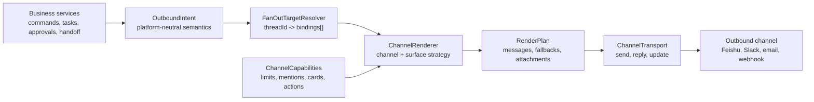

# feat: Add channel-neutral message rendering layer

## Summary

Add a channel-neutral rendering layer for outbound bridge messages. Business services should describe what they want to communicate through platform-neutral intents, while each channel renderer decides how to fit that intent into Feishu, Slack, Enterprise WeChat, email, webhook, or another delivery surface.

This is a platform abstraction, not a bot-to-bot collaboration feature. Bot-to-bot handoff is one consumer of the layer because Feishu requires a real `text` or `post` mention message to trigger another bot, but the rendering boundary must also cover task cards, command/control cards, approvals, notices, bot/user mentions, files, long-message pagination, and fallbacks.

---

## Problem Frame

The bridge currently sends most outbound content through Feishu-specific card, post, text, reply, and update payloads. That is acceptable while Feishu is the only channel, but it couples business behavior to Feishu CardKit limits and message semantics.

The bridge needs a formal render layer because future channels can have different constraints:

- Feishu CardKit has rendered-card JSON size limits, update APIs, reply/thread behavior, and separate `text`/`post` mention triggers.
- Slack Block Kit has its own block, text, thread, and interaction limits.
- Enterprise WeChat can have different card and Markdown support.
- Email has no live card update semantics and usually prefers summary plus attachments.
- Webhooks may not support mentions or interactive controls at all.

Channel limits must not leak into task orchestration, command handling, approval logic, or bot collaboration policy.

---

## Requirements

- R1. Business services emit platform-neutral outbound intents, not Feishu payload shapes.
- R2. Rendering decisions are based on channel capabilities and message surface.
- R3. Each channel declares size limits, update support, thread support, user mention support, bot mention support, bot-trigger support, action support, and file fallback support.
- R4. Long-message handling is a render policy, not a business rule.
- R5. Pagination must fit against final rendered payload size, not raw Markdown length.
- R6. Pagination delivery state stays outside the renderer.
- R7. Handoff trigger messages must remain bounded and must not paginate into multiple bot-triggering messages.
- R8. Channels without bot-trigger capability fail closed for autonomous handoff unless another explicit trigger mechanism exists.
- R9. Transports send rendered plans and do not understand business intent.
- R10. The first implementation may reuse Feishu CardKit behavior, but Feishu limits must be isolated behind Feishu capabilities.
- R11. The renderer can render bot and user mentions, but it does not own authorization or response policy. Bot response behavior remains controlled by inbound readiness and bot response switches.
- R12. When one ChatGPT thread is bound by multiple channel endpoints, fan-out is driven by `threadId -> bindings[]`: the renderer creates one channel-specific render plan per binding, and transport delivery state is tracked per binding.

---

## Architecture



Responsibilities:

- `OutboundIntent` describes the semantic message: task update, final result, approval request, command response, plain notice, file, or handoff trigger. Mentions are semantic targets attached to those intents, not channel payload snippets.
- `FanOutTargetResolver` maps a thread projection to the current set of channel bindings. It is the only place that decides whether one event should be delivered to one endpoint or several endpoints.
- `ChannelCapabilities` describes what one channel can actually send.
- `RenderContext` describes the destination surface: direct control, group task, or group collaboration.
- `ChannelRenderer` converts intent and context into one or more rendered messages.
- `RenderPlan` carries primary messages, fallbacks, attachments, warnings, and consumption metadata.
- `ChannelTransport` sends, replies, updates, uploads, or falls back according to the rendered plan.

---

## Core Interfaces

```ts
type MentionTarget =
  | { readonly kind: 'bot'; readonly openId: string; readonly appId?: string; readonly displayName?: string }
  | { readonly kind: 'user'; readonly openId: string; readonly displayName?: string };

type OutboundIntent =
  | { readonly kind: 'task-card'; readonly taskState: TaskProjection; readonly mentions?: readonly MentionTarget[] }
  | { readonly kind: 'command-card'; readonly command: string; readonly card: BridgeCard; readonly mentions?: readonly MentionTarget[] }
  | { readonly kind: 'approval-card'; readonly approval: ApprovalProjection; readonly mentions?: readonly MentionTarget[] }
  | { readonly kind: 'handoff-trigger'; readonly handoff: HandoffProjection; readonly mentions: readonly MentionTarget[] }
  | { readonly kind: 'plain-notice'; readonly level: 'info' | 'warning' | 'error'; readonly text: string; readonly mentions?: readonly MentionTarget[] }
  | { readonly kind: 'file'; readonly file: OutboundFile };

interface ChannelCapabilities {
  readonly channel: 'feishu' | 'slack' | 'wechat-work' | 'email' | 'webhook';
  readonly maxTextBytes: number;
  readonly maxRichMessageBytes?: number;
  readonly maxAttachmentBytes?: number;
  readonly supportsRichCard: boolean;
  readonly supportsCardUpdate: boolean;
  readonly supportsThreadReply: boolean;
  readonly supportsFileFallback: boolean;
  readonly supportsUserMention: boolean;
  readonly supportsBotMention: boolean;
  readonly botMentionCanTriggerBot: boolean;
  readonly supportsActions: boolean;
}

type OverflowStrategy =
  | 'paginate'
  | 'truncate-with-notice'
  | 'summary-plus-file'
  | 'summary-plus-link'
  | 'reject';

interface RenderContext {
  readonly channel: ChannelCapabilities['channel'];
  readonly chatType: 'p2p' | 'group';
  readonly surface: 'direct-control' | 'group-task' | 'group-collaboration';
  readonly appId: string;
  readonly rootMessageId?: string;
  readonly locale?: 'zh_cn' | 'en_us';
}

interface RenderPlan {
  readonly messages: readonly RenderedMessage[];
  readonly fallbacks?: readonly RenderedMessage[];
  readonly attachments?: readonly RenderedAttachment[];
  readonly warnings?: readonly string[];
  readonly consumption?: RenderConsumption;
}
```

The exact projection types should follow the existing task card, approval card, command card, and handoff models during implementation. The core contract is the direction of dependency: business services produce intent; renderers produce channel payloads. Mention rendering must be deterministic and capability-driven; it must not decide whether a mentioned bot should respond.

---

## Pagination And Overflow

Pagination belongs to rendering, but pagination state belongs to orchestration.

Renderer responsibilities:

- Fit pages against final rendered payload size.
- Split content by semantic sections when possible.
- Use binary search for large text segments where exact rendered size matters.
- Emit page consumption metadata so the orchestrator can advance offsets safely.
- Select channel-specific overflow strategy.

Orchestrator responsibilities:

- Store delivery cursor and offsets.
- Track frozen pages and active card/message IDs.
- Serialize writes for the same task/thread.
- Retry failed sends or updates.
- Decide whether a divergent terminal answer should be delivered as a revision.

Overflow strategy by intent:

| Intent | Default Strategy | Notes |
| --- | --- | --- |
| task card | `paginate` | Feishu can reuse current rendered-card byte fitting and 300 KB ceiling |
| handoff trigger | `truncate-with-notice` or `summary-plus-link` | Never paginate, because each page could trigger another bot |
| command/control card | list pagination or selectable controls | Avoid oversized control cards |
| approval card | `reject` or truncate nonessential detail | Actions must remain visible and stable |
| plain notice | `truncate-with-notice` | Keep diagnostics short |
| mention notice | `truncate-with-notice` | Preserve the mention target when the channel supports it, then fit the body |
| file/artifact | `summary-plus-file` | Only when the channel supports file fallback |

---

## Channel Capability Examples

Feishu initial capability:

- rich card: supported
- card update: supported
- thread/reply: supported
- file fallback: supported
- user mention: supported for real `text`/`post` messages when an open ID is available
- bot mention: supported for real `text`/`post` messages when a bot open ID is available
- bot mention can trigger bot: only for real `text`/`post` messages, not card-rendered mentions
- task card overflow: paginate by rendered CardKit JSON bytes
- handoff trigger overflow: bounded post/text, no pagination

Non-Feishu adapters must define their own capability profile before they can send production messages. They must not inherit Feishu CardKit constants.

---

## Implementation Units

### U1. Define Intent, Capability, Context, and Plan Types

**Goal:** Establish platform-neutral outbound contracts.

**Files:**
- `src/app/render/outbound-intent.ts`
- `src/app/render/channel-capabilities.ts`
- `src/app/render/render-context.ts`
- `src/app/render/render-plan.ts`
- `test/app/render-contract.test.ts`

**Test scenarios:**
- Intent types can represent task cards, approvals, command cards, handoff triggers, notices, and files.
- Intent types can carry bot and user mention targets without embedding Feishu payload syntax.
- Capability profiles can express Feishu and fake limited-channel constraints.

### U2. Add Feishu Renderer Adapter

**Goal:** Move Feishu payload creation into one renderer boundary.

**Files:**
- `src/app/render/feishu/feishu-message-renderer.ts`
- `src/app/render/feishu/feishu-capabilities.ts`
- `src/app/render/feishu/handoff-trigger-renderer.ts`
- `src/app/lark/handoff-message-emitter.ts`
- `test/app/feishu-message-renderer.test.ts`

**Test scenarios:**
- Feishu group handoff renders `post` with a real bot mention and `text` fallback.
- Feishu plain notice renders a real user mention when the user open ID is available.
- Feishu direct control card renders as interactive card.
- Feishu group task output uses reply/thread metadata when available.
- Card-rendered bot mention is marked as display-only and is not used as an automatic bot trigger.

### U3. Move Pagination Into Render Services

**Goal:** Reuse existing task-card fitting while removing Feishu limit logic from the orchestrator over time.

**Files:**
- `src/app/render/pagination.ts`
- `src/app/render/feishu/cardkit-pagination.ts`
- `src/app/in-memory-orchestrator.ts`
- `test/app/render-pagination.test.ts`

**Test scenarios:**
- Task card pages fit by rendered payload bytes.
- Long final answers continue across pages without losing offsets.
- Handoff trigger content is bounded and never paginated.

### U4. Add Transport Boundary

**Goal:** Keep sending APIs separate from rendering and business decisions.

**Files:**
- `src/app/render/channel-transport.ts`
- `src/app/render/feishu/feishu-message-transport.ts`
- `src/app/lark/handoff-message-emitter.ts`
- `test/app/feishu-message-transport.test.ts`

**Test scenarios:**
- Transport sends primary messages in order.
- Transport applies renderer-provided fallbacks only when the primary payload is rejected.
- Transport does not inspect business intent.

---

## Migration Plan

1. Start with handoff trigger rendering, because it already needs Feishu `post` plus `text` fallback.
2. Add mention target rendering for Feishu bot mentions and user mentions.
3. Wrap existing card payloads as `task-card`, `command-card`, and `approval-card` intents without changing card content.
4. Move existing task-card pagination helpers behind Feishu render services.
5. Add fake-channel tests to prove limits are capability-driven.
6. Add non-Feishu channel adapters only after their capabilities and trigger semantics are explicitly modeled.

---

## Acceptance Criteria

- Business services no longer import Feishu `msg_type`, `post`, `text`, or CardKit payload shapes for new outbound paths.
- Handoff coordinator emits a handoff intent; Feishu renderer creates the real target mention message.
- Plain notice and handoff intents can mention bots or users without business services constructing Feishu mention syntax.
- Long task output still paginates according to rendered payload size.
- Handoff triggers are bounded and never split into multiple trigger messages.
- Unsupported channel capabilities fail closed with explicit diagnostics.
- Feishu-specific tests prove current behavior is preserved.
