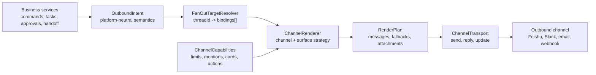

# feat: 新增渠道无关消息渲染层

## 摘要

为 Bridge outbound 消息新增渠道无关的渲染层。业务服务通过平台无关 intent 描述要表达什么，每个渠道 renderer 决定如何把该 intent 落到飞书、Slack、企业微信、邮件、Webhook 或其他投递界面。

这是平台抽象，不是 bot-to-bot 协作功能。Bot-to-bot handoff 是该层的一个消费者，因为飞书需要真实 `text` 或 `post` mention 消息才能触发另一个机器人；但渲染边界还必须覆盖任务卡、命令/控制卡、审批、通知、bot/user mention、文件、长消息分页和 fallback。

---

## 问题背景

Bridge 当前大部分 outbound 内容直接构造飞书 card、post、text、reply 和 update payload。只有飞书一个渠道时可以接受，但这会把业务行为耦合到飞书 CardKit 限制和消息语义。

Bridge 需要正式渲染层，因为未来渠道可能有不同约束：

- 飞书 CardKit 有渲染后卡片 JSON 大小限制、更新 API、reply/thread 行为，以及独立 `text`/`post` mention 触发路径。
- Slack Block Kit 有自己的 block、文本、thread 和交互限制。
- 企业微信可能有不同的卡片和 Markdown 支持。
- 邮件没有实时卡片更新语义，通常更适合 summary plus attachment。
- Webhook 可能完全不支持 mention 或交互控件。

渠道限制不能泄漏到任务编排、命令处理、审批逻辑或机器人协作策略中。

---

## 需求

- R1. 业务服务输出平台无关 outbound intent，而不是飞书 payload shape。
- R2. 渲染决策基于渠道能力和消息 surface。
- R3. 每个渠道声明大小限制、更新支持、thread 支持、用户 mention 支持、机器人 mention 支持、机器人触发支持、action 支持和文件 fallback 支持。
- R4. 长消息处理是 render policy，不是业务规则。
- R5. 分页必须按最终渲染后的 payload 大小做 fit，而不是按原始 Markdown 长度。
- R6. 分页投递状态留在 renderer 外部。
- R7. Handoff trigger 消息必须保持有界，不能分页成多条会触发机器人的消息。
- R8. 不具备机器人触发能力的渠道，对自动 handoff fail closed，除非另有显式 trigger 机制。
- R9. Transport 发送 rendered plan，不理解业务 intent。
- R10. 第一版可以复用飞书 CardKit 行为，但飞书限制必须隔离在飞书 capabilities 后面。
- R11. Renderer 可以渲染 bot 和 user mention，但不负责授权或响应策略。机器人是否响应仍由入站就绪状态和 bot response switch 控制。
- R12. 当一个 ChatGPT thread 被多个渠道端点绑定时，fan-out 基于 `threadId -> bindings[]` 驱动：renderer 为每个 binding 生成一份渠道专属 render plan，transport 的投递状态按 binding 单独跟踪。

---

## 架构



职责：

- `OutboundIntent` 描述语义消息：任务更新、最终结果、审批请求、命令响应、普通通知、文件或 handoff trigger。Mention 是挂在 intent 上的语义目标，不是渠道 payload 片段。
- `FanOutTargetResolver` 把一个 thread projection 映射为当前渠道 bindings 集合。是否把一次事件投递给一个端点还是多个端点，只能由这一层决定。
- `ChannelCapabilities` 描述一个渠道实际能发送什么。
- `RenderContext` 描述目标界面：direct control、group task 或 group collaboration。
- `ChannelRenderer` 将 intent 和 context 转换成一个或多个 rendered messages。
- `RenderPlan` 携带主消息、fallback、附件、warning 和 consumption metadata。
- `ChannelTransport` 根据 rendered plan 发送、回复、更新、上传或 fallback。

---

## 核心接口

```ts
type MentionTarget =
  | { readonly kind: 'bot'; readonly openId: string; readonly appId?: string; readonly displayName?: string }
  | { readonly kind: 'user'; readonly openId: string; readonly displayName?: string };

type OutboundIntent =
  | { readonly kind: 'task-card'; readonly taskState: TaskProjection; readonly mentions?: readonly MentionTarget[] }
  | { readonly kind: 'command-card'; readonly command: string; readonly card: BridgeCard; readonly mentions?: readonly MentionTarget[] }
  | { readonly kind: 'approval-card'; readonly approval: ApprovalProjection; readonly mentions?: readonly MentionTarget[] }
  | { readonly kind: 'handoff-trigger'; readonly handoff: HandoffProjection; readonly mentions: readonly MentionTarget[] }
  | { readonly kind: 'plain-notice'; readonly level: 'info' | 'warning' | 'error'; readonly text: string; readonly mentions?: readonly MentionTarget[] }
  | { readonly kind: 'file'; readonly file: OutboundFile };

interface ChannelCapabilities {
  readonly channel: 'feishu' | 'slack' | 'wechat-work' | 'email' | 'webhook';
  readonly maxTextBytes: number;
  readonly maxRichMessageBytes?: number;
  readonly maxAttachmentBytes?: number;
  readonly supportsRichCard: boolean;
  readonly supportsCardUpdate: boolean;
  readonly supportsThreadReply: boolean;
  readonly supportsFileFallback: boolean;
  readonly supportsUserMention: boolean;
  readonly supportsBotMention: boolean;
  readonly botMentionCanTriggerBot: boolean;
  readonly supportsActions: boolean;
}

type OverflowStrategy =
  | 'paginate'
  | 'truncate-with-notice'
  | 'summary-plus-file'
  | 'summary-plus-link'
  | 'reject';

interface RenderContext {
  readonly channel: ChannelCapabilities['channel'];
  readonly chatType: 'p2p' | 'group';
  readonly surface: 'direct-control' | 'group-task' | 'group-collaboration';
  readonly appId: string;
  readonly rootMessageId?: string;
  readonly locale?: 'zh_cn' | 'en_us';
}

interface RenderPlan {
  readonly messages: readonly RenderedMessage[];
  readonly fallbacks?: readonly RenderedMessage[];
  readonly attachments?: readonly RenderedAttachment[];
  readonly warnings?: readonly string[];
  readonly consumption?: RenderConsumption;
}
```

具体 projection 类型应在实现时沿用现有任务卡、审批卡、命令卡和 handoff 模型。核心契约是依赖方向：业务服务产出 intent，renderer 产出渠道 payload。Mention 渲染必须确定且由 capability 驱动；它不能决定被 @ 的机器人是否应该响应。

---

## 分页与 Overflow

分页属于渲染，但分页状态属于编排。

Renderer 职责：

- 按最终渲染后的 payload 大小做 fit。
- 尽量按语义段落拆分内容。
- 对精确渲染大小敏感的大文本段使用二分查找。
- 输出 page consumption metadata，方便 orchestrator 安全推进 offset。
- 选择渠道专属 overflow strategy。

Orchestrator 职责：

- 存储 delivery cursor 和 offsets。
- 跟踪已冻结页面和 active card/message IDs。
- 串行化同一任务/thread 的写入。
- 重试失败的发送或更新。
- 判断发散的终态答案是否应作为 revision 投递。

按 intent 的 overflow 策略：

| Intent | 默认策略 | 说明 |
| --- | --- | --- |
| task card | `paginate` | 飞书可复用当前渲染后 CardKit JSON 字节 fit 和 300 KB 上限 |
| handoff trigger | `truncate-with-notice` 或 `summary-plus-link` | 绝不分页，因为每一页都可能触发另一个机器人 |
| command/control card | 列表分页或选择控件 | 避免超大控制卡 |
| approval card | `reject` 或截断非关键明细 | 操作按钮必须保持可见和稳定 |
| plain notice | `truncate-with-notice` | 诊断保持短小 |
| mention notice | `truncate-with-notice` | 渠道支持时保留 mention 目标，再 fit 正文 |
| file/artifact | `summary-plus-file` | 仅在渠道支持文件 fallback 时使用 |

---

## 渠道能力示例

飞书初始能力：

- rich card：支持
- card update：支持
- thread/reply：支持
- file fallback：支持
- user mention：当具备用户 open ID 时，真实 `text`/`post` 消息支持
- bot mention：当具备机器人 open ID 时，真实 `text`/`post` 消息支持
- bot mention can trigger bot：仅真实 `text`/`post` 消息支持，卡片渲染出的 mention 不作为触发路径
- task card overflow：按渲染后 CardKit JSON bytes 分页
- handoff trigger overflow：有界 post/text，不分页

非飞书 adapter 必须先定义自己的 capability profile，才能发送生产消息。它们不能继承飞书 CardKit 常量。

---

## 实施单元

### U1. 定义 Intent、Capability、Context 和 Plan 类型

**目标：** 建立平台无关 outbound 契约。

**文件：**
- `src/app/render/outbound-intent.ts`
- `src/app/render/channel-capabilities.ts`
- `src/app/render/render-context.ts`
- `src/app/render/render-plan.ts`
- `test/app/render-contract.test.ts`

**测试场景：**
- Intent 类型可以表达任务卡、审批、命令卡、handoff trigger、通知和文件。
- Intent 类型可以携带 bot 和 user mention 目标，但不嵌入飞书 payload 语法。
- Capability profile 可以表达飞书和 fake limited-channel 约束。

### U2. 新增飞书 Renderer Adapter

**目标：** 将飞书 payload 构造移动到统一 renderer 边界。

**文件：**
- `src/app/render/feishu/feishu-message-renderer.ts`
- `src/app/render/feishu/feishu-capabilities.ts`
- `src/app/render/feishu/handoff-trigger-renderer.ts`
- `src/app/lark/handoff-message-emitter.ts`
- `test/app/feishu-message-renderer.test.ts`

**测试场景：**
- 飞书群 handoff 渲染成带真实机器人 mention 的 `post`，并包含 `text` fallback。
- 当用户 open ID 可用时，飞书 plain notice 渲染真实用户 mention。
- 飞书 direct control card 渲染成 interactive card。
- 飞书 group task output 在可用时使用 reply/thread metadata。
- 卡片渲染出的 bot mention 被标记为 display-only，不作为自动 bot trigger。

### U3. 将分页迁入 Render Services

**目标：** 复用现有任务卡 fitting，同时逐步移除 orchestrator 中的飞书限制逻辑。

**文件：**
- `src/app/render/pagination.ts`
- `src/app/render/feishu/cardkit-pagination.ts`
- `src/app/in-memory-orchestrator.ts`
- `test/app/render-pagination.test.ts`

**测试场景：**
- 任务卡页面按渲染后 payload bytes fit。
- 长最终答案跨页延续时不丢 offset。
- Handoff trigger 内容有界且绝不分页。

### U4. 新增 Transport 边界

**目标：** 将发送 API 与渲染、业务决策分离。

**文件：**
- `src/app/render/channel-transport.ts`
- `src/app/render/feishu/feishu-message-transport.ts`
- `src/app/lark/handoff-message-emitter.ts`
- `test/app/feishu-message-transport.test.ts`

**测试场景：**
- Transport 按顺序发送 primary messages。
- 只有 primary payload 被拒绝时，transport 才使用 renderer 提供的 fallback。
- Transport 不检查业务 intent。

---

## 迁移计划

1. 从 handoff trigger 渲染开始，因为它已经需要飞书 `post` 加 `text` fallback。
2. 增加飞书 bot mention 和 user mention 的 mention target 渲染。
3. 将现有卡片 payload 包装成 `task-card`、`command-card` 和 `approval-card` intent，不改变卡片内容。
4. 将现有任务卡分页 helpers 移到飞书 render services 后面。
5. 增加 fake-channel 测试，证明限制由 capability 驱动。
6. 只有在能力和触发语义被明确建模后，才新增非飞书 channel adapter。

---

## 验收标准

- 新 outbound 路径的业务服务不再导入飞书 `msg_type`、`post`、`text` 或 CardKit payload shape。
- Handoff coordinator 输出 handoff intent；飞书 renderer 创建真实目标 mention 消息。
- Plain notice 和 handoff intent 可以 mention bot 或 user，不需要业务服务构造飞书 mention 语法。
- 长任务输出仍按渲染后 payload 大小分页。
- Handoff trigger 有界，绝不拆成多条触发消息。
- 不支持的渠道能力 fail closed，并输出明确诊断。
- 飞书专属测试证明当前行为保持不变。
