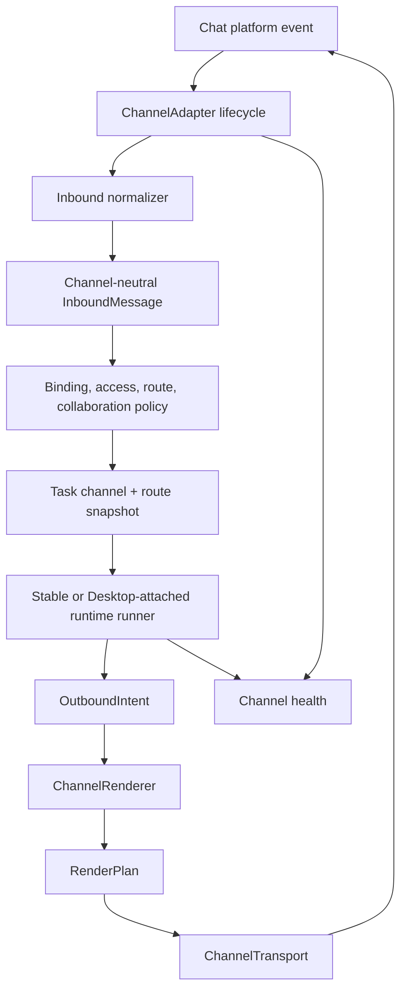
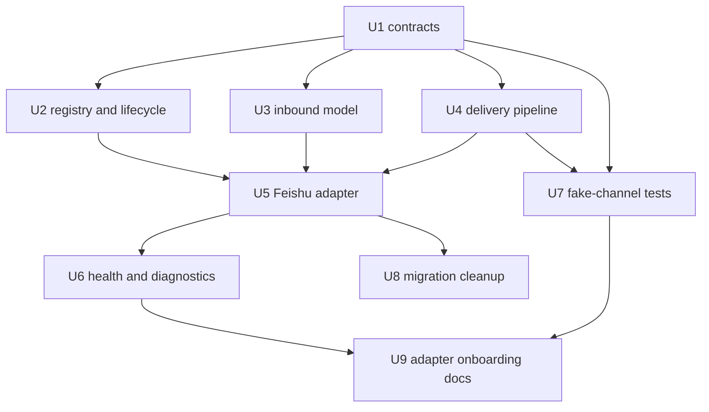

# feat: Add channel adapter abstraction layer

## Summary

Add a channel adapter abstraction so Bridge can support Feishu, WeCom, DingTalk, Telegram, WhatsApp, and future messaging surfaces without pushing platform-specific event, identity, callback, delivery, and media rules into orchestration code. This plan complements `docs/plans/2026-07-28-003-feat-channel-neutral-message-renderer-plan.md`: channel adapters own platform connectivity and transport, while renderers own intent-to-payload presentation.

---

## Problem Frame

Bridge is currently a Feishu-first application. Feishu-specific inbound normalization, WebSocket lifecycle, CardKit clients, message acknowledgement, image/file handling, and handoff message emission are wired directly from `src/app/main.ts`, `src/app/lark/*`, `src/app/cards/*`, and `src/app/in-memory-orchestrator.ts`.

That direct wiring is workable for one channel, but it will not scale to WeCom, DingTalk, Telegram, WhatsApp, or custom internal chat systems. Each channel has different identity models, mention semantics, callback payloads, file limits, message update support, rate limits, authentication, and group/thread behavior. Those differences must be contained behind channel contracts and capability declarations rather than leaking into task execution, binding, approval, routing, collaboration, or rendering logic.

---

## Assumptions

*This plan was authored from the current product discussion and local repository context. Review these assumptions before implementation if product behavior has changed.*

- The existing Feishu behavior remains the compatibility baseline; the first implementation should migrate Feishu behind abstractions without changing user-visible behavior.
- The renderer plan in `docs/plans/2026-07-28-003-feat-channel-neutral-message-renderer-plan.md` remains active and should be treated as the outbound presentation layer, not duplicated here.
- New production channels should not be added until Feishu is proven behind the new contracts with fake-channel regression coverage.
- Runtime execution route policy is separate from message channel selection. A task can be received from Feishu, DingTalk, or Telegram and still choose stable or Desktop-attached execution by route policy.
- Bot-to-bot handoff remains fail-closed unless the active channel explicitly declares a trigger mechanism that can safely address another bot.

---

## Requirements

- R1. Business and orchestration code consume a channel-neutral `InboundMessage`, not Feishu event payloads.
- R2. Outbound business code emits `OutboundIntent`; it does not call channel SDKs or build channel payloads directly.
- R3. Each channel declares capabilities for text, rich cards, markdown, update/delete, reply/thread, mentions, bot trigger, actions, media, files, rate limits, and proactive send.
- R4. Channel adapters own platform lifecycle: authentication, event subscription, reconnect, readiness, shutdown, and health reporting.
- R5. Channel adapters own inbound normalization, including identity, tenant/workspace, chat surface, root message, reply/thread context, media references, old-message filtering, duplicate detection, and sender authorization hooks.
- R6. Channel transports send rendered plans and upload artifacts; they do not inspect business intent or route execution state.
- R7. Unsupported capabilities degrade or fail closed through explicit policy instead of silently falling through to Feishu behavior.
- R8. A task snapshots channel identity, surface, capabilities, reply context, and execution route when it is created.
- R9. Feishu stays behavior-compatible during migration, including group mention gating, disabled-bot behavior, image batching, card updates, approvals, handoff, and unavailable-message handling.
- R10. Fake-channel tests prove the core pipeline works when a channel has no cards, no update API, no bot-trigger mention, no files, or strict size limits.
- R11. Diagnostics expose channel readiness and effective capability decisions independently from App Server and Desktop runtime health.
- R12. Adding a future channel requires a bounded adapter package, renderer/transport pair, capability profile, config block, and CUJ coverage, not changes to core orchestration.

---

## Scope Boundaries

- This plan does not implement production WeCom, DingTalk, Telegram, or WhatsApp adapters in the first migration.
- This plan does not replace the route-based runtime execution design in `docs/plans/2026-07-28-001-feat-dual-runtime-modes-plan.md`.
- This plan does not remove existing Feishu files immediately; migration should wrap and then move behavior behind adapter boundaries.
- This plan does not make renderer policy responsible for WebSocket connections, auth, retries, or upload APIs.
- This plan does not make channel adapters responsible for task scheduling, approval decisions, binding authorization, or runtime execution.
- This plan does not choose a lowest-common-denominator channel model. Rich channels use richer render plans; limited channels degrade or fail closed.

### Deferred to Follow-Up Work

- Production WeCom adapter: after Feishu adapter migration and fake-channel tests are stable.
- Production DingTalk adapter: after markdown/action/update capability rules are modeled.
- Production Telegram adapter: after reply/thread and inline-button behavior is mapped to the common contracts.
- Production WhatsApp adapter: after Business API constraints, template messages, media hosting, and proactive-send rules are separately reviewed.
- External adapter WebSocket protocol similar to `cc-connect/docs/bridge-protocol.md`: useful later, but not part of the first internal channel abstraction.

---

## Context & Research

### Relevant Bridge Code and Patterns

- `src/app/main.ts` currently wires Feishu clients, event servers, message aggregation, acknowledgements, file upload, handoff emission, task orchestration, health, and runtime routing in one startup path.
- `src/app/lark/intake.ts` defines the current Feishu-shaped `InboundMessage` and `InboundReplyContext`.
- `src/app/lark/event-server.ts` owns Feishu event dispatch, disabled-bot handling, card action callbacks, and unavailable-message replies.
- `src/app/lark/client.ts` owns Feishu SDK clients, token retrieval, WebSocket ready state, reconnect state, and terminal error reporting.
- `src/app/lark/inbound-message-aggregator.ts` implements image batching and duplicate suppression around Feishu inbound messages.
- `src/app/cards/cardkit-client.ts`, `src/app/cards/layouts.ts`, and `src/app/lark/handoff-message-emitter.ts` show outbound Feishu coupling that the renderer and transport layers must isolate.
- `src/app/in-memory-orchestrator.ts` currently accepts Feishu-shaped inbound messages and directly uses a CardKit-like card client for task card creation, update, pagination, and freeze/continue behavior.
- `src/app/runtime-health.ts` already models runtime and Feishu connection health; it should be extended rather than replaced.
- `test/app/lark-image-input.test.ts`, `test/app/lark-event-server.test.ts`, `test/app/lark-client.test.ts`, `test/app/lark-handoff-message-emitter.test.ts`, and `test/app/desktop-ipc-regression.test.ts` provide the main characterization coverage to preserve during migration.

### cc-connect Design Experience to Absorb

- `cc-connect/AGENTS.md` keeps `core/` independent from concrete platform and agent packages, with dependency direction enforced by package boundaries.
- `cc-connect/core/interfaces.go` uses optional capability interfaces such as card sending, message updates, file sending, typing indicators, and progress style providers.
- `cc-connect/core/card.go` models a channel-neutral card structure with text fallback.
- `cc-connect/core/bridge.go` exposes external adapter registration with capabilities and token authentication.
- `cc-connect/core/dedup.go`, `cc-connect/core/outgoing_ratelimit.go`, `cc-connect/core/redact.go`, and `cc-connect/core/runas_check.go` show small hardening modules instead of embedding safety behavior in the engine.
- `cc-connect/core/cuj_test.go` tests user-visible journeys through the same platform entry point used in production.

### Institutional Learnings

- Group-chat and direct-chat execution routing are first-class configurable policy, and the effective execution route must be snapshotted when a task is created.
- Group-chat multi-bot behavior should fail closed: only the current bot's explicit mention can execute, unknown or removed bots stay silent, and disabled bots never route work.
- App Server compatibility and Desktop route health are independent concerns; channel readiness must not be conflated with runtime readiness.
- Channel trigger messages for handoff must stay bounded and must never paginate into multiple bot-triggering messages.

### External References

- None used. This plan uses local Bridge code and the local `cc-connect` project as prior art.

---

## Key Technical Decisions

| Decision | Rationale |
|---|---|
| Introduce `src/app/channels/*` as the channel abstraction area | Keeps channel connection, event, transport, and capability code out of runtime orchestration and out of the renderer-only layer. |
| Treat Feishu as the first adapter, not a special built-in path | Preserves behavior while proving the abstraction against the hardest existing channel. |
| Separate adapter lifecycle from renderer and transport | Startup/reconnect/auth belongs to adapters; payload construction belongs to renderers; send/update/upload belongs to transports. |
| Use capability profiles instead of channel-name branching | Matches cc-connect's strongest design principle and prevents future `if channel === "feishu"` growth in shared code. |
| Snapshot channel context at task creation | Prevents later config or binding changes from mutating queued work, reply targets, fallback behavior, or execution route. |
| Add fake limited channels before real new channels | Fake channels prove degradation semantics cheaply and prevent accidental Feishu constant leakage. |
| Keep route policy orthogonal to channel policy | Message channel selects how Bridge talks to the user; execution route selects how Bridge runs Codex. Mixing them would make cross-channel behavior fragile. |
| Make unsupported handoff fail closed | Channels without a real bot-trigger mechanism must not simulate autonomous handoff through unsafe or non-triggering messages. |

---

## Open Questions

### Resolved During Planning

- Should channel abstraction be separate from renderer abstraction? Yes. A channel adapter owns connectivity and transport; a renderer owns presentation.
- Should Bridge copy cc-connect's package shape directly? No. Bridge should absorb the core principles while matching the current TypeScript modules and existing Feishu code.
- Should real WeCom/DingTalk/Telegram/WhatsApp adapters be part of the first change? No. Feishu migration plus fake channels should prove the architecture first.
- Should route policy move into channel adapters? No. Runtime execution routing remains a separate product capability.

### Deferred to Implementation

- Exact naming of normalized channel types and projection objects: choose names that fit the existing TypeScript style during implementation.
- Whether Feishu files should be moved from `src/app/lark/*` to `src/app/channels/feishu/*` immediately or wrapped first: decide based on diff size and test blast radius.
- Exact channel config syntax: implement after reviewing current environment parsing and bot config shape.
- Exact WhatsApp support boundary: requires a separate API and product review because proactive messages and templates have platform-specific constraints.

---

## Output Structure

Expected new structure. This is a scope declaration, not a rigid file tree.

```text
src/app/channels/
  channel-adapter.ts
  channel-capabilities.ts
  channel-context.ts
  channel-delivery.ts
  channel-health.ts
  channel-registry.ts
  inbound-message.ts
  fake/
    fake-channel-adapter.ts
    fake-channel-capabilities.ts
  feishu/
    feishu-channel-adapter.ts
    feishu-capabilities.ts
    feishu-inbound-normalizer.ts
    feishu-transport.ts
    feishu-runtime-clients.ts

src/app/render/
  ... files from docs/plans/2026-07-28-003-feat-channel-neutral-message-renderer-plan.md

test/app/channels/
  channel-contract.test.ts
  fake-channel.test.ts
  feishu-channel-adapter.test.ts
```

---

## High-Level Technical Design

> *This illustrates the intended approach and is directional guidance for review, not implementation specification. The implementing agent should treat it as context, not code to reproduce.*

Channel and runtime remain separate axes:

| Axis | Owns | Examples |
|---|---|---|
| Channel adapter | How Bridge talks to a chat platform | Feishu, WeCom, DingTalk, Telegram, WhatsApp |
| Renderer | How an outbound intent becomes platform-shaped messages | Feishu CardKit, Telegram markdown/buttons, WhatsApp text/media fallback |
| Transport | How rendered messages are sent, updated, uploaded, or retried | send message, reply, patch card, upload file |
| Runtime route | How Codex execution runs | stable App Server, Desktop-attached |
| Orchestrator | Task lifecycle and policy decisions | queue, steer, cancel, approvals, card delivery state |

End-to-end flow:



Adapter contract sketch:

```text
ChannelAdapter
  identity: channel name, bot key, tenant/workspace
  capabilities: ChannelCapabilities
  lifecycle: start, stop, readiness snapshot
  inbound: normalize native events and emit InboundMessage
  transport: send/update/upload rendered plans
  diagnostics: health, auth failures, reconnect state, rate-limit state
```

Capability decision matrix:

| Capability gap | Expected behavior |
|---|---|
| No rich card | Renderer emits text or markdown fallback. |
| No update API | Transport sends final messages only or creates append-only progress, based on intent policy. |
| No thread/reply | Context falls back to chat-level send if safe; otherwise fail closed for reply-required flows. |
| No button/action callback | Command cards render as text guidance or are rejected when actions are required. |
| No bot-trigger mention | Autonomous handoff is rejected with explicit diagnostics. |
| Strict text size | Renderer truncates, paginates, or file-fallbacks based on intent policy. |
| No file upload | Artifact delivery uses summary-plus-link only when a safe link exists; otherwise fail closed. |

Implementation dependency graph:



---

## Implementation Units

### U1. Define Channel Contracts and Capabilities

**Goal:** Establish the neutral contracts for channel identity, capabilities, inbound messages, reply context, delivery targets, rendered delivery results, and channel errors.

**Requirements:** R1, R3, R6, R7, R8, R12

**Dependencies:** None

**Files:**
- Create: `src/app/channels/channel-adapter.ts`
- Create: `src/app/channels/channel-capabilities.ts`
- Create: `src/app/channels/channel-context.ts`
- Create: `src/app/channels/channel-delivery.ts`
- Create: `src/app/channels/inbound-message.ts`
- Create: `src/app/channels/channel-health.ts`
- Test: `test/app/channels/channel-contract.test.ts`

**Approach:**
- Define a channel-neutral inbound model by lifting the non-Feishu parts of `src/app/lark/intake.ts` into `src/app/channels/inbound-message.ts`.
- Keep native platform payloads out of shared contracts; adapters may store native payload fragments only inside opaque adapter-owned context.
- Model capabilities as stable booleans and limits rather than platform names.
- Include size limits and rate-limit hints as capability data because rendering and transport both need them.
- Include a clear error taxonomy for unsupported capability, rejected payload, auth failure, rate limit, stale context, and unknown delivery outcome.

**Execution note:** Start with characterization tests that assert current Feishu `InboundMessage` fields can be represented without losing task, binding, image, and handoff information.

**Patterns to follow:**
- `src/app/lark/intake.ts` for current inbound fields.
- `cc-connect/core/interfaces.go` for optional capability style.
- `cc-connect/core/card.go` for neutral structure plus fallback philosophy.

**Test scenarios:**
- Happy path: a normalized p2p text message carries channel, bot key, tenant, sender, root message, reply context, text, and payload digest.
- Happy path: a normalized group post message can carry text plus multiple image references.
- Happy path: capability profile can express Feishu as card/update/reply/action/file/mention capable.
- Edge case: a minimal fake channel with only text support has every unsupported capability explicitly false or undefined.
- Edge case: opaque reply context can be stored without exposing native SDK payloads to orchestration code.
- Error path: unsupported capability errors include channel name, operation, and stable diagnostic reason without leaking tokens.

**Verification:**
- Shared channel contracts compile without importing `src/app/lark/*` or `src/app/cards/*`.
- Existing Feishu inbound information has a place in the neutral model.

### U2. Add Channel Registry and Lifecycle Orchestration

**Goal:** Create a registry and startup lifecycle so Bridge can start one or more channel adapters through a shared path.

**Requirements:** R3, R4, R11, R12

**Dependencies:** U1

**Files:**
- Create: `src/app/channels/channel-registry.ts`
- Modify: `src/app/main.ts`
- Modify: `src/app/runtime-health.ts`
- Modify: `src/app/doctor.ts`
- Test: `test/app/channels/channel-registry.test.ts`
- Test: `test/app/runtime-health.test.ts`
- Test: `test/app/doctor.test.ts`

**Approach:**
- Add a registry similar in spirit to cc-connect's platform registry, but scoped to Bridge channel adapters.
- Keep construction in `main.ts` initially so dependency injection remains explicit and low-risk.
- Represent each adapter's lifecycle state independently: idle, starting, ready, reconnecting, degraded, terminal, stopped.
- Aggregate channel health separately from App Server and Desktop runtime health.
- Make doctor output list configured channels, readiness, capability profile summary, and last terminal error.

**Execution note:** Characterization-first around existing Feishu startup health before inserting the registry.

**Patterns to follow:**
- `src/app/lark/client.ts` for WebSocket state snapshot.
- `src/app/runtime-health.ts` for serialized health snapshots.
- `cc-connect/core/registry.go` for simple registry semantics.

**Test scenarios:**
- Happy path: registering one Feishu adapter exposes it by channel name and bot key.
- Happy path: multiple enabled bot configs create separate Feishu adapter instances without sharing mutable health state.
- Edge case: disabled bot config does not start an adapter but remains visible in diagnostics as disabled.
- Error path: adapter startup failure marks only that channel instance terminal and does not misreport App Server compatibility.
- Integration: `doctor` reports channel readiness separately from Desktop route readiness.

**Verification:**
- `main.ts` no longer needs to special-case every Feishu lifecycle detail outside the Feishu adapter construction path.
- Health output distinguishes channel failures from runtime execution failures.

### U3. Extract Channel-Neutral Inbound Pipeline

**Goal:** Move inbound normalization, filtering, reply context reconstruction, duplicate handling, and media aggregation behind channel-owned adapters while preserving Feishu behavior.

**Requirements:** R1, R4, R5, R8, R9

**Dependencies:** U1, U2

**Files:**
- Create: `src/app/channels/feishu/feishu-inbound-normalizer.ts`
- Create: `src/app/channels/feishu/feishu-channel-adapter.ts`
- Modify: `src/app/lark/intake.ts`
- Modify: `src/app/lark/event-server.ts`
- Modify: `src/app/lark/inbound-message-aggregator.ts`
- Modify: `src/app/group-access-policy.ts`
- Modify: `src/app/main.ts`
- Test: `test/app/channels/feishu-inbound-normalizer.test.ts`
- Test: `test/app/lark-image-input.test.ts`
- Test: `test/app/lark-event-server.test.ts`
- Test: `test/app/group-access-policy.test.ts`

**Approach:**
- Wrap existing Feishu intake behavior first; move code only after tests prove the adapter boundary.
- Make `LarkEventServer` either become an internal Feishu adapter helper or be called only from `FeishuChannelAdapter`.
- Preserve current fail-closed semantics: wrong bot mention is rejected, disabled bot does not route work, unavailable replies validate mention context but do not authorize tasks.
- Keep image aggregation channel-neutral where practical, but let Feishu adapter own Feishu image key resolution.
- Include channel reply context in task snapshot so queued messages are not affected by later adapter reconnect or route-policy changes.

**Execution note:** Characterization-first: update existing Feishu tests to assert neutral inbound output before moving behavior.

**Patterns to follow:**
- `src/app/lark/intake.ts` normalization tests.
- `src/app/lark/inbound-message-aggregator.ts` duplicate and image batch behavior.
- `cc-connect/core/dedup.go` for old-message and duplicate filtering as small reusable modules.

**Test scenarios:**
- Happy path: Feishu p2p text event becomes neutral inbound and dispatches to the existing command/task path.
- Happy path: Feishu group post with current bot mention strips only that mention and preserves other text and images.
- Happy path: image-only batch plus later description still dispatches one neutral message with all local image paths.
- Edge case: group message mentioning another bot remains rejected and silent for this bot.
- Edge case: disabled bot can emit only unavailable feedback and cannot route commands, approvals, or card actions.
- Error path: stale event or duplicate message is ignored without creating a task.
- Integration: command handling and task handling consume neutral inbound messages without importing Feishu event payload types.

**Verification:**
- Existing Feishu inbound tests pass with neutral model assertions added.
- No task creation path depends on raw Feishu event shape.

### U4. Add Capability-Driven Outbound Delivery Pipeline

**Goal:** Connect `OutboundIntent`, renderer output, channel transport, and task delivery state through a channel-neutral pipeline.

**Requirements:** R2, R3, R6, R7, R8, R10

**Dependencies:** U1 and the renderer contracts from `docs/plans/2026-07-28-003-feat-channel-neutral-message-renderer-plan.md`

**Files:**
- Create: `src/app/channels/channel-delivery-pipeline.ts`
- Create: `src/app/channels/feishu/feishu-transport.ts`
- Modify: `src/app/render/render-context.ts`
- Modify: `src/app/render/render-plan.ts`
- Modify: `src/app/in-memory-orchestrator.ts`
- Modify: `src/app/command-service.ts`
- Modify: `src/app/desktop-approval-service.ts`
- Test: `test/app/channels/channel-delivery-pipeline.test.ts`
- Test: `test/app/desktop-ipc-regression.test.ts`
- Test: `test/app/feishu-message-transport.test.ts`

**Approach:**
- Treat `RenderPlan` as the only object the transport sends.
- Push Feishu-specific `replyCard`, `sendCard`, `replaceCard`, `post`, `text`, upload, and acknowledgement calls behind Feishu transport methods.
- Ensure orchestrator stores task channel snapshot: channel id, bot key, chat surface, capabilities, reply/root context, and execution route.
- Let renderer choose fallback strategy; let transport report send/update/upload results without inspecting business intent.
- Preserve existing card pagination state in the orchestrator until U8 cleanup moves more of it behind render services.

**Execution note:** Characterization-first around task card creation/update/freeze tests before replacing the card client dependency.

**Patterns to follow:**
- `src/app/in-memory-orchestrator.ts` card write serialization and retry behavior.
- `src/app/cards/cardkit-client.ts` Feishu card API behavior.
- `cc-connect/core/card.go` fallback behavior, but adapted to Bridge's richer render plan.

**Test scenarios:**
- Happy path: task-card intent renders and sends through Feishu transport with the same visible card content as before.
- Happy path: command-card and approval-card intents reply to the original message through transport, not direct CardKit calls.
- Happy path: final answer update uses the channel snapshot captured at task creation.
- Edge case: channel capability changes after task creation do not mutate queued task delivery behavior.
- Edge case: no-update fake channel receives append-only or final-only delivery according to render policy.
- Error path: primary rendered payload rejection uses renderer-provided fallback and records the fallback reason.
- Error path: unsupported required action on a no-action channel fails closed with a diagnostic notice.
- Integration: Desktop approval service can update approval cards without importing Feishu transport payload shapes.

**Verification:**
- Orchestrator and command services depend on channel delivery contracts, not Feishu SDK payloads.
- Existing task card and approval behavior remains user-visible compatible on Feishu.

### U5. Migrate Feishu Into a First-Class Channel Adapter

**Goal:** Convert the current Feishu runtime into an adapter package that owns Feishu clients, capabilities, inbound event dispatch, media APIs, card/action callbacks, and transport.

**Requirements:** R4, R5, R6, R9, R11

**Dependencies:** U2, U3, U4

**Files:**
- Create: `src/app/channels/feishu/feishu-capabilities.ts`
- Create: `src/app/channels/feishu/feishu-runtime-clients.ts`
- Modify: `src/app/lark/client.ts`
- Modify: `src/app/lark/message-acknowledgement.ts`
- Modify: `src/app/lark/output-file-uploader.ts`
- Modify: `src/app/lark/inbound-image-store.ts`
- Modify: `src/app/lark/handoff-message-emitter.ts`
- Modify: `src/app/main.ts`
- Test: `test/app/channels/feishu-channel-adapter.test.ts`
- Test: `test/app/lark-client.test.ts`
- Test: `test/app/lark-handoff-message-emitter.test.ts`
- Test: `test/app/card-image-renderer.test.ts`

**Approach:**
- Keep Feishu SDK wrappers reusable; do not rewrite SDK calls unless required by the abstraction.
- Move Feishu capability constants behind a profile that explicitly documents real mention trigger behavior: only native text/post can trigger another bot, card-rendered mentions cannot.
- Keep Feishu file upload and image retrieval as adapter-owned media services.
- Keep card action callbacks bound to server-side context and existing action-token protections.
- Make Feishu adapter expose current bot key and tenant identity so multi-bot instances remain isolated.

**Execution note:** Characterization-first around multi-bot group behavior and handoff trigger fallback.

**Patterns to follow:**
- `src/app/bot-config-store.ts` for bot-scoped configuration.
- `src/app/lark/handoff-message-emitter.ts` for current post-to-text fallback behavior.
- `cc-connect/platform/feishu/card.go` for platform-specific rendering behind a neutral card contract.

**Test scenarios:**
- Happy path: enabled Feishu bot starts one adapter with expected capability profile.
- Happy path: Feishu handoff trigger sends real post mention and falls back to text when post is rejected.
- Happy path: Feishu card action routes through the same bot-scoped callback policy as before.
- Edge case: disabled Feishu bot cannot send acknowledgements, process approvals, mutate bindings, or trigger card side effects.
- Edge case: multiple Feishu bot configs do not share transport, token cache, or callback state.
- Error path: token rejection invalidates token cache and reports channel auth failure without exposing secrets.
- Integration: existing multi-bot group bridge tests pass through adapter-owned Feishu lifecycle.

**Verification:**
- Feishu is registered and started as a `ChannelAdapter`.
- Feishu-specific imports are concentrated in `src/app/channels/feishu/*`, `src/app/lark/*`, and low-level card helpers, not in orchestration policies.

### U6. Extend Channel Health, Doctor, and Operator Diagnostics

**Goal:** Make channel readiness, capability choices, fallback decisions, and unsupported operations visible to operators.

**Requirements:** R7, R8, R11, R12

**Dependencies:** U2, U4, U5

**Files:**
- Modify: `src/app/runtime-health.ts`
- Modify: `src/app/doctor.ts`
- Modify: `src/app/cards/command-cards.ts`
- Modify: `src/app/cards/layouts.ts`
- Modify: `src/app/command-service.ts`
- Test: `test/app/runtime-health.test.ts`
- Test: `test/app/doctor.test.ts`
- Test: `test/app/conversation-binding-service-v3.test.ts`

**Approach:**
- Add channel section to health snapshots with adapter state, bot key, channel name, reconnect count, last readiness change, and summarized capability profile.
- Add delivery diagnostics for fallback path chosen, unsupported capability, rejected payload, media upload failure, and stale reply context.
- Keep sensitive fields out of health and logs.
- Update status/help cards to show channel and runtime axes separately.

**Patterns to follow:**
- `src/app/runtime-health.ts` status aggregation.
- `src/app/cards/command-cards.ts` status-card style.
- `cc-connect/core/doctor.go` for optional capability-aware diagnostics.

**Test scenarios:**
- Happy path: status card shows Feishu channel ready while App Server and Desktop states are separately reported.
- Happy path: fallback from card to text records a visible diagnostic reason.
- Edge case: channel reconnecting degrades channel health without claiming runtime incompatibility.
- Error path: auth failure redacts app secret and token values in diagnostics.
- Integration: route policy snapshot and channel snapshot appear together for a task without implying they are the same decision.

**Verification:**
- Operators can identify whether a failure is channel, renderer, transport, App Server, Desktop route, or policy related.

### U7. Add Fake Channels and CUJ Coverage

**Goal:** Prove that the channel abstraction works across capability combinations before adding real new channels.

**Requirements:** R7, R8, R10, R12

**Dependencies:** U1, U3, U4

**Files:**
- Create: `src/app/channels/fake/fake-channel-adapter.ts`
- Create: `src/app/channels/fake/fake-channel-capabilities.ts`
- Create: `test/app/channels/fake-channel.test.ts`
- Create: `test/app/channel-cuj.test.ts`
- Modify: `test/app/desktop-ipc-regression.test.ts`

**Approach:**
- Provide fake channels with capability profiles for text-only, markdown-only, no-update, no-actions, no-files, strict-size, and no-bot-trigger cases.
- Drive tests through the same inbound entry point the real adapters use, then assert user-visible outbound delivery.
- Add CUJ tests inspired by cc-connect: multi-step user behavior, not just helper functions.
- Use fake channels to prevent Feishu CardKit constants from creeping into core pagination and fallback decisions.

**Patterns to follow:**
- `cc-connect/core/cuj_test.go` user-visible testing philosophy.
- Existing `test/app/desktop-ipc-regression.test.ts` task lifecycle stubs.
- Existing image aggregation tests for multi-message flows.

**Test scenarios:**
- Happy path: text-only fake channel can start a task and receive a final answer.
- Happy path: no-update fake channel does not receive patch/update calls during streaming.
- Happy path: strict-size fake channel receives renderer-fitted pages that stay under its declared limit.
- Edge case: no-bot-trigger fake channel rejects autonomous handoff and emits a diagnostic without sending trigger messages.
- Edge case: no-file fake channel rejects artifact delivery unless renderer provides summary-plus-link.
- Error path: action-required approval on no-action channel fails closed and does not create an unusable approval.
- CUJ: user sends task, receives progress/final response, switches route policy, sends second task, and first task's channel snapshot remains unchanged.
- CUJ: group message for another bot remains silent on the current bot across fake and Feishu adapters.

**Verification:**
- The test suite proves capability-driven fallback and fail-closed behavior without relying on Feishu.

### U8. Clean Up Feishu Coupling From Orchestration

**Goal:** Remove remaining Feishu-specific imports and concepts from business services after the adapter and renderer boundaries are stable.

**Requirements:** R1, R2, R6, R8, R9, R12

**Dependencies:** U3, U4, U5, U7

**Files:**
- Modify: `src/app/main.ts`
- Modify: `src/app/in-memory-orchestrator.ts`
- Modify: `src/app/command-service.ts`
- Modify: `src/app/conversation-binding-service-v3.ts`
- Modify: `src/app/desktop-approval-service.ts`
- Modify: `src/app/domain.ts`
- Test: `test/app/desktop-ipc-regression.test.ts`
- Test: `test/app/conversation-binding-service-v3.test.ts`
- Test: `test/app/desktop-approval-service.test.ts`

**Approach:**
- Replace Feishu-specific type imports in orchestration code with channel-neutral contracts.
- Keep `lark` naming only in Feishu adapter/helper packages until a later rename is worth the churn.
- Move capability checks out of orchestration branches and into renderer/delivery decisions.
- Preserve idempotency keys and card write serialization semantics during the move.

**Execution note:** Do this after fake-channel tests exist; it is the highest regression-risk unit.

**Patterns to follow:**
- Existing scoped dependency injection in `src/app/main.ts`.
- Existing card write serialization in `src/app/in-memory-orchestrator.ts`.

**Test scenarios:**
- Happy path: command card, task card, approval card, handoff trigger, image batch, and unavailable-message flows still pass on Feishu.
- Happy path: orchestrator can run against fake text-only channel without Feishu card client stubs.
- Edge case: queued task keeps original reply context after adapter reconnect.
- Edge case: stale card/message IDs from one channel cannot be used by another channel.
- Error path: delivery failure from transport does not mutate runtime execution state.
- Integration: multi-bot group tests verify bot-scoped adapter state after Feishu imports are removed from orchestration.

**Verification:**
- Shared orchestration modules no longer import Feishu SDK payload types or CardKit payload shapes.
- Feishu behavior remains covered by characterization tests.

### U9. Document the Adapter Onboarding Playbook

**Goal:** Document how future channels such as WeCom, DingTalk, Telegram, and WhatsApp should be added safely.

**Requirements:** R3, R7, R10, R11, R12

**Dependencies:** U6, U7

**Files:**
- Create: `docs/channel-adapters.md`
- Create: `docs/channel-adapters.zh-CN.md`
- Modify: `README.md`
- Test expectation: none -- documentation-only unit.

**Approach:**
- Provide a checklist: capability profile first, inbound normalizer, renderer profile, transport, config, health, CUJ tests, rollout gate.
- Include channel-specific caution notes for WeCom, DingTalk, Telegram, and WhatsApp without promising production support before implementation.
- Include a "no core changes" rule for new channels: if a new channel requires changing orchestration, the capability model is probably incomplete.
- Include security requirements for tokens, webhook secrets, media URLs, sender allowlists, callback signatures, and logs.

**Patterns to follow:**
- `cc-connect/docs/bridge-protocol.md` capability-first documentation style.
- Existing bilingual plan/document pattern in `docs/plans/*.zh-CN.md`.

**Test scenarios:**
- Test expectation: none -- documentation-only unit.

**Verification:**
- A future adapter implementer can identify required files, contracts, capability decisions, and tests before writing channel code.

---

## System-Wide Impact

- **Interaction graph:** Inbound platform events, command routing, binding policy, task orchestration, approval handling, renderer output, transport delivery, health, and doctor output all touch this abstraction.
- **Error propagation:** Adapter errors become channel health and inbound rejection diagnostics; renderer errors become render diagnostics; transport errors become delivery diagnostics; runtime execution errors remain App Server/Desktop route diagnostics.
- **State lifecycle risks:** Task channel snapshots must be immutable after task creation. Queued work cannot pick up later channel config, route config, or adapter reconnect state.
- **API surface parity:** Feishu commands/cards must remain behavior-compatible while fake channels prove core behavior does not depend on Feishu-only APIs.
- **Integration coverage:** CUJ tests must cover multi-step user-visible behavior across at least Feishu and fake limited channels.
- **Unchanged invariants:** App Server compatibility gates, Desktop IPC route ownership, binding authorization, group mention fail-closed behavior, and approval token safety remain unchanged.

---

## Risks & Dependencies

| Risk | Mitigation |
|---|---|
| Abstraction becomes lowest-common-denominator and weakens Feishu UX | Use capability-driven render plans so Feishu keeps rich cards, updates, actions, and file fallback. |
| Feishu behavior regresses during migration | Wrap first, move second, and keep existing Feishu tests plus new characterization coverage. |
| Channel and runtime route policy get conflated | Keep separate context objects and show both in task snapshots and diagnostics. |
| Future adapters need core changes anyway | Add fake-channel profiles now; document that repeated core changes indicate missing capability modeling. |
| Unsupported handoff becomes unsafe | Require `mentionCanTriggerBot` or another explicit trigger capability; otherwise fail closed. |
| Health becomes noisy with many axes | Report channel, renderer/delivery, App Server, and Desktop states separately, then aggregate only for high-level status. |
| WhatsApp constraints are underestimated | Defer production WhatsApp adapter to a separate product/API review and document template/proactive-send risks. |

---

## Phased Delivery

1. **Phase 1: Contracts and fake profiles** - U1, U2, U7 core scaffolding.
2. **Phase 2: Feishu inbound/outbound migration** - U3, U4, U5 with behavior compatibility.
3. **Phase 3: Diagnostics and cleanup** - U6, U8.
4. **Phase 4: Adapter playbook** - U9, then production channel adapters in separate plans.

---

## Documentation / Operational Notes

- Update operator docs to explain that channel readiness and execution runtime readiness are different health axes.
- Add channel onboarding docs before accepting a production non-Feishu adapter.
- For each future channel, require capability matrix, auth/secrets handling, sender allowlist policy, media size policy, callback verification, and CUJ tests.
- For rollout, enable the Feishu adapter behind existing behavior first; do not enable a new production channel in the same release as the abstraction migration.

---

## Sources & References

- Related plan: `docs/plans/2026-07-28-003-feat-channel-neutral-message-renderer-plan.md`
- Related plan: `docs/plans/2026-07-28-001-feat-dual-runtime-modes-plan.md`
- Bridge inbound code: `src/app/lark/intake.ts`
- Bridge Feishu lifecycle: `src/app/lark/client.ts`
- Bridge startup wiring: `src/app/main.ts`
- Bridge orchestrator: `src/app/in-memory-orchestrator.ts`
- cc-connect development guide: `cc-connect/AGENTS.md`
- cc-connect core interfaces: `cc-connect/core/interfaces.go`
- cc-connect neutral card model: `cc-connect/core/card.go`
- cc-connect bridge protocol: `cc-connect/docs/bridge-protocol.md`
- cc-connect CUJ tests: `cc-connect/core/cuj_test.go`
