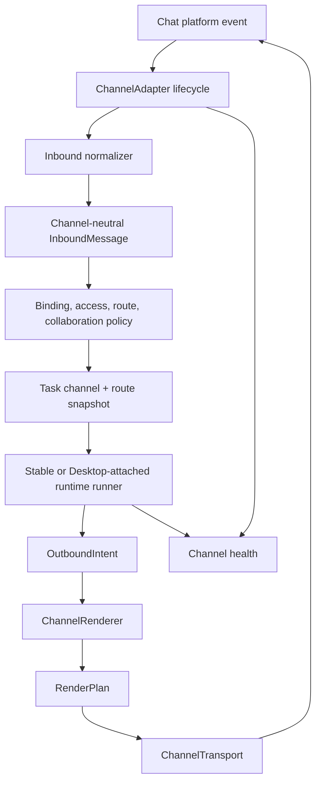
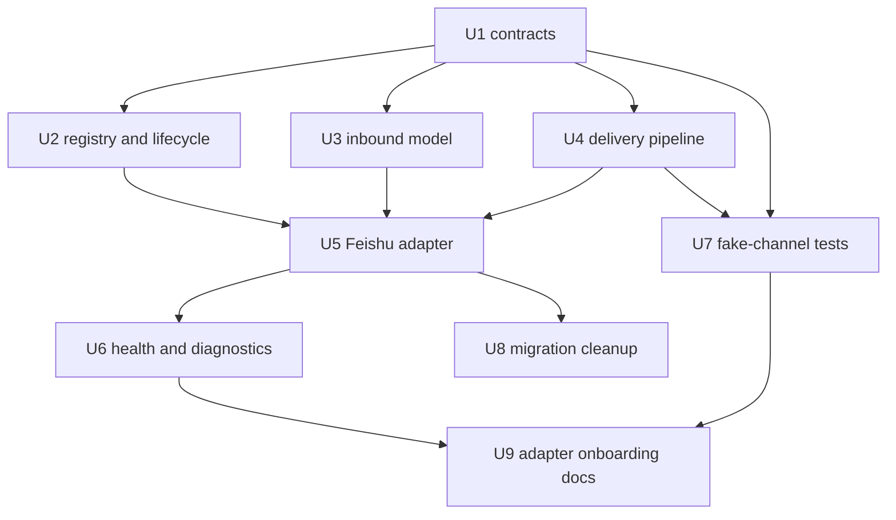

# feat: 新增渠道适配抽象层

## 摘要

为 Bridge 新增渠道适配抽象，使后续接入飞书、企业微信、钉钉、Telegram、WhatsApp 以及内部自定义 IM 时，不再把平台事件、身份、回调、投递、媒体和限流规则塞进编排代码。本方案补齐 `docs/plans/2026-07-28-003-feat-channel-neutral-message-renderer-plan.md` 之外的上层边界：渠道适配负责连接和传输，renderer 负责 intent 到 payload 的表现。

---

## 问题背景

Bridge 当前是飞书优先实现。飞书 inbound normalization、WebSocket 生命周期、CardKit client、消息确认、图片/文件处理、handoff 消息发送都直接散落在 `src/app/main.ts`、`src/app/lark/*`、`src/app/cards/*` 和 `src/app/in-memory-orchestrator.ts`。

只有一个渠道时可以接受，但后续接企业微信、钉钉、Telegram、WhatsApp 或内部聊天系统时会失控。不同渠道的身份模型、mention 语义、回调 payload、文件限制、消息 update 支持、限流、认证和 group/thread 行为都不同。这些差异必须被渠道 contract 和 capability profile 包住，不能泄漏到任务执行、绑定、审批、路由、协作或渲染逻辑中。

---

## 假设

*本方案基于当前产品讨论和本地仓库上下文推导。若产品行为已变化，实施前需要复核这些假设。*

- 现有飞书行为是兼容性基线；第一版应先把飞书迁到抽象层后面，不改变用户可见行为。
- `docs/plans/2026-07-28-003-feat-channel-neutral-message-renderer-plan.md` 仍是 outbound 表现层方案，本方案不重复实现 renderer。
- 新生产渠道不应在飞书抽象迁移和 fake-channel 回归稳定前接入。
- runtime execution route policy 与 message channel selection 是两条轴。任务可以来自飞书、钉钉或 Telegram，但执行仍按 route policy 选择 stable 或 Desktop-attached。
- Bot-to-bot handoff 默认 fail closed；只有当前渠道明确声明了可安全触发目标机器人的机制，才允许自动 handoff。
- 渠道凭证放在 `channels/<channel>/` 下；根目录 `config.toml` 是进程级配置，根目录 `bindings.json` 是跨渠道端点到 ChatGPT thread 的索引。

---

## 需求

- R1. 业务和编排代码消费渠道无关 `InboundMessage`，不消费飞书原始事件 payload。
- R2. Outbound 业务代码输出 `OutboundIntent`，不直接调用渠道 SDK，也不直接构造渠道 payload。
- R3. 每个渠道声明 text、rich card、markdown、update/delete、reply/thread、mention、bot trigger、action、media、file、rate limit 和 proactive send 能力。
- R4. 渠道适配器负责平台生命周期：认证、事件订阅、重连、ready、shutdown 和 health reporting。
- R5. 渠道适配器负责 inbound normalization，包括身份、tenant/workspace、chat surface、root message、reply/thread context、media references、旧消息过滤、去重和 sender authorization hook。
- R6. 渠道 transport 只发送 rendered plan 和上传 artifact，不理解业务 intent 或 runtime route 状态。
- R7. 不支持的能力必须按显式策略降级或 fail closed，不能静默回落到飞书行为。
- R8. 任务创建时必须 snapshot channel identity、surface、capabilities、reply context 和 execution route。
- R9. 飞书迁移期间保持行为兼容，包括群聊 mention gate、disabled-bot、图片批处理、卡片更新、审批、handoff 和 unavailable-message。
- R10. fake-channel 测试必须证明无卡片、无 update、无 bot-trigger mention、无文件或严格大小限制时核心链路仍按能力降级或 fail closed。
- R11. 诊断必须独立暴露 channel readiness 和 capability 决策，不能和 App Server/Desktop runtime health 混在一起。
- R12. 后续新增渠道只应新增 adapter package、renderer/transport、capability profile、config block 和 CUJ 测试，不应修改核心编排。

---

## 范围边界

- 第一轮不实现生产级企业微信、钉钉、Telegram 或 WhatsApp adapter。
- 本方案不替代 `docs/plans/2026-07-28-001-feat-dual-runtime-modes-plan.md` 的 route-based runtime execution 设计。
- 本方案不立即删除现有飞书文件；迁移应先 wrap，再把行为移动到 adapter 边界后面。
- 本方案不让 renderer 负责 WebSocket、auth、retry 或 upload API。
- 本方案不让 channel adapter 负责任务调度、审批决策、绑定授权或 runtime execution。
- 本方案不采用最低公约数模型。富渠道继续使用 richer render plans，弱渠道按能力降级或 fail closed。

### Deferred to Follow-Up Work

- 生产级企业微信 adapter：等飞书 adapter 迁移和 fake-channel 测试稳定后单独实施。
- 生产级钉钉 adapter：等 markdown/action/update 能力规则建模后单独实施。
- 生产级 Telegram adapter：等 reply/thread 和 inline-button 行为映射到通用 contract 后单独实施。
- 生产级 WhatsApp adapter：需单独评审 Business API、template message、media hosting 和 proactive-send 约束。
- 类似 `cc-connect/docs/bridge-protocol.md` 的外部 adapter WebSocket 协议：后续有价值，但不放入第一版内部渠道抽象。

---

## 上下文与调研

### 相关 Bridge 代码和模式

- `src/app/main.ts` 当前集中装配飞书 client、event server、message aggregation、ack、file upload、handoff emitter、task orchestration、health 和 runtime routing。
- `src/app/lark/intake.ts` 定义了当前飞书形态的 `InboundMessage` 和 `InboundReplyContext`。
- `src/app/lark/event-server.ts` 负责飞书事件 dispatch、disabled-bot、card action callback 和 unavailable-message reply。
- `src/app/lark/client.ts` 负责飞书 SDK client、tenant token、WebSocket ready state、reconnect state 和 terminal error。
- `src/app/lark/inbound-message-aggregator.ts` 围绕飞书 inbound message 做图片批处理和去重。
- `src/app/cards/cardkit-client.ts`、`src/app/cards/layouts.ts`、`src/app/lark/handoff-message-emitter.ts` 展示了当前 outbound 飞书耦合，后续要由 renderer 和 transport 隔离。
- `src/app/in-memory-orchestrator.ts` 当前接收飞书形态 inbound message，并直接使用 CardKit-like card client 完成任务卡创建、更新、分页和 freeze/continue。
- `src/app/runtime-health.ts` 已有 runtime 与飞书连接健康模型，应扩展而不是替换。
- `test/app/lark-image-input.test.ts`、`test/app/lark-event-server.test.ts`、`test/app/lark-client.test.ts`、`test/app/lark-handoff-message-emitter.test.ts`、`test/app/desktop-ipc-regression.test.ts` 是迁移时必须保留的主要 characterization 覆盖。

### 可吸收的 cc-connect 设计经验

- `cc-connect/AGENTS.md` 明确 `core/` 不依赖具体 platform/agent 包，依赖方向由包边界保证。
- `cc-connect/core/interfaces.go` 用 optional capability interfaces 表达 card sending、message updates、file sending、typing indicators、progress style providers。
- `cc-connect/core/card.go` 用渠道无关 card 结构承载 fallback。
- `cc-connect/core/bridge.go` 通过 capabilities 和 token auth 支持外部 adapter 注册。
- `cc-connect/core/dedup.go`、`cc-connect/core/outgoing_ratelimit.go`、`cc-connect/core/redact.go`、`cc-connect/core/runas_check.go` 把安全硬化做成小模块，而不是塞进 engine。
- `cc-connect/core/cuj_test.go` 从生产同款 platform entry point 驱动，断言用户实际看到的 journey。

### 项目内既有认知

- 群聊和直聊执行路由是 first-class configurable policy；任务创建时必须 snapshot effective execution route。
- 群聊多 bot 行为默认 fail closed：只有当前 bot 的显式 mention 可执行，unknown/removed bot 静默，disabled bot 不可路由工作。
- App Server compatibility、Desktop route health、channel readiness 是三件事，不能互相代替。
- Handoff trigger 消息必须有界，绝不能分页成多条会触发机器人的消息。

### 外部参考

- 未使用外部资料。本方案基于本地 Bridge 代码和本地 `cc-connect` 项目。

---

## 关键技术决策

| 决策 | 理由 |
|---|---|
| 新增 `src/app/channels/*` 作为渠道抽象区域 | 避免 channel connection、event、transport 和 capability 代码继续进入 runtime orchestration，也避免和 renderer-only 层混淆。 |
| 将飞书作为第一个 adapter，而不是特殊内建路径 | 用最复杂的现有渠道证明抽象，同时保持行为兼容。 |
| 分离 adapter lifecycle、renderer 和 transport | startup/reconnect/auth 属于 adapter；payload 构造属于 renderer；send/update/upload 属于 transport。 |
| 使用 capability profile，避免按 channel name 分支 | 这是 cc-connect 最值得吸收的设计原则，也能防止共享代码持续增长 `if channel === "feishu"`。 |
| 任务创建时 snapshot channel context | 防止后续配置或 binding 变化影响 queued work、reply target、fallback 行为或 execution route。 |
| binding 跨渠道，渠道配置按渠道隔离 | 允许飞书和企业微信端点绑定同一个 ChatGPT thread，同时隔离各渠道凭证、发现缓存和 API 专属状态。 |
| 先加 fake limited channels，再加真实新渠道 | fake channel 能低成本证明降级语义，防止飞书常量泄漏。 |
| route policy 与 channel policy 正交 | 消息渠道决定 Bridge 怎么和用户说话；执行路由决定 Bridge 怎么跑 Codex。混在一起会让跨渠道行为变脆。 |
| unsupported handoff fail closed | 没有真实 bot-trigger 机制的渠道不能用不安全或不会触发的消息模拟自动 handoff。 |

---

## 开放问题

### 规划期已解决

- 渠道抽象是否要和 renderer 抽象分开？是。channel adapter 管连接和传输，renderer 管表现。
- 是否直接复制 cc-connect 的包结构？否。吸收原则，但落到 Bridge 现有 TypeScript 模块形态。
- 第一轮是否包含企业微信/钉钉/Telegram/WhatsApp 生产 adapter？否。先迁飞书并用 fake channel 证明架构。
- route policy 是否放进 channel adapter？否。runtime execution routing 是单独产品能力。

### 延后到实现期

- normalized channel 类型和 projection 对象的最终命名：实现时按现有 TypeScript 风格确定。
- 飞书文件是立即从 `src/app/lark/*` 移到 `src/app/channels/feishu/*`，还是先 wrap：按 diff 大小和测试风险决定。
- channel config 的最终语法：使用 `channels/<channel>/` 目录。飞书使用 `channels/feishu/bots.json` 和 `channels/feishu/external-bots.json`；未来渠道新增自己的目录，不把渠道凭证写入 `config.toml`。
- 多渠道 fan-out 的精确机制：renderer/channel adapter 必须把一个 thread projection 转换为当前 `threadId -> bindings[]` 的每个 binding 对应的一份 outbound delivery plan。
- WhatsApp 的确切支持边界：因 proactive message 和 template 约束强，需要单独 API/产品评审。

---

## 输出结构

预期新增结构如下。这是范围声明，不是刚性目录约束。

```text
src/app/channels/
  channel-adapter.ts
  channel-capabilities.ts
  channel-context.ts
  channel-delivery.ts
  channel-health.ts
  channel-registry.ts
  inbound-message.ts
  fake/
    fake-channel-adapter.ts
    fake-channel-capabilities.ts
  feishu/
    feishu-channel-adapter.ts
    feishu-capabilities.ts
    feishu-inbound-normalizer.ts
    feishu-transport.ts
    feishu-runtime-clients.ts

src/app/render/
  ... 来自 docs/plans/2026-07-28-003-feat-channel-neutral-message-renderer-plan.md 的文件

test/app/channels/
  channel-contract.test.ts
  fake-channel.test.ts
  feishu-channel-adapter.test.ts
```

---

## 高层技术设计

> *本节只说明预期方向，供评审理解，不是实现规范。实施时应把它作为上下文，而不是逐字复刻。*

Channel 和 runtime 是两条独立轴：

| 轴 | 职责 | 示例 |
|---|---|---|
| Channel adapter | Bridge 如何接入聊天平台 | 飞书、企业微信、钉钉、Telegram、WhatsApp |
| Renderer | outbound intent 如何变成平台可投递消息 | 飞书 CardKit、Telegram markdown/buttons、WhatsApp text/media fallback |
| Transport | rendered message 如何发送、更新、上传和重试 | send message、reply、patch card、upload file |
| Runtime route | Codex execution 如何运行 | stable App Server、Desktop-attached |
| Orchestrator | 任务生命周期和策略决策 | queue、steer、cancel、approval、card delivery state |

端到端流：



Adapter contract 草图：

```text
ChannelAdapter
  identity: channel name, bot key, tenant/workspace
  capabilities: ChannelCapabilities
  lifecycle: start, stop, readiness snapshot
  inbound: normalize native events and emit InboundMessage
  transport: send/update/upload rendered plans
  diagnostics: health, auth failures, reconnect state, rate-limit state
```

能力决策矩阵：

| 能力缺口 | 预期行为 |
|---|---|
| 无 rich card | Renderer 输出 text 或 markdown fallback。 |
| 无 update API | Transport 按 intent policy 发送 final-only 或 append-only progress。 |
| 无 thread/reply | 安全时 fallback 到 chat-level send；reply-required flow 否则 fail closed。 |
| 无 button/action callback | 命令卡渲染成文本指引；action 必需的场景直接 reject。 |
| 无 bot-trigger mention | 自动 handoff 被拒绝并输出明确诊断。 |
| text size 严格 | Renderer 按 intent policy 截断、分页或 file fallback。 |
| 无 file upload | 只有存在安全链接时才 summary-plus-link；否则 fail closed。 |

实施依赖图：



---

## 实施单元

### U1. 定义 Channel Contracts 和 Capabilities

**目标：** 建立 channel identity、capabilities、inbound message、reply context、delivery target、delivery result 和 channel error 的中立合同。

**需求：** R1, R3, R6, R7, R8, R12

**依赖：** 无

**文件：**
- Create: `src/app/channels/channel-adapter.ts`
- Create: `src/app/channels/channel-capabilities.ts`
- Create: `src/app/channels/channel-context.ts`
- Create: `src/app/channels/channel-delivery.ts`
- Create: `src/app/channels/inbound-message.ts`
- Create: `src/app/channels/channel-health.ts`
- Test: `test/app/channels/channel-contract.test.ts`

**实现思路：**
- 从 `src/app/lark/intake.ts` 中抽出非飞书专属字段，形成 `src/app/channels/inbound-message.ts`。
- 共享 contract 不暴露原生平台 payload；需要保留的平台上下文放进 adapter-owned opaque context。
- Capability 用稳定布尔和 limit 表达，不用平台名表达。
- size limit 和 rate-limit hint 也放入 capability，因为 renderer 和 transport 都需要。
- 增加稳定错误分类：unsupported capability、payload rejected、auth failure、rate limit、stale context、unknown delivery outcome。

**执行提示：** 先写 characterization tests，证明当前飞书 `InboundMessage` 信息不会在中立模型里丢失。

**参考模式：**
- `src/app/lark/intake.ts` 的当前 inbound 字段。
- `cc-connect/core/interfaces.go` 的 optional capability 风格。
- `cc-connect/core/card.go` 的中立结构加 fallback 思路。

**测试场景：**
- Happy path：p2p text message 可携带 channel、bot key、tenant、sender、root message、reply context、text 和 payload digest。
- Happy path：group post message 可携带 text 和多个 image references。
- Happy path：capability profile 可表达飞书支持 card/update/reply/action/file/mention。
- Edge case：只有 text 能力的 fake channel 对所有不支持能力都有明确 false 或 undefined。
- Edge case：opaque reply context 不向 orchestrator 暴露原生 SDK payload。
- Error path：unsupported capability error 包含 channel name、operation 和稳定诊断原因，且不泄漏 token。

**验收：**
- 共享 channel contracts 编译时不导入 `src/app/lark/*` 或 `src/app/cards/*`。
- 当前飞书 inbound 信息在中立模型中都有承载位置。

### U2. 新增 Channel Registry 和 Lifecycle Orchestration

**目标：** 建立 registry 和启动生命周期，使 Bridge 能通过统一路径启动一个或多个 channel adapter。

**需求：** R3, R4, R11, R12

**依赖：** U1

**文件：**
- Create: `src/app/channels/channel-registry.ts`
- Modify: `src/app/main.ts`
- Modify: `src/app/runtime-health.ts`
- Modify: `src/app/doctor.ts`
- Test: `test/app/channels/channel-registry.test.ts`
- Test: `test/app/runtime-health.test.ts`
- Test: `test/app/doctor.test.ts`

**实现思路：**
- 新增类似 cc-connect platform registry 的 Bridge channel adapter registry。
- 初期仍在 `main.ts` 中显式构造，保持依赖注入清晰，降低迁移风险。
- 每个 adapter 独立报告 lifecycle state：idle、starting、ready、reconnecting、degraded、terminal、stopped。
- channel health 与 App Server/Desktop runtime health 分开聚合。
- doctor 输出 configured channels、readiness、capability profile 摘要和 last terminal error。

**执行提示：** 插入 registry 前先用 characterization test 锁住现有飞书 startup health。

**参考模式：**
- `src/app/lark/client.ts` 的 WebSocket state snapshot。
- `src/app/runtime-health.ts` 的序列化 health snapshot。
- `cc-connect/core/registry.go` 的简单 registry 语义。

**测试场景：**
- Happy path：注册一个 Feishu adapter 后可按 channel name 和 bot key 查询。
- Happy path：多个 enabled bot configs 创建独立 Feishu adapter instance，且不共享可变 health state。
- Edge case：disabled bot config 不启动 adapter，但 diagnostics 中能看到 disabled。
- Error path：adapter startup failure 只标记该 channel instance terminal，不误报 App Server compatibility。
- Integration：`doctor` 分开报告 channel readiness 和 Desktop route readiness。

**验收：**
- `main.ts` 不再需要在 Feishu adapter 构造路径之外特殊处理每个飞书生命周期细节。
- health 输出能区分 channel failure 和 runtime execution failure。

### U3. 抽出渠道无关 Inbound Pipeline

**目标：** 将 inbound normalization、filtering、reply context reconstruction、duplicate handling 和 media aggregation 放到 channel-owned adapter 后面，同时保持飞书行为。

**需求：** R1, R4, R5, R8, R9

**依赖：** U1, U2

**文件：**
- Create: `src/app/channels/feishu/feishu-inbound-normalizer.ts`
- Create: `src/app/channels/feishu/feishu-channel-adapter.ts`
- Modify: `src/app/lark/intake.ts`
- Modify: `src/app/lark/event-server.ts`
- Modify: `src/app/lark/inbound-message-aggregator.ts`
- Modify: `src/app/group-access-policy.ts`
- Modify: `src/app/main.ts`
- Test: `test/app/channels/feishu-inbound-normalizer.test.ts`
- Test: `test/app/lark-image-input.test.ts`
- Test: `test/app/lark-event-server.test.ts`
- Test: `test/app/group-access-policy.test.ts`

**实现思路：**
- 先 wrap 现有 Feishu intake 行为；测试证明边界后再移动代码。
- `LarkEventServer` 后续要么成为 Feishu adapter 内部 helper，要么只由 `FeishuChannelAdapter` 调用。
- 保持现有 fail-closed 语义：其他 bot mention 被拒绝、disabled bot 不路由工作、unavailable reply 只校验 mention context 而不授权 task。
- 图片聚合尽量 channel-neutral，但 Feishu image key 解析归 Feishu adapter。
- task snapshot 中保存 channel reply context，避免 queued message 受后续 adapter reconnect 或 route policy 修改影响。

**执行提示：** 先升级现有飞书测试，断言中立 inbound output，再移动实现。

**参考模式：**
- `src/app/lark/intake.ts` 的 normalization tests。
- `src/app/lark/inbound-message-aggregator.ts` 的去重和图片批处理。
- `cc-connect/core/dedup.go` 的旧消息过滤和去重小模块思路。

**测试场景：**
- Happy path：飞书 p2p text event 变成中立 inbound，并进入现有 command/task 路径。
- Happy path：飞书 group post 带当前 bot mention 时只剥当前 bot mention，保留其他文本和图片。
- Happy path：image-only batch 加后续描述时 dispatch 一条包含全部 local image paths 的中立 message。
- Edge case：群消息 mention 其他 bot 时当前 bot 保持 rejected and silent。
- Edge case：disabled bot 只能发送 unavailable feedback，不能 route commands、approvals 或 card actions。
- Error path：stale event 或 duplicate message 不创建 task。
- Integration：command handling 和 task handling 消费中立 inbound，不导入飞书事件 payload type。

**验收：**
- 现有飞书 inbound 测试通过，并补充中立模型断言。
- 任务创建路径不依赖原始飞书 event shape。

### U4. 新增 Capability-Driven Outbound Delivery Pipeline

**目标：** 将 `OutboundIntent`、renderer output、channel transport 和 task delivery state 接到渠道无关投递链路中。

**需求：** R2, R3, R6, R7, R8, R10

**依赖：** U1，以及 `docs/plans/2026-07-28-003-feat-channel-neutral-message-renderer-plan.md` 的 renderer contracts

**文件：**
- Create: `src/app/channels/channel-delivery-pipeline.ts`
- Create: `src/app/channels/feishu/feishu-transport.ts`
- Modify: `src/app/render/render-context.ts`
- Modify: `src/app/render/render-plan.ts`
- Modify: `src/app/in-memory-orchestrator.ts`
- Modify: `src/app/command-service.ts`
- Modify: `src/app/desktop-approval-service.ts`
- Test: `test/app/channels/channel-delivery-pipeline.test.ts`
- Test: `test/app/desktop-ipc-regression.test.ts`
- Test: `test/app/feishu-message-transport.test.ts`

**实现思路：**
- `RenderPlan` 是 transport 唯一发送对象。
- 把飞书 `replyCard`、`sendCard`、`replaceCard`、`post`、`text`、upload、ack 调用藏到 Feishu transport 后面。
- Orchestrator 保存 task channel snapshot：channel id、bot key、chat surface、capabilities、reply/root context 和 execution route。
- Renderer 决定 fallback strategy；transport 只报告 send/update/upload result，不检查 business intent。
- 在 U8 cleanup 前，现有卡片分页状态可暂时留在 orchestrator。

**执行提示：** 替换 card client dependency 前，先锁住 task card 创建、更新和 freeze 行为。

**参考模式：**
- `src/app/in-memory-orchestrator.ts` 的 card write serialization 和 retry。
- `src/app/cards/cardkit-client.ts` 的飞书卡片 API 行为。
- `cc-connect/core/card.go` 的 fallback 思路，但要适配 Bridge 更丰富的 render plan。

**测试场景：**
- Happy path：task-card intent 经 Feishu transport 发送，用户可见卡片内容与迁移前一致。
- Happy path：command-card 和 approval-card intent 通过 transport 回复原消息，不直接调用 CardKit。
- Happy path：final answer update 使用任务创建时捕获的 channel snapshot。
- Edge case：任务创建后 channel capability 变化不影响 queued task delivery。
- Edge case：无 update 能力的 fake channel 按 render policy 收到 append-only 或 final-only delivery。
- Error path：primary rendered payload 被拒绝时使用 renderer fallback，并记录 fallback reason。
- Error path：no-action channel 遇到 action-required 场景时 fail closed 并输出诊断。
- Integration：Desktop approval service 更新审批卡时不导入飞书 payload shape。

**验收：**
- Orchestrator 和 command services 依赖 channel delivery contracts，而不是 Feishu SDK payload。
- Feishu 上现有 task card 和 approval 行为保持用户可见兼容。

### U5. 将飞书迁移成 First-Class Channel Adapter

**目标：** 把当前飞书 runtime 转成 adapter package，由它负责 Feishu clients、capabilities、inbound event dispatch、media APIs、card/action callbacks 和 transport。

**需求：** R4, R5, R6, R9, R11

**依赖：** U2, U3, U4

**文件：**
- Create: `src/app/channels/feishu/feishu-capabilities.ts`
- Create: `src/app/channels/feishu/feishu-runtime-clients.ts`
- Modify: `src/app/lark/client.ts`
- Modify: `src/app/lark/message-acknowledgement.ts`
- Modify: `src/app/lark/output-file-uploader.ts`
- Modify: `src/app/lark/inbound-image-store.ts`
- Modify: `src/app/lark/handoff-message-emitter.ts`
- Modify: `src/app/main.ts`
- Test: `test/app/channels/feishu-channel-adapter.test.ts`
- Test: `test/app/lark-client.test.ts`
- Test: `test/app/lark-handoff-message-emitter.test.ts`
- Test: `test/app/card-image-renderer.test.ts`

**实现思路：**
- 复用现有 Feishu SDK wrapper；除非抽象需要，不重写 SDK 调用。
- 飞书 capability profile 必须明确真实 mention trigger 行为：只有原生 text/post 可触发其他 bot，card-rendered mention 不触发。
- Feishu file upload 和 image retrieval 归 adapter-owned media services。
- Card action callback 继续绑定服务端上下文和现有 action-token 保护。
- Feishu adapter 暴露当前 bot key 和 tenant identity，保持多 bot instance 隔离。

**执行提示：** 先锁住 multi-bot group 行为和 handoff trigger fallback。

**参考模式：**
- `src/app/bot-config-store.ts` 的 bot-scoped configuration。
- `src/app/lark/handoff-message-emitter.ts` 的 post-to-text fallback。
- `cc-connect/platform/feishu/card.go` 的平台专属渲染隔离方式。

**测试场景：**
- Happy path：enabled Feishu bot 启动一个 adapter，并带预期 capability profile。
- Happy path：Feishu handoff trigger 发送真实 post mention，post rejected 时 fallback 到 text。
- Happy path：Feishu card action 继续通过 bot-scoped callback policy 路由。
- Edge case：disabled Feishu bot 不能 ack、process approval、mutate binding 或触发 card side effect。
- Edge case：多个 Feishu bot config 不共享 transport、token cache 或 callback state。
- Error path：token rejected 会 invalidate token cache，并报告 channel auth failure，且不暴露 secret。
- Integration：现有 multi-bot group bridge 测试通过 adapter-owned Feishu lifecycle。

**验收：**
- 飞书通过 `ChannelAdapter` 注册和启动。
- 飞书专属 import 集中在 `src/app/channels/feishu/*`、`src/app/lark/*` 和底层 card helper，而不是编排策略中。

### U6. 扩展 Channel Health、Doctor 和操作诊断

**目标：** 让操作员能看到 channel readiness、capability choices、fallback decisions 和 unsupported operations。

**需求：** R7, R8, R11, R12

**依赖：** U2, U4, U5

**文件：**
- Modify: `src/app/runtime-health.ts`
- Modify: `src/app/doctor.ts`
- Modify: `src/app/cards/command-cards.ts`
- Modify: `src/app/cards/layouts.ts`
- Modify: `src/app/command-service.ts`
- Test: `test/app/runtime-health.test.ts`
- Test: `test/app/doctor.test.ts`
- Test: `test/app/conversation-binding-service-v3.test.ts`

**实现思路：**
- Health snapshot 新增 channel section：adapter state、bot key、channel name、reconnect count、last readiness change、capability summary。
- Delivery diagnostics 记录 fallback path、unsupported capability、rejected payload、media upload failure 和 stale reply context。
- Health 和日志中继续避免敏感字段。
- Status/help card 同时展示 channel axis 和 runtime axis。

**参考模式：**
- `src/app/runtime-health.ts` 的 status aggregation。
- `src/app/cards/command-cards.ts` 的 status-card 风格。
- `cc-connect/core/doctor.go` 的 capability-aware diagnostics。

**测试场景：**
- Happy path：status card 显示 Feishu channel ready，同时 App Server 和 Desktop 状态分开展示。
- Happy path：card fallback 到 text 时记录用户可理解的 diagnostic reason。
- Edge case：channel reconnecting 只降级 channel health，不误报 runtime incompatibility。
- Error path：auth failure 在 diagnostics 中 redacts app secret 和 token。
- Integration：task 中同时出现 route policy snapshot 和 channel snapshot，但不暗示它们是同一决策。

**验收：**
- 操作员能判断失败来自 channel、renderer、transport、App Server、Desktop route 还是 policy。

### U7. 新增 Fake Channels 和 CUJ 覆盖

**目标：** 在接真实新渠道前，用不同能力组合证明 channel abstraction 可用。

**需求：** R7, R8, R10, R12

**依赖：** U1, U3, U4

**文件：**
- Create: `src/app/channels/fake/fake-channel-adapter.ts`
- Create: `src/app/channels/fake/fake-channel-capabilities.ts`
- Create: `test/app/channels/fake-channel.test.ts`
- Create: `test/app/channel-cuj.test.ts`
- Modify: `test/app/desktop-ipc-regression.test.ts`

**实现思路：**
- 提供 text-only、markdown-only、no-update、no-actions、no-files、strict-size、no-bot-trigger 等 fake capability profiles。
- 测试从真实 adapter 同款 inbound entry point 驱动，再断言用户可见 outbound delivery。
- 参考 cc-connect 添加 CUJ 测试：覆盖多步用户行为，不只测 helper。
- 用 fake channel 防止 Feishu CardKit 常量进入核心 pagination 和 fallback 决策。

**参考模式：**
- `cc-connect/core/cuj_test.go` 的用户可见测试哲学。
- `test/app/desktop-ipc-regression.test.ts` 的任务生命周期 stub。
- 现有图片聚合测试里的多消息 flow。

**测试场景：**
- Happy path：text-only fake channel 可启动任务并收到 final answer。
- Happy path：no-update fake channel 在 streaming 期间不会收到 patch/update 调用。
- Happy path：strict-size fake channel 收到的 renderer-fitted pages 均低于声明 limit。
- Edge case：no-bot-trigger fake channel 拒绝 autonomous handoff，输出诊断且不发送 trigger message。
- Edge case：no-file fake channel 拒绝 artifact delivery，除非 renderer 提供 summary-plus-link。
- Error path：no-action channel 遇到 action-required approval 时 fail closed，不创建不可用审批。
- CUJ：用户发送任务、收到 progress/final response、切换 route policy、发送第二个任务，第一个任务的 channel snapshot 不变。
- CUJ：发给其他 bot 的群消息在 fake 和 Feishu adapter 上都让当前 bot 静默。

**验收：**
- 测试证明 capability-driven fallback 和 fail-closed 行为不依赖飞书。

### U8. 清理编排层中的飞书耦合

**目标：** adapter 和 renderer 边界稳定后，从业务服务中移除剩余飞书专属 import 和概念。

**需求：** R1, R2, R6, R8, R9, R12

**依赖：** U3, U4, U5, U7

**文件：**
- Modify: `src/app/main.ts`
- Modify: `src/app/in-memory-orchestrator.ts`
- Modify: `src/app/command-service.ts`
- Modify: `src/app/conversation-binding-service-v3.ts`
- Modify: `src/app/desktop-approval-service.ts`
- Modify: `src/app/domain.ts`
- Test: `test/app/desktop-ipc-regression.test.ts`
- Test: `test/app/conversation-binding-service-v3.test.ts`
- Test: `test/app/desktop-approval-service.test.ts`

**实现思路：**
- 用 channel-neutral contracts 替换 orchestration code 里的飞书类型 import。
- `lark` 命名在后续 rename 值得做之前，保留在 Feishu adapter/helper 包中即可。
- 把 capability check 从 orchestration branch 移到 renderer/delivery decision 中。
- 迁移期间保持 idempotency keys 和 card write serialization 语义。

**执行提示：** fake-channel 测试存在后再做，这是最高回归风险单元。

**参考模式：**
- `src/app/main.ts` 的 scoped dependency injection。
- `src/app/in-memory-orchestrator.ts` 的 card write serialization。

**测试场景：**
- Happy path：command card、task card、approval card、handoff trigger、image batch 和 unavailable-message flow 在飞书上仍通过。
- Happy path：orchestrator 可运行在 fake text-only channel 上，不需要 Feishu card client stub。
- Edge case：queued task 在 adapter reconnect 后仍保持原 reply context。
- Edge case：一个 channel 的 stale card/message IDs 不能被另一个 channel 使用。
- Error path：transport delivery failure 不会修改 runtime execution state。
- Integration：移除 orchestration 飞书 imports 后，多 bot group tests 仍证明 bot-scoped adapter state。

**验收：**
- 共享编排模块不再导入飞书 SDK payload types 或 CardKit payload shapes。
- 飞书行为仍被 characterization tests 覆盖。

### U9. 编写 Adapter Onboarding Playbook

**目标：** 文档化未来如何安全新增企业微信、钉钉、Telegram 和 WhatsApp 等渠道。

**需求：** R3, R7, R10, R11, R12

**依赖：** U6, U7

**文件：**
- Create: `docs/channel-adapters.md`
- Create: `docs/channel-adapters.zh-CN.md`
- Modify: `README.md`
- Test expectation: none -- documentation-only unit.

**实现思路：**
- 提供 checklist：先写 capability profile，再写 inbound normalizer、renderer profile、transport、config、health、CUJ tests、rollout gate。
- 写清企业微信、钉钉、Telegram、WhatsApp 的渠道专属注意点，但不承诺第一版生产支持。
- 明确新增渠道的 "no core changes" 规则：如果新增渠道必须改 orchestration，通常说明 capability model 不完整。
- 写清 token、webhook secret、media URL、sender allowlist、callback signature 和日志的安全要求。

**参考模式：**
- `cc-connect/docs/bridge-protocol.md` 的 capability-first 文档风格。
- `docs/plans/*.zh-CN.md` 的双语文档惯例。

**测试场景：**
- Test expectation: none -- documentation-only unit.

**验收：**
- 未来 adapter 实施者在写代码前就能确定所需文件、contract、capability 决策和测试。

---

## 系统影响

- **交互图：** inbound platform events、command routing、binding policy、task orchestration、approval handling、renderer output、transport delivery、health、doctor output 都会触及此抽象。
- **错误传播：** adapter error 进入 channel health 和 inbound rejection diagnostics；renderer error 进入 render diagnostics；transport error 进入 delivery diagnostics；runtime execution error 仍归 App Server/Desktop route diagnostics。
- **状态生命周期风险：** task channel snapshot 创建后必须不可变。queued work 不能拾取后续 channel config、route config 或 adapter reconnect state。
- **API surface parity：** 飞书 commands/cards 保持行为兼容，同时 fake channels 证明核心不依赖飞书专属 API。
- **集成覆盖：** CUJ 测试至少覆盖 Feishu 和 fake limited channels 的多步用户可见行为。
- **不变约束：** App Server compatibility gates、Desktop IPC route ownership、binding authorization、group mention fail-closed、approval token safety 不改变。

---

## 风险与依赖

| 风险 | 缓解 |
|---|---|
| 抽象变成最低公约数，削弱飞书体验 | 用 capability-driven render plans，让飞书继续使用 rich cards、updates、actions 和 file fallback。 |
| 迁移期间飞书行为回归 | 先 wrap 后移动，保留现有飞书测试并增加 characterization coverage。 |
| channel 和 runtime route policy 混淆 | 使用独立 context，并在 task snapshot 和 diagnostics 中同时展示两者。 |
| 未来 adapter 仍需要改 core | 先加 fake-channel profiles；文档规定反复改 core 说明 capability model 缺失。 |
| unsupported handoff 变成不安全行为 | 要求 `mentionCanTriggerBot` 或其他显式 trigger capability，否则 fail closed。 |
| health 维度变多导致噪声 | 分别报告 channel、renderer/delivery、App Server、Desktop 状态，高层 status 再聚合。 |
| 低估 WhatsApp 约束 | 生产 WhatsApp adapter 延后到单独产品/API 评审，并在文档中写明 template/proactive-send 风险。 |

---

## 分阶段交付

1. **Phase 1: Contracts and fake profiles** - U1, U2, U7 core scaffolding。
2. **Phase 2: Feishu inbound/outbound migration** - U3, U4, U5 保持行为兼容。
3. **Phase 3: Diagnostics and cleanup** - U6, U8。
4. **Phase 4: Adapter playbook** - U9，然后各生产渠道单独立 plan。

---

## 文档与运维说明

- 更新操作文档，说明 channel readiness 和 execution runtime readiness 是不同健康轴。
- 在接收生产级非飞书 adapter 前，先补 channel onboarding docs。
- 每个未来渠道都必须提供 capability matrix、auth/secrets handling、sender allowlist policy、media size policy、callback verification 和 CUJ tests。
- 发布时先让 Feishu adapter 承载既有行为；不要在同一个 release 同时启用新生产渠道和抽象迁移。

---

## Sources & References

- Related plan: `docs/plans/2026-07-28-003-feat-channel-neutral-message-renderer-plan.md`
- Related plan: `docs/plans/2026-07-28-001-feat-dual-runtime-modes-plan.md`
- Bridge inbound code: `src/app/lark/intake.ts`
- Bridge Feishu lifecycle: `src/app/lark/client.ts`
- Bridge startup wiring: `src/app/main.ts`
- Bridge orchestrator: `src/app/in-memory-orchestrator.ts`
- cc-connect development guide: `cc-connect/AGENTS.md`
- cc-connect core interfaces: `cc-connect/core/interfaces.go`
- cc-connect neutral card model: `cc-connect/core/card.go`
- cc-connect bridge protocol: `cc-connect/docs/bridge-protocol.md`
- cc-connect CUJ tests: `cc-connect/core/cuj_test.go`
